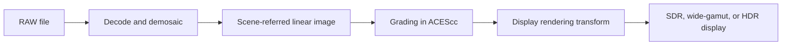
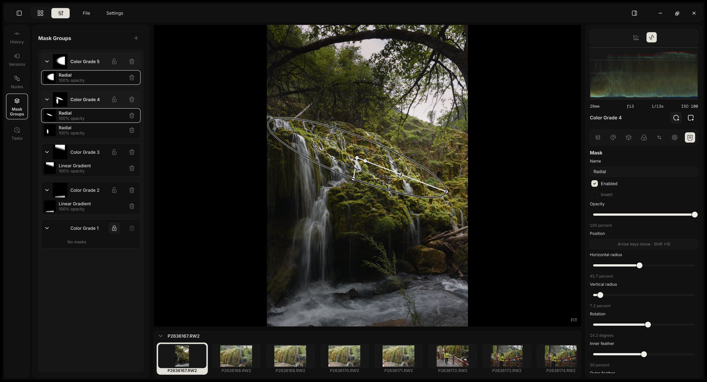

  

  <a href="https://aoraw.org/">Project website</a> · <a href="https://aoraw.org/zh-cn/">项目网页</a> · <a href="https://zidage.github.io/AlcedoStudio_docs/docs/intro">Documentation</a> · <a href="https://github.com/zidage/AlcedoStudio/releases/tag/v0.2.9">Download v0.2.9</a>

<a href="./README.md"><strong>English</strong></a> | <a href="./README.zh-CN.md">简体中文</a>

-lightgrey)

**Alcedo Studio** is a free and open-source RAW editor and photo library.

Copy your photos to a local drive, import the folder, and Alcedo lets you browse, rate, and search them, then develop each RAW in a GPU-accelerated, 32-bit floating-point pipeline that handles files of up to 150 megapixels. The album structure and the full edit history of every photo live together in a single project file, which you can move or back up like any other file.

It supports Windows 10/11 (x64) and Macs with Apple Silicon.

  

<strong>Demo Video</strong> (two short videos)

Editor

https://github.com/user-attachments/assets/d70cd10d-2045-42f3-a67d-97ab3ef9874b

Library

https://github.com/user-attachments/assets/ae0d9773-220e-4901-90f6-1989f58b0462

## A closer look

### RAW decode

Alcedo reads RAW files from Canon, Nikon, Sony, Fujifilm, Panasonic, OM System, Leica, Hasselblad, Phase One (including the 150 MP IQ4), Pentax, Sigma, and DNGs from phones and drones; see the lists of [supported formats](docs/supported_raw_formats.md) and [supported cameras](docs/supported_cameras.md). Through the project's [LibRaw fork](https://github.com/zidage/LibRaw), it also opens Nikon High Efficiency NEFs from the Z 8, Z 9, Z 6 III, and Z 50 II.

It offers two demosaicing methods. RCD is the default for Bayer sensors, and the Neural Engine, a compact neural network distilled from [DemosaicNet](https://groups.csail.mit.edu/graphics/demosaicnet/) that runs on the GPU, is the default for Fujifilm X-Trans and works with Bayer files as well. Alcedo also supports highlight reconstruction based on an improved inpaint-opposed method from darktable and RawTherapee, lens correction with Lensfun profiles, and the color profiles embedded in DNG files.

### High-performance 32-bit float pipeline

Editing stays fluid even with a 150-megapixel file, thanks to a highly optimized GPU-accelerated pipeline, built on CUDA and OpenCL on Windows and Metal on the Mac, together with a carefully designed caching mechanism. While you drag a slider, the preview holds 2.5K at 60 frames per second regardless of the source resolution, and when you let go it resolves to 4K. When you zoom in, Alcedo renders only the visible region at full detail.

### Scene-referred color pipeline

Alcedo keeps the full range of the RAW file through the whole edit and forms the picture for your display only at the last step:

For the display rendering transform, you can choose the ACES 2.0 output transform or OpenDRT, and set the target color space, transfer function, and peak luminance. On a Mac with an HDR display, the editor previews the HDR result directly.

### Node-based grading

Each photo's edit is a node graph. The Develop node turns the RAW into a scene-referred image, any number of Color Grade nodes follow in sequence, and the Display Transform node forms the final picture. Every Color Grade node carries its own adjustments and its own masks, so a grade can apply to the whole frame or only to the region you choose.

Inside each node you will find the usual tone and color controls, a tone curve, lift/gamma/gain color wheels, selective color, and detail tools, with shadows and highlights handled by local tone mapping. Alcedo also ships with [CUBE LUTs built from the spectral responses of real film stocks](https://github.com/JanLohse/spectral_film_lut), along with film grain and halation based on physical models.

### Versions and edit history

Every photo can hold several named versions, and you can branch a new version from any point in the history. Each adjustment is recorded in a Git-like history saved inside the project file, so you can undo it forever. You can also copy a whole look, or only the parts you choose, onto other photos. The [edit history design notes](https://zidage.github.io/AlcedoStudio_docs/en/docs/developer/edit-history-architecture) explain how it works.

### Library and search

The library is stored in a [DuckDB](https://duckdb.org/) database, so browsing, filtering, and searching stay responsive as your collection grows. The Album Inspector groups photos by capture date, camera, lens, label, and rating, and selecting a group filters the album.

Alcedo supports three kinds of search: EXIF search by camera, lens, date, ISO, focal length, and aperture; natural-language search with multilingual CLIP models that run locally and can tag photos automatically after import; and full-text search over the descriptions and tags Alcedo has generated.

It can also connect to an AI provider you already use, through an OpenAI-compatible or Anthropic-compatible endpoint, to write a description for each photo and give it a 1–5 star rating with a short reason. You can set how strict the review is and which language it uses. API keys are kept in the Windows Credential Manager or the macOS Keychain, and the analysis runs in the background while you keep working.

### Export

Alcedo exports JPEG, PNG, TIFF, OpenEXR, and Ultra HDR JPEG, at 8, 16, or 32 bits depending on the format. It supports sizing by long edge, dimensions, or print size, embedded ICC profiles, and file names built from the source name, capture date, camera, lens, exposure, rating, and a sequence number, with presets for settings you reuse. Location data, device serial numbers, and edit history are left out of exported files.

## Screenshots

<table>
  <tr>
    <td width="50%"></td>
    <td width="50%"></td>
  </tr>
  <tr>
    <td width="50%"></td>
    <td width="50%"></td>
  </tr>
  <tr>
    <td width="50%"></td>
    <td width="50%"></td>
  </tr>
</table>

## System requirements

- **Windows** 10 or 11, x64. NVIDIA GPUs with compute capability 6.0 or newer use CUDA; other GPUs use OpenCL.
- **macOS** 13.3 or later on Apple Silicon (M1 or newer), using Metal.
- 8 GB of memory at minimum, 16 GB or more for large libraries.

## Documentation

User guides and developer notes are on the [documentation site](https://zidage.github.io/AlcedoStudio_docs/docs/intro). To build from source, see [docs/build_from_source.md](docs/build_from_source.md). Release notes are in [docs/changelog/](docs/changelog/).

## Acknowledgements

Alcedo Studio is based on the work of many open-source projects and their authors.

- Film-emulation LUTs from [JanLohse/spectral_film_lut](https://github.com/JanLohse/spectral_film_lut).
- Some camera color matrices from [rawtoaces-data](https://github.com/AcademySoftwareFoundation/rawtoaces-data).
- Neural demosaic models distilled from [mgharbi/demosaicnet](https://github.com/mgharbi/demosaicnet) ([Gharbi et al., 2016](https://groups.csail.mit.edu/graphics/demosaicnet/)).
- Inpaint-opposed highlight reconstruction adapted from [darktable](https://github.com/darktable-org/darktable/blob/master/src/iop/hlreconstruct/opposed.c) and [RawTherapee](https://github.com/RawTherapee/RawTherapee/blob/dev/rtengine/hilite_recon.cc).
- RCD demosaicing adapted from [LuisSR/RCD-Demosaicing](https://github.com/LuisSR/RCD-Demosaicing).
- OpenDRT ported from Jed Smith's [open-display-transform](https://github.com/jedypod/open-display-transform).
- ACES 2.0 output transform implemented from [aces-aswf/aces-core](https://github.com/aces-aswf/aces-core).
- Film grain based on [Realistic Film Grain Rendering](https://doi.org/10.5201/ipol.2017.192) (IPOL 2017).
- RAW decoding with [LibRaw](https://www.libraw.org/), lens correction with [Lensfun](https://lensfun.github.io/), metadata with [Exiv2](https://exiv2.org/), image I/O with [OpenImageIO](https://github.com/AcademySoftwareFoundation/OpenImageIO) and [OpenCV](https://opencv.org/), color management with [OpenColorIO](https://opencolorio.org/), the library with [DuckDB](https://duckdb.org/), and the interface with [Qt](https://www.qt.io/) and [QuickQanava](https://github.com/cneben/QuickQanava).

The complete list of third-party components and their licenses is in [THIRD_PARTY_NOTICE.txt](THIRD_PARTY_NOTICE.txt) and [third_party_licenses/](third_party_licenses/).

ACES is a trademark of the Academy of Motion Picture Arts and Sciences (A.M.P.A.S.). Alcedo Studio is an independent project and is not affiliated with, certified by, or endorsed by A.M.P.A.S., the Academy Software Foundation, Jed Smith, or any other upstream author named above. These names are used only to identify the corresponding technology.

## License

Alcedo Studio is licensed under the GNU General Public License v3.0 (GPL-3.0-only). See [LICENSE](LICENSE) and [NOTICE](NOTICE).
