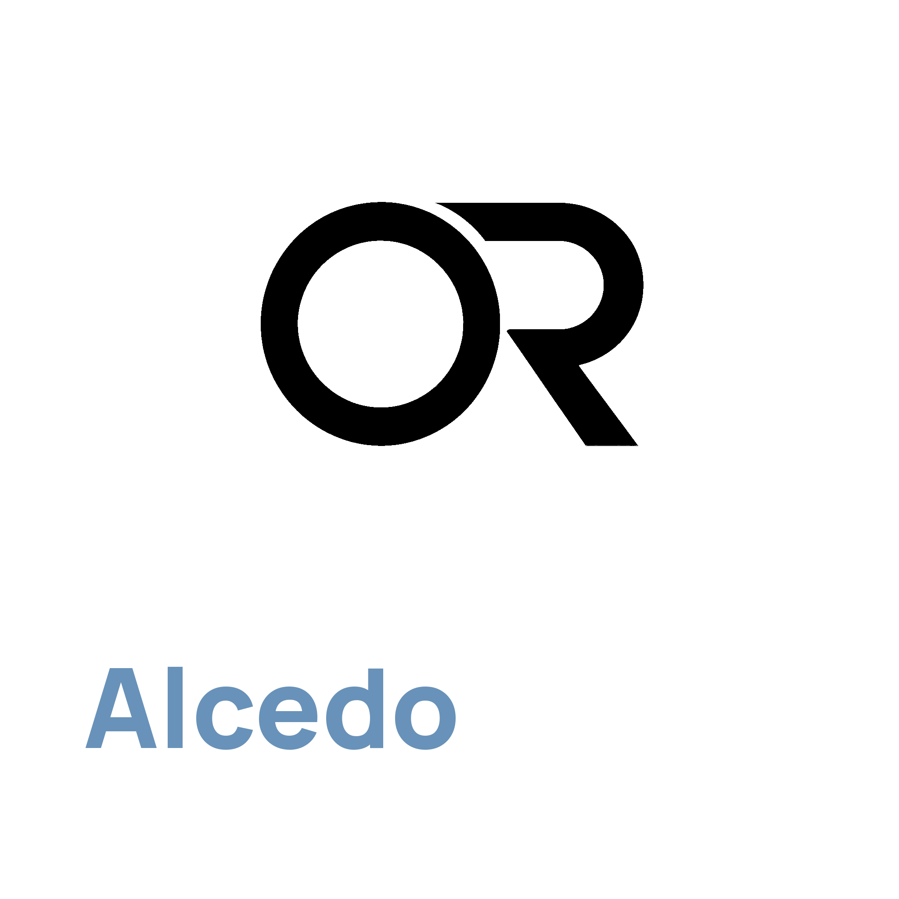

  

[Project website](https://aoraw.org/) | [项目网页](https://aoraw.org/zh-cn/)

<a href="./README.md"><strong>English</strong></a> | <a href="./README.zh-CN.md">简体中文</a>

**Alcedo Studio** is a free, open-source photography workstation for the day after a shoot.

Import a card of RAW files and start browsing. Grade up to 150-megapixel frames in 32-bit float on the GPU.

One file follows your photos. It's a [DuckDB](https://duckdb.org/) database with extra metadata, and it holds your album structure and the full edit history. Move it, back it up, put it where you want. No mess, and searches across a large library stay fast.

What's more, it uses a film-industry workflow. In a DI suite, the colorist works on a scene-referred image in a log-like working space, and a fixed transform forms the final picture for the screen. That split is why modern color pipelines stay stable when shots, cameras, and deliverables change. Alcedo follows the same structure: your RAW becomes a scene-linear image, you grade in an ACEScc-style log space, film-emulation LUTs carry the look, and a display rendering transform makes the final picture. On macOS you can even watch HDR while you edit.

Windows 10/11 x64 and Apple Silicon. Current release: [v0.2.9](https://github.com/zidage/AlcedoStudio/releases/tag/v0.2.9).

---

https://github.com/user-attachments/assets/d70cd10d-2045-42f3-a67d-97ab3ef9874b

https://github.com/user-attachments/assets/ae0d9773-220e-4901-90f6-1989f58b0462

## Features

**Work with most cameras.** Tested across Canon, Nikon, Sony, Fujifilm, Panasonic, OM System, Leica, Hasselblad, Phase One (including IQ4 150MP), Pentax, Sigma, and phone / drone DNG. Lists: [supported formats](docs/supported_raw_formats.md) and [supported cameras](docs/supported_cameras.md). Nikon HE and HE★ NEFs from the Z 8, Z 9, Z 6 III, and Z 50 II decode through the project's [LibRaw fork](https://github.com/zidage/LibRaw). You can also pick the demosaic: Default, RCD, or Neural Engine (a distilled [DemosaicNet](https://groups.csail.mit.edu/graphics/demosaicnet/) on the GPU, Bayer and X-Trans). Highlight reconstruction comes from an improved inpaint-opposed method, adapted from darktable and RawTherapee.

**High-performance processing core.** Drag a slider and the preview holds 2.5K at 60 frames per second. When you stop, the preview sharpens to 4K, so your high-megapixel camera still shows what it captured. An RGB histogram and waveform follow the image. CUDA on NVIDIA, OpenCL on other Windows GPUs, Metal on macOS. A tuned cache keeps interactions fast and memory use low. It also provides a wide range of adjustment tools, from local tone mapping (highlights and shadows) to CDL color wheels, all carefully tuned for photography.

**A display rendering transform forms the picture.** Scene-linear RAW holds colors and dynamic range a monitor can't show on its own. A DRT (Display Rendering Transform) is the look decision that maps that range onto the screen. That transform sits at the heart of modern film pipelines, and there's a good public write-up in [Chris Brejon's article on picture formation](https://chrisbrejon.com/articles/what-makes-a-good-picture-formation/). Alcedo provides ACES 2.0 and OpenDRT. Grade toward sRGB, wide-gamut, or HDR. You pick the target color space, the EOTF, and the HDR peak luminance. On macOS, the preview supports HDR while you edit.

**Film-emulation LUTs.** [CUBE LUTs generated from real film-stock spectral response](https://github.com/JanLohse/spectral_film_lut), plus grain and halation with a physical model behind them.

**Looks you keep, copy, and walk back.** A photo can hold several named looks, so you can compare and come back. You can copy a look onto another photo, or merge parts of one look into another. Every adjustment leaves a record, and you can return to every step. That whole history stays with the project file, so the undo trail is still there next month. The edit history is backed by a Git-like version control system. For more information, see [Edit History](https://zidage.github.io/AlcedoStudio_docs/en/docs/developer/edit-history-architecture).

**Export with highly customizable configurations.** Configure format, size, naming, metadata, and ICC profile. JPEG, PNG, TIFF, or EXR up to 32-bit. Original pixels, a longest edge, pixel bounds, or a print size at a set DPI. File names can draw from the source name, capture date, camera, lens, exposure, rating, and a running sequence.

**Describe, review, and rate.** Connect an LLM provider you already use, and it writes a description, a 1–5 star rating, and a short rating reason. You control how strict the review is. You can also run this analysis in the background while you browse or edit images.

**Tag it. Find it.** The library supports semantic tagging. Multilingual CLIP models run locally and tag every photo, so a scene, a subject, or a phrase becomes a query — no manual keywording. Global search mixes field filters (camera, date, lens) with natural-language search by meaning, and the album inspector maps the same library by capture date, camera, lens, labels, and rating. You can also manage models and configure auto tagging after import.

**The library stays fast.** The library uses an inode-like file system stored in a DuckDB database. Full-text search lets the words in an LLM description work as a query: "red umbrella" matches the description, not only the filename. HNSW vector search keeps similar photos close, so a phrase can find images by their content.

## System requirements

- **Windows**: 10/11 x64. NVIDIA GPU (compute capability 6.0+) for CUDA; other GPUs use OpenCL.
- **macOS**: Apple Silicon (M1 or newer), macOS 13.3 or later, Metal.
- 8GB RAM minimum (16GB and up if your library is large).
- Release builds install signed updates from Settings → Updates.

## Documentation

User guides and build notes: [documentation site](https://zidage.github.io/AlcedoStudio_docs/docs/intro). Source build: [docs/build_from_source.md](docs/build_from_source.md). Change logs: [docs/changelog/](docs/changelog/).

## Acknowledgements

- Film LUTs from [JanLohse/spectral_film_lut](https://github.com/JanLohse/spectral_film_lut).
- Camera color matrices from [rawtoaces-data](https://github.com/AcademySoftwareFoundation/rawtoaces-data).
- Neural demosaic student models distilled from [mgharbi/demosaicnet](https://github.com/mgharbi/demosaicnet) ([Gharbi et al., 2016](https://groups.csail.mit.edu/graphics/demosaicnet/)).
- Inpaint-opposed highlight reconstruction adapted from [darktable opposed.c](https://github.com/darktable-org/darktable/blob/master/src/iop/hlreconstruct/opposed.c) and [RawTherapee](https://github.com/RawTherapee/RawTherapee/blob/dev/rtengine/hilite_recon.cc).
- RCD demosaic from [LuisSR/RCD-Demosaicing](https://github.com/LuisSR/RCD-Demosaicing).
- OpenDRT ported from [jedypod/open-display-transform](https://github.com/jedypod/open-display-transform).
- ACES 2.0 from [aces-aswf/aces-core](https://github.com/aces-aswf/aces-core).
- Film grain based on [Realistic Film Grain Rendering](https://doi.org/10.5201/ipol.2017.192) (IPOL 2017).

## License

Alcedo Studio is licensed under the GNU General Public License v3.0 (GPL-3.0-only). See [LICENSE](LICENSE) and [NOTICE](NOTICE).
