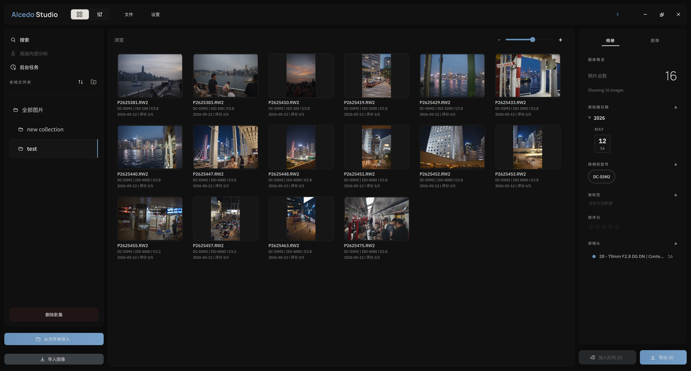
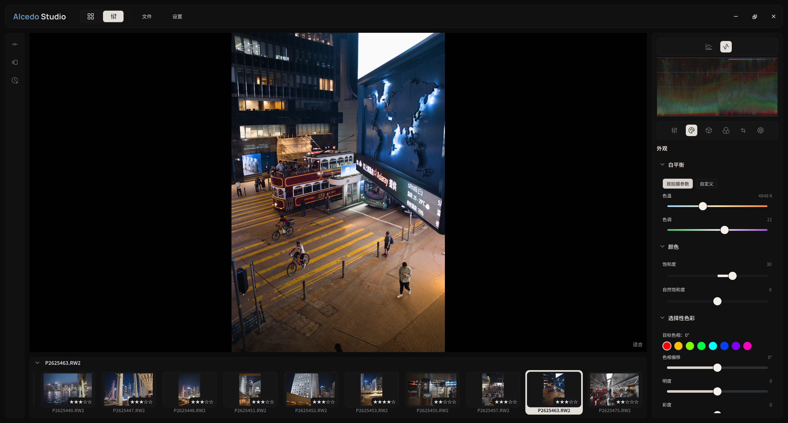

  

[Project website](https://aoraw.org/) | [项目网页](https://aoraw.org/zh-cn/)

<a href="./README.md"><strong>English</strong></a> | <a href="./README.zh-CN.md">简体中文</a>

**Alcedo Studio** is a RAW photo editor and photo library manager. Image processing runs on a GPU-accelerated pipeline. Tagging and search run locally on your machine, while the culling assist uses LLM APIs (OpenAI-compatible, Anthropic, or Volcengine Ark) that may be cloud-hosted. The library is stored in a single DuckDB-backed file next to your photos, so there is no separate catalog to migrate.

---

## Core Features

### 1. 32-Bit Float Pipeline, Dual Color Science, and HDR Output

The processing pipeline works in 32-bit float. Demosaicing, adjustments, and output transforms all operate on float data, and the pipeline runs on the GPU where one is available.

* **32-Bit Floating-Point Precision**: The pipeline, from raw demosaicing with the RCD algorithm through highlight reconstruction, operates in 32-bit float per channel to preserve shadow and highlight detail.
* **Dual Color Science**: Output rendering uses ACES 2.0 and OpenDRT, with custom target color spaces, peak-luminance control, and EOTF mapping.
* **HDR and UltraHDR Output**: HDR display output is not a post-processing effect. Alcedo Studio maps the dynamic range of the RAW file to HDR displays (HDR preview is macOS-only) and can export standard-compliant **UltraHDR gain-map JPEGs**, which reproduce the original luminance range on HDR screens.
* **GPU Backends**: The pipeline is implemented natively for CUDA and OpenCL on Windows and for Metal on macOS. On modern GPUs, exposure and grading adjustments update in real time.

### 2. Native Nikon High-Efficiency (HE/HE*) Support

Nikon's High-Efficiency (`HE`) and High-Efficiency★ (`HE*`) formats are not supported by upstream LibRaw. Alcedo Studio decodes them directly, so these files can be imported and edited without converting them to DNG first.

* **Direct Import**: Import and edit compressed RAW files from Nikon Z 8, Z 9, Z 6 III, Z f, and Z 50 II cameras.
* **Patched LibRaw**: The project ships a custom-patched fork of LibRaw for decoding these formats.

### 3. On-Device Semantic Search

Alcedo Studio includes a local vector search engine. Vision models (CLIP / SigLIP) run on your machine and index the library without sending images anywhere.

* **Semantic Queries**: Type a description such as *"portrait at sunset by the ocean"*. The query is converted to an embedding and ranked against the library locally.
* **Local and Private**: Images and queries stay on your hard drive. No API keys are required for tagging and searching.
* **Model Isolation**: Switch between models (MobileCLIP2, SigLIP2, Jina CLIP v2, or macOS CoreML profiles). Labels produced by different models are kept separate, so tags from one model do not mix with another's.

### 4. LLM-Assisted Culling and EXIF Metadata Writeback

The culling assist batch-analyzes candidate photos through standard APIs (OpenAI-compatible, Anthropic, or Volcengine Ark) before you start editing them.

* **Issue Detection**: The analysis flags technical and aesthetic issues — missed focus, motion blur, and poor composition.
* **1-5 Star Ratings**: Each photo receives a rating from 1 to 5 stars based on the configured strictness. Ratings are written back to standard EXIF metadata, so other photo managers can read them.
* **Keys and Strictness**: API keys are stored in the OS keychain. A strictness setting controls how critical the analysis is.

### 5. Single-File Project Management

Projects use a physical-first layout: the library is described by a single file in the photo directory, and there is no separate catalog to migrate or rebuild.

* **Single `.alcd` File**: All edit history, version metadata, semantic tags, and folder organization are stored in a DuckDB-backed `.alcd` file located in the photo directory.
* **Portability**: Backing up or moving a library means copying the `.alcd` file.
* **Separate Thumbnail Cache**: The disk-backed thumbnail cache and metadata are stored independently, so project files stay small.

---

## Additional Features

### Non-Destructive Versioning (Mini-Git Edit History)

Alcedo Studio does not modify the original RAW files. Edits for each photo are stored as a small Git-like commit graph in the project's `.alcd` file.

* **Versions and Edit History**: The editor's left rail has two panels. **Versions** lists named branches for a photo (for example “High-contrast B&W” and “Warm film look”). **Edit History** shows the commit graph for the currently checked-out Version, with undo and redo.
* **Branch management**: A Version is a named branch that points at a commit (or at the image root). Multiple Versions may share ancestry; shared commits are stored once.
* **Commits**: When you release the slider, one immutable edit commit is recorded on the active Version. Undo and redo move the working head along that Version's graph.
* **Branch, fork, paste, and merge**:
  - **Branch from current** creates a new Version from the current head.
  - **Fork from root** creates a new Version from the image's import baseline.
  - **Paste adjustments** creates a new Version on the target photo from another photo's adjustments, so you can try the other photo's look without changing the existing Version.
  - **Merge adjustments** folds another photo's adjustments into the Version you are already using — useful when you want to keep local work (crop, exposure, and so on) and still take color or style from elsewhere. Conflicting fields are resolved in a preview dialog; the result is one merge commit.
* **Write-ahead log (WAL)**: Finalized edits are first appended to a per-image recovery journal (a write-ahead log). Before switching photos, checking out another Version, leaving the editor, or shutting down, that journal is materialized into DuckDB so the live pipeline, panel state, and stored project agree.

> How to use the **Versions** and **Edit History** panels: [user guide](https://zidage.github.io/AlcedoStudio_docs/en/docs/getting-started/edit-history-and-versions).  
> Commit graph, journal, and storage layout: [developer documentation](https://zidage.github.io/AlcedoStudio_docs/en/docs/developer/edit-history-architecture).

### RAW Processing & Styling
* **Demosaicing**: The RCD demosaic algorithm produces clean, artifact-free RAW decoding with sharp detail.
* **Styling & Film Emulation**: Curated spectral film LUTs (CUBE format) tuned for ACEScc/ACEScct, with GPU-backed film grain and halation simulation.

### Export Workflow
* **Flexible formats**: Batch export to JPEG, PNG, TIFF, and WebP, at 8/16/32-bit depths.
* **UltraHDR & HDR Gain-Maps**: Export gain-map JPEGs for HDR display on modern platforms (for example, mobile devices and HDR screens).
* **Metadata & ICC Options**: Control metadata stripping and embed ICC profiles per batch.

> [!TIP]
> For edit history and versioning, see the [Alcedo Studio documentation site](https://zidage.github.io/AlcedoStudio_docs/docs/intro).

---

## RAW and Camera Support

Alcedo Studio imports all major RAW formats through a patched fork of [LibRaw](https://github.com/zidage/LibRaw):

- Canon CR2 / CR3
- Nikon NEF
- Sony ARW
- Fujifilm RAF
- Panasonic RW2
- Olympus / OM System ORF
- Leica, Hasselblad, Phase One, Pentax, Sigma, Samsung
- DNG, including smartphone and drone DNGs

See the full format list in [docs/supported_raw_formats.md](docs/supported_raw_formats.md) and the camera list in [docs/supported_cameras.md](docs/supported_cameras.md).

### Nikon HE / HE\* support
Nikon High-Efficiency (`HE`) and High-Efficiency★ (`HE*`) NEFs are still unsupported in upstream LibRaw 0.22. Alcedo Studio ships a patched LibRaw fork that decodes these files directly — no conversion to DNG required. Validated cameras include:
- Nikon Z 8
- Nikon Z 9
- Nikon Z 6 III
- Nikon Z f
- Nikon Z 50 II

The decoder lives in the project's LibRaw fork: **https://github.com/zidage/LibRaw**

---

## System Requirements

- **Windows**: Windows 10/11 x64. CUDA-capable NVIDIA GPU (minimum compute capability 6.0 / 10-series, recommended 7.0+ / 20-series) with 6GB+ VRAM for 40MP+ RAW files. OpenCL fallback available for non-NVIDIA GPUs.
- **macOS**: Apple Silicon Mac (M1/M2/M3/M4 series) running native Metal execution paths.
- **Memory**: Minimum 8GB system RAM (16GB+ recommended for large libraries).
- **Disk Space**: 500MB free disk space for installation; 60MB+ package footprint.

---

## Build from Source

Build instructions are maintained separately in [docs/build_from_source.md](docs/build_from_source.md) (English and Chinese).

---

## Roadmap

Roadmap and ongoing milestones are tracked in [docs/roadmap/roadmap.md](docs/roadmap/roadmap.md).

---

## Acknowledgements

Alcedo Studio builds on research, open-source implementations, and community data from the wider imaging ecosystem:

- Distributed film-emulation LUTs are from [JanLohse/spectral_film_lut](https://github.com/JanLohse/spectral_film_lut).
- Some camera color matrices are from [AcademySoftwareFoundation/rawtoaces-data](https://github.com/AcademySoftwareFoundation/rawtoaces-data).
- The highlight reconstruction algorithm is adapted from RawTherapee's [hilite_recon.cc](https://github.com/RawTherapee/RawTherapee/blob/dev/rtengine/hilite_recon.cc).
- The RCD demosaic algorithm is from [LuisSR/RCD-Demosaicing](https://github.com/LuisSR/RCD-Demosaicing).
- OpenDRT is ported from [OpenDRT.dctl](https://github.com/jedypod/open-display-transform/blob/main/display-transforms/opendrt/OpenDRT.dctl).
- ACES 2.0 support is ported from [aces-aswf/aces-core](https://github.com/aces-aswf/aces-core).
- The film grain renderer is based on Alasdair Newson, Noura Faraj, Bruno Galerne, and Julie Delon's [Realistic Film Grain Rendering](https://doi.org/10.5201/ipol.2017.192).

---

## License

The `v0.1.1` tag and earlier releases remain under Apache-2.0.
Development after `v0.1.1` is licensed under `GPL-3.0-only`, with an additional permission under GPLv3 section 7 for combining/distributing required NVIDIA CUDA components.
See [LICENSE](LICENSE) and [NOTICE](NOTICE).
