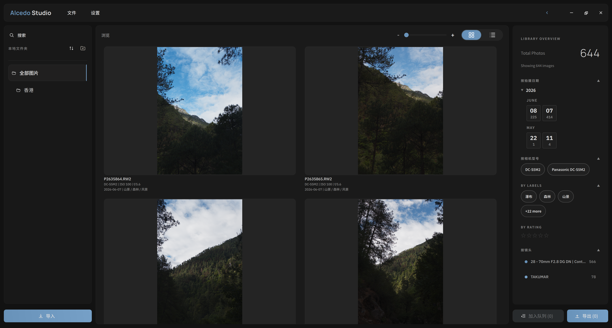
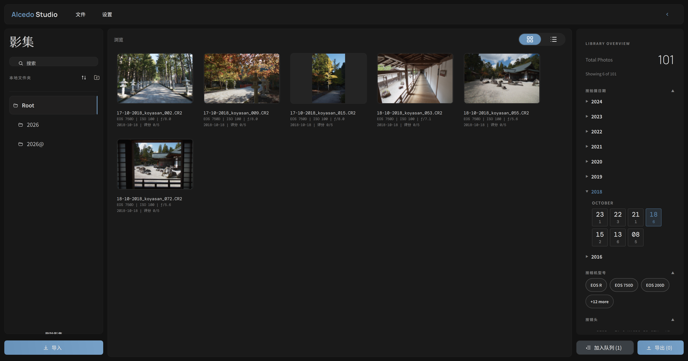
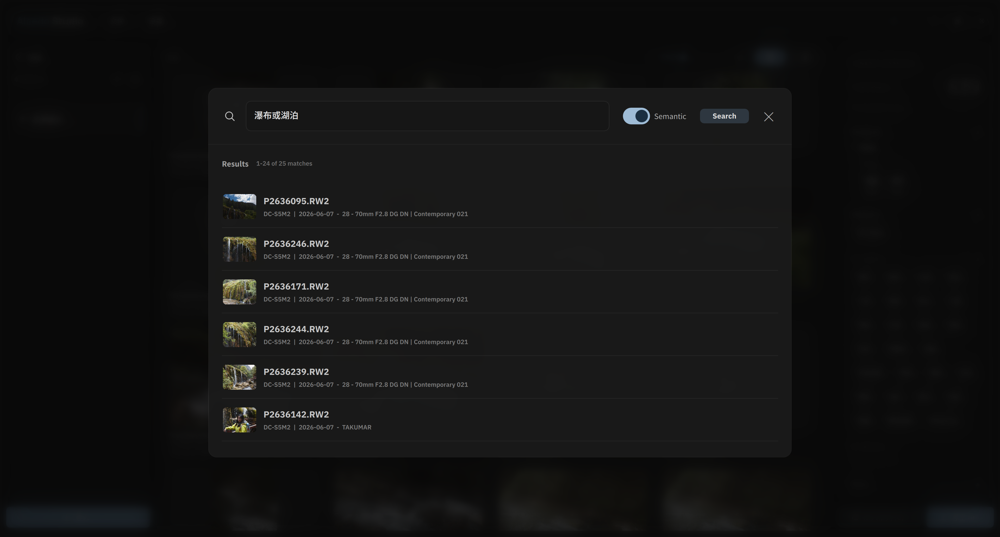
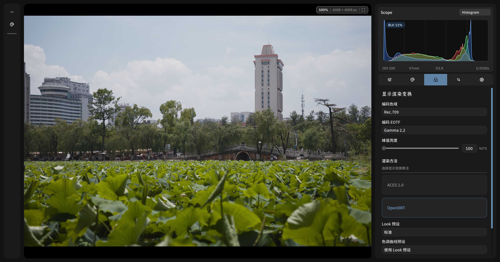
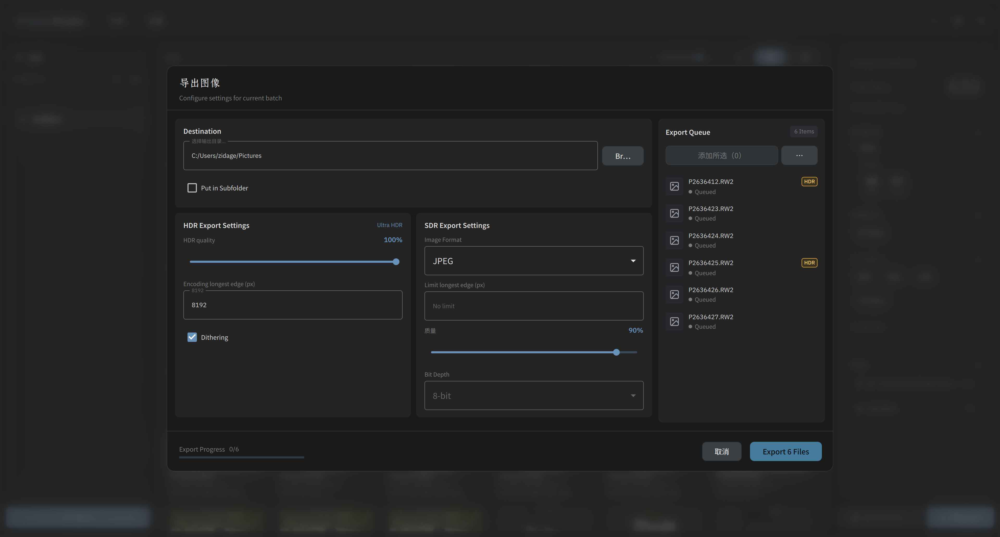

[Project website](https://aoraw.org/) | [项目网页](https://aoraw.org/zh-cn/)

<a href="./README.md"><strong>English</strong></a> | <a href="./README.zh-CN.md">简体中文</a>

**Alcedo Studio** is a next-generation RAW photo editor and library management system designed for photographers who demand absolute speed, complete privacy, and native AI capabilities. By replacing database bloat and cloud dependency with a high-performance GPU-accelerated pipeline and local-first AI models, Alcedo Studio delivers a fluid, secure, and professional editing workflow.

---

## Screenshots and Demo

The screenshots below reflect the v0.2.6-era interface of Alcedo Studio.

<table>
  <colgroup>
    <col style="width: 76%" />
    <col style="width: 24%" />
  </colgroup>
  <tbody>
    <tr>
      <td></td>
      <td><strong>Library Browser</strong> — Fast thumbnail grid, folder directory tree, active search facets, rating filters, and AI labels in a single workspace.</td>
    </tr>
    <tr>
      <td></td>
      <td><strong>Advanced Filtering</strong> — Search, filter, and drill down through your library using EXIF data, custom ratings, and semantic keywords.</td>
    </tr>
    <tr>
      <td></td>
      <td><strong>Local AI Vision Engine</strong> — Toggle and manage local CLIP and SigLIP models to run lightning-fast photo scanning with 100% data privacy.</td>
    </tr>
    <tr>
      <td></td>
      <td><strong>Semantic Label Filters</strong> — Automatically generated AI tags are integrated directly into the filter panel as first-class library attributes.</td>
    </tr>
    <tr>
      <td></td>
      <td><strong>Natural-Language Search</strong> — Describe a scene in plain English, and find the closest matches instantly using our local vector index.</td>
    </tr>
    <tr>
      <td></td>
      <td><strong>Professional Color Science</strong> — Output rendering using ACES 2.0 and OpenDRT with display color space and peak luminance controls.</td>
    </tr>
    <tr>
      <td></td>
      <td><strong>Real-Time Exposure & Tone</strong> — Fine-tune white balance, exposure, contrast, tone curves, and local highlights/shadows with live histogram feedback.</td>
    </tr>
    <tr>
      <td></td>
      <td><strong>Creative Grading</strong> — Precise control over HSL adjustments, color wheel grading (Lift, Gamma, Gain), and real-time scopes.</td>
    </tr>
    <tr>
      <td></td>
      <td><strong>Geometry & Perspective</strong> — Intuitive crop, rotation, perspective repair, and common aspect ratio templates.</td>
    </tr>
    <tr>
      <td></td>
      <td><strong>Film Simulation</strong> — Native support for curated Kodak, Fuji, and Agfa LUTs (.cube) designed for ACEScc/ACEScct workflows.</td>
    </tr>
    <tr>
      <td></td>
      <td><strong>Analog Film Effects</strong> — Beautiful, mathematically realistic film grain and halation effects computed dynamically on GPU/CPU pipelines.</td>
    </tr>
    <tr>
      <td></td>
      <td><strong>Advanced Export</strong> — Multi-format batch export, quality parameters, metadata handling, and UltraHDR gain-map embedding.</td>
    </tr>
  </tbody>
</table>

> Some demo RAW files used by the project are from [signatureedits](https://www.signatureedits.com/free-raw-photos/) 100% Free Raw Files.

---

## What Changed Since v0.2.3

Following the v0.2.3 rebrand, subsequent cycles moved the project from prototype breadth to a practical, production-ready RAW editor and digital asset manager.

| Release | Key Highlights |
| --- | --- |
| **v0.2.4** | GPU pipeline migrated to OpenCL; added OpenCL image containers, program management, lens calibration, perspective geometry, DNG warping, and scope analysis. Split editing UI into dedicated tool panels. Sleeve filesystem introduced collection grouping, pagination, star ratings, and global index search. |
| **v0.2.5** | Overhauled local tone mapping (Highlights/Shadows) with LLF-style processing. Improved OKLCh/HLS color science. Added batch copy/paste adjustments, interactive geometry crop overlays, and UltraHDR gain-map export writers. |
| **v0.2.6** | Integrated AI-native workspace: local semantic search, local CLIP/SigLIP background scanners, HNSW vector indexing, and asynchronous model down loaders. Added GPU/CPU film grain & halation simulation. Patched LibRaw to natively decode Nikon HE/HE* RAWs. |

---

## Core Pillars

### 1. Studio-Grade 32-Bit Float, Dual Color Science & HDR Pipeline
Editing is at the heart of Alcedo Studio. Quality, precision, and performance are never compromised, keeping your creative flow completely seamless.
* **32-Bit Floating-Point Precision**: The entire pipeline from raw demosaicing using the high-fidelity **RCD algorithm** to highlight reconstruction operates in 32-bit float per channel, preserving every ounce of shadow and highlight detail.
* **Dual Color Science**: Native integration of professional ACES 2.0 and OpenDRT output transforms with custom target color spaces, peak-luminance control, and EOTF mapping.
* **True HDR & UltraHDR Workflow**: This is not a simulated post-processing filter that artificially brightens shadows and highlights. Alcedo Studio maps the full, uncompromised dynamic range captured by the RAW sensor directly to high-dynamic-range displays (HDR preview is macOS-only). Export standard-compliant **UltraHDR gain-map JPEGs** to faithfully reproduce the scene's original luminosity on modern HDR screens and social media.
* **Multi-Backend GPU Speed**: Written natively for CUDA and OpenCL on Windows, and Metal on macOS. The engine delivers hundreds of frames per second on modern GPUs, making exposure and grading adjustments instantaneous.

### 2. Native Nikon High-Efficiency (HE/HE*) Support
High-Efficiency (`HE`) and High-Efficiency★ (`HE*`) RAW formats are still unsupported in mainstream upstream LibRaw. Instead of forcing you to waste time converting files to DNG, Alcedo Studio decodes them natively.
* **Zero Conversion Bottleneck**: Import and edit highly-compressed RAW files directly from Nikon Z 8, Z 9, Z 6 III, Z f, and Z 50 II cameras.
* **Patched LibRaw Integration**: Uses a custom-patched fork of LibRaw optimized for maximum decompression speed.

### 3. Privacy-First, On-Device Semantic Search
Stop hunting through folders and guessing filenames. Alcedo Studio includes a built-in local vector search engine powered by state-of-the-art vision models (CLIP / SigLIP) running entirely on your machine.
* **Semantic Querying**: Type natural language descriptions like *"portrait at sunset by the ocean"* to search your library. Queries are converted to vector embeddings and ranked against your photos in milliseconds.
* **100% Local and Private**: Zero images or queries leave your hard drive. No API keys are required for core library tagging and searching.
* **Model Isolation**: Switch between different models (MobileCLIP2, SigLIP2, Jina CLIP v2, or macOS CoreML profiles) seamlessly. Labels generated by different models remain isolated to prevent tag pollution.

### 4. Multi-Modal LLM Culling Assist & EXIF Metadata Writeback
Let AI handle the tedious first pass of culling by acting as your aesthetic editor. Connect to standard APIs (OpenAI-compatible, Anthropic, or Volcengine Ark) to batch-analyze candidate photos.
* **Detect Culling Pain Points**: The AI automatically flags technical and aesthetic issues such as **out-of-focus shots (missed focus), camera shake (motion blur), and poor composition** before you waste time editing them.
* **1-5 Star Aesthetic Ratings**: Get clear reviews and ratings mapped based on your strictness settings. Star ratings are automatically written back to the standard EXIF metadata, making them readable in any other photo manager.
* **Secure and Customized**: API keys are saved securely in your OS keychain, and adjustable strictness scales let you set the AI's critique standards from generous to highly critical.

### 5. Portable, Single-File Project Management
Forget the headache of migrating heavy database catalogs or dealing with corrupted library indices. Alcedo Studio uses a modern physical-first structure.
* **Single `.alcd` File**: All edit history, version metadata, semantic tags, and organization folders are packaged into a single lightweight DuckDB-backed `.alcd` file located right inside your photo directory.
* **Instant Portability**: Backing up, migrating, or syncing your library to an external drive or cloud storage is as simple as copying the folder containing the `.alcd` file.
* **Decoupled Thumbnail Cache**: Disk-backed thumbnail cache and metadata reside independently, ensuring your project files stay tiny and clean.

---

## Additional Features

### Non-Destructive Versioning (Edit History)
* **Named Version Trees**: Experiment with multiple creative looks (e.g., high-contrast monochrome vs. soft pastel film simulation) using named versions without duplicating RAW files.
* **Independent Undo/Redo Timeline**: Each version has its own history timeline. Revert to any state or clone editing recipes across multiple photos instantly.
* **Under the Hood**: Uses a Git-like content-addressable log where state matches are computed via Merkle tree hashing. See the [Architecture Details](docs/technical/architecture_details.md) to learn how this works.

### RAW Processing & Styling
* **High-Fidelity Demosaicing**: Native **RCD demosaic algorithm** implementation ensures clean, artifact-free RAW decoding with sharp details.
* **Styling & Film Emulation**: Curated spectral film LUTs (CUBE formats) optimized for ACEScc/ACEScct, paired with an advanced GPU-backed film grain and halation simulation engine.

### Export Workflow
* **Flexible formats**: Batch export to JPEG, PNG, TIFF, and WebP, supporting 8/16/32-bit depths.
* **UltraHDR & HDR Gain-Maps**: Fully supports exporting gain-map JPEGs for high-dynamic-range display on modern platforms (e.g., mobile devices and HDR screens).
* **Metadata & ICC Options**: Control metadata striping and embed target ICC profiles per batch.

> [!TIP]
> To read more about the technical details including virtual folder databases, performance stats, and rendering pipeline, check our [Architecture Details](docs/technical/architecture_details.md) document.

---

## RAW and Camera Support

Alcedo Studio imports all major RAW formats through a patched fork of [LibRaw](https://github.com/zidage/LibRaw):

- Canon CR2 / CR3
- Nikon NEF
- Sony ARW
- Fujifilm RAF
- Panasonic RW2
- Olympus / OM System ORF
- Leica, Hasselblad, Phase One, Pentax, Sigma, Samsung
- DNG, including smartphone and drone DNGs

See the full format list in [docs/supported_raw_formats.md](docs/supported_raw_formats.md) and the camera list in [docs/supported_cameras.md](docs/supported_cameras.md).

### Exclusive Nikon HE / HE\* support
Nikon High-Efficiency (`HE`) and High-Efficiency★ (`HE*`) NEFs are still unsupported in upstream LibRaw 0.22. Alcedo Studio ships a patched LibRaw fork that decodes these files directly — no conversion to DNG required. Validated cameras include:
- Nikon Z 8
- Nikon Z 9
- Nikon Z 6 III
- Nikon Z f
- Nikon Z 50 II

The decoder lives in the project's LibRaw fork: **https://github.com/zidage/LibRaw**

---

## System Requirements

- **Windows**: Windows 10/11 x64. CUDA-capable NVIDIA GPU (minimum compute capability 6.0 / 10-series, recommended 7.0+ / 20-series) with 6GB+ VRAM for optimal 40MP+ RAW performance. OpenCL fallback available for non-NVIDIA GPUs.
- **macOS**: Apple Silicon Mac (M1/M2/M3/M4 series) running native Metal execution paths.
- **Memory**: Minimum 8GB system RAM (16GB+ recommended for large libraries).
- **Disk Space**: 500MB free disk space for installation; 60MB+ package footprint.

---

## Build from Source

Build instructions are maintained separately in [docs/build_from_source.md](docs/build_from_source.md) (English and Chinese).

---

## Roadmap

Roadmap and ongoing milestones are tracked in [docs/roadmap/roadmap.md](docs/roadmap/roadmap.md).

---

## Acknowledgements

Alcedo Studio builds on research, open-source implementations, and community data from the wider imaging ecosystem:

- Distributed film-emulation LUTs are from [JanLohse/spectral_film_lut](https://github.com/JanLohse/spectral_film_lut).
- Some camera color matrices are from [AcademySoftwareFoundation/rawtoaces-data](https://github.com/AcademySoftwareFoundation/rawtoaces-data).
- The highlight reconstruction algorithm is adapted from RawTherapee's [hilite_recon.cc](https://github.com/RawTherapee/RawTherapee/blob/dev/rtengine/hilite_recon.cc).
- The RCD demosaic algorithm is from [LuisSR/RCD-Demosaicing](https://github.com/LuisSR/RCD-Demosaicing).
- OpenDRT is ported from [OpenDRT.dctl](https://github.com/jedypod/open-display-transform/blob/main/display-transforms/opendrt/OpenDRT.dctl).
- ACES 2.0 support is ported from [aces-aswf/aces-core](https://github.com/aces-aswf/aces-core).
- The film grain renderer is based on Alasdair Newson, Noura Faraj, Bruno Galerne, and Julie Delon's [Realistic Film Grain Rendering](https://doi.org/10.5201/ipol.2017.192).

---

## License

The `v0.1.1` tag and earlier releases remain under Apache-2.0.
Development after `v0.1.1` is licensed under `GPL-3.0-only`, with an additional permission under GPLv3 section 7 for combining/distributing required NVIDIA CUDA components.
See [LICENSE](LICENSE) and [NOTICE](NOTICE).
