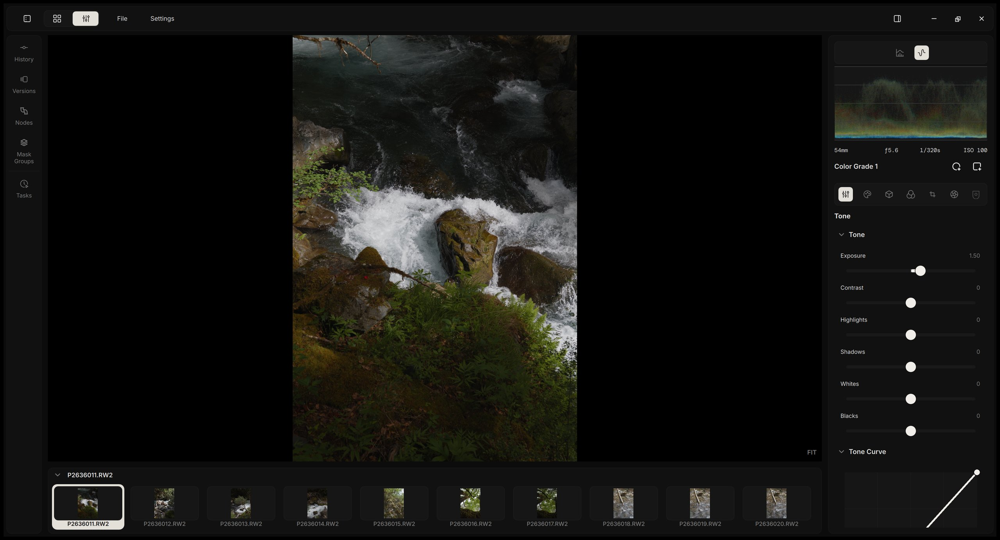
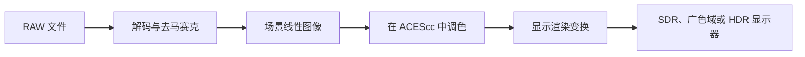
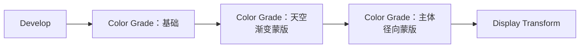
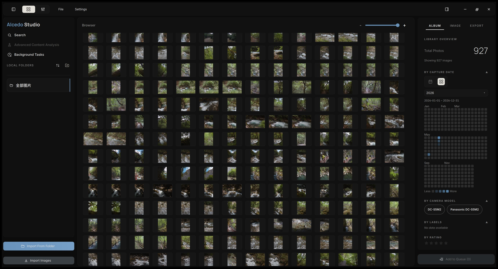
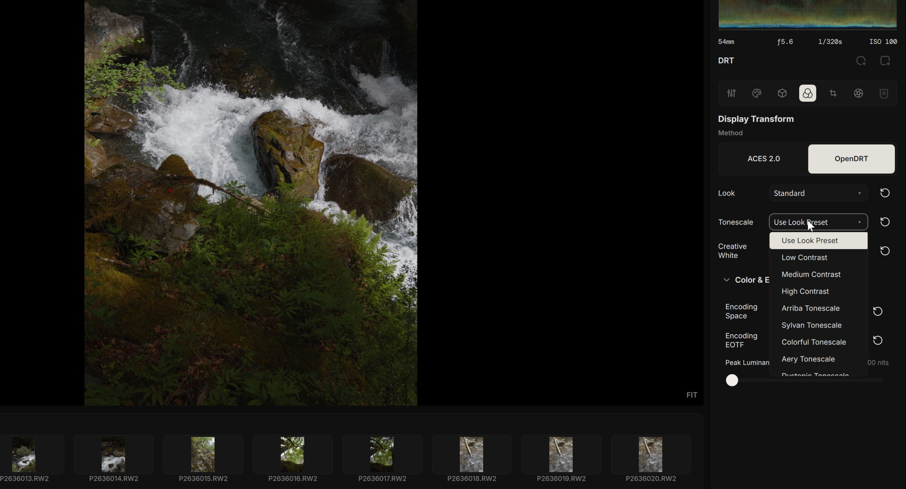
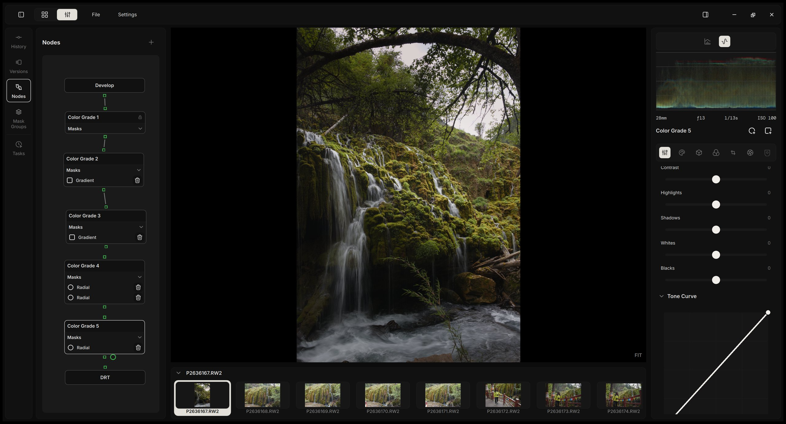
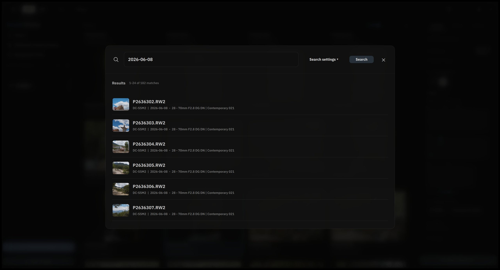
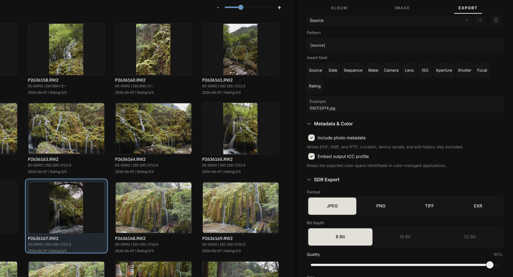

  

  <a href="https://aoraw.org/zh-cn/">项目网站</a> · <a href="https://aoraw.org/">Project website</a> · <a href="https://zidage.github.io/AlcedoStudio_docs/docs/intro">文档</a> · <a href="https://github.com/zidage/AlcedoStudio/releases/tag/v0.2.9">下载 v0.2.9</a>

<a href="./README.md">English</a> | <a href="./README.zh-CN.md"><strong>简体中文</strong></a>

-lightgrey)

**Alcedo Studio** 是一款免费、开源的 RAW 编辑器与照片图库。

把照片拷贝到本地硬盘并导入文件夹后，你可以在 Alcedo 中浏览、评分和搜索它们，再通过 GPU 加速的 32 位浮点管线逐张冲洗 RAW，最高可处理 1.5 亿像素的文件。相册结构和每张照片的完整编辑历史都保存在同一个项目文件里，移动或备份它就像处理任何普通文件一样。

支持 Windows 10/11（x64）和搭载 Apple Silicon 的 Mac。

  

<strong>观看演示</strong>（两段短视频）

编辑器

https://github.com/user-attachments/assets/d70cd10d-2045-42f3-a67d-97ab3ef9874b

图库

https://github.com/user-attachments/assets/ae0d9773-220e-4901-90f6-1989f58b0462

## 功能一览

### RAW 解码

Alcedo 可以读取 Canon、Nikon、Sony、Fujifilm、Panasonic、OM System、Leica、Hasselblad、Phase One（包括 1.5 亿像素的 IQ4）、Pentax、Sigma 的 RAW 文件，以及手机和无人机生成的 DNG，详见[支持的格式](docs/supported_raw_formats.md)和[支持的相机](docs/supported_cameras.md)。借助项目维护的 [LibRaw 分支](https://github.com/zidage/LibRaw)，它也能打开 Z 8、Z 9、Z 6 III 和 Z 50 II 拍摄的 Nikon 高效率（HE）NEF 文件。

它提供两种去马赛克方法。Bayer 传感器默认使用 RCD；Fujifilm X-Trans 默认使用 Neural Engine，这是一个从 [DemosaicNet](https://groups.csail.mit.edu/graphics/demosaicnet/) 蒸馏而来、在 GPU 上运行的精简神经网络，同样适用于 Bayer 文件。Alcedo 还支持基于 darktable 与 RawTherapee 的 inpaint-opposed 方法改进而来的高光重建、基于 Lensfun 配置文件的镜头校正，以及 DNG 文件内嵌的色彩配置文件。

### 高性能 32 位浮点管线

得益于高度优化的 GPU 加速管线（Windows 上基于 CUDA 和 OpenCL，Mac 上基于 Metal）和精心设计的缓存机制，即使打开 1.5 亿像素的文件，编辑依然流畅。拖动滑块时，无论原图分辨率多高，预览都能保持 2.5K、60 FPS；松开后，预览会提升到 4K。放大查看时，Alcedo 只以完整细节渲染当前可见的区域。

### 场景参考的色彩管线

Alcedo 在整个编辑过程中保留 RAW 文件的全部范围，只在最后一步为你的显示器形成画面：

显示渲染变换可以选择 ACES 2.0 输出变换或 OpenDRT，并设置目标色彩空间、传递函数和峰值亮度。在配备 HDR 显示屏的 Mac 上，编辑器可以直接预览 HDR 效果。

### 基于节点的调色

每张照片的编辑都是一张节点图。Develop 节点把 RAW 转换为场景参考图像，之后可以依次串联任意多个 Color Grade 节点，最后由 Display Transform 节点形成最终画面。每个 Color Grade 节点都有自己的调整和蒙版，因此一次调色既可以作用于整个画面，也可以只作用于你选定的区域。

每个节点内都有常用的影调和色彩控制、色调曲线、Lift/Gamma/Gain 色轮、可选颜色和细节工具，阴影与高光由局部色调映射处理。Alcedo 还内置了[根据真实胶片光谱响应生成的 CUBE LUT](https://github.com/JanLohse/spectral_film_lut)，以及基于物理模型的胶片颗粒和光晕。

### 版本与编辑历史

每张照片可以保存多个命名版本，你也可以从历史中的任意一步分出新版本。每一次调整都会记录在类似 Git 的历史中，并保存在项目文件里，因此可以永远撤销。你还可以把完整的 Look，或只把其中你选中的部分，复制到其他照片上。实现原理请参阅[编辑历史设计说明](https://zidage.github.io/AlcedoStudio_docs/en/docs/developer/edit-history-architecture)。

### 图库与搜索

图库存储在 [DuckDB](https://duckdb.org/) 数据库中，照片越来越多时，浏览、筛选和搜索依然流畅。相册检查器按拍摄日期、相机、镜头、标签和评分对照片分组，选中某个分组即可筛选相册。

Alcedo 支持三种搜索：按相机、镜头、日期、ISO、焦距和光圈进行 EXIF 搜索；使用在本地运行的多语言 CLIP 模型进行自然语言搜索，这些模型也可以在导入后自动为照片打标签；以及对 Alcedo 生成的描述和标签进行全文搜索。

它还可以通过兼容 OpenAI 或 Anthropic 的接口，连接你已经在使用的 AI 服务，为每张照片撰写描述，并给出 1–5 星评分和简短理由。评片的严格程度和使用的语言都可以设置。API 密钥保存在 Windows 凭据管理器或 macOS 钥匙串中，分析在后台运行，不影响你继续工作。

### 导出

Alcedo 可以导出 JPEG、PNG、TIFF、OpenEXR 和 Ultra HDR JPEG，并根据格式支持 8、16 或 32 位。它支持按长边、像素尺寸或打印尺寸设置大小，嵌入 ICC 配置文件，并用源文件名、拍摄日期、相机、镜头、曝光参数、评分和序号组合文件名；常用设置可以保存为预设。导出的文件不包含定位信息、设备序列号和编辑历史。

## 截图

<table>
  <tr>
    <td width="50%"></td>
    <td width="50%"></td>
  </tr>
  <tr>
    <td width="50%"></td>
    <td width="50%"></td>
  </tr>
  <tr>
    <td width="50%"></td>
    <td width="50%"></td>
  </tr>
</table>

## 系统要求

- **Windows** 10 或 11，x64。计算能力 6.0 及以上的 NVIDIA GPU 使用 CUDA，其他 GPU 使用 OpenCL。
- **macOS** 13.3 或更高版本，Apple Silicon（M1 或更新），使用 Metal。
- 内存至少 8 GB，大型图库建议 16 GB 或以上。

## 文档

用户指南和开发者说明请见[文档网站](https://zidage.github.io/AlcedoStudio_docs/docs/intro)。从源码构建请参阅 [docs/build_from_source.md](docs/build_from_source.md)，各版本的更新说明位于 [docs/changelog/](docs/changelog/)。

## 致谢

Alcedo Studio 基于许多开源项目及其作者的工作。

- 胶片模拟 LUT 来自 [JanLohse/spectral_film_lut](https://github.com/JanLohse/spectral_film_lut)。
- 部分相机色彩矩阵来自 [rawtoaces-data](https://github.com/AcademySoftwareFoundation/rawtoaces-data)。
- 神经网络去马赛克模型蒸馏自 [mgharbi/demosaicnet](https://github.com/mgharbi/demosaicnet)（[Gharbi 等，2016](https://groups.csail.mit.edu/graphics/demosaicnet/)）。
- Inpaint-opposed 高光重建改编自 [darktable](https://github.com/darktable-org/darktable/blob/master/src/iop/hlreconstruct/opposed.c) 和 [RawTherapee](https://github.com/RawTherapee/RawTherapee/blob/dev/rtengine/hilite_recon.cc)。
- RCD 去马赛克改编自 [LuisSR/RCD-Demosaicing](https://github.com/LuisSR/RCD-Demosaicing)。
- OpenDRT 移植自 Jed Smith 的 [open-display-transform](https://github.com/jedypod/open-display-transform)。
- ACES 2.0 输出变换依据 [aces-aswf/aces-core](https://github.com/aces-aswf/aces-core) 实现。
- 胶片颗粒基于 [Realistic Film Grain Rendering](https://doi.org/10.5201/ipol.2017.192)（IPOL 2017）。
- RAW 解码使用 [LibRaw](https://www.libraw.org/)，镜头校正使用 [Lensfun](https://lensfun.github.io/)，元数据使用 [Exiv2](https://exiv2.org/)，图像读写使用 [OpenImageIO](https://github.com/AcademySoftwareFoundation/OpenImageIO) 和 [OpenCV](https://opencv.org/)，色彩管理使用 [OpenColorIO](https://opencolorio.org/)，图库使用 [DuckDB](https://duckdb.org/)，界面使用 [Qt](https://www.qt.io/) 和 [QuickQanava](https://github.com/cneben/QuickQanava)。

完整的第三方组件及其许可证列表请参阅 [THIRD_PARTY_NOTICE.txt](THIRD_PARTY_NOTICE.txt) 和 [third_party_licenses/](third_party_licenses/)。

ACES 是美国电影艺术与科学学院（A.M.P.A.S.）的商标。Alcedo Studio 是独立项目，与 A.M.P.A.S.、Academy Software Foundation、Jed Smith 以及上文提到的其他上游作者均无关联，也未获得其认证或背书。文中提及这些名称仅用于标明相应的技术。

## 许可证

Alcedo Studio 使用 GNU 通用公共许可证 v3.0（GPL-3.0-only）。请参阅 [LICENSE](LICENSE) 和 [NOTICE](NOTICE)。
