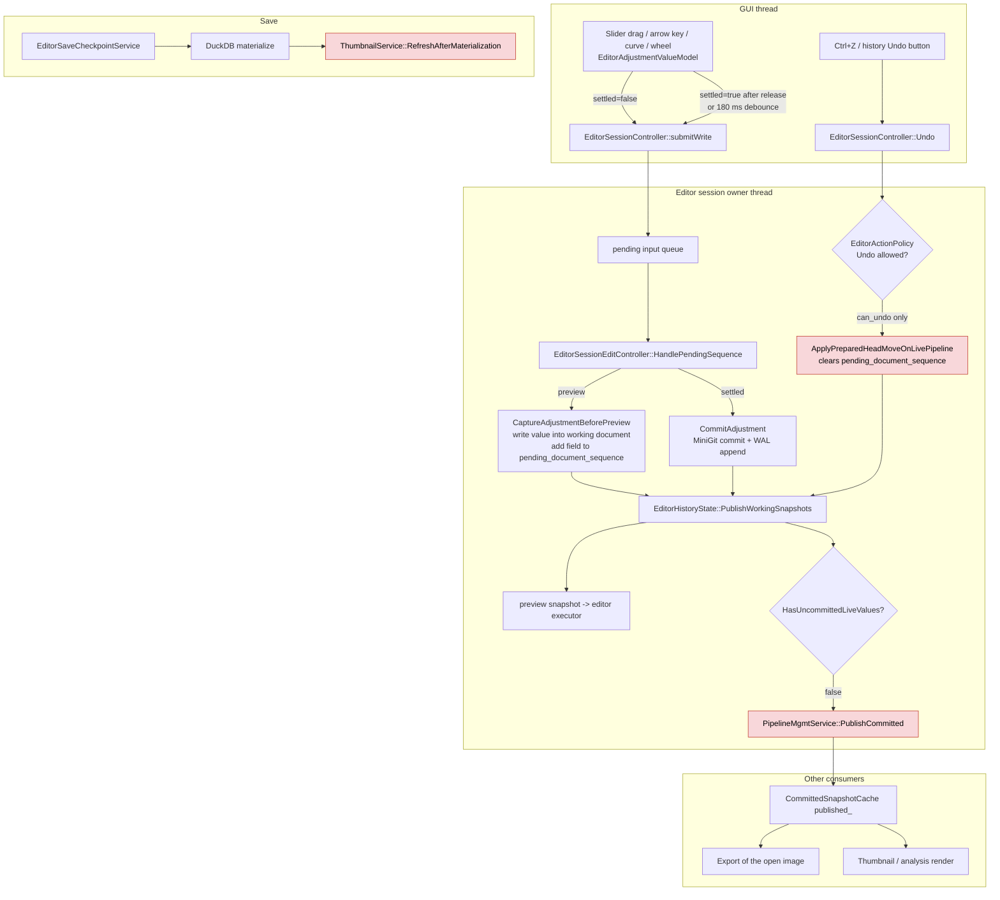
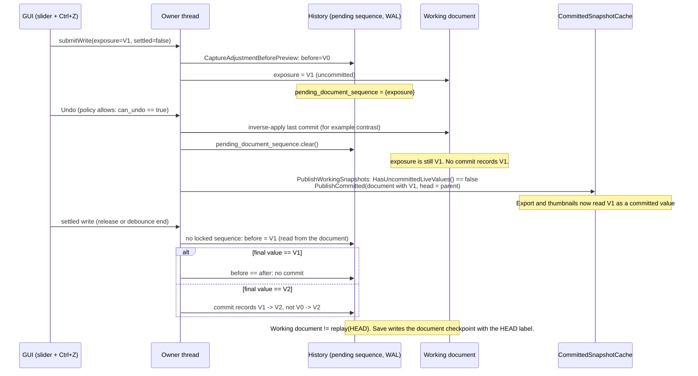
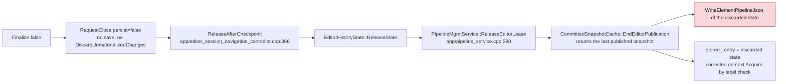
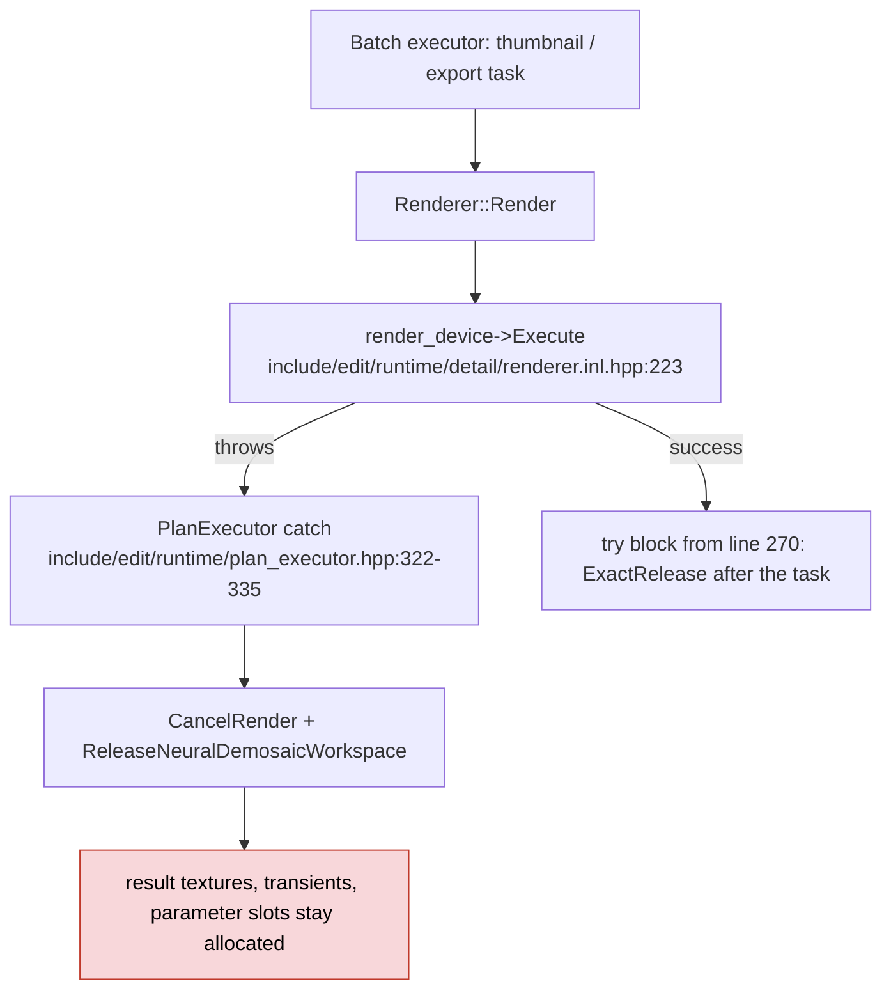

# Executor Ownership Refactor Review Findings

- Date: 2026-10-07
- Status: planned (findings recorded; no fix started)
- Reviewed series: #211, #212, #216, #217, #218, #219, #220, #223, #224
  (executor ownership refactor P0 to P8; +20198 / -14118 lines in 292 files)
- Source revision: `v0.3.2` (`939700f7`)
- Specification: [Executor ownership refactor plan](../../../refactor/2026-09-27-executor-ownership-refactor-plan.md)
  and [executor ownership audit](../../../refactor/2026-09-27-executor-ownership-audit.md)
- Related roadmap notes that the refactor superseded:
  [Editor single live pipeline plan](../ui/editor_single_live_pipeline_wal_checkpoint_plan.md),
  [NM1 pipeline document editing plan](node_mask_editor/phase_nm1_pipeline_document_editing_plan.md),
  [Phase 6C history and pipeline snapshot plan](../ui/phase_6c_mini_git_history_and_pipeline_snapshot_plan.md),
  [G10 final removal plan](gpu_dag_final_removal_phase_plan.md)
- Other affected areas: editor session (UI backend), thumbnails, export, CI

Paths in this document are relative to `alcedo_studio/src/` unless they start with `alcedo_studio/`,
`docs/`, or `.github/`.

## 1. Decision record

### 1.1 Review rules

1. Judge history and commit behavior from the actions that the UI allows. A finding that needs an
   action sequence the UI blocks is not a product defect. Section 6 lists such findings.
2. A pipeline document with no commit is in the edit state. The edit state belongs to the editor
   session only. No other consumer (thumbnails, analysis, export, Copy, element pipeline JSON)
   can see a value that no commit records.
3. A committed state can go to other consumers. A discarded commit must not stay visible to any
   consumer.
4. Behavioral correctness comes only from executed tests. The review machine had no Qt, CUDA,
   OpenCL, Metal, or DuckDB, so no test ran. Each finding states its evidence level:
   - **Source trace**: the reviewer followed the call chain in the `v0.3.2` source. A test must
     confirm the result before a fix lands.
   - **Coverage gap**: the behavior has no test that can fail when the behavior breaks.
   - **Maintainability**: structure, naming, or documentation. No behavior claim.
5. Do not add a version, generation, token, or similar mechanism for a finding until a test
   drives the executable interleaving. `AGENTS.md` sets this rule.

### 1.2 Terms

| Term | Meaning in this document |
| --- | --- |
| Input sequence | The preview writes of one field between the first write and the settled write. A slider drag, the 180 ms debounce after an arrow key, and an open Mask edit are input sequences. |
| Commit | One settled transaction in `MiniGitWorkingHistory`. The WAL journal stores it at once. |
| Save | Materialization of the commits to DuckDB (`EditorSaveCheckpointService`). |
| Working document | `HistoryWorkingState::document`, owned by the editor session owner thread. |
| Preview snapshot | Frozen working document for the editor render. It can hold uncommitted values. |
| Committed snapshot | `PipelineGraphSnapshot` with `committed == true`, labelled with head and chain. Thumbnails, analysis, and export read only this kind. |

## 2. Commit model in the current source

The flowchart shows the data flow at `v0.3.2`. The red nodes are the steps where the findings in
Section 4 apply.

Verified source facts:

- Every panel field write goes through `EditorSessionController::submitWrite`
  (`ui/alcedo_main/album_backend/editor_session_controller.cpp:1477`). Sliders, curves, and color
  wheels use the same pending sequence. Mask edits set `mask_input_open`.
- `HasUncommittedLiveValues()` is `!pending_document_sequence.empty() || mask_input_open`
  (`include/ui/alcedo_main/album_backend/editor_history_state_detail.hpp:83-85`).
- `PublishWorkingSnapshots` publishes the preview document as the committed snapshot when that
  check is false (`ui/alcedo_main/album_backend/editor_history_state_detail.cpp:233-251`).

## 3. Findings summary

| ID | Severity | Finding | Evidence |
| --- | --- | --- | --- |
| H1 | High | Undo, Redo, and history moves run during an open input sequence. The uncommitted value stays in the document, leaves no commit, and goes to other consumers as a committed state. | Source trace |
| H2 | High | macOS CI runs no Metal test. All Metal evidence of the series is local only. | Source trace (CI configuration) |
| M1 | Medium | Close with Discard writes the discarded state into the element pipeline JSON. | Source trace |
| M2 | Medium | The thumbnail of the open image changes only after Save, not after each commit. | Source trace |
| M3 | Medium | A batch render that fails during GPU execution keeps its GPU resources. | Source trace |
| M4 | Medium | Copy Adjustments reads the editor image identity and its history in two separate steps. | Source trace |
| M5 | Medium | The executor binding key and the release order differ from plan §3.3. | Source trace |
| M6 | Medium | Silent substitutes and swallowed errors break the no-fallback rule. | Source trace |
| M7 | Medium | Export reports a wrong stage and message when the render fails. | Source trace |
| M8 | Medium | The GUI thread does storage reads, history replay, and file deletes. | Source trace |
| M9 | Medium | The frozen-document write check never compiles in CI, and revision reuse has no per-type test. | Coverage gap |
| L1–L6 | Low | Unused epoch, wrong completion records, terminology, test quality, cost claims, API surface. | Mixed |
| D1–D4 | Structure | Editor session god object, shared history state, three lease tables, two replay paths. | Maintainability |
| W1–W3 | Not reachable | Paste and editor open race, lease release race, non-slider input bypass. | Withdrawn |

## 4. Findings

### H1 — History moves run during an open input sequence

**Rule affected:** Section 1.1 rule 2. An uncommitted value must stay private to the editor session.

**UI paths that the current policy allows:**

1. Press an arrow key on a focused slider, then press Ctrl+Z within 180 ms. The arrow key starts
   a preview write and a 180 ms debounce
   (`ui/alcedo_main/album_backend/editor_adjustment_models.cpp:248`, `:344`).
2. Hold a slider drag with the mouse and press Ctrl+Z.
3. Keep a Mask edit open (`mask_input_open == true`) and press Ctrl+Z.
4. Use Redo, or select a commit in the history list (MoveHead), in the same windows.

The Undo shortcut checks only `canUndo` (`ui/alcedo_main/qml/Main.qml:835-842`).
`EditorActionPolicy::Evaluate` checks `mask_input_open` only for `OpenComparison`
(`app/editor_action_policy.cpp:362-371`). It does not check an open input sequence for `Undo`,
`Redo`, or `MoveHead` (`app/editor_action_policy.cpp:274-296`).

**Call chain:**

**Source references:**

- The pending sequence is cleared without a restore in
  `ui/alcedo_main/album_backend/editor_history_mutation.cpp:215`
  (`ApplyPreparedHeadMoveOnLivePipeline`).
- `EditorSessionService::Undo` (`app/editor_session_service.cpp:2059-2091`) and
  `EditorSessionEditController::HandleUndoRedo` (`app/editor_session_edit_controller.cpp:188-216`)
  do not restore or settle the open sequence first.
- A settled write with no locked sequence reads `before` from the current document
  (`ui/alcedo_main/album_backend/editor_history_mutation.cpp:310-338`).
- Save refuses to capture only while `HasUncommittedLiveValues()` is true. After the sequence is
  cleared, it captures the working document with the HEAD label
  (`ui/alcedo_main/album_backend/editor_history_checkpoint.cpp:38-50`). The divergent document is
  then stored as the checkpoint of HEAD.

**Effect:** The user sees the value V1 in the editor, but the history does not contain it. Export,
the thumbnail, and the saved checkpoint get V1 under the HEAD label. A later replay from the root
gives a different image than the checkpoint. A later Undo of the V1 -> V2 commit restores V1, a
value that no commit ever recorded.

**Origin:** The divergence of the document and the history can predate the series. The series
adds the publication of that document to thumbnails and export (P4, P6).

**Required behavior:** While an input sequence or a Mask edit is open, the working document is in
the edit state. A history move must not run on it. Use the existing action policy:

- Add an `input_sequence_open` fact to `EditorActionInputs`. Set it from
  `pending_document_sequence` and from the pending input queue of the open image.
- Deny `Undo`, `Redo`, and `MoveHead` while `input_sequence_open || mask_input_open` is true. Use
  the same rule that `OpenComparison` already uses for `mask_input_open`.
- Check `ApplyPaste` into the open image against the same rule. The review did not trace it.
  `DiscardChanges` already restores the open sequence first
  (`ui/alcedo_main/album_backend/editor_history_mutation.cpp:785-793`), and Version checkout
  settles queued input before its save (`SealAndStartSave`).
- The QML shortcut and the history buttons read the same projected decision, so they become
  disabled without a QML change.
- Keep the defensive restore: if a history move runs with a non-empty sequence, restore the
  `before` values (`RestoreUnsettledPreview`) before the move. Do not clear the sequence alone.

**Required tests (drive the real history port, not a fake):**

- `UndoIsDeniedWhileASliderInputSequenceIsOpen`: open sequence -> `Undo` returns Rejected; the
  working document and HEAD do not change; no committed snapshot is published.
- `UndoIsDeniedWhileAMaskEditIsOpen`.
- `ArrowKeyThenUndoWithinDebounceKeepsDocumentEqualToHeadReplay`: preview write, Undo, settled
  write -> the working document equals `BuildDocumentFromRoot(head)`.
- `CommittedSnapshotNeverContainsAnUncommittedValue`: for each of Undo, Redo, MoveHead during an
  open sequence -> `AcquireCommittedSnapshot` returns a document equal to the replay of its head.
- `SaveCheckpointMatchesHeadReplayAfterHistoryMoves`.

### H2 — macOS CI runs no Metal test

- `CMakePresets.json:257` filters CTest labels with `ci_core_flow|ci_raw_flow|ci_metal_runtime`.
- No test has the label `ci_metal_runtime`. Metal tests have `gpu;edit;runtime;metal`
  (for example `alcedo_studio/tests/edit/CMakeLists.txt:491-492`). The `ci_metal` category in
  `alcedo_studio/tests/cmake/AlcedoTestRegistration.cmake` adds a build dependency, not a label.
- `.github/workflows/cpp-ci.yml:93` runs `ctest --preset macos_arm_metal_ci`.
- The filter predates the series. The series is affected because its Metal changes (P1 revision
  protocol, P3 binding release) have only local evidence. The P3 local record has a known Metal
  failure (`InteractiveQualityBaseInteractiveReuses2560PixelResults`), and the executor-level tests
  skipped because sample images were missing.

**Required work:** Give the Metal runtime tests the `ci_metal_runtime` label, or change the
preset filter to the label that the tests have. Then give `ExecutorIsolationTest` a CI label. It
has no CTest label now, so CI never runs it.

### M1 — Close with Discard writes the discarded state into the element pipeline JSON

**UI path:** Quit the application, choose Discard in `EditorCloseConfirmDialog`
(`ui/alcedo_main/qml/Main.qml:368`, `Finalize(false)`).

- The cache entry is safe: `Acquire` compares the head and chain with the materialized labels and
  reloads from storage (`app/committed_snapshot_cache.cpp:123-135`).
- The element pipeline JSON is not safe: it receives commits that the user discarded. Plan §6.3
  keeps this JSON for older application versions.

**Required behavior:** On release without Save, do not write the element pipeline JSON. Write it
only for a snapshot whose head equals the materialized head.

**Related observation outside the series (needs confirmation):** Close with Discard does not
truncate the WAL journal (`editor-journal/image-<id>.mini-git.wal`). The next acquire of the
same image in the same project directory replays the missing suffix and persists it
(`ui/alcedo_main/album_backend/editor_history_state_detail.cpp:96-163`). If the project directory
survives the quit, Discard does not discard. `ContinueToClose` had the same body at `v0.3.0`.

**Required tests:** `DiscardCloseLeavesElementPipelineJsonAtTheMaterializedState`;
`DiscardCloseThenReopenShowsTheMaterializedState`.

### M2 — The thumbnail of the open image changes only after Save

- Plan §3.4: commit -> `PublishCommitted` -> `ThumbnailService` invalidates and redraws for the
  new head.
- Code: `PipelineMgmtService::PublishCommitted` (`app/pipeline_service.cpp:108-114`) only
  updates the cache. The only refresh for the editor image runs after Save
  (`app/editor_save_checkpoint_service.cpp:256-258`) and after library history changes
  (`ui/alcedo_main/album_backend/application_module_host.cpp:328`).
- UI effect: the editor filmstrip (`EditorFilmstrip.qml`) shows the old thumbnail of the open
  image until Save or image switch. Section 1.1 rule 3 allows the committed state to go to
  thumbnails, so the redraw is permitted.
- The tests call `InvalidateThumbnail` by hand
  (`alcedo_studio/tests/app/thumbnail_committed_render_test.cpp:340`, `:353`), so they cannot
  detect this.

**Required work:** Notify `ThumbnailService` from the commit publication, or record that refresh
on Save is the product rule and correct plan §3.4. **Required test:**
`CommitWithoutSaveRedrawsTheOpenImageThumbnailWithTheNewHead`.

### M3 — A failed batch render keeps its GPU resources

- Plan §3.3: a batch task is one binding. The executor releases everything after the task.
- The resources stay until the next successful batch render on that executor.

**Required test (per backend):** `BatchRenderFailureDuringExecuteReleasesEveryResultResource`:
inject a failure in `Execute`; assert that the texture pool, the transient allocations, and the
parameter slots return to zero.

### M4 — Copy Adjustments reads identity and history in two steps

**UI path:** The editor shows image X. The user selects image Y in the filmstrip. Before the
switch completes, the user right-clicks X and chooses Copy Adjustments
(`ui/alcedo_main/qml/ImageActionsController.qml:585`).

- `AdjustmentTransferController::PrepareCopy` checks `editor_session_->element_id() == X`, then
  calls `SnapshotHistorySource`, which takes no element id
  (`ui/alcedo_main/album_backend/adjustment_transfer_controller.cpp:120-124`,
  `app/editor_session_service.cpp:596-605`).
- If the owner thread completes the switch between the two calls, Copy reads the history of Y
  and labels it as X.

**Required work:** Pass the element id to `SnapshotHistorySource`. Reject the read when the editor
does not hold that image. **Required test:**
`CopyAdjustmentsDuringImageSwitchReadsTheRequestedImageOrFails`.

### M5 — The binding key and the release order differ from plan §3.3

- Plan: binding key `(lineage, source file identity)`. Code: `{lineage, element_id}`. Within one
  binding, the prepared-source cache keeps several sources under a 512 MiB LRU. Two CUDA tests
  assert that reuse (`alcedo_studio/tests/edit/runtime/cuda_result_cache_test.cpp:474`,
  `alcedo_studio/tests/edit/runtime/cuda_product_plan_cache_test.cpp:136`).
- Plan: `WaitIdle` first, then release. Code: `Renderer<Backend>::ReleaseBinding` clears the
  source cache and the plan cache before `ReleaseDeviceResources`
  (`include/edit/runtime/renderer.hpp:290-299`).
- Automatic release on binding change has a test only on CUDA. OpenCL and Metal test only the
  explicit release call. No backend test checks transients, plan cache count, or the neural
  workspace after release.

**Required work:** Correct the code or the plan, and add per-backend release tests.

### M6 — Silent substitutes and swallowed errors

`AGENTS.md` forbids a silent substitute and catch-and-continue. The review found these cases:

| Case | Location |
| --- | --- |
| The scheduler reads the live frame-sink viewport when a request has no frozen viewport. The comment calls it a fallback. | `renderer/pipeline_scheduler.cpp:64-75`, `include/renderer/pipeline_task.hpp:44` |
| With no `PipelineMgmtService`, render owners use the Auto backend and the default LUT resolver. | PMS `accelerator_preference_`, `lut_resources_` consumers |
| A failed committed-snapshot publication only logs `qWarning`. Export and thumbnails keep the old state without an error. | `ui/alcedo_main/album_backend/editor_history_state_detail.cpp:252-255` |
| WAL recovery persistence failure: the image opens and the error is lost. | `ui/alcedo_main/album_backend/editor_history_state_detail.cpp:153-162` |
| `DeletePipeline(s)` and image jobs use empty `catch (...)`. | `app/pipeline_service.cpp`, `ui/alcedo_main/album_backend/editor_session_render_scheduler_port.cpp` |
| The apply request has a cancel callback that no renderer reads. | `include/edit/runtime/pipeline_apply_request.hpp:43` |

**Required work:** Report each failure to its caller. Remove the viewport substitute and the
default backend substitute.

### M7 — Export reports a wrong stage and message on render failure

- The scheduler returns a null result instead of an error, and the export completion callback
  ignores the message (`renderer/pipeline_scheduler.cpp:291-294`,
  `app/export_service.cpp:206-210`).
- The user sees stage "encode" with "ImageWriter: image_data is null".

**Required test:** `ExportRenderFailureReportsTheRenderStageAndTheRenderError`.

### M8 — The GUI thread does storage reads, replay, and file deletes

- Export enqueue reads and replays history on the GUI thread (`ui/alcedo_main/album_backend/import_export.cpp:1058`).
  The function note says to call it off the UI thread (`include/app/pipeline_service.hpp:144`).
- `PrepareCopy` reads the whole history on the GUI thread
  (`ui/alcedo_main/album_backend/adjustment_transfer_controller.cpp:131`).
- `ThumbnailService::InvalidateThumbnail` deletes disk entries on the caller thread and removes
  the entries of every head. This defeats the disk cache key `(head, chain)`.
- `panel_projection()` and `history_snapshot()` take the same lock as Checkout, WAL recovery, and
  the element JSON write on lease release.

**Required work:** Move these operations to the owner thread or a worker. Add a test that asserts
the thread of each storage read.

### M9 — Frozen-document and revision evidence

- The Debug write check of a frozen document exists only in
  `app/editor_working_document.cpp:36-41`. It checks the previous preview at the next publish, not
  around each render. It does not cover committed snapshots in the cache or metadata such as node
  names. CI builds Release, so the check never compiles there. No death test exists.
- Clones copy revisions on the assumption that a JSON round trip keeps every value. No test
  checks this per catalog type. A lost field keeps the old revision, and the renderer can show old
  parameters after Undo.
- The frozen-document tests skip Undo, Redo, replay (`ApplyPipelineEditBatch` with
  `ApplyTopologyDelta` rollback), `UseSensorSettingsFrom`, `LoadJson`, Paste, and grade
  `RemoveAdjustment` / `MoveAdjustment`. They compare JSON, not revisions.

**Required tests:** `PackedParametersMatchAfterCloneForEveryCatalogType`;
`FrozenDocumentIsUnchangedAfterEveryWritePath` (one case per write path above).

### Low severity

| ID | Finding | Location |
| --- | --- | --- |
| L1 | `AdvanceDocumentEpoch` / `document_epoch_` has no production caller and no documented interleaving, but still feeds the content key. Delete it. | document model, see `AGENTS.md` consistency rule |
| L2 | Completion records do not match the code: P2 / P2A say all changed files are under 1000 lines (`app/editor_session_service.cpp` is 2703); P7 says "no LRU" (the code has a 16-entry LRU); P8 marks `docs/technical/app` complete (the path is ignored by `.gitignore`); P1 "hit counts equal the baseline" is printed, not asserted. | refactor plan §P1, §P2, §P2A, §P7, §P8 |
| L3 | #211 adds three `class CommitGraph;` forward declarations without an include cycle. Touched files keep prohibited terms (`gating` at `include/edit/runtime/grade_parameter_slot.hpp:52`, `SmokeTest` target, half-renamed `LoadSeededBackend`). Phase labels stay in permanent code and tests (`Phase 4`, `Phase 7A`, `ALCEDO_P0_*`). Public struct members use a trailing `_`. The Doxygen block of `ImageHistorySnapshot` now sits above `EncodedImageRoot` (`include/app/pipeline_service.hpp:31-55`). | `AGENTS.md` naming and include rules |
| L4 | Test quality: `CompletionRunsAfterTheExecutorRenderLockIsReleased` calls `try_lock` on a mutex that the same thread can hold (undefined behavior); `pipeline_frame_sink_test.cpp:482,562,606` test code written in the test; `HistoryQueuesBehindRenderOwnershipOfLivePipeline` asserts the removed model; "reopen" tests reuse one `Storage` object; Paste tests do not check pasted values; `metal_full_pipeline_preview_test.cpp` is not registered in CMake; `SleeveServiceTest` has no `gtest_discover_tests`; the three P0 regression tests call `GTEST_SKIP` without the sample DNG. | `alcedo_studio/tests/` |
| L5 | Cost claims: `Freeze()` copies node and edge vectors, so it is O(nodes + edges), not O(changed nodes). Allocation limits are asserted only on Windows MSVC Debug. `TopologyRevision` has no production reader. `EditorSessionRenderSchedulerPort::scheduled_` grows by one request per frame and is never cleared (`ui/alcedo_main/album_backend/editor_session_render_scheduler_port.cpp:274`). | document model, scheduler port |
| L6 | API surface: `Renderer` exposes writable `Device()`, `SourceCache()`, `PlanCache()` (`include/edit/runtime/renderer.hpp:182-196`); `PipelineExecutor` keeps two role flags although each executor has one role; `PipelineGraphSnapshot` accepts any `shared_ptr<const PipelineDocument>`; `MaskListView` is a `void*` view that can bind to a temporary. | executor, document model |

## 5. Structure findings

| ID | Finding | Required work |
| --- | --- | --- |
| D1 | `EditorSessionService` has 2703 + 957 lines, 103 member functions, and grew by 176 lines after P6. | Split by responsibility: navigation, render routing, history commands, Mask creation, action projection. Each new type owns its fields. |
| D2 | Six history-port components share one `EditorHistoryState&`, change one `HistoryWorkingState`, and use one `mutex_`. This is a physical split, not a module split. | Give each component its own state and typed requests. |
| D3 | The single-writer lease is in three tables: `PipelineMgmtService::editor_leases_`, `EditorSessionPipelinePort::leases_`, `EditorHistoryState::working_states_`. | Keep one owner of the "editor holds image" fact. |
| D4 | Two storage-read and replay paths check stored state in different ways: `app/committed_snapshot_cache.cpp:38-98` and `app/pipeline_service.cpp:52-87`, `:243-263`. Both decode JSON while they hold the DB lock. | Use one loader. Decode after the lock is released. |

Other files over 1000 lines in the series: `app/thumbnail_service.cpp` (1100, its `State` has
about seven responsibilities), `ui/alcedo_main/album_backend/import_export.cpp` (1114),
`edit/runtime/opencl/opencl_backend.cpp` (1255), and
`alcedo_studio/tests/app/thumbnail_service_test.cpp` (3384).

## 6. Findings that the UI does not allow (withdrawn)

These findings came from code reading. The UI blocks the required action sequence, or the result
is correct under the commit rules in Section 1.1. Do not add a consistency mechanism for them.

| ID | Original finding | Why it is not a product defect |
| --- | --- | --- |
| W1 | `PersistHistory` checks the editor lease, writes, and checks again (`app/pipeline_service.cpp:138-173`). A library Paste and an editor open of the same image can interleave. | A running Paste sets `InteractionCapability::SelectEditorImage` to blocked (`ui/alcedo_main/album_backend/adjustment_transfer_apply_coordinator.cpp:91`). The editor cannot open any image during the Paste. |
| W2 | `ReleaseEditorLease` erases the lease before `EndEditorPublication`. A concurrent `Acquire` can store the storage state. | Close with Save materializes before release, so storage equals the last published state. Close with Discard needs the storage state. The cache result is correct in both cases. (The JSON write is a separate defect, M1.) |
| W3 | Curve, color wheel, crop, and DRT input could bypass `HasUncommittedLiveValues`. | All panel writes go through `submitWrite` and the pending sequence. Mask input sets `mask_input_open`. The real gap is H1. |

## 7. Follow-up work order

| Order | Work | Findings | Estimated diff |
| --- | --- | --- | --- |
| 1 | Deny history moves during an open input sequence; restore the sequence before any move; add the H1 tests. | H1 | 400 |
| 2 | Fix the macOS CI label filter; label `ExecutorIsolationTest`. | H2 | 50 |
| 3 | Stop the element JSON write on release without Save; confirm the WAL behavior on Discard. | M1 | 250 |
| 4 | Release batch resources on failure; per-backend release tests; correct the binding release order. | M3, M5 | 600 |
| 5 | Pass the element id to `SnapshotHistorySource`; report render failure in export; remove silent substitutes. | M4, M6, M7 | 500 |
| 6 | Commit-time thumbnail refresh or a plan correction; move GUI-thread storage work. | M2, M8 | 700 |
| 7 | Revision and frozen-document tests; delete the unused epoch; correct the completion records. | M9, L1, L2 | 600 |
| 8 | Editor session and history-port decomposition. | D1–D4 | Plan separately; split into phases of at most 2000 lines. |

Before work starts on any item, read `AGENTS.md` and the applicable skills again. Each item needs
the named tests to fail on `v0.3.2` (or to show the finding is wrong) before the fix lands.

## 8. Completion record

No item is complete. Record the test names, the commands, and the results here when an item lands.
