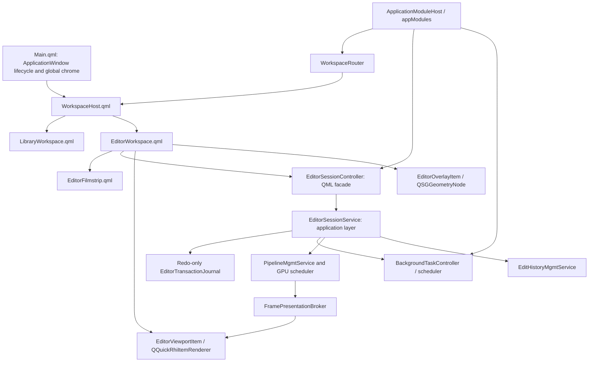

# QML Editor and Qt RHI Unified Workspace Refactor Plan

Date: 2026-07-16

Primary roadmap owner: `alcedo_studio/src/ui/alcedo_main`

Last revised: 2026-07-16 after the second architecture grill.

Affected areas:

- `alcedo_studio/src/ui/alcedo_main/qml`
- `alcedo_studio/src/ui/alcedo_main/editor_dialog`
- `alcedo_studio/src/include/ui/edit_viewer`
- `alcedo_studio/src/ui/edit_viewer`
- editor-facing application services, pipeline scheduling, edit history, and background tasks
- Windows CUDA/D3D11 and OpenCL/OpenGL interoperability
- macOS Metal presentation and EDR configuration

Status: planning. Product and architecture decisions were locked in a grill session on
2026-07-16. This is a replacement plan, not an incremental compatibility plan. The final product
has one QML editor architecture, no editor dialog, no QWidget viewer, no editor stub, and no
runtime fallback renderer.

## Outcome

Move the editor into the same application window as the library UI. The top-level QML scene owns a
`WorkspaceHost` that switches between a library workspace and an editor workspace. The editor keeps
a bottom filmstrip that collapses downward into a small persistent handle, accepts live search
results, and remains open with an empty-state prompt when no image is selected.

Replace the current broad `AlbumBackend` facade with an `ApplicationModuleHost` composition root,
exposed to QML as `appModules`. The host constructs modules in dependency order, owns their
lifecycle, and exposes typed module properties. QML behavior starts at a child module method; the
host does not mirror module state or forward module actions.

The image viewport becomes a `QQuickRhiItem`. Pipeline output remains GPU-resident and is presented
through an explicit native-resource lease protocol for all supported backend pairs:

| Launch backend | Qt Quick graphics API | Pipeline backend | Native presentation path |
| --- | --- | --- | --- |
| `cuda` | Direct3D 11 | CUDA 12.8 | CUDA/D3D11 shared texture |
| `opencl` | OpenGL | OpenCL | OpenCL/OpenGL shared texture |
| `metal` | Metal | Metal | shared `MTLTexture` |

Backend selection is a startup decision. There is no UI hot-switch. Unsupported combinations fail
before the first `QQuickWindow` is created and report a concrete startup error.

The refactor preserves every current editor capability before cutover. It also replaces the current
close-and-save dialog lifecycle with non-blocking, redo-only transaction journaling. Leaving an
image, leaving the editor workspace, or exiting the application automatically flushes the current
image transaction through the existing background-task infrastructure. Explicit Discard is a
secondary action on the current filmstrip thumbnail's context menu only.

## Non-negotiable constraints

- Do not embed the existing `QWidget` editor with `createWindowContainer`, `QQuickWidget`, or a
  native child window.
- Do not retain `OpenEditorDialog`, the editor stub, `QtEditViewer`, `QRhiWidget`, or the legacy GL
  viewer after cutover.
- Do not add host-upload, CPU-copy, OpenGL-widget, or software-scene-graph fallback presentation.
- Do not allow QML to call storage, pipeline, or history infrastructure directly. UI code calls the
  application-service layer.
- Do not add editor state or editor actions to `AlbumBackend`. Replace it with
  `ApplicationModuleHost`, and invoke behavior through child module APIs.
- Do not inject `ApplicationModuleHost&`, a generic service locator, or a bag containing every
  service into a module. Inject the narrow typed dependencies that module actually needs.
- Do not add friend access between the host and controller modules. Existing friend-based shared
  state must be removed as each affected module is migrated.
- Do not share mutable renderer objects between the GUI thread, Qt Quick render thread, and pipeline
  workers.
- Do not create or destroy `QRhi` resources from the GUI thread when the threaded Qt Quick render
  loop is active.
- Do not expose a renderer/backend selector in QML. Backend selection happens before QML engine and
  window construction.
- Do not cut over with a reduced editor. Tone, Look, Display Transform, Geometry, RAW Decode,
  crop/rotate, zoom/pan, ROI/detail patch, LUT browsing, history/versioning, histogram/waveform,
  export, and editor shortcuts are all required.
- Do not name a test, target, file, or document with the repository-banned vague test term.

Intermediate phases may coexist with the old implementation on the development branch so the work
can compile, but they are not separate product modes. No backend flag may select old versus new UI.
The final phase removes the old implementation in the same change that enables the new production
entrypoint.

## Feasibility conclusion from Qt documentation

The refactor is feasible on Qt 6.9.3, with one important qualification: ordinary Qt Quick rendering
solves the embedded RHI viewport, but dynamic whole-window HDR requires application ownership of the
top-level swapchain.

### What Qt supports directly

- [`QQuickRhiItem`](https://doc.qt.io/qt-6.9/qquickrhiitem.html) is the Qt Quick counterpart of
  `QRhiWidget`. It renders into an offscreen color buffer and participates as a normal `QQuickItem`,
  so QML layout, clipping, opacity, stacking, and overlay composition work normally. Qt 6.9 supports
  RGBA8, RGBA16F, RGBA32F, and RGB10A2 color buffers.
- [`QQuickRhiItemRenderer`](https://doc.qt.io/qt-6.9/qquickrhiitemrenderer.html) owns render-thread
  state. `initialize()` must rebuild resources after RHI, render-target, sample-count, or size
  changes; `render()` records its own pass against the item's render target. Qt marks this renderer
  API preliminary, so the integration must stay isolated and version-pinned.
- The standard Windows D3D11 and macOS Metal Qt Quick render loops are threaded. GUI-thread item
  state must be copied into render-thread state only at the scene graph synchronization point. See
  [Qt Quick Scene Graph](https://doc.qt.io/qt-6.9/qtquick-visualcanvas-scenegraph.html).
- [`QQuickWindow::setGraphicsApi`](https://doc.qt.io/qt-6.9/qquickwindow.html) must be called before
  the first Qt Quick window. This matches Alcedo's startup-only backend decision and requires moving
  CUDA adapter selection out of `QtEditViewer` construction.
- Qt Quick pointer handlers separate input behavior from visual items. `HoverHandler`,
  `DragHandler`, `PinchHandler`, `WheelHandler`, and `TapHandler` cover the editor's mouse, trackpad,
  touch, and stylus entrypoints. See
  [Qt Quick Input Handlers](https://doc.qt.io/qt-6/qtquickhandlers-index.html).
- A custom `QQuickItem::updatePaintNode()` can maintain `QSGGeometryNode` content on the render
  thread. This is the appropriate path for crop masks, grids, handles, ROI outlines, and other
  frequently changing vector overlays. See the
  [custom scene graph material example](https://doc.qt.io/qt-6.9/qtquick-scenegraph-custommaterial-example.html).

### What requires an Alcedo render host

- [`QRhiSwapChain`](https://doc.qt.io/qt-6/qrhiswapchain.html) exposes SDR,
  `HDRExtendedSrgbLinear`, HDR10, and `HDRExtendedDisplayP3Linear`, but the format is intended to be
  selected before the first `createOrResize()`.
- The standard Qt Quick render loop owns its swapchain. `QQuickWindow::swapChain()` exposes it for
  inspection, but Qt 6.9 has no public, high-level contract for repeatedly changing the owned
  swapchain between SDR and HDR while the window is live.
- [`QQuickRenderControl`](https://doc.qt.io/qt-6/qquickrendercontrol.html) lets an application drive
  the Qt Quick scene into an application-controlled render target. Together with
  [`QQuickGraphicsDevice::fromRhi()`](https://doc.qt.io/qt-6/qquickgraphicsdevice.html), Alcedo can
  use one application-owned `QRhi`, render the complete QML scene to a linear 16-bit-float target,
  and perform the final SDR/HDR output pass into its own swapchain.

Qt's QRhi APIs have limited source and binary compatibility guarantees and require `Qt6::GuiPrivate`.
The editor must therefore pin the supported Qt minor version to 6.9.3, compile all RHI integration in
CI, and treat a Qt minor upgrade as an explicit port with the full GPU harness.

## Current architecture and why it cannot be embedded as-is

The active path is:

```text
ThumbnailGridView / ThumbnailListView
  -> AlbumBackend::OpenEditor
  -> EditorController::OpenEditor
  -> OpenEditorDialog
  -> modal EditorDialog::exec()
  -> QtEditViewer QWidget
  -> RhiEditViewerSurface QRhiWidget
```

The relevant editor and viewer trees contain roughly 24,000 lines. The difficulty is not the dialog
window flag; it is that windowing, pipeline scheduling, native texture allocation, overlays, input,
scopes, history, and save lifecycle currently meet inside QWidget-oriented objects.

Specific blockers:

- `QtEditViewer` is both a `QWidget` and an `IFrameSink`. It owns a `QRhiWidget` surface plus a
  separate QWidget/QPainter overlay.
- `RhiEditViewerSurface` creates native targets and releases imported RHI textures from the widget
  lifecycle. Under Qt Quick, equivalent RHI resources belong exclusively to the scene graph render
  thread.
- `IFrameSink` exposes synchronous `EnsureSize`, map, unmap, and notify calls. CUDA and OpenCL
  pipeline code assumes the target can be resized and mapped from worker execution. A threaded
  scene graph cannot safely honor that contract directly.
- `EditorRenderCoordinator` and `EditorFrameManager` hold concrete `QtEditViewer`, spinner, and scope
  widget types. They must be split at service/model boundaries, not wrapped in QObjects unchanged.
- `EditorDialog` builds Tone, Look, Display Transform, Geometry, RAW Decode, LUT, versioning, and
  scope widgets imperatively. Reusing the widget composition would preserve the old architecture.
- `Main.qml` is already a large layout owner. Adding an editor branch directly would make it the
  application router, library layout, editor layout, and global-window implementation at once.
- `AlbumBackend` currently mirrors a large number of child-module properties and actions, stores
  shared mutable state for helpers, and forwards calls such as `OpenEditor`. Adding another editor
  facade to it would turn the composition root into the editor's service locator.
- CUDA-to-D3D adapter configuration currently occurs during viewer construction, after the QML
  window can already have initialized a different adapter.
- The macOS color manager finds a `CAMetalLayer` in the widget window and changes its color space,
  `wantsExtendedDynamicRangeContent`, and EDR metadata. In the unified window that layer belongs to
  the whole QML scene, so the behavior must be made an explicit whole-window display state.

The reusable parts are the pure geometry/controllers, pipeline adapters, edit-history services,
scope analyzers, LUT catalog logic, and the image-rendering shader/pipeline behavior. Reuse these by
moving them behind clean interfaces; do not preserve their QWidget ownership graph.

## Decisions locked in the grill session

### Workspace and navigation

- `Main.qml` becomes a thin application-window shell.
- `ApplicationModuleHost` replaces `AlbumBackend` as the process-local UI module composition root
  and is exposed to QML as `appModules`.
- `WorkspaceHost.qml` owns workspace layout and lazy loading.
- A C++ `WorkspaceRouter` owns the route (`Library` or `Editor`) and route arguments; it does not
  perform pixel layout.
- `LibraryWorkspace.qml` contains the extracted current album/library surface.
- `EditorWorkspace.qml` contains the editor toolbar, central viewport, control panels,
  scopes/history, and bottom `EditorFilmstrip.qml`.
- The filmstrip collapses downward. Collapsed state leaves a small focusable handle showing the
  current position/count and background-save state, expands the viewport into the released space,
  and does not destroy the filmstrip model or current image session. The preference survives
  workspace switches and is restored when the application reopens.
- Entering the editor unloads the library workspace's expensive visual tree. Shared backend models
  may remain alive where project services require them.
- The editor can be opened without a selected image. It shows a centered localized prompt equivalent
  to “Select an image to edit”, an empty viewport, disabled adjustment controls, and a filmstrip that
  can later receive search results.
- The editor supports global search. A search replaces the filmstrip with the live search element
  list and focuses the selected result. Changing ordinary library filters requires returning to the
  library workspace.
- If a live search update removes the current image, the editor seals and autosaves its transaction,
  selects the nearest surviving element by prior index, or enters the empty state if none survive.

### Overlay and input

- `EditorViewportItem : QQuickRhiItem` renders only the photograph layers.
- `EditorOverlayItem : QQuickItem` produces retained `QSGGeometryNode` content for crop mask/grid,
  crop border/handles, ROI/detail bounds, guides, and selection outlines.
- Existing `ViewportMapper`, `CropGeometry`, `CropInteractionController`,
  `ViewTransformController`, and `EditViewerOverlayGeometry` logic is retained only after removing
  QWidget dependencies and proving coordinate parity.
- Pointer handlers live in QML and call a small typed input/controller surface. Ordinary QML renders
  labels, buttons, spinner/status, contextual help, and focus indication.
- Overlays are not baked into the photograph RHI pass. This preserves QML stacking and keeps HDR
  image encoding independent from UI geometry.

### Save, journal, and version semantics

- Editing is autosave-first. There is no primary Save/Cancel dialog contract.
- A completed user gesture creates one coalesced redo-only edit transaction. Slider samples during a
  drag do not each become durable transactions; release or an idle coalescing boundary commits the
  latest value.
- Each journal record contains image/element identity, base version identity, session identity,
  monotonically increasing generation, operation payload, and integrity metadata.
- Undo and redo append explicit cursor-move records. They do not mutate the durable journal in
  place.
- Appending an edit while the working cursor is behind the transaction tail appends one atomic,
  journal-only `RewriteTimeline` control record. It contains the version identity, expected timeline
  hash, retained cursor, discarded-tail hash, and replacement `EditTransaction`. Replay validates
  the expected hashes, logically tombstones the old redo tail, and appends the replacement as one
  mutation; it must never expose a state where the tail was removed but the replacement is absent.
- `RewriteTimeline` is not an `EditTransaction`, is not rendered as a user edit, and does not create
  a hidden Version. The discarded redo tail is unavailable after the rewrite; existing user-visible
  Versions remain the mechanism for preserving alternate looks.
- Journal storage stays append-only. Timeline rewrites become physical deletion only when a verified
  compaction checkpoint replaces the old journal.
- Journal appends and project persistence run through the background-task scheduler. Older async
  completions are forbidden from overwriting a newer generation.
- Switching image, changing workspace, or exiting issues a durability barrier for the current
  transaction and immediately starts the next allowed work. Image save and next-image load/render
  overlap when their resource locks do not conflict.
- A durable redo journal is sufficient to reconstruct the resulting version. Recovery replays only
  records newer than the persisted base/head generation and is idempotent.
- Successful materialization advances the image's persisted head, flushes the current transaction,
  schedules thumbnail invalidation/regeneration, and begins a fresh transaction boundary.
- On abnormal termination, the next project open automatically replays valid redo-only records and
  marks the recovered head in history. Corrupt or base-mismatched records stop recovery for that
  image and surface a diagnostic; they are never applied partially.
- Explicit Discard exists only in the current editor-filmstrip thumbnail context menu and is enabled
  only for an unflushed current transaction. It cancels that transaction and reloads the durable
  head. Once an autosave has published a version, the user returns through version history instead
  of destructive discard.

### HDR and display state

- The application initially uses the standard Qt Quick render loop while the QML editor is built.
- Existing macOS system-API EDR behavior must remain available. The macOS development environment is
  currently unavailable, so implementation and feasibility qualification are deliberately deferred
  to the dedicated phase immediately before the final HDR/cutover phase. Production cutover cannot
  proceed until that phase passes.
- Application-owned QRhi/swapchain rendering is the final implementation phase.
- HDR selection is image/editor state. Entering an HDR edit, changing to an HDR/SDR image, leaving the
  editor, or disabling HDR requests a whole-window display-mode transition.
- The transition may freeze the last completed frame, wait for GPU idle, rebuild presentation, and
  briefly show black. The target is no more than 250 ms on supported hardware.
- Recreating the native top-level window is permitted when the platform requires it, but window
  geometry, screen, maximized/fullscreen state, workspace, focused image, journal generation, and
  focus must be restored.
- Windows OpenCL/OpenGL is tested for a true HDR swapchain. If
  `QRhiSwapChain::isFormatSupported()` reports that the active screen/backend cannot create it,
  Alcedo performs the product-defined HDR-to-SDR display transform in the same renderer. This is a
  display policy, not a renderer fallback.

## Target architecture



### Responsibility boundaries

`ApplicationModuleHost`:

- replaces `AlbumBackend` and acts only as the module composition root;
- creates application services and UI modules in a documented dependency order;
- exposes typed constant module properties such as `workspaceRouter`, `editorSession`, `search`,
  `backgroundTasks`, `interactionPolicy`, and library modules;
- contains no forwarding `Q_INVOKABLE` actions and no mirrored module-specific adjustment,
  thumbnail, search, import/export, AI, or editor properties;
- stops new intents, drains/cancels tasks by policy, and destroys modules in reverse dependency order;
- connects optional cross-module notifications with signals, while required synchronous
  collaboration uses narrow constructor-injected interfaces;
- does not give modules a pointer/reference back to the host and does not act as a service locator.

Each module owns its QML-facing properties, signals, and invokables. For example, QML calls
`appModules.workspaceRouter.openEditor(...)` and `appModules.editorSession.undo()`, never
`appModules.openEditor(...)` or a host forwarding wrapper.

`WorkspaceRouter`:

- owns route and route arguments;
- accepts “open editor”, “return to library”, and global-search navigation intents;
- never owns panel sizes or image-edit state.

`WorkspaceHost.qml`:

- lays out global chrome and the active workspace;
- uses `Loader` so inactive expensive trees are destroyed;
- restores focus deliberately after route changes.

`EditorSessionController`:

- is a QML-facing QObject facade with typed properties and invokables;
- exposes current element, loading/empty/error state, adjustment models, history, scope models,
  filmstrip model, and interaction capabilities;
- does not own pipeline guards, database transactions, native textures, or worker threads.

`EditorSessionService`:

- is the application-layer owner of the active image session;
- acquires pipeline/history guards, applies typed adjustment patches, sequences generations, and
  coordinates save/switch/recovery;
- calls existing application services rather than allowing UI code to reach storage directly;
- registers save/load/render operations with the background-task system and declares per-image
  resource locks.

`EditorTransactionJournal`:

- appends redo-only records with checksums and monotonic generations;
- supports durable barriers, replay, commit/head markers, and safe truncation;
- never records intermediate slider samples or renderer-only state such as zoom/pan.

`FramePresentationBroker`:

- replaces the synchronous `IFrameSink` map/unmap contract;
- exchanges immutable target leases and completed-frame submissions between pipeline workers and the
  render thread;
- carries backend, pixel format, dimensions, target generation, image render generation, native
  handle, synchronization primitive, and lifetime token;
- rejects stale detail patches and frames after resize, image switch, or target recreation;
- releases an imported native resource only after both producer completion and QRhi consumption.

`EditorViewportRenderer`:

- lives only on the scene graph render thread;
- creates imported `QRhiTexture` wrappers, render pipelines, SRBs, uniform buffers, and samplers;
- rebuilds all dependent resources from `initialize()` when RHI, render target, size, format, or
  sample count changes;
- renders InteractivePrimary, QualityBase, and DetailPatch layers with the current zoom, pan,
  letterbox, and ROI rules;
- consumes only the newest completed frame compatible with the current target and image generation.

## Startup backend contract

Add a startup parser before `QQmlApplicationEngine` and before any QML type can construct a window.
Use one explicit argument, for example:

```text
alcedo_main --editor-backend=cuda
alcedo_main --editor-backend=opencl
alcedo_main --editor-backend=metal
```

The exact spelling may follow the existing command-line parser, but the semantics are fixed:

- `cuda` is Windows-only, requires the project's CUDA 12.8 driver/device policy, selects the
  matching CUDA adapter LUID, and calls `QQuickWindow::setGraphicsApi(Direct3D11)` before loading
  QML.
- `opencl` is Windows-only for this plan, verifies the required OpenCL/GL sharing extensions,
  configures the process-wide OpenGL surface/share context, and selects
  `QQuickWindow::setGraphicsApi(OpenGL)` before loading QML.
- `metal` is macOS-only and selects Metal before loading QML.
- An unavailable build feature, invalid platform pair, adapter mismatch, or missing interop extension
  is a startup failure with detected adapter/backend details. It does not silently choose another
  pair.
- Production packaging chooses a documented default, but CMake adds developer launch targets for
  each built backend so CUDA and OpenCL are one command apart during development.

## Image switch state machine

Filmstrip and live-search switching must not serialize save then load on the GUI thread.

```text
Focused(image A)
  -> seal active gesture and capture transaction generation N
  -> enqueue A journal/save barrier with image-scoped write lock
  -> invalidate A render generation and release UI ownership of its session
  -> acquire B pipeline/history guards with image-scoped read/write lock
  -> request B interactive preview
  -> publish B only when its metadata and first compatible frame are ready

A save and B load/render may overlap.
Stale A frames, scope results, thumbnail completions, and journal completions carry A identity and
generation and cannot mutate B.
```

If the next element is removed before it becomes active, cancel that generation and resolve the new
nearest element. If the list becomes empty, keep EditorWorkspace open, complete the prior save, and
enter the empty state.

## Phased implementation plan

Each phase has a hard acceptance gate. A phase is not complete because code exists; its named tests,
thread/lifetime assertions, and platform checks must pass.

### Phase 0 - Windows executable contracts and feasibility harness

Status: **implemented and verified on Windows** (2026-07-16). Maintained targets:
`EditorRhiHarness`, `EditorRhiContractsTest`, `run_editor_rhi_harness_cuda`,
`run_editor_rhi_harness_opencl`.

Verified on NVIDIA GeForce RTX 3080 Laptop GPU:
- `EditorRhiHarness --editor-backend=cuda --case=direct-presentation` (pixel error 0)
- `EditorRhiHarness --editor-backend=opencl --case=direct-presentation` (pixel error 0)
- CUDA cases: resize-churn, hide-show, minimize-restore, renderer-recreation, hdr-format-query
- OpenGL HDR probe (Phase 9 input): SDR supported; HDRExtendedSrgbLinear/HDR10/P3Linear false
  on this display/backend path
- `EditorRhiContractsTest` (9 tests) passed

Metal lease contract is defined in `frame_presentation_lease.hpp`; Metal feasibility remains Phase 8.
Production `alcedo_main` entrypoint is intentionally unchanged in Phase 0.

Deliverables:

- Add a maintained `EditorRhiHarness` executable using a real `QQuickWindow` and minimal
  `QQuickRhiItem`.
- Add startup backend parsing and diagnostics without changing the production editor entrypoint.
- Move CUDA adapter discovery into a pre-window helper and prove the Qt D3D11 device uses the same
  adapter as CUDA.
- Prove OpenCL/GL shared-texture creation, acquire/release synchronization, and render-thread context
  ownership with the Qt Quick threaded render loop.
- Exercise RGBA32F viewport rendering, resize, device-pixel-ratio change, hide/show,
  minimize/restore, renderer recreation, and application shutdown on both Windows backend pairs.
- Record Windows OpenGL `isFormatSupported()` results for HDR on representative NVIDIA, AMD, HDR,
  and SDR display configurations. This is input for Phase 9, not a reason to switch renderers.
- Create deterministic fixtures: FP32 gradient, checkerboard, ROI patch, odd-sized image, and a small
  real RAW project fixture.
- Define the backend-neutral Metal lease contract but do not claim Metal feasibility while the macOS
  environment is unavailable. Metal implementation and qualification are Phase 8.

Acceptance:

- CUDA/D3D11 and OpenCL/OpenGL display the generated FP32 frame through native interop with no host
  presentation copy.
- Backend/adapter mismatch is detected before QML window creation.
- Repeated resize and renderer recreation produce no stale import, deadlock, or native-resource leak.
- The harness reads back the pre-composition viewport result and compares expected pixels within a
  documented floating-point tolerance.

### Phase 1A - ApplicationModuleHost composition root

Deliverables:

- Replace the `AlbumBackend` class and QML context name with `ApplicationModuleHost` / `appModules`.
- Move module-specific Q_PROPERTY, signals, invokables, state, and behavior to their owning modules.
- Expose typed constant module properties from the host; do not expose a generic `QObject*` bag when
  the concrete QML type can be registered.
- Define a construction graph for project lifecycle, library, folders, thumbnails, search, tasks,
  interaction policy, AI, import/export, workspace routing, and editor session modules.
- Give every module a narrow constructor signature containing only its required application services
  and collaborator interfaces. Do not pass the host or a universal dependency bundle.
- Replace required cross-module friend access with injected interfaces. Use Qt signals for optional
  notifications that do not require a synchronous answer.
- Define reverse-order shutdown: stop accepting QML intents, request task shutdown by policy, flush
  required journals/project writes, disconnect modules, then destroy services.
- Update QML call sites to begin behavior at child modules, for example
  `appModules.workspaceRouter.openEditor(...)`.

Acceptance:

- `ApplicationModuleHost` contains lifecycle/composition code and typed module accessors only.
- It has no forwarded module actions and no mirrored module-specific state.
- No migrated module declares the host or another controller as a friend.
- Module unit tests construct the module with fakes without constructing the host, QML engine,
  project, or unrelated modules.
- Construction and shutdown order are covered by a deterministic lifecycle test.

### Phase 1A-Fix

审核范围是 `28f75d15..56b92f43`。忽略换行符和纯空白变化后，实际代码变化约为
4,858 行增加、4,004 行删除。`alcedo_main`、`alcedo_tests_ui` 和
`AlbumBackendCiWorkflowTest` 均能编译；本次改动相关的 105 个可运行测试全部通过，另有
4 个测试因为缺少外部项目或 Metal 环境而跳过。常用的项目、导入、文件夹、删除、评分、
缩略图和搜索流程目前没有发现普遍退化，但下面的问题仍需修正后才能把 Phase 1A 标为完成。

- `ImageController::DeleteTargets()` 中“导入仍在运行”的判断写成了
  `ie && ie->current_import_job() && !ie && ...`。前面已经要求 `ie` 有值，后面又要求
  `ie` 没有值，所以这个分支永远不会执行。`DeleteImages()` 从 QML 进入时通常还会先经过
  `InteractionPolicyController`，因此普通界面操作不一定马上暴露问题；但是
  `NikonHeRecoveryController` 等 C++ 调用者会直接调用 `DeleteTargets()`，可以绕过前一层
  检查。应恢复原来的 `!ie->current_import_job()->IsCancelationAcked()` 判断，并增加一个测试：
  导入尚未结束时，从直接 C++ 入口删除图片必须被拒绝，导入确认取消后才允许删除。

- 退出处理没有完成 Phase 1A 计划中写明的步骤。`ShutdownModules()` 先清除了数据库写入
  屏障的回调，却没有调用 `image_analysis_sink_->FlushPendingWrites()`；如果导出仍占用屏障，
  图片分析结果会留在内存队列中，随后随对象销毁而丢失。这里也没有调用
  `background_tasks_->CancelAll()`，没有按照每个任务的退出规则等待结束，也没有等待模型
  下载、模型启用、图片分析和导出真正停止。应先拒绝新的界面操作，再按任务各自的规则取消
  或等待，释放数据库写入屏障，写完排队的数据，最后保存和打包项目。需要增加“导出占用
  屏障时图片分析完成并立即退出”和“每种后台任务仍在运行时退出”的测试，确认数据已经写入，
  回调不会在模块销毁后执行。

- 新增的创建和销毁顺序测试没有观察真实对象。测试只读取
  `ConstructionOrder()` 返回的固定字符串，再把这组字符串倒过来比较；即使构造函数和成员
  声明已经写错，测试仍然会通过。当前就有一个实际不一致：构造时先创建
  `AiProviderProfileController`，再创建 `SemanticGenerationController`，但头文件中的成员声明
  顺序相反，C++ 销毁成员时会先销毁 `AiProviderProfileController`，而
  `SemanticGenerationController` 仍保存着指向它的指针。应调整成员声明或显式按正确顺序释放，
  并让测试通过真实对象的创建、停止和 `destroyed` 事件记录顺序，不能再用固定字符串代替。

- `ApplicationModuleHost` 暴露给 QML 的 16 个模块属性全部声明成了 `QObject*`。这与 Phase 1A
  要求的具体模块类型不符，也让 QML 工具无法在编译时检查 `appModules.project`、
  `appModules.library` 等对象上是否真的存在某个属性或方法。应注册这些具体 C++ 类型，并把
  `Q_PROPERTY` 和读取函数改成对应的具体指针类型。增加一个检查，读取每个属性的类型名称，
  防止以后又退回 `QObject*`。

- 原来的集中访问方式并没有真正拆开，只是从 `AlbumBackend` 转移到了 `ProjectModule`。
  `ProjectModule::BindCollaborators()` 一次接收七个其他模块，并公开这些模块的读取函数；
  `ProjectHandler` 再通过 `ProjectModule` 取得 library、folders、stats、editor、import/export、
  semantic generation 和 model download。这样 `ProjectHandler` 仍然可以接触几乎全部界面模块，
  单个模块也仍然必须等其他模块全部创建后再补指针。应把每项操作需要的少量接口直接传给
  使用者，例如项目打开后的通知、界面状态提示和语义标签读取分别使用小接口或 Qt 信号，删除
  `ProjectModule` 上为其他模块转发的读取函数和方法。

- “模块可以用假对象单独测试”这一项没有完成。项目、文件夹、图片、导入导出、图库、统计和
  搜索测试仍然都先创建完整的 `ApplicationModuleHost`，会同时创建项目服务、模型服务和所有
  无关模块。现有测试只能证明整组对象放在一起时能工作，不能证明构造函数只要求了真正需要的
  对象。应至少为 `ProjectModule`、`LibraryModule`、`FolderController`、`ImageController`、
  `ImportExportHandler`、`StatsEngine` 和 `SearchController` 各增加直接构造测试，使用小型假对象
  验证输入、状态变化和信号，不创建 `ApplicationModuleHost`。

- `application_module_host.cpp` 仍包含约四百多行与对象创建无关的功能，包括 EXIF 文本整理、
  AI sidecar 启动、分析结果写数据库、评分更新和搜索刷新。虽然这些代码写在几个内部类里，
  它们仍让这个文件同时负责对象创建和具体业务。应把图片分析环境和结果写入实现移到独立文件，
  `ApplicationModuleHost` 文件只保留创建、连接、停止和销毁对象的代码。

- Phase 1A 的交付项写明创建关系应包含 `workspaceRouter` 和 `editorSession`，当前主机没有这两个
  属性或对象。现在 QML 仍调用 `appModules.editor.OpenEditor()`，进入的还是旧
  `EditorController` 和旧对话框流程。如果这两项确实要到 Phase 1B 和后续编辑器阶段才实现，
  应先修改 Phase 1A 的交付说明，避免把未实现内容记为完成；否则应在 Phase 1A 补齐这两个模块
  的最小接口、创建顺序和测试。

- 一些 QML 组件仍保留了同时兼容新旧入口的判断。例如 `GlobalSearchDialog.qml` 会在
  `backend.search` 与 `backend.searchController` 之间选择，`AdvancedContentAnalysisDialog.qml`
  会在 `backend.images` 与 `backend` 之间选择，`CollectionsPanel.qml` 也同时接受主机和文件夹
  模块。这会继续允许把整个 `appModules` 传给子组件，也容易让旧调用方式悄悄回来。应让这些
  组件只接收自己需要的模块，例如只传 search、interactionPolicy、images 或 folders，并删除
  旧入口判断。

- 这次修改替换了约 260 处 QML 调用，但测试只实际加载了 `GlobalSearchDialog.qml`，没有测试
  完整的 `Main.qml`。C++ 测试通过不能发现主窗口中属性名称写错、信号接到错误模块、弹窗打开
  后才访问到不存在方法等问题。应增加一个可见窗口测试，使用真实 `ApplicationModuleHost`
  加载 `Main.qml`，至少走完项目打开、文件夹切换、缩略图更新、导入状态、导出状态、图片检查、
  搜索弹窗、设置弹窗和编辑入口，并把 QML warning 当作测试失败。

- 38 个本来只需要少量修改的源文件、QML 文件和测试文件被整体改成了 CRLF。结果是普通 diff
  显示 23,609 行增加、22,755 行删除，`git diff --check` 也会把这些行尾报告成空白问题；这正是
  本次改动看起来超过两万行的主要原因，也掩盖了真正的代码变化。应在提交修复前恢复仓库原有
  行尾，只保留实际修改，并去掉这次顺带加入的重复自包含头文件。清理后重新运行
  `git diff --check`，结果必须为空。

### Phase 1B - Thin Main and workspace shell

Deliverables:

- Extract the current library body from `Main.qml` into `LibraryWorkspace.qml` without changing its
  behavior.
- Add `WorkspaceHost.qml` and the `WorkspaceRouter` module.
- Reduce `Main.qml` to application-window lifecycle, frameless/native window chrome, global
  shortcuts, global dialogs/toasts, and `WorkspaceHost` construction.
- Add `EditorWorkspace.qml` with toolbar regions, central empty viewport slot, inspector/scope slots,
  and a bottom filmstrip dock slot.
- Define the downward-collapse geometry and persistent handle contract for the filmstrip dock.
- Add the no-image empty state and focus/accessibility order.
- Route grid/list double-click through `appModules.workspaceRouter` rather than a modal editor method.
- Define lazy-load and teardown rules for both workspaces.

Acceptance:

- Library layout and behavior remain pixel/functionally equivalent after extraction.
- Routing can open an empty editor, open an editor focused on an element, and return to the library.
- The filmstrip slot collapses downward, releases its height to the viewport, and leaves its handle
  keyboard- and pointer-accessible.
- Repeating workspace switches does not grow the QML object count or retain inactive visual trees.
- `Main.qml` contains no library/editor panel layout decisions.

### Phase 2 - QQuickRhiItem viewport and native frame broker

Deliverables:

- Implement `EditorViewportItem`, `EditorViewportRenderer`, and `FramePresentationBroker`.
- Port the existing RHI image renderer behavior to the QQuickRhiItem render target.
- Replace synchronous target mapping with target leases and completed-frame submissions.
- Implement CUDA/D3D11 and OpenCL/OpenGL lease adapters. Preserve a backend-neutral lease boundary
  so Phase 8 can add Metal without changing the broker protocol.
- Carry target and image generations through InteractivePrimary, QualityBase, and DetailPatch.
- Define cancellation and resource release for image switch, resize, hidden window, scene graph
  invalidation, and application shutdown.
- Expose read-only renderer diagnostics to tests: backend name, target generation, last presented
  image generation, dropped-stale-frame count, and live target count.

Acceptance:

- A real pipeline render reaches QQuickRhiItem on both Windows backend pairs without a CPU
  presentation copy.
- Resize never asks a pipeline worker to create or destroy QRhi resources.
- An old image or ROI detail patch cannot appear after switch or resize.
- Hiding/minimizing the window cannot leave a producer blocked forever on a target lease.
- Scene graph invalidation releases all imported wrappers and native targets in a deterministic order.

### Phase 3 - Scene graph overlays and viewer interactions

Deliverables:

- Implement `EditorOverlayItem` with retained QSG geometry.
- Port crop mask, thirds/grid guides, crop border/handles, ROI/detail patch bounds, and interaction
  feedback.
- Connect QML pointer handlers for hover, drag, wheel, pinch, tap/double-tap, and keyboard focus.
- Keep logical coordinates, item coordinates, physical pixels, source-image coordinates, and cropped
  output coordinates explicit in APIs and tests.
- Preserve zoom-at-cursor, pan clamping, fit modes, crop-handle hit priority, cursor shapes, and
  native trackpad gestures.
- Keep spinner/status and text overlays as ordinary QML.

Acceptance:

- Existing viewer geometry tests pass against the decoupled logic.
- QML interaction tests reproduce crop, zoom, pan, fit, ROI, and reset behavior at DPR 1.0, 1.5,
  and 2.0.
- Overlay golden captures match expected geometry at landscape, portrait, square, and odd viewport
  sizes.
- Overlay updates do not recreate the viewport texture or block the render thread on pipeline work.

### Phase 4A - Editor session state machine and service boundaries

Deliverables:

- Add `EditorSessionService` in the application-service layer and a thin
  `EditorSessionController` child module under `appModules`.
- Define explicit session states for no image, acquiring, loading, interactive, saving, switching,
  failed, and shutting down.
- Move reusable adjustment snapshots, patches, pipeline adapters, LUT catalog logic, history
  coordination, and scope tap contracts out of QWidget ownership.
- Acquire pipeline/history guards inside the service; never expose them to the QML module.
- Define typed intents/results for open, switch, patch, gesture commit, undo, redo, discard, and
  shutdown.

Acceptance:

- The state machine is deterministic under reordered load/render/save completions.
- The controller can be tested with a fake `EditorSessionService` and the service with fake pipeline,
  history, task, and journal ports.
- Neither class depends on `AlbumBackend`, QWidget, the future module host, or a global service
  locator.

### Phase 4B - Redo-only journal format and timeline rewrites

Deliverables:

- Add a versioned journal envelope containing record length, record type, sequence, image/version/
  session/generation identity, payload checksum, and record checksum.
- Define records for edit append, cursor move, atomic `RewriteTimeline`, materialized-head marker,
  recovery marker, and compaction checkpoint.
- Make `RewriteTimeline` validate the expected timeline hash and discarded-tail hash, retain the
  requested cursor prefix, and append the replacement edit as one logical mutation.
- Keep journal files append-only. A rewrite creates a logical tombstone; only verified compaction can
  physically omit discarded tail records.
- Define transaction ID allocation after rewrite/recovery so IDs are never reused even when a tail is
  discarded.
- Add a small reference implementation that applies journal records to an in-memory timeline without
  using `WorkingVersion`. This becomes the oracle for recovery and fuzz tests.

Acceptance:

- `edit A, edit B, undo, append C` replays as `[A, C]` with the cursor at two and B unavailable to
  redo.
- `edit A, edit B, undo, redo` replays as `[A, B]` with the cursor at two.
- A hash mismatch rejects the whole rewrite and leaves the prior valid prefix unchanged.
- A partial `RewriteTimeline` record is ignored as an incomplete tail; replay never observes
  “B discarded but C absent”.
- WorkingVersion, journal replay, and the independent reference model produce identical pipeline
  params, cursor, transaction IDs, and timeline hash for the same operation sequence.

### Phase 4C - Background autosave and overlapping image switches

Deliverables:

- Register journal flush, version materialization, thumbnail invalidation, image load, and preview
  render through the existing background-task module.
- Implement image-scoped locks so saving A can overlap loading/rendering B without sharing a mutable
  pipeline guard.
- On image/workspace/app transition, seal the current gesture, enqueue its durability barrier,
  invalidate its render generation, and begin the next permitted load immediately.
- Make stale journal, thumbnail, scope, and render completions validate image and generation before
  publishing.
- Implement current-thumbnail context-menu Discard for an unflushed transaction only.

Acceptance:

- Leaving an image, leaving EditorWorkspace, and orderly application exit durably save the latest
  coalesced transaction without GUI-thread I/O.
- The next image begins loading before the previous image's save completes when locks permit.
- An older async save completion cannot overwrite a newer generation.
- Discard removes only the current unflushed transaction; published versions remain available
  through history.

### Phase 4D - Recovery, compaction, and injected storage failures

Deliverables:

- Implement idempotent replay from the latest verified checkpoint and valid journal prefix.
- Implement compaction as create-new, flush, verify, atomic replace, and directory durability steps;
  never rewrite the active file in place.
- Add injectable file operations for short write, failed flush, failed atomic replace, checksum
  corruption, stale head marker, duplicated record, and reordered task completion.
- Preserve the original journal and emit a diagnostic bundle when recovery cannot validate a record.

Acceptance:

- Every injected failure recovers to either the state before or after one complete record, never a
  hybrid.
- Replaying the same journal twice is idempotent.
- A failed compaction leaves the previous journal recoverable.
- Materialization interrupted after journal durability reconstructs the same history/pipeline head.

### Phase 4E - Reproducible forced-termination fuzz harness

Deliverables:

- Build an ad-hoc parent/child fuzz runner with no new fuzzing-library dependency.
- Generate seeded sequences of edit, undo, redo, `RewriteTimeline`, switch image, search replacement,
  workspace change, autosave, materialize, compact, and shutdown operations.
- Have the child emit named crash points around record header/payload/checksum writes, flush,
  head-marker update, materialization, thumbnail invalidation, compaction replace, and image switch.
- Let the parent randomly terminate the child at those points, restart it, recover, and compare the
  result with the independent reference timeline model.
- Combine process termination with the Phase 4D in-process file/task fault injectors.
- Print and persist the seed, minimized operation sequence, crash point, backend-independent journal
  fixture, and expected/actual state for every failure.
- Keep a checked-in regression-seed corpus and run fresh bounded random seeds in scheduled CI.

Acceptance:

- Recovery always yields a valid journal prefix and a state allowed by the durability boundary.
- A discarded redo tail never reappears after restart or compaction.
- Transaction IDs, cursor, timeline hash, version head, and pipeline params match the oracle.
- The harness reproduces a failure from its emitted seed and operation list without timing sleeps.
- The fixed regression corpus passes in ordinary presubmit tests; the larger randomized run is a
  required scheduled job.

### Phase 5A - Shared adjustment contracts and QML controls

Deliverables:

- Define focused typed models for values, ranges, enum choices, enabled state, defaults, validation,
  reset, gesture begin/update/commit, and history labels.
- Build shared QML numeric slider/field, toggle, combo, collapsible group, reset affordance, and
  validation components.
- Preserve interactive-preview coalescing and full-quality render after gesture stabilization.

Acceptance:

- Shared controls generate one committed transaction per completed gesture.
- Keyboard editing, pointer dragging, reset, focus, accessibility, and invalid values have focused
  component tests.

### Phase 5B - Tone panel

Deliverables:

- Port exposure, contrast, whites, blacks, highlights, shadows, and their enable/reset behavior.
- Port the tone-curve model and custom scene graph/QML curve editor.
- Preserve numeric ranges, precision, default curve, point ordering, and interactive rendering.

Acceptance:

- Every Tone value and curve operation round-trips through pipeline, journal, undo/redo, recovery,
  and reconstructed version.
- Curve gestures have deterministic model and visual geometry tests.

### Phase 5C - Look panel

Deliverables:

- Port color temperature, tint, saturation, vibrance, HLS, color wheels/CDL, clarity, sharpen, film
  grain, halation, and all currently exposed Look controls.
- Port the custom trackball interaction.
- Port LUT catalog/selection/browser behavior owned by the Look workflow.

Acceptance:

- Every currently exposed Look operator has value, reset, enable, serialization, history, and
  recovered-journal parity.
- Trackball and LUT interactions have deterministic controller and QML tests.

### Phase 5D - Display Transform panel

Deliverables:

- Port working/output color-space selection, CST/ODT, ACES tone mapping, transfer function, peak
  luminance, and HDR display intent.
- Separate pipeline output-transform state from whole-window display-mode state.
- Expose requested versus actual HDR state and the Windows OpenGL down-transform reason.

Acceptance:

- Display-transform values reproduce the existing rendered output for SDR fixtures.
- HDR intent changes request display transitions without directly touching a window or swapchain from
  QML.

### Phase 5E - Geometry panel

Deliverables:

- Port crop, rotate, aspect constraints, geometry reset, and lens-calibration controls.
- Connect panel values to the Phase 3 viewport overlay and interaction controller.
- Preserve dimension-changing render invalidation and crop-coordinate mapping.

Acceptance:

- Panel edits and direct overlay gestures stay bidirectionally consistent without binding loops.
- Undo/redo/rewrite/recovery restores both pipeline geometry and overlay geometry exactly.

### Phase 5F - RAW Decode panel

Deliverables:

- Port every current RAW Decode option, enum, enable/reset rule, metadata-derived availability rule,
  and full-pipeline invalidation behavior.
- Keep RAW decode capability decisions in application/pipeline services, not QML.

Acceptance:

- Supported and unsupported RAW fixtures expose the correct controls and values.
- Every RAW Decode edit survives save, replay, version reconstruction, image switch, and reopen.

### Phase 5G - Cross-panel integration and shortcuts

Deliverables:

- Integrate panel ordering, collapse state, scroll/focus behavior, and global reset semantics.
- Port editor shortcuts through the central shortcut registry with focus-aware suppression in text
  fields.
- Exercise undo followed by an edit in a different panel to force cross-panel `RewriteTimeline`.

Acceptance:

- Every existing adjustment can be set, reset, serialized, replayed, and represented in history.
- Cross-panel operation sequences match the independent journal oracle and rendered pipeline state.

### Phase 6A - Versioning and history module

Deliverables:

- Port history/version cards, create/rename/remove/select, branch navigation, and checkout to QML
  backed by typed models.
- Distinguish user-visible Versions from working-timeline cursor moves and journal-only
  `RewriteTimeline` records.
- Surface recovered heads without exposing internal journal records as edit rows.

Acceptance:

- Version create, checkout, rename, remove, reconstruction, and alternate-look behavior match the
  current editor.
- Timeline rewrite never creates an implicit Version or corrupts an existing Version hash.

### Phase 6B - Histogram and waveform scope module

Deliverables:

- Reuse scope analysis backends while exposing immutable histogram/waveform snapshots to QML.
- Render high-density plots with a dedicated scene graph item; avoid per-frame QImage upload unless
  measurement proves it meets the target.
- Carry image, final-display, and scope generations through analysis and presentation.

Acceptance:

- Histogram and waveform consume the correct final-display generation and never show a prior image
  after switching.
- Hidden/collapsed scopes stop scheduling visual updates without corrupting the analyzer lifecycle.

### Phase 6C - Collapsible editor filmstrip module

Deliverables:

- Implement `EditorFilmstripModel` from the active library element list.
- Add selection, keyboard navigation, thumbnail state, render/save badges, and current-transaction
  context menu.
- Implement the downward-collapsing dock, persistent handle, saved expanded height, and preference
  restoration.
- Keep the model/session alive while collapsed and give the released vertical space to the viewport.
- Invalidate/regenerate saved thumbnails without reordering the ordinary library-backed list.

Acceptance:

- Collapse/expand preserves current image, scroll position, selection, save state, and keyboard focus.
- Repeated animation and workspace switching do not leak delegates or trigger image reloads.
- Discard is visible only where specified and only when the current transaction is eligible.

### Phase 6D - Live search editor integration

Deliverables:

- Let global search replace the filmstrip source with the live search element list while the editor
  remains open.
- Implement rapid-query cancellation, result generations, insert/remove/reorder, active-image
  removal, nearest-survivor selection, and empty results.
- Keep ordinary filter editing in LibraryWorkspace and preserve context when returning there.

Acceptance:

- Search can be initiated while editing and can produce an empty editor without closing the
  workspace.
- Removing the current image seals/autosaves it before selecting the deterministic successor.
- Rapid search replacement causes no stale frame, scope, transaction, or selection publication.

### Phase 6E - Empty state and workspace lifecycle module

Deliverables:

- Complete no-image, loading, saving, recovered, unsupported, and error states.
- Open EditorWorkspace with no image and keep controls disabled until a valid session exists.
- Integrate return-to-library context, workspace shutdown, and application shutdown with the
  autosave barrier and task policy.

Acceptance:

- Every lifecycle state has deterministic QML and controller tests.
- Empty editor, workspace switch, and shutdown preserve journal and module-host invariants.

### Phase 7 - Windows full parity and release qualification

Deliverables:

- Complete export, localization, accessibility, focus navigation, keyboard shortcuts, settings,
  error/empty/loading states, and all remaining editor behavior.
- Run the feature-parity matrix on CUDA/D3D11 and OpenCL/OpenGL against the existing editor using the
  same RAW fixtures and stored edit histories.
- Run long-duration resource, frame-pacing, transaction, search, and workspace-switch tests.
- Resolve every direct QWidget dependency in the new editor path.
- Freeze the production cutover commit contents, including the complete deletion manifest, but do
  not retain a runtime old/new selector.

Acceptance:

- Every non-negotiable editor capability passes Windows automated or explicitly recorded
  hardware/manual acceptance.
- No new editor class includes QWidget, QRhiWidget, QOpenGLWidget, or editor-dialog headers.
- The QML editor is the only path exercised by the end-to-end harness.
- No known data-loss, stale-generation, resource-lifetime, or Windows display-mode defect remains
  open.

### Phase 8 - macOS Metal and existing EDR feasibility qualification

This phase is intentionally delayed until the macOS development environment is available, and is the
mandatory gate immediately before the final render-host/cutover phase.

Deliverables:

- Extend `EditorRhiHarness` with the Metal backend on actual supported macOS hardware.
- Implement and validate the Metal `FramePresentationBroker` lease adapter and shared `MTLTexture`
  lifetime/synchronization path.
- Exercise QQuickRhiItem rendering, resize, DPR/screen change, hide/show, renderer recreation, image
  generation cancellation, and shutdown under the Metal scene graph.
- Apply the existing `ColorManager` system-API behavior to the unified QQuickWindow CAMetalLayer and
  verify color space, `wantsExtendedDynamicRangeContent`, PQ/HLG EDR metadata, and SDR reset.
- Compare the unified editor against the current macOS editor on the same HDR/SDR fixtures and
  display. Preserve the current result before attempting the Phase 9 owned swapchain.
- Run the editor session, journal, filmstrip, search, scopes, versioning, and panel parity suites on
  macOS rather than assuming backend-neutral code is sufficient.

Acceptance:

- Metal pipeline output reaches QQuickRhiItem through shared GPU resources with no CPU presentation
  copy.
- Existing macOS EDR behavior is demonstrably preserved in the unified QML window and resets cleanly
  in SDR.
- No Metal resource lifetime, threaded scene graph, DPR, window, or EDR blocker remains.
- The full macOS parity matrix passes. Phase 9 cannot start and production cannot cut over otherwise.

### Phase 9 - Application-owned HDR render host and hard cutover

This is intentionally the last phase.

Deliverables:

- Add an `AlcedoRenderHost` QWindow that owns the selected QRhi device, swapchain, frame lifecycle,
  and presentation diagnostics.
- Drive an offscreen QQuickWindow with `QQuickRenderControl` using the same QRhi device.
- Render the full QML scene into a linear RGBA16F target and use one final output pass for SDR/HDR
  encoding, UI reference-white mapping, gamut conversion, and dithering.
- Use a dedicated render thread and keep the two QRhi frame scopes sequential: first
  `QQuickRenderControl::beginFrame/sync/render/endFrame` completes the offscreen scene frame, then
  `QRhi::beginFrame(swapchain)` records the final output pass and presents it. Never nest a render
  control offscreen frame inside an active swapchain frame.
- Reimplement `QQuickRenderControl::renderWindow()` for correct DPR, screen association, popup
  positioning, and input-coordinate mapping. Forward mouse, tablet, touch, wheel, key, IME, drag/drop,
  and accessibility-relevant window state deliberately.
- Implement the SDR/HDR transition state machine, including last-frame freeze, GPU idle, swapchain
  destroy/recreate, scene target rebuild, and optional native-window recreation with state restore.
- Preserve the Phase 8 macOS color-space/EDR result and integrate it with the owned Metal swapchain.
- On Windows D3D11, prefer `HDRExtendedSrgbLinear` when supported. On Windows OpenGL, use a true HDR
  format when supported; otherwise select the defined HDR-to-SDR display transform and expose the
  reason in diagnostics.
- React to screen changes by re-querying format support and display metadata before rebuilding.
- Switch back to SDR when leaving EditorWorkspace or when the active image/display transform no
  longer requests HDR.
- Change the production entrypoint to the QML editor and remove every legacy artifact listed below.

Acceptance:

- SDR -> HDR -> SDR and HDR-image-to-SDR-image transitions preserve workspace, image, journal,
  window, and focus state and complete within the measured transition budget on supported hardware.
- The entire QML UI remains visually correct in HDR: text, chrome, overlays, thumbnails, and popups
  preserve the defined SDR reference white while the image can exceed it.
- HDR pixel encoding is verified before presentation; supported real HDR displays are verified on
  Windows D3D11, Windows OpenGL where available, and macOS Metal.
- An unsupported Windows OpenGL HDR configuration uses the explicit down-transform in the same
  renderer and reports that state; it never selects a different graphics backend.
- Application exit, surface destruction, and window recreation release the swapchain before the
  native surface and leave no outstanding frame/transaction leases.
- Legacy source, build options, symbols, and Qt Widgets dependencies are deleted in the same cutover.

## Legacy deletion manifest

The final cutover deletes or replaces all of the following:

- `alcedo_studio/src/ui/alcedo_main/editor_dialog/` QWidget dialog, widgets, scope widgets, spinner,
  and dialog-owned coordinators after reusable non-UI logic has moved.
- `alcedo_studio/src/include/ui/alcedo_main/editor_dialog/` widget/dialog interfaces and adapters that
  only exist for the old ownership graph.
- `OpenEditorDialog`, `EditorDialog::exec()`, and `editor_dialog_stub.cpp`.
- `QtEditViewer`, `RhiEditViewerSurface`, `GlEditViewerSurface`, the QWidget/QPainter overlay, and the
  old synchronous `IFrameSink` presentation contract.
- `ALCEDO_REAL_WIDGET_EDITOR`, `ALCEDO_REAL_OPENGL_EDITOR`, `ALCEDO_RHI_WIDGET_EDITOR`,
  `ALCEDO_HAS_LEGACY_GL_VIEWER`, and the editor-stub branch.
- `ALCEDO_ENABLE_OPENGL_EDITOR` as a widget-editor switch. OpenGL remains a supported Qt Quick backend
  under the startup backend contract and should have a backend-oriented build option/name.
- The QML-visible runtime backend picker and any assumption that backend selection can occur after a
  QQuickWindow exists.
- `Qt6::OpenGLWidgets` and editor-only `Qt6::Widgets` linkage. If unrelated application code still
  needs Widgets, document that owner separately; the editor must not be the reason.
- The current broad `AlbumBackend` class, context property, forwarding methods, mirrored properties,
  shared helper state, and controller friend declarations after their owners move to typed modules.
- Dead inline-editor properties/methods on the current `EditorController` after they are replaced by
  the `WorkspaceRouter` and `EditorSessionController` modules.

Do not leave deprecated forwarding headers or adapters “for later cleanup.” Repository search for
the deleted types, symbols, compile definitions, and include paths is part of Phase 9 acceptance.

## Test harness

### 1. Deterministic logic tests

Extend the existing viewer geometry coverage and add focused tests such as:

- `FramePresentationBrokerRejectsPriorImageAfterGenerationChange`
- `FramePresentationBrokerReleasesTargetAfterProducerAndRendererComplete`
- `HiddenViewportCancelsOutstandingWritableLease`
- `EditorTransactionJournalReplaysCommittedGenerationsInOrder`
- `EditorTransactionJournalIgnoresAlreadyMaterializedRecords`
- `RewriteTimelineAtomicallyDropsRedoTailAndAppendsReplacement`
- `PartialRewriteTimelineLeavesPriorTimelineUnchanged`
- `CursorMovesAndTimelineRewriteReplayToReferenceModel`
- `OlderAsyncFlushCannotOverwriteNewerEditorGeneration`
- `ImageSwitchStartsNextLoadBeforePreviousSaveCompletes`
- `LiveSearchRemovalSelectsNearestSurvivingElement`
- `EmptySearchResultsKeepEditorWorkspaceOpen`
- `DiscardReloadsDurableHeadAndDropsOnlyUnflushedTransaction`
- `ApplicationModuleHostConstructsAndDestroysModulesInDependencyOrder`

Use fake clocks, explicit executors, barriers, and deterministic generation IDs. Do not use sleeps to
prove concurrency ordering.

### 2. QML component and interaction tests

Follow the existing visible-window QML test pattern, but construct `WorkspaceHost`,
`EditorWorkspace`, and real custom QQuickItems. Cover:

- route changes and lazy-loader destruction;
- empty, loading, ready, saving, recovered, and error states;
- filmstrip mouse/keyboard selection and current-thumbnail context menu;
- filmstrip downward collapse/expand, persistent handle, height restoration, and focus retention;
- hover, drag, wheel, pinch, crop, ROI, and focus behavior;
- search result replacement/removal and rapid query generations;
- DPR and window-size matrices;
- localization and accessible names/actions.

Use `QTest` input events and QML property/model assertions. Add golden captures only for stable
geometry and layout; keep text rendering assertions structural to avoid platform-font noise.

### 3. Native GPU presentation harness

`EditorRhiHarness` is a maintained test executable, not a throwaway demo. It must support:

```text
EditorRhiHarness --editor-backend=cuda --case=direct-presentation
EditorRhiHarness --editor-backend=opencl --case=direct-presentation
EditorRhiHarness --editor-backend=metal --case=direct-presentation
```

The CUDA and OpenCL commands are Phase 0/2 gates. The Metal command is added and becomes mandatory
in Phase 8 when macOS hardware is available.

Required cases:

- generated RGBA32F gradient/checker presentation;
- InteractivePrimary -> QualityBase -> DetailPatch ordering;
- resize and DPR churn;
- hide/show and minimize/restore;
- scene graph invalidation/recreation;
- rapid image-generation cancellation;
- native producer/consumer synchronization;
- process shutdown with queued render and journal work.

Read back the viewport/render target before OS composition and compare pixels with explicit tolerance.
Track native resource creation/destruction counters and fail on a nonzero live count at teardown.

### 4. End-to-end editor harness

Create a temporary project from a real RAW fixture and drive the application-level services plus QML:

1. open the library and enter EditorWorkspace;
2. adjust exposure, curve, color, geometry, RAW Decode, and display transform;
3. append two edits, undo one, append a replacement from another panel, and verify the resulting
   `RewriteTimeline` removes the redo tail;
4. verify interactive and full-quality generations;
5. collapse and restore the filmstrip without losing selection or session state;
6. switch to another filmstrip image while the first autosave is delayed by a test barrier;
7. verify the second image starts rendering before the first save barrier is released;
8. replace the filmstrip with live search results, remove the focused image, then produce an empty
   result;
9. leave and reopen EditorWorkspace;
10. reconstruct history from the redo journal and verify pipeline values/version identity;
11. verify thumbnail invalidation and regeneration;
12. exercise version checkout/branching and export.

Run a second process that terminates after journal durability but before version materialization,
then verify automatic recovery in a fresh process.

### 5. Forced-termination and storage-fault fuzz harness

Maintain a small repository-owned framework rather than adding a general-purpose fuzz dependency:

- a parent runner generates or loads a seed and operation sequence;
- a child runner applies operations to a temporary project and announces named crash points over a
  pipe;
- the parent terminates the child at a selected point, restarts recovery, and compares the result
  against the independent journal reference model;
- an in-process file/task adapter independently injects short writes, failed flushes, corrupted
  checksums, failed replacement, duplicate completion, and completion reordering;
- failure artifacts include the seed, exact operation list, crash point, journal bytes, checkpoint,
  expected state, and actual state;
- a reducer removes operations while preserving the failure so the saved regression case is small;
- fixed seeds run in presubmit; fresh bounded random seeds and all crash points run in scheduled CI.

The operation generator must cover edits across every migrated panel, repeated undo/redo, append
after undo, multiple `RewriteTimeline` operations, version checkout, image switch, live-search list
replacement, filmstrip collapse, workspace switch, autosave, materialization, compaction, and
shutdown. The oracle verifies cursor, logical transaction list, discarded-tail hashes, transaction
IDs, version/hash identity, pipeline params, and durable generation.

No test relies on timing sleeps. Seed and crash-point selection are explicit inputs so every failure
is locally reproducible.

### 6. HDR/display harness

Separate deterministic encoding checks from real-display qualification:

- unit-test gamut, transfer, UI reference-white, peak mapping, and SDR down-transform shaders with
  numeric vectors;
- read back the linear scene target and encoded output target;
- assert requested/actual swapchain format, color-space metadata, screen identity, and transition
  state;
- move the window between SDR/HDR screens and verify the defined rebuild/down-transform path;
- on macOS, assert `wantsExtendedDynamicRangeContent`, color space, and EDR metadata for PQ/HLG and
  their reset in SDR;
- on Windows OpenGL, assert the explicit down-transform state when HDR format support is false;
- record hardware qualification for at least one supported HDR screen per production backend.

Desktop screenshots cannot prove emitted luminance. Real-display qualification records OS HDR state,
swapchain format, metadata, and a visual/reference-image comparison; use a measurement device when a
strict luminance claim is introduced.

### 7. Performance and soak gates

Measure rather than infer:

- GUI-thread event handling during adjustment drags;
- render-thread frame time and missed frames;
- pipeline completion-to-presentation latency;
- image switch latency with overlapping save/load;
- journal append/materialization latency and queue depth;
- GPU/CPU memory and live native-resource counts;
- HDR/SDR transition duration.

Required stress runs:

- 500 alternating filmstrip switches with delayed save completions;
- 200 resize/DPR/minimize cycles;
- 30 minutes of continuous adjustment, crop, search, and version operations;
- repeated Library <-> Editor workspace switches;
- shutdown at each journal and frame-lease state.

The GUI and render threads must never wait for database I/O or a pipeline worker. Any intentional GPU
idle during HDR/surface rebuild is isolated to the display-transition state and measured separately.

### Platform matrix

| Platform job | Required coverage |
| --- | --- |
| Windows CUDA machine | D3D11 scene graph, CUDA interop, adapter LUID, SDR, HDR when screen supports it |
| Windows OpenCL NVIDIA/AMD | OpenGL scene graph, CL/GL sharing, SDR, HDR query and HDR/down-transform result |
| macOS Apple Silicon, Phase 8+ | Metal interop, existing EDR behavior, final owned HDR swapchain, SDR reset |
| Non-GPU logic job | geometry, journal, session state machine, models, QML structure where software rendering is not required |

`QQuickRhiItem` does not work with the software scene graph. GPU integration tests must fail as skipped
only when their CTest label is not assigned to that CI worker; a worker assigned a backend must treat
missing hardware/interop as a failure.

On Windows, configure and build through `scripts/msvc_env.cmd` and the repository presets. Do not run
bare CMake for these targets.

## Observability required in production builds

Log structured, non-sensitive diagnostics for:

- selected launch backend, Qt RHI backend, adapter/device identity, and interop capability;
- scene graph and target generations;
- current image render generation and presented layer generation;
- stale frame/scope/journal completion drops;
- journal durable/materialized head per image;
- requested and actual SDR/HDR display state, swapchain format, screen, and down-transform reason;
- surface, scene graph, and native-resource recreation.

Do not log image pixels, full filesystem paths, or unbounded per-frame messages. Counters and state
transitions must be queryable by the harness without scraping human-readable logs.

## Principal risks and containment

| Risk | Containment |
| --- | --- |
| QRhi private API changes | Pin Qt 6.9.3; isolate QRhi includes; run all backend harnesses before a Qt minor upgrade |
| Render-thread/native-resource race | Immutable leases, dual-sided completion, generation rejection, deterministic teardown tests |
| CUDA uses a different adapter from Qt | Select LUID before first window; fail startup on mismatch |
| OpenCL/GL sharing depends on context/share group | Create and validate the share topology at startup; require the sharing extension; no host-copy path |
| Search removes the active image mid-edit | Seal/autosave by identity and generation, then nearest-survivor or empty-state transition |
| Redo journal replays twice or out of order | Base/head IDs, monotonic generations, checksum, idempotent materialization markers |
| Undo then append resurrects a discarded redo tail | Atomic hash-checked `RewriteTimeline`, append-only tombstone semantics, reference-model and forced-close fuzzing |
| ApplicationModuleHost becomes another god object | Typed module properties only, narrow constructor injection, no behavior forwarding, no friend access, isolated module tests |
| Main.qml becomes another monolith | Thin Main, QML WorkspaceHost, C++ route state, independent workspace components |
| Whole-window HDR changes UI appearance | Linear scene target plus explicit final output transform and UI reference-white tests |
| Standard Qt Quick cannot dynamically rebuild HDR | Final application-owned QRhi/swapchain with QQuickRenderControl |
| Old editor remains as a permanent safety path | One hard cutover phase with an explicit deletion manifest and repository symbol scan |

## Definition of done

This roadmap is complete only when:

- the production editor is a QML workspace in the same application window as the library;
- `ApplicationModuleHost/appModules` is a lifecycle composition root, not a behavioral facade or
  service locator;
- the downward-collapsible bottom filmstrip, live search result replacement, and no-image empty state
  work;
- CUDA/D3D11, OpenCL/OpenGL, and Metal present native GPU output through QQuickRhiItem with no host
  presentation copy;
- every existing editor feature passes parity qualification;
- redo-only autosave, recovery, image switching, workspace switching, and shutdown pass the
  deterministic, injected-failure, and process-termination fuzz harnesses;
- undo followed by append is persisted as atomic `RewriteTimeline` and never resurrects its discarded
  redo tail;
- overlays and scopes are scene graph/QML content, not QWidget/QPainter content;
- whole-window HDR/SDR transitions use the owned render host, preserve macOS EDR behavior, and apply
  the defined Windows OpenGL down-transform only when true HDR is unsupported;
- all legacy editor dialog/viewer/stub code and build switches in the deletion manifest are gone;
- the complete platform, end-to-end, HDR, and stress test matrices pass.
