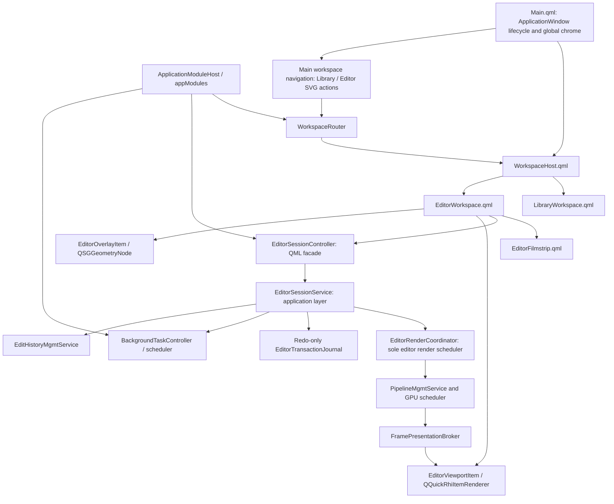

# QML Editor and Qt RHI Unified Workspace Refactor Plan

Date: 2026-07-16

Primary roadmap owner: `alcedo_studio/src/ui/alcedo_main`

Last revised: 2026-07-18 to add Phase 4D visual-consistency closeout and clarify that production
first-frame delivery remains in Phase 5B.

Affected areas:

- `alcedo_studio/src/ui/alcedo_main/qml`
- `alcedo_studio/src/ui/alcedo_main/editor_dialog`
- `alcedo_studio/src/include/ui/edit_viewer`
- `alcedo_studio/src/ui/edit_viewer`
- editor-facing application services, pipeline scheduling, edit history, and background tasks
- Windows CUDA/D3D11 and OpenCL/OpenGL interoperability
- macOS Metal presentation and EDR configuration

Status: planning. Product and architecture decisions were locked in a grill session on
2026-07-16. This is a replacement plan, not an incremental compatibility plan. The final product
has one QML editor architecture, no editor dialog, no QWidget viewer, no editor stub, and no
runtime fallback renderer.

## Outcome

Move the editor into the same application window as the library UI. The top-level QML scene owns a
`WorkspaceHost` that switches between a library workspace and an editor workspace. The editor keeps
a bottom filmstrip that collapses downward into a small persistent handle, accepts live search
results, and remains open with an empty-state prompt when no image is selected.

Library and Editor are two persistent choices in the main-window navigation. Double-clicking a
library image remains a shortcut that selects the image and activates Editor, but it is not the only
way to enter Editor. Editor does not own a separate “Back to Library” button. The editor desktop
keeps the established ordering: History/Versions rail on the left, image viewport in the center,
and adjustment controls on the right.

Replace the current broad `AlbumBackend` facade with an `ApplicationModuleHost` composition root,
exposed to QML as `appModules`. The host constructs modules in dependency order, owns their
lifecycle, and exposes typed module properties. QML behavior starts at a child module method; the
host does not mirror module state or forward module actions.

The image viewport becomes a `QQuickRhiItem`. Pipeline output remains GPU-resident and is presented
through an explicit native-resource lease protocol for all supported backend pairs:

| Launch backend | Qt Quick graphics API | Pipeline backend | Native presentation path |
| --- | --- | --- | --- |
| `cuda` | Direct3D 11 | CUDA 12.8 | CUDA/D3D11 shared texture |
| `opencl` | OpenGL | OpenCL | OpenCL/OpenGL shared texture |
| `metal` | Metal | Metal | shared `MTLTexture` |

Backend selection is a startup decision. There is no UI hot-switch. Unsupported combinations fail
before the first `QQuickWindow` is created and report a concrete startup error.

The refactor preserves every current editor capability before cutover. It also replaces the current
close-and-save dialog lifecycle with non-blocking, redo-only transaction journaling. Leaving an
image, leaving the editor workspace, or exiting the application automatically flushes the current
image transaction through the existing background-task infrastructure. Explicit Discard is a
secondary action on the current filmstrip thumbnail's context menu only.

## Non-negotiable constraints

- Do not embed the existing `QWidget` editor with `createWindowContainer`, `QQuickWidget`, or a
  native child window.
- Do not retain `OpenEditorDialog`, the editor stub, `QtEditViewer`, `QRhiWidget`, or the legacy GL
  viewer after cutover.
- Do not add host-upload, CPU-copy, OpenGL-widget, or software-scene-graph fallback presentation.
- Do not allow QML to call storage, pipeline, or history infrastructure directly. UI code calls the
  application-service layer.
- Do not add editor state or editor actions to `AlbumBackend`. Replace it with
  `ApplicationModuleHost`, and invoke behavior through child module APIs.
- Do not inject `ApplicationModuleHost&`, a generic service locator, or a bag containing every
  service into a module. Inject the narrow typed dependencies that module actually needs.
- Do not add friend access between the host and controller modules. Existing friend-based shared
  state must be removed as each affected module is migrated.
- Do not share mutable renderer objects between the GUI thread, Qt Quick render thread, and pipeline
  workers.
- Do not create or destroy `QRhi` resources from the GUI thread when the threaded Qt Quick render
  loop is active.
- Do not expose a renderer/backend selector in QML. Backend selection happens before QML engine and
  window construction.
- Do not make Library-to-Editor navigation depend on double-clicking an image. The main-window
  navigation always exposes both workspaces, including Editor with no selected image.
- Do not add workspace-return buttons inside `EditorWorkspace.qml`. Workspace selection belongs to
  the shared main-window navigation.
- Do not reverse the established editor desktop. History/Versions stay on the left; adjustment
  controls stay on the right.
- Do not use visible words as the main affordance for workspace switching, panel switching,
  collapse/expand, close, reset-view, or filmstrip dock controls. These structural actions use SVG
  icons with localized tooltips and accessible names. Text remains for actual content, values,
  errors, and places where an icon alone would be ambiguous.
- Do not let adjustment panels, viewport input handlers, image loading code, or history modules call
  the pipeline scheduler independently. They submit typed render intents to one editor render
  coordinator; that coordinator is the only production owner of editor render scheduling.
- Opening an image always creates an initial render intent. First-frame rendering must not depend on
  an adjustment change, zoom, pan, or any other later interaction.
- Do not cut over with a reduced editor. Tone, Look, Display Transform, Geometry, RAW Decode,
  crop/rotate, zoom/pan, ROI/detail patch, LUT browsing, history/versioning, histogram/waveform,
  export, and editor shortcuts are all required.
- Do not name a test, target, file, or document with the repository-banned vague test term.

Intermediate phases may coexist with the old implementation on the development branch so the work
can compile, but they are not separate product modes. No backend flag may select old versus new UI.
The final phase removes the old implementation in the same change that enables the new production
entrypoint.

## Feasibility conclusion from Qt documentation

The refactor is feasible on Qt 6.9.3, with one important qualification: ordinary Qt Quick rendering
solves the embedded RHI viewport, but dynamic whole-window HDR requires application ownership of the
top-level swapchain.

### What Qt supports directly

- [`QQuickRhiItem`](https://doc.qt.io/qt-6.9/qquickrhiitem.html) is the Qt Quick counterpart of
  `QRhiWidget`. It renders into an offscreen color buffer and participates as a normal `QQuickItem`,
  so QML layout, clipping, opacity, stacking, and overlay composition work normally. Qt 6.9 supports
  RGBA8, RGBA16F, RGBA32F, and RGB10A2 color buffers.
- [`QQuickRhiItemRenderer`](https://doc.qt.io/qt-6.9/qquickrhiitemrenderer.html) owns render-thread
  state. `initialize()` must rebuild resources after RHI, render-target, sample-count, or size
  changes; `render()` records its own pass against the item's render target. Qt marks this renderer
  API preliminary, so the integration must stay isolated and version-pinned.
- The standard Windows D3D11 and macOS Metal Qt Quick render loops are threaded. GUI-thread item
  state must be copied into render-thread state only at the scene graph synchronization point. See
  [Qt Quick Scene Graph](https://doc.qt.io/qt-6.9/qtquick-visualcanvas-scenegraph.html).
- [`QQuickWindow::setGraphicsApi`](https://doc.qt.io/qt-6.9/qquickwindow.html) must be called before
  the first Qt Quick window. This matches Alcedo's startup-only backend decision and requires moving
  CUDA adapter selection out of `QtEditViewer` construction.
- Qt Quick pointer handlers separate input behavior from visual items. `HoverHandler`,
  `DragHandler`, `PinchHandler`, `WheelHandler`, and `TapHandler` cover the editor's mouse, trackpad,
  touch, and stylus entrypoints. See
  [Qt Quick Input Handlers](https://doc.qt.io/qt-6/qtquickhandlers-index.html).
- A custom `QQuickItem::updatePaintNode()` can maintain `QSGGeometryNode` content on the render
  thread. This is the appropriate path for crop masks, grids, handles, ROI outlines, and other
  frequently changing vector overlays. See the
  [custom scene graph material example](https://doc.qt.io/qt-6.9/qtquick-scenegraph-custommaterial-example.html).

### What requires an Alcedo render host

- [`QRhiSwapChain`](https://doc.qt.io/qt-6/qrhiswapchain.html) exposes SDR,
  `HDRExtendedSrgbLinear`, HDR10, and `HDRExtendedDisplayP3Linear`, but the format is intended to be
  selected before the first `createOrResize()`.
- The standard Qt Quick render loop owns its swapchain. `QQuickWindow::swapChain()` exposes it for
  inspection, but Qt 6.9 has no public, high-level API for repeatedly changing the owned
  swapchain between SDR and HDR while the window is live.
- [`QQuickRenderControl`](https://doc.qt.io/qt-6/qquickrendercontrol.html) lets an application drive
  the Qt Quick scene into an application-controlled render target. Together with
  [`QQuickGraphicsDevice::fromRhi()`](https://doc.qt.io/qt-6/qquickgraphicsdevice.html), Alcedo can
  use one application-owned `QRhi`, render the complete QML scene to a linear 16-bit-float target,
  and perform the final SDR/HDR output pass into its own swapchain.

Qt's QRhi APIs have limited source and binary compatibility guarantees and require `Qt6::GuiPrivate`.
The editor must therefore pin the supported Qt minor version to 6.9.3, compile all RHI integration in
CI, and treat a Qt minor upgrade as an explicit port with the full GPU harness.

## Current architecture and why it cannot be embedded as-is

The active path is:

```text
ThumbnailGridView / ThumbnailListView
  -> AlbumBackend::OpenEditor
  -> EditorController::OpenEditor
  -> OpenEditorDialog
  -> modal EditorDialog::exec()
  -> QtEditViewer QWidget
  -> RhiEditViewerSurface QRhiWidget
```

The relevant editor and viewer trees contain roughly 24,000 lines. The difficulty is not the dialog
window flag; it is that windowing, pipeline scheduling, native texture allocation, overlays, input,
scopes, history, and save lifecycle currently meet inside QWidget-oriented objects.

Specific blockers:

- `QtEditViewer` is both a `QWidget` and an `IFrameSink`. It owns a `QRhiWidget` surface plus a
  separate QWidget/QPainter overlay.
- `RhiEditViewerSurface` creates native targets and releases imported RHI textures from the widget
  lifecycle. Under Qt Quick, equivalent RHI resources belong exclusively to the scene graph render
  thread.
- `IFrameSink` exposes synchronous `EnsureSize`, map, unmap, and notify calls. CUDA and OpenCL
  pipeline code assumes the target can be resized and mapped from worker execution. A threaded
  scene graph cannot safely honor that synchronous behavior directly.
- `EditorRenderCoordinator` and `EditorFrameManager` hold concrete `QtEditViewer`, spinner, and scope
  widget types. They must be split at service/model boundaries, not wrapped in QObjects unchanged.
- `EditorDialog` builds Tone, Look, Display Transform, Geometry, RAW Decode, LUT, versioning, and
  scope widgets imperatively. Reusing the widget composition would preserve the old architecture.
- `Main.qml` is already a large layout owner. Adding an editor branch directly would make it the
  application router, library layout, editor layout, and global-window implementation at once.
- `AlbumBackend` currently mirrors a large number of child-module properties and actions, stores
  shared mutable state for helpers, and forwards calls such as `OpenEditor`. Adding another editor
  facade to it would turn the composition root into the editor's service locator.
- CUDA-to-D3D adapter configuration currently occurs during viewer construction, after the QML
  window can already have initialized a different adapter.
- The macOS color manager finds a `CAMetalLayer` in the widget window and changes its color space,
  `wantsExtendedDynamicRangeContent`, and EDR metadata. In the unified window that layer belongs to
  the whole QML scene, so the behavior must be made an explicit whole-window display state.

The reusable parts are the pure geometry/controllers, pipeline adapters, edit-history services,
scope analyzers, LUT catalog logic, and the image-rendering shader/pipeline behavior. Reuse these by
moving them behind clean interfaces; do not preserve their QWidget ownership graph.

## Decisions locked in the grill session

### Workspace and navigation

- `Main.qml` becomes a thin application-window shell.
- `ApplicationModuleHost` replaces `AlbumBackend` as the process-local UI module composition root
  and is exposed to QML as `appModules`.
- `WorkspaceHost.qml` owns workspace layout and lazy loading.
- A C++ `WorkspaceRouter` owns the route (`Library` or `Editor`) and route arguments; it does not
  perform pixel layout.
- The main-window navigation contains persistent Library and Editor SVG actions. It is owned by
  `Main.qml` / `WorkspaceHost.qml`, remains visible in both workspaces, and shows the active choice.
- Activating Editor without an image is valid. Double-clicking a library image sets the focused
  image and activates Editor in one action.
- `EditorWorkspace.qml` contains no “Library” or “Back to Library” button. Returning to Library uses
  the same main navigation as entering Editor.
- `LibraryWorkspace.qml` contains the extracted current album/library surface.
- `EditorWorkspace.qml` contains the editor toolbar, central viewport, control panels,
  scopes/history, and bottom `EditorFilmstrip.qml`.
- The editor desktop order is left History/Versions SVG rail and flyout, center viewport/filmstrip,
  and right scope plus adjustment stack. The right adjustment stack keeps its panel navbar rather
  than replacing it with a single placeholder or a long text explanation.
- Structural controls use SVG icons and visual state. Their localized words live in tooltips,
  accessible names, and tests, not as permanent labels consuming editor space.
- The filmstrip collapses downward. Collapsed state leaves a small focusable handle showing the
  current position/count and background-save state, expands the viewport into the released space,
  and does not destroy the filmstrip model or current image session. The preference survives
  workspace switches and is restored when the application reopens.
- Entering the editor unloads the library workspace's expensive visual tree. Shared backend models
  may remain alive where project services require them.
- The editor can be opened without a selected image. It shows a centered localized prompt equivalent
  to “Select an image to edit”, an empty viewport, disabled adjustment controls, and a filmstrip that
  can later receive search results.
- The editor supports global search. A search replaces the filmstrip with the live search element
  list and focuses the selected result. Changing ordinary library filters requires returning to the
  library workspace.
- If a live search update removes the current image, the editor seals and autosaves its transaction,
  selects the nearest surviving element by prior index, or enters the empty state if none survive.

### Overlay and input

- `EditorViewportItem : QQuickRhiItem` renders only the photograph layers.
- `EditorOverlayItem : QQuickItem` produces retained `QSGGeometryNode` content for crop mask/grid,
  crop border/handles, ROI/detail bounds, guides, and selection outlines.
- Existing `ViewportMapper`, `CropGeometry`, `CropInteractionController`,
  `ViewTransformController`, and `EditViewerOverlayGeometry` logic is retained only after removing
  QWidget dependencies and proving coordinate parity.
- Pointer handlers live in QML and call a small typed input/controller surface. Ordinary QML renders
  labels, buttons, spinner/status, contextual help, and focus indication.
- Overlays are not baked into the photograph RHI pass. This preserves QML stacking and keeps HDR
  image encoding independent from UI geometry.

### Save, journal, and version semantics

- Editing is autosave-first. There is no primary Save/Cancel dialog workflow.
- A completed user gesture creates one coalesced redo-only edit transaction. Slider samples during a
  drag do not each become durable transactions; release or an idle coalescing boundary commits the
  latest value.
- Each journal record contains image/element identity, base version identity, session identity,
  monotonically increasing generation, operation payload, and integrity metadata.
- Undo and redo append explicit cursor-move records. They do not mutate the durable journal in
  place.
- Appending an edit while the working cursor is behind the transaction tail appends one atomic,
  journal-only `RewriteTimeline` control record. It contains the version identity, expected timeline
  hash, retained cursor, discarded-tail hash, and replacement `EditTransaction`. Replay validates
  the expected hashes, logically tombstones the old redo tail, and appends the replacement as one
  mutation; it must never expose a state where the tail was removed but the replacement is absent.
- `RewriteTimeline` is not an `EditTransaction`, is not rendered as a user edit, and does not create
  a hidden Version. The discarded redo tail is unavailable after the rewrite; existing user-visible
  Versions remain the mechanism for preserving alternate looks.
- Journal storage stays append-only. Timeline rewrites become physical deletion only when a verified
  compaction checkpoint replaces the old journal.
- Journal appends and project persistence run through the background-task scheduler. Older async
  completions are forbidden from overwriting a newer generation.
- Switching image, changing workspace, or exiting issues a durability barrier for the current
  transaction and immediately starts the next allowed work. Image save and next-image load/render
  overlap when their resource locks do not conflict.
- A durable redo journal is sufficient to reconstruct the resulting version. Recovery replays only
  records newer than the persisted base/head generation and is idempotent.
- Successful materialization advances the image's persisted head, flushes the current transaction,
  schedules thumbnail invalidation/regeneration, and begins a fresh transaction boundary.
- On abnormal termination, the next project open automatically replays valid redo-only records and
  marks the recovered head in history. Corrupt or base-mismatched records stop recovery for that
  image and surface a diagnostic; they are never applied partially.
- Explicit Discard exists only in the current editor-filmstrip thumbnail context menu and is enabled
  only for an unflushed current transaction. It cancels that transaction and reloads the durable
  head. Once an autosave has published a version, the user returns through version history instead
  of destructive discard.

### HDR and display state

- The application initially uses the standard Qt Quick render loop while the QML editor is built.
- Existing macOS system-API EDR behavior must remain available. The macOS development environment is
  currently unavailable, so implementation and feasibility qualification are deliberately deferred
  to the dedicated phase immediately before the final HDR/cutover phase. Production cutover cannot
  proceed until that phase passes.
- Application-owned QRhi/swapchain rendering is the final implementation phase.
- HDR selection is image/editor state. Entering an HDR edit, changing to an HDR/SDR image, leaving the
  editor, or disabling HDR requests a whole-window display-mode transition.
- The transition may freeze the last completed frame, wait for GPU idle, rebuild presentation, and
  briefly show black. The target is no more than 250 ms on supported hardware.
- Recreating the native top-level window is permitted when the platform requires it, but window
  geometry, screen, maximized/fullscreen state, workspace, focused image, journal generation, and
  focus must be restored.
- Windows OpenCL/OpenGL is tested for a true HDR swapchain. If
  `QRhiSwapChain::isFormatSupported()` reports that the active screen/backend cannot create it,
  Alcedo performs the product-defined HDR-to-SDR display transform in the same renderer. This is a
  display policy, not a renderer fallback.

## Target architecture



### Responsibility boundaries

`ApplicationModuleHost`:

- replaces `AlbumBackend` and acts only as the module composition root;
- creates application services and UI modules in a documented dependency order;
- exposes typed constant module properties such as `workspaceRouter`, `editorSession`, `search`,
  `backgroundTasks`, `interactionPolicy`, and library modules;
- contains no forwarding `Q_INVOKABLE` actions and no mirrored module-specific adjustment,
  thumbnail, search, import/export, AI, or editor properties;
- stops new intents, drains/cancels tasks by policy, and destroys modules in reverse dependency order;
- connects optional cross-module notifications with signals, while required synchronous
  collaboration uses narrow constructor-injected interfaces;
- does not give modules a pointer/reference back to the host and does not act as a service locator.

Each module owns its QML-facing properties, signals, and invokables. For example, QML calls
`appModules.workspaceRouter.openEditor(...)` and `appModules.editorSession.undo()`, never
`appModules.openEditor(...)` or a host forwarding wrapper.

`WorkspaceRouter`:

- owns route and route arguments;
- accepts “open editor”, “return to library”, and global-search navigation intents;
- never owns panel sizes or image-edit state.

`WorkspaceHost.qml`:

- lays out global chrome and the active workspace;
- uses `Loader` so inactive expensive trees are destroyed;
- restores focus deliberately after route changes.

Main workspace navigation:

- is part of shared window chrome, not part of LibraryWorkspace or EditorWorkspace;
- always exposes Library and Editor with SVG actions and a clear active state;
- lets Editor open without an image and removes the need for an editor-local return button;
- keeps localized tooltips, accessible names, and keyboard focus even though visible labels are
  minimized.

`EditorSessionController`:

- is a QML-facing QObject facade with typed properties and invokables;
- exposes current element, loading/empty/error state, adjustment models, history, scope models,
  filmstrip model, and interaction capabilities;
- does not own pipeline guards, database transactions, native textures, or worker threads.

`EditorSessionService`:

- is the application-layer owner of the active image session;
- acquires pipeline/history guards, applies typed adjustment patches, sequences generations, and
  coordinates save/switch/recovery;
- calls existing application services rather than allowing UI code to reach storage directly;
- registers save/load/render operations with the background-task system and declares per-image
  resource locks.

`EditorRenderCoordinator`:

- is the only production component allowed to enqueue editor work on `PipelineScheduler` or the
  corresponding `PipelineMgmtService` entrypoint;
- accepts typed intents for initial frame, interactive adjustment, settled adjustment, zoom/pan,
  viewport resize, detail refresh, undo/redo, image switch, and explicit retry;
- owns request priority, replacement of outdated pending work, quality timing, image/session/view
  generations, cancellation, and frame-delivery status;
- attaches the active session's presentation sink before issuing its first render and submits all
  completed frame roles through the same frame-routing path;
- does not know QML controls, QWidget, `QtEditViewer`, or dialog-owned spinner widgets;
- exposes immutable state/results to `EditorSessionService`; individual UI modules never receive a
  pipeline or scheduler pointer.

`EditorTransactionJournal`:

- appends redo-only records with checksums and monotonic generations;
- supports durable barriers, replay, commit/head markers, and safe truncation;
- never records intermediate slider samples or renderer-only state such as zoom/pan.

`FramePresentationBroker`:

- replaces the synchronous `IFrameSink` map/unmap interface;
- exchanges immutable target leases and completed-frame submissions between pipeline workers and the
  render thread;
- carries backend, pixel format, dimensions, target generation, image render generation, native
  handle, synchronization primitive, and lifetime token;
- rejects stale detail patches and frames after resize, image switch, or target recreation;
- releases an imported native resource only after both producer completion and QRhi consumption.

`EditorViewportRenderer`:

- lives only on the scene graph render thread;
- creates imported `QRhiTexture` wrappers, render pipelines, SRBs, uniform buffers, and samplers;
- rebuilds all dependent resources from `initialize()` when RHI, render target, size, format, or
  sample count changes;
- renders InteractivePrimary, QualityBase, and DetailPatch layers with the current zoom, pan,
  letterbox, and ROI rules;
- consumes only the newest completed frame compatible with the current target and image generation.

## Startup backend requirements

Add a startup parser before `QQmlApplicationEngine` and before any QML type can construct a window.
Use one explicit argument, for example:

```text
alcedo_main --editor-backend=cuda
alcedo_main --editor-backend=opencl
alcedo_main --editor-backend=metal
```

The exact spelling may follow the existing command-line parser, but the semantics are fixed:

- `cuda` is Windows-only, requires the project's CUDA 12.8 driver/device policy, selects the
  matching CUDA adapter LUID, and calls `QQuickWindow::setGraphicsApi(Direct3D11)` before loading
  QML.
- `opencl` is Windows-only for this plan, verifies the required OpenCL/GL sharing extensions,
  configures the process-wide OpenGL surface/share context, and selects
  `QQuickWindow::setGraphicsApi(OpenGL)` before loading QML.
- `metal` is macOS-only and selects Metal before loading QML.
- An unavailable build feature, invalid platform pair, adapter mismatch, or missing interop extension
  is a startup failure with detected adapter/backend details. It does not silently choose another
  pair.
- Production packaging chooses a documented default, but CMake adds developer launch targets for
  each built backend so CUDA and OpenCL are one command apart during development.

## Image switch state machine

Filmstrip and live-search switching must not serialize save then load on the GUI thread.

```text
Focused(image A)
  -> seal active gesture and capture transaction generation N
  -> enqueue A journal/save barrier with image-scoped write lock
  -> invalidate A render generation and release UI ownership of its session
  -> acquire B pipeline/history guards with image-scoped read/write lock
  -> request B interactive preview
  -> publish B only when its metadata and first compatible frame are ready

A save and B load/render may overlap.
Stale A frames, scope results, thumbnail completions, and journal completions carry A identity and
generation and cannot mutate B.
```

If the next element is removed before it becomes active, cancel that generation and resolve the new
nearest element. If the list becomes empty, keep EditorWorkspace open, complete the prior save, and
enter the empty state.

## Phased implementation plan

Each phase has a hard acceptance gate. A phase is not complete because code exists; its named tests,
thread/lifetime assertions, and platform checks must pass.

### Phase 0 - Windows executable requirements and feasibility harness

Status: **implemented and verified on Windows** (2026-07-16). Maintained targets:
`EditorRhiHarness`, `EditorRhiContractsTest`, `run_editor_rhi_harness_cuda`,
`run_editor_rhi_harness_opencl`.

Verified on NVIDIA GeForce RTX 3080 Laptop GPU:
- `EditorRhiHarness --editor-backend=cuda --case=direct-presentation` (pixel error 0)
- `EditorRhiHarness --editor-backend=opencl --case=direct-presentation` (pixel error 0)
- CUDA cases: resize-churn, hide-show, minimize-restore, renderer-recreation, hdr-format-query
- OpenGL HDR probe (Phase 10 input): SDR supported; HDRExtendedSrgbLinear/HDR10/P3Linear false
  on this display/backend path
- `EditorRhiContractsTest` (9 tests) passed

The Metal lease interface is defined in `frame_presentation_lease.hpp`; Metal feasibility remains
Phase 9.
Production `alcedo_main` entrypoint is intentionally unchanged in Phase 0.

Deliverables:

- Add a maintained `EditorRhiHarness` executable using a real `QQuickWindow` and minimal
  `QQuickRhiItem`.
- Add startup backend parsing and diagnostics without changing the production editor entrypoint.
- Move CUDA adapter discovery into a pre-window helper and prove the Qt D3D11 device uses the same
  adapter as CUDA.
- Prove OpenCL/GL shared-texture creation, acquire/release synchronization, and render-thread context
  ownership with the Qt Quick threaded render loop.
- Exercise RGBA32F viewport rendering, resize, device-pixel-ratio change, hide/show,
  minimize/restore, renderer recreation, and application shutdown on both Windows backend pairs.
- Record Windows OpenGL `isFormatSupported()` results for HDR on representative NVIDIA, AMD, HDR,
  and SDR display configurations. This is input for Phase 10, not a reason to switch renderers.
- Create deterministic fixtures: FP32 gradient, checkerboard, ROI patch, odd-sized image, and a small
  real RAW project fixture.
- Define the backend-neutral Metal lease interface but do not claim Metal feasibility while the macOS
  environment is unavailable. Metal implementation and qualification are Phase 9.

Acceptance:

- CUDA/D3D11 and OpenCL/OpenGL display the generated FP32 frame through native interop with no host
  presentation copy.
- Backend/adapter mismatch is detected before QML window creation.
- Repeated resize and renderer recreation produce no stale import, deadlock, or native-resource leak.
- The harness reads back the pre-composition viewport result and compares expected pixels within a
  documented floating-point tolerance.

### Phase 1A - ApplicationModuleHost composition root

Deliverables:

- Replace the `AlbumBackend` class and QML context name with `ApplicationModuleHost` / `appModules`.
- Move module-specific Q_PROPERTY, signals, invokables, state, and behavior to their owning modules.
- Expose typed constant module properties from the host; do not expose a generic `QObject*` bag when
  the concrete QML type can be registered.
- Define a construction graph for project lifecycle, library, folders, thumbnails, search, tasks,
  interaction policy, AI, import/export, workspace routing, and editor session modules.
- Give every module a narrow constructor signature containing only its required application services
  and collaborator interfaces. Do not pass the host or a universal dependency bundle.
- Replace required cross-module friend access with injected interfaces. Use Qt signals for optional
  notifications that do not require a synchronous answer.
- Define reverse-order shutdown: stop accepting QML intents, request task shutdown by policy, flush
  required journals/project writes, disconnect modules, then destroy services.
- Update QML call sites to begin behavior at child modules, for example
  `appModules.workspaceRouter.openEditor(...)`.

Acceptance:

- `ApplicationModuleHost` contains lifecycle/composition code and typed module accessors only.
- It has no forwarded module actions and no mirrored module-specific state.
- No migrated module declares the host or another controller as a friend.
- Module unit tests construct the module with fakes without constructing the host, QML engine,
  project, or unrelated modules.
- Construction and shutdown order are covered by a deterministic lifecycle test.

### Phase 1A-Fix

审核范围是 `28f75d15..56b92f43`。忽略换行符和纯空白变化后，实际代码变化约为
4,858 行增加、4,004 行删除。`alcedo_main`、`alcedo_tests_ui` 和
`AlbumBackendCiWorkflowTest` 均能编译；本次改动相关的 105 个可运行测试全部通过，另有
4 个测试因为缺少外部项目或 Metal 环境而跳过。常用的项目、导入、文件夹、删除、评分、
缩略图和搜索流程目前没有发现普遍退化，但下面的问题仍需修正后才能把 Phase 1A 标为完成。

- `ImageController::DeleteTargets()` 中“导入仍在运行”的判断写成了
  `ie && ie->current_import_job() && !ie && ...`。前面已经要求 `ie` 有值，后面又要求
  `ie` 没有值，所以这个分支永远不会执行。`DeleteImages()` 从 QML 进入时通常还会先经过
  `InteractionPolicyController`，因此普通界面操作不一定马上暴露问题；但是
  `NikonHeRecoveryController` 等 C++ 调用者会直接调用 `DeleteTargets()`，可以绕过前一层
  检查。应恢复原来的 `!ie->current_import_job()->IsCancelationAcked()` 判断，并增加一个测试：
  导入尚未结束时，从直接 C++ 入口删除图片必须被拒绝，导入确认取消后才允许删除。

- 退出处理没有完成 Phase 1A 计划中写明的步骤。`ShutdownModules()` 先清除了数据库写入
  屏障的回调，却没有调用 `image_analysis_sink_->FlushPendingWrites()`；如果导出仍占用屏障，
  图片分析结果会留在内存队列中，随后随对象销毁而丢失。这里也没有调用
  `background_tasks_->CancelAll()`，没有按照每个任务的退出规则等待结束，也没有等待模型
  下载、模型启用、图片分析和导出真正停止。应先拒绝新的界面操作，再按任务各自的规则取消
  或等待，释放数据库写入屏障，写完排队的数据，最后保存和打包项目。需要增加“导出占用
  屏障时图片分析完成并立即退出”和“每种后台任务仍在运行时退出”的测试，确认数据已经写入，
  回调不会在模块销毁后执行。

- 新增的创建和销毁顺序测试没有观察真实对象。测试只读取
  `ConstructionOrder()` 返回的固定字符串，再把这组字符串倒过来比较；即使构造函数和成员
  声明已经写错，测试仍然会通过。当前就有一个实际不一致：构造时先创建
  `AiProviderProfileController`，再创建 `SemanticGenerationController`，但头文件中的成员声明
  顺序相反，C++ 销毁成员时会先销毁 `AiProviderProfileController`，而
  `SemanticGenerationController` 仍保存着指向它的指针。应调整成员声明或显式按正确顺序释放，
  并让测试通过真实对象的创建、停止和 `destroyed` 事件记录顺序，不能再用固定字符串代替。

- `ApplicationModuleHost` 暴露给 QML 的 16 个模块属性全部声明成了 `QObject*`。这与 Phase 1A
  要求的具体模块类型不符，也让 QML 工具无法在编译时检查 `appModules.project`、
  `appModules.library` 等对象上是否真的存在某个属性或方法。应注册这些具体 C++ 类型，并把
  `Q_PROPERTY` 和读取函数改成对应的具体指针类型。增加一个检查，读取每个属性的类型名称，
  防止以后又退回 `QObject*`。

- 原来的集中访问方式并没有真正拆开，只是从 `AlbumBackend` 转移到了 `ProjectModule`。
  `ProjectModule::BindCollaborators()` 一次接收七个其他模块，并公开这些模块的读取函数；
  `ProjectHandler` 再通过 `ProjectModule` 取得 library、folders、stats、editor、import/export、
  semantic generation 和 model download。这样 `ProjectHandler` 仍然可以接触几乎全部界面模块，
  单个模块也仍然必须等其他模块全部创建后再补指针。应把每项操作需要的少量接口直接传给
  使用者，例如项目打开后的通知、界面状态提示和语义标签读取分别使用小接口或 Qt 信号，删除
  `ProjectModule` 上为其他模块转发的读取函数和方法。

- “模块可以用假对象单独测试”这一项没有完成。项目、文件夹、图片、导入导出、图库、统计和
  搜索测试仍然都先创建完整的 `ApplicationModuleHost`，会同时创建项目服务、模型服务和所有
  无关模块。现有测试只能证明整组对象放在一起时能工作，不能证明构造函数只要求了真正需要的
  对象。应至少为 `ProjectModule`、`LibraryModule`、`FolderController`、`ImageController`、
  `ImportExportHandler`、`StatsEngine` 和 `SearchController` 各增加直接构造测试，使用小型假对象
  验证输入、状态变化和信号，不创建 `ApplicationModuleHost`。

- `application_module_host.cpp` 仍包含约四百多行与对象创建无关的功能，包括 EXIF 文本整理、
  AI sidecar 启动、分析结果写数据库、评分更新和搜索刷新。虽然这些代码写在几个内部类里，
  它们仍让这个文件同时负责对象创建和具体业务。应把图片分析环境和结果写入实现移到独立文件，
  `ApplicationModuleHost` 文件只保留创建、连接、停止和销毁对象的代码。

- Phase 1A 的交付项写明创建关系应包含 `workspaceRouter` 和 `editorSession`，当前主机没有这两个
  属性或对象。现在 QML 仍调用 `appModules.editor.OpenEditor()`，进入的还是旧
  `EditorController` 和旧对话框流程。如果这两项确实要到 Phase 1B 和后续编辑器阶段才实现，
  应先修改 Phase 1A 的交付说明，避免把未实现内容记为完成；否则应在 Phase 1A 补齐这两个模块
  的最小接口、创建顺序和测试。

- 一些 QML 组件仍保留了同时兼容新旧入口的判断。例如 `GlobalSearchDialog.qml` 会在
  `backend.search` 与 `backend.searchController` 之间选择，`AdvancedContentAnalysisDialog.qml`
  会在 `backend.images` 与 `backend` 之间选择，`CollectionsPanel.qml` 也同时接受主机和文件夹
  模块。这会继续允许把整个 `appModules` 传给子组件，也容易让旧调用方式悄悄回来。应让这些
  组件只接收自己需要的模块，例如只传 search、interactionPolicy、images 或 folders，并删除
  旧入口判断。

- 这次修改替换了约 260 处 QML 调用，但测试只实际加载了 `GlobalSearchDialog.qml`，没有测试
  完整的 `Main.qml`。C++ 测试通过不能发现主窗口中属性名称写错、信号接到错误模块、弹窗打开
  后才访问到不存在方法等问题。应增加一个可见窗口测试，使用真实 `ApplicationModuleHost`
  加载 `Main.qml`，至少走完项目打开、文件夹切换、缩略图更新、导入状态、导出状态、图片检查、
  搜索弹窗、设置弹窗和编辑入口，并把 QML warning 当作测试失败。

- 38 个本来只需要少量修改的源文件、QML 文件和测试文件被整体改成了 CRLF。结果是普通 diff
  显示 23,609 行增加、22,755 行删除，`git diff --check` 也会把这些行尾报告成空白问题；这正是
  本次改动看起来超过两万行的主要原因，也掩盖了真正的代码变化。应在提交修复前恢复仓库原有
  行尾，只保留实际修改，并去掉这次顺带加入的重复自包含头文件。清理后重新运行
  `git diff --check`，结果必须为空。

### Phase 1B - Thin Main and workspace shell

**Status: complete (2026-07-17).** Phase 1B-Fix closed the review gaps below.

Deliverables:

- Extract the current library body from `Main.qml` into `LibraryWorkspace.qml` without changing its
  behavior.
- Add `WorkspaceHost.qml` and the `WorkspaceRouter` module.
- Reduce `Main.qml` to application-window lifecycle, frameless/native window chrome, global
  shortcuts, global dialogs/toasts, and `WorkspaceHost` construction.
- Add `EditorWorkspace.qml` with toolbar regions, central empty viewport slot, inspector/scope slots,
  and a bottom filmstrip dock slot.
- Define the downward-collapse geometry and persistent handle behavior for the filmstrip dock.
- Add the no-image empty state and focus/accessibility order.
- Route grid/list double-click through `appModules.workspaceRouter` rather than a modal editor method.
- Define lazy-load and teardown rules for both workspaces.

Acceptance:

- Library layout and behavior remain pixel/functionally equivalent after extraction.
- Routing can open an empty editor, open an editor focused on an element, and return to the library.
- The filmstrip slot collapses downward, releases its height to the viewport, and leaves its handle
  keyboard- and pointer-accessible.
- Repeating workspace switches does not grow the QML object count or retain inactive visual trees.
- `Main.qml` contains no library/editor panel layout decisions.

Implementation notes:

- `Main.qml` is the application shell (window chrome, global dialogs, shortcuts, overlays).
- `WorkspaceHost.qml` lazy-loads exactly one of `LibraryWorkspace.qml` / `EditorWorkspace.qml`
  via mutually exclusive `Loader`s so inactive trees are destroyed.
- `EditorFilmstrip.qml` owns the collapsible dock + persistent handle; collapse state and expanded
  height persist through `EditorSessionController` (`QSettings` keys
  `editor/filmstripCollapsed`, `editor/filmstripExpandedHeight`).
- `WorkspaceRouter::OpenEditor` / `OpenLibrary` drive route state only. `EditorSessionController`
  tracks session identity without opening the legacy modal `OpenEditorDialog`.
- Covered by `MainQmlWorkflowTest` and `WorkspaceShellTest`.

### Phase 1B-Fix

**Status: complete (2026-07-17).**

审核范围是 `d94fbbce..73c55433`。下列问题已全部修正，`WorkspaceShellTest`（11）与
`MainQmlWorkflowTest`（1）通过。

| 问题 | 修复 |
| --- | --- |
| 项目切换/关闭不结束新编辑会话 | `finalize_editor_session` 同时结束 legacy `EditorController` 与 `EditorSessionController`，并 `WorkspaceRouter::OpenLibrary()` |
| 图库视图状态随 Loader 销毁丢失 | 状态提升到 `Main.qml`（`library*` 属性）；`LibraryWorkspace` 创建时 snapshot、销毁时 persist；滚动 `contentY` 往返恢复 |
| 检查面板自适应宽度少算 24px | 去掉对窗口级 `mainFrameHorizontalMargins` 的重复扣减；基于 workspace 实际宽度计算 |
| Inspector 按钮位置/尺寸漂移 | 恢复到顶部工具栏 52×42、图标 24×24（`libraryInspectorToggle`） |
| 缩放中进入编辑器泄漏缩略图 pin | `ThumbnailGridView` `Component.onDestruction` 强制 `flushDeferredThumbnailReleases` |
| 测试只调 C++ 路由 | QTest 双击网格、点击返回、胶片栏 Space/Enter/Down |
| Loader active 计数不足 | `library/editor Create/Destroy` 计数 + `QTimer` 基线对比 |
| 旧对话框调用不可观测 | 测试 stub 记录 `OpenEditorDialogCallCount()`，断言为 0 |
| 胶片栏 QSettings 污染本机 | IniFormat + 测试临时目录 + 恢复 org/app/format |
| Main/LibraryWorkspace CRLF | 恢复 LF；`git diff --check` 干净 |

### Phase 2 - QQuickRhiItem viewport and native frame broker

Deliverables:

- Implement `EditorViewportItem`, `EditorViewportRenderer`, and `FramePresentationBroker`.
- Port the existing RHI image renderer behavior to the QQuickRhiItem render target.
- Replace synchronous target mapping with target leases and completed-frame submissions.
- Implement CUDA/D3D11 and OpenCL/OpenGL lease adapters. Preserve a backend-neutral lease boundary
  so Phase 9 can add Metal without changing the broker protocol.
- Carry target and image generations through InteractivePrimary, QualityBase, and DetailPatch.
- Define cancellation and resource release for image switch, resize, hidden window, scene graph
  invalidation, and application shutdown.
- Expose read-only renderer diagnostics to tests: backend name, target generation, last presented
  image generation, dropped-stale-frame count, and live target count.

Acceptance:

- A real pipeline render reaches QQuickRhiItem on both Windows backend pairs without a CPU
  presentation copy.
- Resize never asks a pipeline worker to create or destroy QRhi resources.
- An old image or ROI detail patch cannot appear after switch or resize.
- Hiding/minimizing the window cannot leave a producer blocked forever on a target lease.
- Scene graph invalidation releases all imported wrappers and native targets in a deterministic order.

**Status: complete (2026-07-17).** Implemented and verified on Windows with the production
`QQuickRhiItem` viewport, broker lease protocol, CUDA/D3D11 and OpenCL/OpenGL adapters, generation
and stale-frame filtering, render-thread resource release, and read-only diagnostics. Phase 2-Fix
closed the production-viewport gaps (lease sink wiring, startup backend, sync, pool recycle,
session generation). Interface suite (20), production `EditorViewportItem` harness on CUDA/OpenCL,
and direct-presentation harness cases pass.

### Phase 2-Fix

**Status: complete (2026-07-17).**

审核范围是 `82623d7d..d8069e9d`。下列问题已全部修正；`EditorRhiContractsTest`（20）、
生产 `EditorViewportItem` harness（CUDA/OpenCL lease presentation、continuous submit、
hide/show、renderer recreation）与既有 direct-presentation harness 通过。

Implementation closeout:

- `LeaseFrameSink` bridges `IFrameSink` → lease acquire/fill/submit (no CPU-upload path).
- Production `alcedo_main` parses `--editor-backend` and calls `ApplyEditorBackendBeforeWindow`
  before any QML window.
- Broker backend comes from `ActiveEditorBackend()`; writable CUDA array / OpenCL `cl_mem` are
  distinct from sync fields; dual-sided `LeaseLifetimeToken` + producer-writing invalidation.
- Dropped completed frames recycle targets; newest selection uses preview/detail generation;
  image identity is separate from monotonic session generation (`EditorSessionController`).
- Worker submits queue `update()` to the GUI thread; renderer destruction no longer shuts down
  the shared broker; window hide/minimize/exposure drives consumer availability.
- Layer/size-aware target requests + Available-count pool top-up; presentation mode + ROI/aspect
  checks restored; idle `render()` no longer loops forever.

| 问题 | 需要修正和验证的结果 |
| --- | --- |
| 新视口没有接到真实编辑管线。仓库里没有生产代码调用 `tryAcquireWritableTarget`、`submitCompletedFrame`、`submitFrame` 或 `setViewState`，QML 只把 `imageId` 交给视口。打开图片后只能创建一个空的 RHI 视口，不会加载或显示编辑结果。 | 把管线输出、视口状态和图片切换接到新视口。用真实 RAW 输入验证 InteractivePrimary、QualityBase 和 DetailPatch 都能到达生产 `EditorViewportItem`。 |
| 生产程序没有使用已经写好的启动后端选择。`alcedo_main --editor-backend=opencl` 目前不会解析这个参数，也没有在创建窗口前调用 `QQuickWindow::setGraphicsApi(OpenGL)`；Windows 上仍会使用 Qt 默认图形后端。 | 在生产入口创建 `QApplication` 后、加载任何 QML 窗口前完成参数检查、显卡匹配、OpenCL/GL 初始化和 Qt Quick 后端选择。分别启动生产程序验证 CUDA/D3D11 与 OpenCL/OpenGL。 |
| `EditorViewportItem` 创建 `FramePresentationBroker` 时固定使用 CUDA。即使 Qt Quick 已经运行在 OpenGL 上，OpenCL adapter 创建出来的目标也会因后端不一致被 broker 全部拒绝，`liveTargetCount` 会一直是 0。 | broker 的后端必须来自启动时已经确定的后端，并且和当前 QRhi、管线后端一致。增加生产视口的 OpenCL 测试，确认至少一个目标被接受并能显示完成帧。 |
| 管线拿到目标后没有足够的信息完成 GPU 写入。CUDA adapter 创建了 `cudaArray_t`，但它只保存在 adapter 私有状态中，lease 没有把可写数组交给管线；OpenCL 把 `cl_mem` 塞进名为 `sync_object` 的字段，但没有 acquire/release 调用。 | 为 CUDA 和 OpenCL 定义清楚的可写目标内容。CUDA 管线必须拿到正确的 CUDA array，OpenCL 管线必须按顺序 acquire、写入、release，并把失败传回 broker。不要让一个字段同时表示“可写图片”和“同步对象”。 |
| GPU 写入与 Qt Quick 读取之间没有真正的同步。`sync_object` 和 `sync_value` 在渲染器中完全没有使用，`producer_complete` 只是一个布尔值；渲染器也会在 GPU 可能仍在读取旧纹理时立刻把目标重新交给生产者。画面可能撕裂，也可能在高负载时读写同一张纹理。 | 完成 CUDA/D3D11 和 OpenCL/OpenGL 的等待与交接。只有生产 GPU 已经写完，Qt Quick 才能读取；只有 Qt Quick 的读取已经完成，目标才可以再次写入。用异步队列和连续帧测试验证，不要靠 CPU 时序碰巧正确。 |
| resize、换图、隐藏和 shutdown 会把所有目标直接放进销毁队列，包括仍处于 `ProducerWriting` 的目标。`lifetime_token` 使用空删除器，`LeaseReleaseState` 也没有参与实际流程，所以渲染线程可能在管线仍使用 CUDA array 或 `cl_mem` 时销毁它。 | 失效时先阻止新写入，再等待或取消正在写的目标；生产者和渲染器都确认结束后才能销毁底层资源。增加“写入过程中 resize/换图/关闭窗口”的测试，并检查资源计数归零。 |
| 同一图层有多张完成帧时，broker 丢掉旧记录却没有把旧记录对应的目标恢复为可写。测试里的 `older` 目标在 `ConsumeNewestCompletedFrame` 后仍停留在 `RendererConsuming`。重复几轮后，三个目标会逐个耗尽，管线再也拿不到目标。 | 丢弃任何完成帧时都要结束它的渲染端占用，或者安全销毁该目标。增加连续提交多张同图层帧的测试，确认目标数量不会减少，长期运行仍能持续取得目标。 |
| “最新帧”按提交到 broker 的先后顺序选择，而不是按 `preview_generation` 或 `layer_generation` 选择。较早的编辑计算如果更晚结束，会覆盖已经完成的新结果。当前测试只覆盖“旧帧先到、新帧后到”，没有覆盖相反顺序。 | 每个图层记录当前允许显示的 generation，晚到的旧结果直接丢弃。增加“新帧先完成、旧帧后完成”以及三个图层交错完成的测试。 |
| QML 把数据库 `imageId` 当作 `imageGeneration`。图片 A 切到 B 再切回 A 时 generation 会重复，第一次打开 A 的迟到结果可能被第二次 A 会话接受；QML 还把它声明为 `int`，不能可靠保存所有 64 位图片编号。 | 图片身份和每次打开/切换产生的递增 generation 分开保存。帧同时校验图片身份、会话和 generation，A→B→A 后第一轮 A 的结果必须被丢弃。 |
| `submitFrame` 和 `submitCompletedFrame` 声明可以从工作线程调用，但接受帧后直接调用 `QQuickItem::update()`。`QQuickItem` 属于 GUI 线程，这个调用没有切回 GUI 线程。 | 工作线程只改受锁保护的数据；请求 QML/Qt Quick 更新必须通过排队调用回到 GUI 线程。增加从真实管线工作线程连续提交、同时切换图片和关闭窗口的测试。 |
| 场景图被重建后，旧 `EditorViewportRenderer` 析构时会调用 `broker_->Shutdown()`。QML item 仍保留同一个已经永久关闭的 broker，新 renderer 无法再发布目标。Phase 0 的 renderer-recreation 测试测的是另一套 harness renderer，不是生产 renderer。 | renderer 销毁只释放属于该 renderer 的资源；只有 item 或应用真正结束时才永久关闭 broker。直接对生产 `EditorViewportItem` 做场景图失效和恢复测试，恢复后必须继续显示新帧。 |
| 只监听了 `ItemVisibleHasChanged`。最小化或隐藏顶层窗口不会把 item 的 `visible` 属性改成 false，渲染停止后 broker 仍认为消费者可用，也不会按 Phase 2 的约定取消和释放目标。 | 同时监听窗口暴露、可见性、最小化和场景图失效。窗口不再渲染时停止发放目标并安全回收；恢复时重新建池。使用生产窗口做 hide/show 和 minimize/restore 测试。 |
| 三种图层共用一个固定为 QQuickRhiItem 渲染目标大小的三目标池，生产者不能请求输出尺寸，`layer_generation` 创建时也始终为 0。旧实现允许 QualityBase、InteractivePrimary 和 DetailPatch 使用不同尺寸；当前设计无法正确承载不同长宽比的主图和小块细节图。 | 让 lease 请求明确包含图层、目标尺寸和图层 generation，按实际管线输出创建或复用目标。验证横图、竖图、奇数尺寸、缩放中的 ROI 和 DetailPatch 都保持正确比例。 |
| 旧视口的 ROI 选择规则没有完整搬过来。完成帧没有携带 `FramePresentationMode`，直接帧被一律当作 `FullFrame`；同 generation 下选择 InteractivePrimary 时没有检查 ROI 是否仍匹配；DetailPatch 也少了旧实现已有的尺寸比例检查。迟到或尺寸错误的小块可能被拉伸并盖到主图上。 | 把 presentation mode 和完整 ROI 信息带过 lease，恢复旧实现的 ROI 匹配与 DetailPatch 比例检查。用相同输入对比旧、新视口在缩放、平移和连续 ROI 更新时的选帧结果。 |
| 生产视口新增了 `submitFrame`/`consumeHostFrames` 的 CPU 上传路径，这与本计划“不增加 host-upload 或 CPU-copy presentation fallback”的约束相反，而且真实管线并未使用它。 | 删除生产视口的 CPU 展示退路；测试图片应通过独立测试接口或真实 GPU lease 进入，不要让生产代码在 GPU 互操作失败时静默改走 CPU 上传。 |
| `render()` 每一帧末尾都再次调用 `update()`，同时每帧向 GUI 线程发送状态和诊断通知。即使没有新画面，视口也会一直重绘并产生排队事件。 | 只在新帧、视图状态、尺寸或资源状态变化时请求下一帧；诊断值真正变化时才发通知。增加空闲状态测试，确认没有持续占用一个 CPU/GPU 渲染循环。 |
| 当前完成说明把两条 GPU harness 当作生产视口验证，但 `EditorRhiHarness` 仍使用 `HarnessViewportItem/HarnessViewportRenderer`。`MainQmlWorkflowTest` 和 `WorkspaceShellTest` 也没有检查 `EditorViewportItem` 的目标、帧或像素结果，因此上述问题都不会让现有测试失败。 | 给 `EditorRhiViewport` 本身增加可见窗口测试和真实后端测试，检查像素、generation、resize、hide/minimize、renderer recreation、资源释放及长期连续提交。只有这些测试在 CUDA 和 OpenCL 上都通过后，才能把 Phase 2 状态改回 complete。 |

### Phase 3 - Scene graph overlays and viewer interactions

Deliverables:

- Implement `EditorOverlayItem` with retained QSG geometry.
- Port crop mask, thirds/grid guides, crop border/handles, ROI/detail patch bounds, and interaction
  feedback.
- Connect QML pointer handlers for hover, drag, wheel, pinch, tap/double-tap, and keyboard focus.
- Keep logical coordinates, item coordinates, physical pixels, source-image coordinates, and cropped
  output coordinates explicit in APIs and tests.
- Preserve zoom-at-cursor, pan clamping, fit modes, crop-handle hit priority, cursor shapes, and
  native trackpad gestures.
- Keep spinner/status and text overlays as ordinary QML.

Acceptance:

- Existing viewer geometry tests pass against the decoupled logic.
- QML interaction tests reproduce crop, zoom, pan, fit, ROI, and reset behavior at DPR 1.0, 1.5,
  and 2.0.
- Overlay golden captures match expected geometry at landscape, portrait, square, and odd viewport
  sizes.
- Overlay updates do not recreate the viewport texture or block the render thread on pipeline work.

**Status: complete (2026-07-17).**

Implementation closeout:

- `EditorViewerLogic` library holds pure geometry/controllers (`ViewportMapper`, `CropGeometry`,
  `CropInteractionController`, `ViewTransformController`, `EditViewerOverlayGeometry`) with no
  QWidget ownership; legacy `EditViewer` and `EditorRhiViewport` both link it.
- `EditorInteractionController` is the QML-facing typed input surface: viewport metrics (logical size
  + DPR), image/render-reference sizes, crop tool state, detail-ROI UV, and invokables for hover,
  press/move/release, double-tap, wheel (Ctrl-zoom + trackpad pan), pinch, leave, reset view/crop.
  Coordinate APIs document item/logical vs source-image UV explicitly.
- `EditorOverlayItem` builds retained `QSGGeometryNode` content (dim mask, border, edge grips,
  thirds grid, rotate stem/handles, detail-ROI bounds) from `BuildOverlaySceneGeometry`; photograph
  pixels stay in `EditorViewportItem`. Rotation angle, zoom readout, and status remain ordinary QML.
- `EditorWorkspace.qml` stacks viewport + overlay + `HoverHandler` / `DragHandler` / `WheelHandler` /
  `PinchHandler` / `TapHandler` and pushes zoom/pan via `EditorViewportItem::setViewTransform`
  without advancing broker target generation.
- Tests: `EditViewerLogicTest` (18, including DPR + landscape/portrait/square/odd golden geometry)
  and `EditorOverlayInteractionTest` (12, crop/zoom/pan/fit/ROI/reset at DPR 1.0/1.5/2.0, overlay
  updates do not invalidate presentation targets).

### Phase 3-Fix

**Status: 复审后仍需修正（2026-07-17）。**

复审范围是 `99312526..219e8e25` 的遗留项。下列问题已全部修正；
`EditViewerLogicTest`（19）、`EditorOverlayInteractionTest`（24）、`WorkspaceShellTest`（14）
共 57 项测试全部通过且无 QML warning。测试通过后继续检查生产调用和验收内容，仍发现下面
3 个问题，因此本阶段暂时不能记为完成。

| 问题 | 修复 |
| --- | --- |
| 生产会话无法取得视口接收帧的入口 | `EditorSessionController::presentation_frame_sink()` 可以从当前视口取得 `frameSink()`；`Open`/`bind` 也会同步图片编号和本次打开的编号 |
| 编辑器内 A→B 丢失视口绑定 | `Finalize` 不再 unbind；仅 viewport `Component.onDestruction` 解绑；QML 在每次 session 身份变化时 `ensurePresentationBinding`；A→B→A 测试断言同一 sink 指针 |
| 切换图片保留上图裁剪/ROI | `resetPresentationStateForNewImage()` 清 crop/ROI/mode/zoom；`onTargetSizeRequested` 用管线 EnsureSize 更新 render reference |
| 不存在的 `devicePixelRatioChanged` | 删除窗口假信号；跟踪 `QScreen` 并用其 `devicePixelRatio`（NOTIFY=`physicalDotsPerInchChanged`）+ `screenChanged` |
| 暗色遮罩外角重叠 | 用互斥半平面划分 `R0 ∪ (R1∩H0) ∪ …` 三角化；多旋转角下外角采样 coverage==1 |
| 圆头半圆朝内 | `AppendRoundCap` 从 `-n` 扫过 `dir`；端点外向 extent 测试 |
| 一次变化重复 `setViewState` | QML 只监听 `viewStateChanged`；metrics 不再二次 push；`viewStatePushCount` + 手势次数测试 |
| 原有测试中的空断言和宽松断言 | 接收端会检查完整视图状态；目标编号先变成非零再比较；遮罩刷新次数严格检查为 1 |

本次复审仍发现的问题：

| 问题 | 需要修正和验证的结果 |
| --- | --- |
| `presentation_frame_sink()` 目前只有测试调用，生产代码没有把图片处理结果送到这里。`ProductionFrameSinkAcceptsThreeLayerFrameSubmissions` 也只设置了输出大小和三类说明信息，没有写入或提交任何一帧。现在打开图片仍不能证明新视口会收到并显示真实编辑结果。 | 在 Phase 5A–5D 的统一协调流程中取得这个入口并实际提交 InteractivePrimary、QualityBase 和 DetailPatch。Phase 5B 的测试至少要写入并提交一帧，再确认生产视口收到了正确图片和本次打开的编号；在此之前不要写成生产接入已经完成。 |
| 切换图片时会把显示计算使用的图片大小清零，然后暂时改用源图大小。若新旧两张图片请求的输出宽高相同，`LeaseFrameSink::EnsureSize()` 会直接返回，不再发出 `targetSizeRequested`，新图就可能一直用源图大小计算裁剪、缩放和局部区域。 | 即使输出宽高没有变化，只要换了图片或本次打开的编号变了，也要把实际输出大小重新同步给交互控制器。增加“两张源图大小不同、输出大小相同”的切图测试。 |
| Phase 3 原文要求在真实 QML 中验证裁剪、缩放、平移、适配、局部区域和重置，并覆盖 DPR 1.0、1.5、2.0；还要求比较叠加层截图。现在真实 QML 用例把拖动、滚轮和双击放在一起，最后只要求缩放或平移任意一个发生变化，单个操作失效也可能通过；裁剪、捏合、局部区域、重置和三种 DPR 仍只在控制器层测试。名称带 `Golden` 的测试也只检查点和三角形数量，没有截图或像素比较。 | 把真实 QML 操作分开检查，每个操作都验证自己的结果，并覆盖三种 DPR。为横图、竖图、方图和奇数尺寸视口保存实际叠加层图片并做像素比较。 |

Implementation closeout:

- Production attach surface prepared but not yet used by a production frame producer: the session
  holds the viewport, resolves `IFrameSink*`, advances image/session generation on every Open, and
  rebinds across A→B→A without rebuilding the QML workspace.
- Interaction: full state push once per gesture; image-switch resets crop/ROI/mode;
  render reference follows `EnsureSize` / `targetSizeRequested`.
- Overlay: non-overlapping dim mask, outward round caps, coalesced rebuilds.
- QML: PointHandlers unchanged; DPR via screen property binding; session identity key
  drives rebind (PascalCase C++ signals are not used as Connections function handlers).
- Phase 5A–5D own loading, unified scheduling, first-frame proof, equal-output-size geometry
  synchronization, and sustained production operation. Phase 3-Fix remains open until the Phase 3
  interaction/screenshot checks above are complete; production first-frame completion is gated by
  Phase 5B and the sustained-path verification in Phase 5D.

### Phase 4 - QML workspace frontend and visual system

Phase 4 is frontend-only. It establishes the functioning QML workspace, correct desktop structure,
and one documented visual language before backend cutover or adjustment-panel migration adds more
UI. Work follows `4A → 4A-Fix → 4B → 4C → 4D`. Phase 4D is the frontend closeout gate for the
remaining visual inconsistencies found after Phase 4C.

The render/session/backend work formerly grouped into Phase 4 is now the independent Phase 5. It
must consume the frontend interfaces and visual tokens established here without reopening the
workspace information architecture.

### Phase 4A - Main-window Library / Editor navigation

**Status: complete (2026-07-17).**

Deliverables:

- Add persistent Library and Editor SVG actions to the shared main-window navigation owned by
  `Main.qml` / `WorkspaceHost.qml`.
- Keep the navigation visible and in the same position in both workspaces. Show active, hover,
  pressed, disabled, and keyboard-focus states without relying on permanent text labels.
- Let the user activate Editor with no selected image. Keep library double-click as a shortcut that
  selects the image and activates Editor in one action.
- Remove `editorBackToLibraryButton`, the empty-state “Back to Library” button, and the editor-local
  return function from `EditorWorkspace.qml`.
- Preserve library view state and the active editor session when switching workspaces according to
  the existing Loader/session lifetime rules.

Acceptance:

- Library and Editor can each be activated from the main navigation by mouse and keyboard.
- Editor opens successfully with no image, with a selected image, and after the current image is
  removed.
- Double-clicking a library thumbnail still focuses that image and activates Editor.
- No visible or hidden editor-local control performs a separate “return to library” action.
- Repeated navigation does not duplicate the main navigation, lose library scroll/filter state, or
  leak an inactive visual tree.

Implementation closeout:

- Shared main-window navigation is a two-segment capsule in `Main.qml`'s top toolbar
  (`workspaceSwitch`, with `libraryNavButton` / `editorNavButton` icon segments) that reuses the
  former library grid/list switch form (`viewModeTrack` pill + sliding `viewModeThumb` accent + two
  icon segments) and existing repository SVGs `qrc:/panel_icons/layout-grid.svg` (Library) and
  `qrc:/panel_icons/adjustments.svg` (Editor) — no new SVG assets. The accent thumb slides to the
  active workspace (bound to `appModules.workspaceRouter.workspace`); hover, pressed, disabled, and
  keyboard-focus states are expressed without permanent text labels. Tooltips and accessible names
  are localized (`qsTr("Library")` / `qsTr("Editor")`).
- `enabled: appModules.project.serviceReady` gives a meaningful disabled state (verified before any
  project is loaded). Clicking the already-active segment is a no-op so the active editor session is
  preserved; `editorNavButton` activates Editor with no image (`openEditor(0, 0)`), and library
  double-click still routes through `appModules.workspaceRouter.openEditor(elementId, imageId)`.
- The library ListView mode was deleted entirely: `ThumbnailListView.qml` is gone, the
  `viewModeSwitch` grid/list capsule toggle was removed from `LibraryWorkspace.qml`, the `gridMode`
  property + machinery and the `libraryGridMode` / `libraryListContentY` shell properties were
  dropped, and the content Loader always uses `gridComp` (grid-only). The `.ts` `ThumbnailListView`
  context is left as harmless dead weight; no `lupdate` was run.
- `EditorWorkspace.qml` no longer contains `editorBackToLibraryButton`, the empty-state “Back to
  Library” button, the `returnToLibrary()` function, or the redundant full-width editor toolbar card
  (the `editorToolbar` that showed `Editing` / `Editor` / `Element %1` / `No image selected`). The
  active workspace is shown by the shared capsule; the empty state still prompts “Select an image to
  edit”.
- i18n: `alcedo_main_zh_CN.ts` `Main` context un-vanished `Library` (图库) and added `Editor` (编辑).
  No `lupdate` run; `en.ts` left as-is (English source fallback).
- Tests (`workspace_shell_test.cpp`): `RealQmlEntrypointsDriveRoutingFocusAndFilmstripHeight` now
  returns to library via `libraryNavButton` and asserts `editorBackToLibraryButton` is gone. Six new
  tests cover mouse activation (with `isActive` active-state assertions), keyboard activation
  (Space), the already-active no-op, no-leak / no-duplicate with preserved library view state, the
  absent editor-local return control, and the disabled-before-project-load state.
  `LibraryViewStateSurvivesEditorRoundTrip` and `MainNavigationDoesNotDuplicateOrLeakAcrossSwitches`
  were updated to drop list-mode (`gridMode` / `libraryGridMode` / `libraryListContentY`) now that
  the library is grid-only; they still verify `gridZoomLevel` / `inspectorVisible` / `inspectorWidth`
  survival. `WorkspaceShellTest` (20) and `MainQmlWorkflowTest` (1) pass with no QML warnings;
  `git diff --check` is clean and edited files remain LF.

### Phase 4A-Fix

**Status: complete (2026-07-17).**

审核范围是 `2b4f9feb..e08dec38` 的遗留项。下列问题已全部修正；`WorkspaceShellTest`
（原 20 + 新增 5 = 25）与 `AlbumBackendImageDeleteTest`（重构为共享 seeded-project 夹具，
仍全部通过）通过，无 QML warning，`git diff --check` 干净，所有改动文件保持 LF。新增测试均
GPU-free（合成 seeded 项目 / 直接注入缩略图模型），可在非 GPU CI 任务运行。

Implementation closeout:

- `EditorSessionController` 记住上次编辑的图片：`lastElementId`/`lastImageId` 在 `Open(>0,>0)`
  时设置，`Close`/`Finalize` 不触碰，新增 `Q_INVOKABLE clearLastEditedImage()` 与
  `LastEditedImageChanged` 信号。项目切换/关闭经 `finalize_editor_session` 钩子清除该记忆；
  正常 Library 往返（`OpenLibrary()`）不清除，所以再次进入编辑器能回到同一张图片。
- `editorNavButton.onClicked` 在 `workspace !== "editor"` 时读取 `lastElementId`/`lastImageId`；
  两者都 >0 且 `editorImageStillExists(el)`（`thumbnailModel.rowByElementId`）成立则
  `openEditor(lastEl,lastImg)`，否则 `openEditor(0,0)`。存在性检查刻意限制在当前文件夹视图
  （与未来 filmstrip = 当前图库列表一致；全局存在性查询留给 Phase 5B 首帧加载）；删除路径与
  项目切换会清除记忆，所以"只有图片不存在时才显示空白提示"在常见路径上成立。
- `Main.qml` 新增 `handleEditorImageDeleted(deletedIds)`，由 `runDeleteTargets()` 在清理
  selection/queue/focusedImage 之后调用：当 `workspace === "editor"` 且某被删 id 等于
  `editorSession.elementId` 时，先 `clearLastEditedImage()` 再 `openEditor(0,0)`——在编辑器内
  对已编辑会话 `Finalize` 后以空图重开（`active==true`、`hasImage==false`、路由保持 `"editor"`，
  不触发 Loader 重建），显示"选择一张图片进行编辑"空白提示。
- 两个导航按钮新增 `readonly property int highlightLevel`（`!enabled?0 : down?2 : hover.hovered?1 : 0`）
  与 `readonly property bool focusRingVisible`（`enabled && activeFocus`），驱动半透明
  hover/press 背景色与 1px 强调色焦点环；活跃工作区仍由滑动的 `wsThumb` 指示，`isActive` 不变。
  hover 由 `HoverHandler`（指针处理器）跟踪而非 Button 内建 `hovered`——指针处理器在所有 QPA
  平台（含 offscreen CI）都收到 mouse-move 事件，使 hover 色调可测且一致；Button 内建
  `hovered` 仍驱动 ToolTip。
- `LibraryWorkspace.qml` 补上缺失的 `colDanger`（镜像 Main 的 `colDanger`）。CollectionsPanel 在
  选中非根文件夹时用 `withAlpha(theme.colDanger, …)` 渲染删除相册按钮底色；原先 LibraryWorkspace
  未暴露 `colDanger` 导致 `Cannot read property 'r' of undefined` warning。该潜在问题由
  `LibraryFolderFilterSurvivesEditorRoundTrip` 暴露并修复。
- seeded-project 测试夹具抽取为共享头 `tests/ui/album_backend_seeded_project_fixture.hpp`
  （`CreateSeededPackedProject`/`LoadPackedProject`/`FindFolderId` 等内联函数），
  `workspace_shell_test.cpp` 与 `album_backend_image_delete_test.cpp` 共用，避免重复。
  `SeedLibraryThumbnails` 的缩略图数据 URL 改为空串（占位卡片，无解码），避免空 base64 触发
  async `QQuickImage` 解码失败 warning。

| 问题 | 修复 |
| --- | --- |
| 从一张正在编辑的图片切到图库，再点顶部的编辑器按钮，原来的图片不会恢复。 | `EditorSessionController` 记住上次编辑图片；`editorNavButton` 重入时经 `editorImageStillExists` 还原。新增 `EditorNavButtonRestoresLastEditedImageAcrossLibraryRoundTrip`：`OpenEditor(1000,2000)` → 点 `libraryNavButton` → 点 `editorNavButton`，断言仍为 1000/2000。 |
| 当前图片被删除后，新编辑器不会转为空白状态。 | `runDeleteTargets()` 调 `handleEditorImageDeleted()`：被删 id 等于当前 `editorSession.elementId` 时 `clearLastEditedImage()` + `openEditor(0,0)`，停留编辑器显示空白提示。新增 `DeletingCurrentEditorImageDropsEditorToEmptyState`：真实 `runDeleteTargets` 入口删 seeded 图片，断言 `workspace=="editor"`、`has_image()==false`、`last_element_id()==0`、`ShownCount()==0`。 |
| 顶部两个导航按钮没有完整的状态反馈。 | 两按钮新增 `highlightLevel`/`focusRingVisible`，hover 经 `HoverHandler`、press 经 `down`、focus 经 `activeFocus`，驱动 hover/press 背景色与焦点环（活跃仍由 `wsThumb` 指示）。新增 `MainNavigationButtonsShowHoverPressAndFocusStates`：`QTest::mouseMove`/`mousePress`/`forceActiveFocus` 逐一进入 hover(1)/press(2)/focus(ring) 并断言外观状态确实变化。 |
| 图库状态保留只测了缩放/检查面板，没测滚动位置和筛选条件。 | 新增 `LibraryScrollPositionSurvivesEditorRoundTrip`（seed 80 缩略图、`restoreContentY(200)`、真实按钮往返、断言 shell `libraryGridContentY` 保持非零且 grid `contentY` 回到 persisted 一个行高内）与 `LibraryFolderFilterSurvivesEditorRoundTrip`（seeded 项目 + AlbumA、选相册、往返、断言 `currentFolderId()==albumId` 且 `ShownCount()==1`）。 |

### Phase 4B - Restore editor desktop ordering and History/Versions navbar

**Status: complete (2026-07-17).**

Deliverables:

- Restore the established desktop order: History/Versions on the left, viewport and filmstrip in
  the center, scope plus adjustment controls on the right.
- Rebuild the left narrow History/Versions navbar in QML with separate SVG actions for History and
  Versions. Selecting an action opens its panel beside the rail; selecting the active action again
  collapses it.
- Keep the left rail present while its panel is collapsed. Expanding it may take space from the
  viewport or use the documented flyout behavior, but it must not move adjustment controls to the
  left.
- Restore the right adjustment navbar and panel stack for Tone, Look, Display Transform, Geometry,
  and RAW Decode. Phase 4B may use disabled or empty panel bodies until their later port phases, but
  the navigation, ordering, selection, collapse behavior, and sizing must already be final.
- Keep histogram/waveform placement with the right-side editor tools instead of merging history and
  adjustments into one placeholder card.

Acceptance:

- A production screenshot clearly shows the same left/center/right meaning as the existing editor:
  left History/Versions, center image, right adjustments.
- History and Versions open, switch, and collapse from the restored left navbar.
- All five adjustment choices switch the right panel stack and preserve the selected choice across
  workspace round-trips.
- Narrow-window behavior has an explicit minimum viewport size and never silently swaps the two
  side panels.

Implementation closeout:

- Desktop order is fixed in `EditorWorkspace.qml` as `RowLayout` `editorDesktopRow`: left
  `EditorHistoryVersionsRail`, center `editorCenterColumn` (viewport + filmstrip), right
  `EditorAdjustmentStack`. Explicit `minimumViewportWidth: 360` on the workspace; the center column
  holds that floor. Side panels never reorder under a narrow window.
- Left rail (`EditorHistoryVersionsRail.qml`): persistent 60 px rail with SVG History
  (`qrc:/history_icons/git-commit-horizontal.svg`) and Versions (`qrc:/panel_icons/palette.svg`)
  buttons. Selecting an action expands a 300 px panel beside the rail (takes space from the
  viewport); selecting the active action again collapses it. Panel bodies are empty-state only until
  the history/versioning port phases.
- Right stack (`EditorAdjustmentStack.qml`): histogram/waveform scope slot on top, five-segment
  icon navbar (Tone / Look / Display Transform / Geometry / RAW Decode using existing
  `panel_icons`), and a `StackLayout` of empty panel bodies. Preferred / min / max width 300 / 260 /
  420 matches the legacy controls panel width. Shell dims when no image is open; navbar remains
  selectable so choice can be set before an image arrives.
- Session-backed UI state on `EditorSessionController`: `activeAdjustmentPanel` (tone | look |
  display | geometry | raw) is QSettings-persisted (`editor/activeAdjustmentPanel`) so it survives
  Loader teardown and app restart; `historyPanelPage` ("" | history | versions) is in-process only
  so workspace round-trips keep the expanded page without restoring a cold-start flyout.
- QML module: both new files are registered in `alcedo_main` `QML_FILES`.
- Tests (`workspace_shell_test.cpp`, four new):
  `EditorDesktopOrderIsHistoryCenterAdjustments`,
  `HistoryAndVersionsOpenSwitchAndCollapseFromLeftNavbar`,
  `AdjustmentPanelsSwitchAndSurviveWorkspaceRoundTrip`,
  `NarrowWindowKeepsSidePanelOrderAndMinViewport`.
  `WorkspaceShellTest` (29) and `MainQmlWorkflowTest` (1) pass with no QML warnings;
  `git diff --check` is clean.

### Phase 4C - Visual correction and VI foundation

This phase owns the visual debt found in the production review immediately after Phase 4B. It must
correct the existing QML workspace first, then freeze the reusable rules in a visual-identity guide
before Phase 6 begins adding real adjustment controls.

**Status: complete (2026-07-17).**

Implementation closeout:

- Canonical VI specification: `alcedo_studio/src/ui/alcedo_main/DESIGN.md` (agent rule + token tables
  mapped to `AppTheme` / shared components). Drift checklist:
  `docs/roadmap/alcedo_studio/ui/qml_visual_literal_review_checklist.md`.
- `AppTheme` tokens: hit / optical / **source** icon sizes, spacing, radii, type sizes/weights,
  line heights, motion open/close/fade, `reduceMotion`, `cardSurfaceColor` / `cardBorderColor`.
- Shared primitives: `IconActionButton.qml`, `CollapsibleSection.qml`. History/Versions rail and
  adjustment nav consume `IconActionButton`; adjustment panels host a collapsible group shell.
- Fold motion behavior on History/Versions (`panelOpenProgress`), filmstrip (`dockExpandProgress`),
  and `CollapsibleSection` (`foldProgress`) with `driveFoldProgress` / `endFoldDrive` test drivers.
  Ordinary workflow tests force `reduceMotion` so they assert terminal geometry.
- Capsule selection visual is only `workspaceSwitchThumb` (no `highlightLevel` / focus ring).
- Product empty-state copy audited (no “will appear here” / developer placeholders).
- Verification (Windows offscreen, 2026-07-17): `WorkspaceShellTest` **36/36 passed** (includes 7
  new Phase 4C token/surface/icon/motion/copy tests); `MainQmlWorkflowTest` **1/1 passed**;
  `git diff --check` clean. Screenshot property matrix and icon source≥optical / hit-band 40–46
  assertions live in `WorkspaceShellTest`; optional grab fixtures via
  `ALCEDO_PHASE4C_WRITE_FIXTURES=1` under `tests/ui/fixtures/phase4c/` (not required for green CI).

Handoff scope boundary respected: no Phase 5 backend/session work and no Phase 6 production
adjustment controls.

Deliverables:

- Inventory visible structural actions in `Main.qml`, `EditorWorkspace.qml`,
  `EditorFilmstrip.qml`, `EditorHistoryVersionsRail.qml`, `EditorAdjustmentStack.qml`, and panel
  headers. Replace any remaining text-only structural action with an existing repository SVG, or add
  one clear asset only when no existing artwork has the correct meaning.
- Correct the undersized SVGs introduced by the recent workspace work. Define separate tokens for
  button hit area, icon source size, and optical icon size instead of inheriting the SVG view-box or
  using ad-hoc `16`, `18`, and `20` pixel values. Use `DialogActionButton.qml` as the reference for
  deliberate button geometry: ordinary structural actions should provide a 40–46 px hit target and
  a normally 22–24 px optical icon, with compact exceptions documented rather than silently
  shrinking every new asset. Normalize icons with unusual internal whitespace so equal token sizes
  look equal, and verify DPR 1.0, 1.5, and 2.0.
- Simplify the Library/Editor capsule state model. Remove the Phase 4A-Fix
  `highlightLevel`, `focusRingVisible`, `HoverHandler` tint, press tint, and custom 1 px accent focus
  ring from both segments. The sliding `wsThumb` is the only selected-workspace indication; hover is
  retained only to drive the localized tooltip. Keyboard activation and accessible names remain,
  but neither pointer selection nor retained focus may draw the unexplained blue rectangle.
- Unify editor card and empty-state surfaces with the Library grid. History and Versions collapsible
  cards, their expanded bodies, and the editor image placeholder must consume the same semantic
  base/card surface used by `ThumbnailGridView.qml` (currently `appTheme.bgBaseColor`) rather than
  introducing locally darker or lighter fills. Promote that relationship to a named semantic token
  if needed. Borders and selected/hover overlays may vary only through documented semantic tokens;
  collapsed and expanded cards must not change their base color.
- Create `alcedo_studio/src/ui/alcedo_main/DESIGN.md` as the canonical visual-identity (VI) specification
  for the functioning QML application. It must document the approved UI/data/display font families;
  type roles, sizes, weights, line heights, and numeric alignment; semantic colors and surface
  hierarchy; spacing and margin scale; corner-radius scale; border treatment; button and icon
  geometry; tooltip and focus policy; empty/loading/error states; and the motion rules below. Map
  every rule to named `appTheme` or shared component tokens instead of encouraging literal values in
  feature QML. Future AI agents must read this file before changing or adding QML visuals.
- Consolidate repeated visual primitives into shared QML components or theme tokens where that
  reduces drift. Do not turn `DESIGN.md` into a second, disconnected palette: the document, theme
  properties, components, and screenshot fixtures must describe the same values.
- Define one quiet desktop-motion language in `DESIGN.md` and apply it to editor panel folding.
  History/Versions expansion and collapse, adjustment-group folding, filmstrip docking, and future
  collapsible panels use shared duration/easing/distance tokens. The initial baseline is 160–220 ms
  with an emphasized deceleration curve for opening and a slightly faster closing curve; animate
  geometry together with opacity, keep the persistent rail/trigger stationary, clip intermediate
  content, and never block input or recreate the editor session during the transition. Avoid bounce,
  overshoot, unrelated decoration, and perpetual motion. Provide one shared reduced/disabled-motion
  switch that resolves transitions immediately while preserving the same final state.
- Keep localized tooltips and accessible names on every icon action. Keep visible text for image
  information, numeric values, adjustment names, warnings, errors, empty-state meaning, and actions
  that an icon alone cannot explain safely. Remove developer-facing placeholder paragraphs from the
  visible editor.

Acceptance:

- Side-by-side captures show that newly introduced SVG controls have intentional, consistent optical
  size and are no longer visibly smaller than established Alcedo actions; their hit targets and
  alignment match the `DialogActionButton.qml` sizing discipline.
- Library/Editor mouse selection, keyboard activation, workspace round-trip, and tooltip tests pass
  without `highlightLevel`/`focusRingVisible`; screenshots contain the sliding thumb but no blue
  segment outline or extra hover/press fill.
- History, Versions, adjustment shells, Library cards, and the editor image placeholder resolve
  their base fills through the same documented semantic surface family. Screenshot tests cover empty,
  selected, collapsed, expanded, hover, and disabled states in one theme matrix.
- `DESIGN.md` exists at the QML owner root, includes typography, color, radius, spacing, icon, state,
  and motion token tables, and names the corresponding implementation properties/components. A
  repository check or review checklist prevents new unexplained visual literals from becoming the
  default pattern.
- History/Versions and adjustment-panel expand/collapse transitions are visibly continuous, finish
  at exact layout bounds, preserve focus/selection/session state, and remain deterministic under
  rapid reversal. Tests check start, intermediate, completed, and reduced/disabled-animation states
  without timing sleeps.
- Every SVG action remains keyboard reachable and recognizable at DPR 1.0, 1.5, and 2.0, exposes a
  localized tooltip and accessible name, and the visible editor contains no developer-facing
  placeholder explanation.

### Phase 4D - Opaque control surfaces and shared icon actions

This frontend-only phase closes the visual inconsistencies visible after Phase 4C. It does not own
image acquisition, pipeline scheduling, or frame submission. With the current implementation, a
selected image can therefore still leave the production viewport black after Phase 4D; that is an
explicit temporary limitation until Phase 5B delivers the first real frame, not evidence that the
Phase 4 workspace or visual work has regressed.

**Status: complete (2026-07-18).** Residual visual closeout applied the same day after the first
pass: History/Versions rail buttons were still painted as Material rectangles (only the SVG was
correct), the adjustment navbar read as a nested second card, and the right panel shell used
`disabledSurfaceColor` when no image was selected so it no longer matched the left rail / viewport /
filmstrip card family.

Deliverables:

- Make the Adjustment stack use opaque, named theme colors for every visible surface and state.
  The panel shell, scope slot, navigation shell, idle/hover/pressed/selected/disabled buttons, and
  collapsible group shell must not derive their fills through `opacity`, `Qt.rgba(..., alpha)`,
  `withAlpha(...)`, or `"transparent"`. Add explicit opaque semantic colors to `AppTheme` where a
  distinct state is needed. Editor side-panel shells always stay on the shared card surface;
  disabling tools mutes text/icons and sets `enabled: false` — it must not lower parent opacity or
  recolor the shell to a second panel tone that breaks left/right column unity.
- Use one surface color family for Library cards, the History/Versions rail, and the Adjustment
  stack. Verify the actual resolved `QColor` values, including alpha 255, instead of checking only
  that each component references a similarly named property.
- Replace the locally declared stretched `AdjustmentNavButton` variant with direct use of the shared
  icon-action component. Every Adjustment navigation action is square, uses the shared hit-size and
  icon-size tokens, and uses the same radius, fill-state behavior, focus behavior, and border policy
  as the `DialogActionButton.qml` visual family. The Adjustment navigation container and its button
  shells consume the same radius token so the selected button does not appear to have a different
  curvature from its card. Do not add per-button width, height, radius, fill, or alpha literals.
- Consolidate shared button styling rather than copying `DialogActionButton.qml` into another local
  component. If `DialogActionButton.qml` and `IconActionButton.qml` need different content layouts,
  they still consume one set of surface/radius/state tokens. Feature QML supplies only the action,
  icon, selected state, tooltip, and accessible name.
- Add the official [Tabler `versions`](https://tabler.io/icons/icon/versions) SVG as the Versions
  action asset, register it in the existing
  QML resource group, and replace the palette artwork currently used by
  `editorVersionsRailButton`. Preserve the Tabler view box and stroke geometry; do not redraw the
  symbol in QML or approximate it with paths. Record source and license metadata beside the asset.
  For future structural actions, prefer an existing Tabler symbol; a custom-drawn icon requires a
  documented reason that no suitable Tabler symbol exists.

Acceptance:

- Screenshot comparisons for the supplied narrow and horizontal layouts show identical opaque card
  surfaces, square Adjustment actions, matching navigation/button radii, and no parent-opacity color
  drift in enabled, hovered, pressed, selected, keyboard-focused, and disabled states.
- A QML property test enumerates every visible Adjustment background and asserts alpha 255. It also
  fails on local `Qt.rgba` alpha fills, `withAlpha` surface derivation, `"transparent"` surface
  fills, parent-shell opacity changes, or ad-hoc button geometry in `EditorAdjustmentStack.qml`.
- The Adjustment actions and History/Versions rail use shared button primitives; their hit targets,
  optical icon sizes, radii, keyboard focus, tooltips, and accessible names pass at DPR 1.0, 1.5,
  and 2.0.
- `editorVersionsRailButton` resolves to the registered Tabler `versions` asset and no longer
  resolves to `palette.svg`. The asset renders at the shared optical size without QML-drawn path
  geometry.

Implementation closeout:

- AppTheme: 5 new Q_PROPERTYs (`buttonIdleFillColor`, `buttonHoveredFillColor`,
  `buttonPressedFillColor`, `buttonSelectedFillColor`, `disabledSurfaceColor`) all with alpha 255,
  computed in both Alcedo and Classic theme factories as opaque blends of `bgPanelColor` +
  `hoverColor` / `bgCanvasColor`.
- `IconActionButton.qml`: rewritten as an `Item` root (not Material `Button`) so hit chrome stays
  square — Material padding/implicit sizing was stretching icon-only controls into rectangles while
  the SVG looked correct. Defaults use `buttonIdleFillColor` / `buttonSelectedFillColor`;
  hover/press use opaque `buttonHoveredFillColor` / `buttonPressedFillColor`. SVG tinting uses the
  same `MultiEffect` mask path as `IconButton.qml`. Selected/pressed fills step to the hover well
  so selected state reads on both the card shell and the lighter base inset track.
- `EditorAdjustmentStack.qml`: removed the local `AdjustmentNavButton` and parent-opacity patterns.
  Outer shell always uses `colCardSurface` (matches rail / viewport / filmstrip). Scope slot and
  adjustment nav are sunken `colBase` insets (not a nested second card of the same fill). Five
  square `IconActionButton` instances use shared 44/32 hit/optical tokens; idle fill matches the
  nav track, selected uses `buttonSelectedFillColor`.
- `EditorHistoryVersionsRail.qml`: `editorVersionsRailButton.iconSrc` changed from
  `panel_icons/palette.svg` to `panel_icons/versions.svg` (Tabler). Rail and expanded panel always
  use opaque `colCardSurface` (no disabled recolor). Rail buttons are explicit 46×46 squares on
  the Item-based `IconActionButton`.
- `CollapsibleSection.qml`: added `disabledSurfaceColor` property; outer shell uses opaque
  conditional color instead of `opacity: controlsEnabled ? 1.0 : 0.55`; header idle fill is the
  section `surfaceColor` (was `"transparent"`).
- `Main.qml`: exposed `colDisabledSurface: appTheme.disabledSurfaceColor` for child access.
- `resource.qrc`: registered `panel_icons/versions.svg`.
- New SVG: `panel_icons/versions.svg` — Tabler `versions` icon (MIT license, 24×24 viewBox,
  2 px stroke, round caps/joins).
- `DESIGN.md`: documented new button-state fill tokens and disabled surface token; updated
  adjustment navbar description to reflect square buttons; added Tabler icon policy.
- Tests: 6 new `WorkspaceShellTest` cases — `AdjustmentStackBackgroundFillsHaveAlpha255`,
  `AdjustmentNavButtonsAreSquareWithSharedTokens`, `AdjustmentNavContainerAndButtonsShareRadiusToken`,
  `VersionsRailButtonUsesTablerVersionsIcon`, `NewOpaqueThemeTokensExistAndHaveAlpha255`,
  `DisabledAdjustmentStackUsesOpaqueSurfaceNotParentOpacity`.
- `WorkspaceShellTest` (36 prior) → 42; `MainQmlWorkflowTest` (1) unchanged.

### Phase 5 - Editor backend, render coordination, and durable session state

Phase 5 is backend-only except for the minimum state exposure needed by the already established QML
shell. All scheduling, first-frame delivery, quality replacement, journaling, autosave, recovery,
and cancellation work lives here. It may develop against Phase 4's stable frontend interface, but
it must not introduce a parallel visual system or bypass `DESIGN.md` when surfacing state.

All editor rendering uses this one flow:

```text
Open image / adjustment / zoom / pan / resize / crop / undo / redo
  -> typed RenderIntent
  -> EditorRenderCoordinator
       validate image + session + view generations
       replace outdated pending work
       choose frame role, region, size, quality, and priority
       attach/request presentation target when needed
  -> PipelineScheduler / PipelineMgmtService
  -> pipeline writes the coordinator-selected presentation sink
  -> FramePresentationBroker
  -> EditorViewportItem presents the compatible frame
  -> presentation acknowledgement returns to the coordinator/session state
```

Pipeline task completion and frame presentation are different events. The editor may report a
rendering stage after the task starts, but it leaves first-frame loading only after the matching
frame has actually been accepted and presented. No module may add a shorter direct arrow to the
pipeline.

Phase 3-Fix carry-over ownership:

| Phase 3-Fix remaining problem | Required follow-up phase |
| --- | --- |
| Production code does not submit real frames through `presentation_frame_sink()` | Phase 5A defines the single scheduling owner and typed request/result interfaces; Phase 5B delivers and verifies the first real frame; Phase 5C covers all later render reasons; Phase 5D completes sustained operation and removes bypasses. |
| A new image can keep the wrong render-reference geometry when its requested output size equals the previous image | Phase 5B synchronizes render-reference geometry for every new image/session generation and includes the equal-output-size switch test. |
| Real QML interaction coverage is incomplete and the existing “Golden” tests do not compare rendered pixels | Phase 5D must run separate real-QML crop, zoom, pan, fit, ROI, reset, pinch, wheel, and double-click checks at DPR 1.0, 1.5, and 2.0, and compare rendered overlay captures for landscape, portrait, square, and odd viewport sizes. |

These are inherited acceptance requirements for Phase 5, not optional cleanup. Phase 5 cannot be
marked complete while any row remains unverified, even if its newly added functionality passes.

### Phase 5A - Editor session and unified render-intent interfaces

**Status: complete after the second Phase 5A-Fix review (2026-07-18).** The real workspace route now
uses explicit switch, close, discard, and shutdown operations. Loading-time edits, per-image
adjustment state, history restoration, cancellation, first-frame target setup, save failures, and
asynchronous UI notification are covered by tests. Production still uses bootstrap pipeline,
history, journal, and scheduler ports until Phase 5B wires real image load and first-frame
presentation.

Deliverables:

- Add `EditorSessionService` in the application-service layer and retain a thin
  `EditorSessionController` child module under `appModules`.
- Define explicit session states for no image, acquiring, loading, interactive, saving, switching,
  failed, and shutting down.
- Define reusable adjustment snapshots, patches, history operations, and scope tap interfaces in
  the application layer without QWidget types. Moving the legacy panel parameter converters and LUT
  browser data out of `editor_dialog/` belongs to the matching Phase 6 panel work, where each old
  and new path can be compared while the real controls are moved.
- Acquire pipeline/history guards inside the service; never expose them to the QML module.
- Define typed intents/results for open, switch, patch, gesture commit, undo, redo, discard, and
  shutdown.
- Extract the reusable scheduling policy from the legacy `EditorRenderCoordinator`, but do not move
  its QWidget, `QtEditViewer`, spinner, or dialog callbacks into the new service.
- Add an application-layer `EditorRenderCoordinator` as the only owner of editor calls to
  `PipelineScheduler` / `PipelineMgmtService`.
- Define immutable render intents and requests containing image, session and render generations;
  reason; adjustment snapshot; view region; requested size; frame role; quality; priority;
  replacement key; cancellation token; and presentation sink identity.
- Define reasons at minimum for initial frame, interactive adjustment, settled adjustment,
  zoom/pan, resize, detail refresh, undo/redo, image switch, and retry.
- Make the session service the only Phase 5A intent producer. Define the input interfaces used by
  adjustment models and the viewport controller, but connect their adjustment, zoom, pan, and
  resize events in Phase 5C. None of these modules receives the pipeline scheduler or submits
  pipeline tasks itself.
- Define separate request-accepted, render-started, render-completed, frame-submitted,
  frame-presented, replaced, cancelled, and failed results. Session UI state follows these results
  instead of assuming a completed pipeline task is already visible.

Acceptance:

- The state machine is deterministic under reordered load/render/save completions.
- The controller can be tested with a fake `EditorSessionService` and the service with fake pipeline,
  history, task, and journal ports.
- Neither class depends on `AlbumBackend`, QWidget, the future module host, or a global service
  locator.
- Coordinator tests with a fake scheduler prove priority, replacement, cancellation, generation
  rejection, and one scheduling owner without constructing QML or a GPU backend.
- A source scan and dependency test show no editor UI module or input controller calling the
  pipeline scheduler directly.

Implementation notes:

- Headers: `include/app/editor_session_types.hpp`, `editor_render_intent.hpp`,
  `editor_session_ports.hpp`, `editor_session_service.hpp`, `editor_render_coordinator.hpp`,
  `editor_session_bootstrap.hpp`.
- Sources: `app/editor_session_service.cpp`, `app/editor_render_coordinator.cpp` (library
  `EditorSessionService`).
- `ApplicationModuleHost` owns `EditorSessionRuntime` (bootstrap ports + coordinator + service)
  and injects the service into `EditorSessionController`.
- QML facade exposes `sessionState` string; open/switch/close route through the backend.
  Production bootstrap ports succeed without DuckDB/GPU so shell tests keep working; Phase 5B
  replaces them with real acquire/load/render/presentation.
- App-layer `EditorAdjustmentPatch` / `EditorRenderAdjustmentSnapshot` carry full field + params
  JSON (and ordered patches). QWidget panel states, legacy parameter converters, and the legacy LUT
  browser remain under `editor_dialog/` until their Phase 6 panel is moved; session/render intents
  use the app-layer types only.
- Legacy QWidget `alcedo::ui::EditorRenderCoordinator` is unchanged until Phase 5D cutover. Phase 5A
  acceptance for scheduler ownership is scoped to the QML editor path; the legacy QWidget callers
  are documented temporary exceptions in `EditorSessionControllerPhase5ATest`.
- `EditorSessionRuntime::Create()` wires coordinator results into `NotifyRenderResult`; the
  controller observes backend change notifications for async `sessionState` updates.
- Tests: `EditorRenderCoordinatorTest`, `EditorSessionServiceTest`,
  `EditorSessionControllerPhase5ATest` (runtime→controller presentation, QML-path scheduler scan,
  app-header `ui/` ban, `EditorSessionService` no-Widgets CMake check).

### Phase 5A-Fix - 补全结果传递、状态变化和渲染调度

**状态：二次复审问题已修正（2026-07-18）。** 第一轮和第二轮发现的问题都保留在下面，并写明
实际改动和验证方式。Phase 5B 仍需把这里的临时图片读取、历史、日志和调度实现换成生产实现。

| 复审发现的问题 | 修正与验证结果 |
| --- | --- |
| `EditorSessionRuntime::Create()` 未把协调器结果交给会话服务；控制器不同步异步状态 | Runtime 观察者转发 `NotifyRenderResult`；`IEditorSessionBackend::SetChangeNotifier` → 控制器 `StateChanged`。测试：`RuntimeCoordinatorPresentationUpdatesController`、`RuntimeForwardsCoordinatorResultsToControllerState`。 |
| `NotifyImageAcquired` 过早进入 `Interactive` | 读取成功后保持 `Loading`；仅当首帧匹配且 complete→submit→present 后进入 `Interactive`。测试：`ImageAcquireAloneDoesNotLeaveLoading`、`FramePresentedMovesLoadingToInteractiveOnlyWhenMatching`。 |
| 渲染结果匹配过宽；可跳过 submit 或重复 present | 校验 image/session/render/view/request；协调器要求 submit 后才 present，重复忽略。测试：`LateOldRenderInSameSessionIsIgnored`、`RejectsPresentedWithoutSubmittedAndIgnoresDuplicates`。 |
| 保存任务编号丢失，并发切换互相覆盖 | `pending_saves_` 按 session generation 记录真实 task id，发出 `SaveStarted`/`SaveFinished`。测试：`ConcurrentSavesForAThenBFinishInEitherOrder`、`ConcurrentSavesFinishInOpenOrder`。 |
| 再次打开同一图片泄漏守卫/旧渲染 | 策略为 **no-op**（Accepted，不重复 acquire/cancel）。测试：`ReopenSameImageIsNoOpWithoutLeakingGuards`。 |
| 取消后不启动等待队列；运行中取消不通知调度器 | `CancelRequest`/`CancelSession`/`SetActiveGenerations` 后 `Pump`；运行中调用 `scheduler_->Cancel`，终端 id 防重复。测试：`CancelInflightStartsUnrelatedPendingRequest`。 |
| `SetActiveGenerations` 不取消旧编号任务 | 前进时取消不匹配的 pending 与 inflight。测试：`SetActiveGenerationsCancelsObsoletePendingAndInflightRenderGen`、`SetActiveGenerationsCancelsObsoleteViewGeneration`。 |
| 调整数据只有字符串摘要；intent 提交后被改写 | `editor_adjustment_types.hpp`；提交前 `FillRenderIntentDefaults`，之后不改存储 intent。测试：`SubmitDoesNotMutateStoredIntentAfterAccept`、`ScheduledAdjustmentMatchesSubmittedSnapshotFieldByField`。 |
| 历史协调器绑定 QWidget；可复用库链 Widgets | 消息/输入改为回调；`EditorSessionService` 无 PUBLIC/PRIVATE deps、无 Widgets。测试：`EditorSessionServiceCMakeDoesNotLinkQtWidgets`。 |
| 应用层头文件包含 `ui/edit_viewer/frame_sink.hpp` | `FrameRole`/`ViewportRenderRegion` 迁至 `edit/frame_presentation_types.hpp`。测试：`Phase5AAppHeadersDoNotIncludeUi`。 |
| 调度器扫描列表过窄 | 自动扫描 QML 编辑器路径 + Phase 5A 会话/渲染源；明确例外 legacy QWidget 至 Phase 5D。测试：`QmlEditorPathDoesNotIncludePipelineScheduler`。 |

二次复审发现的重大问题：

| 复审发现的问题 | 修正与验证结果 |
| --- | --- |
| 实际工作区切换没有走会话服务的 Switch；返回图库、放弃修改和程序退出也被当成打开空图片。 | `WorkspaceRouter` 不再预先关闭图片。控制器分别调用 `Switch`、`Close(true)`、`Close(false)` 和 `Shutdown`，程序关闭也明确进入 `ShuttingDown`。测试覆盖工作区切图、返回图库、放弃修改和退出。 |
| 首帧还在加载时修改参数会取消首帧，而且没有新的首帧接替，会话可能一直停在 `Loading`。 | 会话服务只在 `Interactive` 状态接受参数修改。加载期间的修改会被拒绝，不会改变首帧编号或取消首帧；视口移动和面板切换不受影响。测试确认旧首帧仍能正常进入 `Interactive`。 |
| 图片 A 的调整数据会被图片 B 继续使用。 | 每次打开新图片都会先使用该图片随请求带入的调整数据，空数据就是未编辑状态，不再继承上一张图片。测试覆盖 A 调整曝光后切到未编辑的 B。 |
| Undo、Redo 和 Discard 完成后仍使用操作前的调整数据；图片取得失败后 Discard 还能错误地进入可编辑状态。 | 历史接口新增读取完整调整数据的方法。Undo、Redo 和 Discard 先读取操作后的数据再渲染；没有图片或历史使用权时拒绝 Discard。测试同时检查数据内容和失败状态。 |
| 运行中的请求只设置取消标记时，实际调度任务不会停止。 | 取消标记现在会通知协调器；协调器停止实际任务、只发出一次取消结果，并立即运行下一条可用请求。测试只调用取消标记，不再用直接取消请求代替。 |
| 后台结果会直接修改界面，而且控制器销毁后服务还可能调用旧通知函数。 | 协调器先完成内部状态修改，再在锁外按顺序通知。控制器把后台通知排入自己的 Qt 线程，并在销毁或更换服务时解除通知。测试覆盖后台线程通知和控制器先销毁的情况。 |
| 第一次进入编辑器时，首帧请求没有显示目标，宽高也是 0。 | 会话服务在显示目标和实际像素大小都有效后才提交首帧；QML 在尺寸或屏幕缩放变化时更新目标大小。测试确认首条请求的目标、宽和高都有效。 |
| Phase 5A 的交付范围把应用层数据和后续面板迁移混在一起，历史操作还接收 `QListWidgetItem*`。 | Phase 5A 只负责不依赖 QWidget 的调整数据和历史操作接口；旧参数转换和 LUT 浏览数据随对应 Phase 6 面板迁移。历史协调器不再接收列表控件对象。独立应用层构建检查继续禁止 Qt Widgets 和 UI 头文件。 |
| 交付项写成调整模型和视口控制器已经提交请求，但现阶段只有会话服务完成了连接。 | Phase 5A 交付项已改成“定义输入接口，由会话服务提交请求”。调整、缩放、平移和尺寸变化接入统一协调器明确归 Phase 5C，并要求每种输入只提交一次。 |
| `Saving` 没有进入点，日志写入失败和保存任务启动失败也被当成保存成功。 | 写入日志成功且保存任务成功启动后才发布 `SaveStarted`，发布时状态为 `Saving`。任一步失败都会停止切图并报告失败，不释放当前图片。测试覆盖日志失败、任务失败和正常保存状态。 |

### Phase 5B - Image open and guaranteed first frame

Deliverables:

- Implement one open-image flow owned by `EditorSessionService` and `EditorRenderCoordinator`:
  allocate a new session/render generation, acquire image and pipeline state, attach the active
  presentation sink, request targets, enqueue the initial render, and publish the first compatible
  frame.
- Create the initial render intent for every successful image open, including Editor filmstrip
  selection and session restoration, even when no adjustment value changed and the user has not
  zoomed or panned.
- Use an InteractivePrimary full-frame request for the first visible result, followed by the normal
  QualityBase request according to coordinator policy. DetailPatch is never a prerequisite for the
  first visible frame.
- Keep the editor in a clear loading state until the first compatible frame is presented. Report a
  useful error and offer retry when image load, target creation, render, or submission fails.
- Synchronize actual render-reference size on every new image/session generation, including when
  the requested width and height happen to equal the previous image's request.
- Reject frames from an older open of the same image as well as frames from a different image.

Acceptance:

- Opening an unedited real RAW fixture from Library displays a first frame in the production
  `EditorViewportItem` without requiring any later UI action.
- Opening Editor first and selecting an image from its filmstrip follows the same path and displays
  the same first frame.
- Two source images with different dimensions but the same requested output dimensions both use
  the correct render-reference geometry.
- A→B→A switching never displays a late frame from the first A session.
- Tests write and submit real frame data through the production presentation sink and verify the
  visible pixels; setting only size or frame description is not sufficient.

### Phase 5C - Unified adjustment, zoom, pan, resize, and quality scheduling

Deliverables:

- Route adjustment preview, gesture completion, zoom, pan, viewport resize, crop/rotation, ROI,
  undo/redo, and retry through typed intents handled by the same coordinator used for the first
  frame.
- Let the coordinator decide whether a view change can reuse the current full frame, needs a new
  InteractivePrimary render, or should wait briefly and request a DetailPatch. Input handlers only
  report the new view; they do not choose or submit pipeline tasks.
- Coalesce repeated slider and pointer updates by image/session and intent replacement key. Keep the
  newest useful interactive request, then request QualityBase after the gesture settles.
- Define one priority order for visible work: missing first frame, current interactive response,
  settled QualityBase, current detail patch, then background/non-visible work.
- Attach frame role, request reason, image/session generation, adjustment generation, view
  generation, requested region, and requested size to every request and completion.
- Expose coordinator state to QML for spinner/progress/error display without letting QML observe or
  manipulate pipeline task objects.

Acceptance:

- Separate tests prove that first open, adjustment drag, adjustment release, zoom, pan, resize,
  crop/rotation, ROI, undo, and redo each produce the expected coordinator decision.
- A burst of replaceable input does not create one pipeline task per event, but the last requested
  state is never lost.
- Interactive work is not blocked behind an outdated quality or detail request.
- No individual panel, viewport handler, history controller, or image loader can bypass the
  coordinator and schedule editor rendering directly.
- The production viewport shows InteractivePrimary, QualityBase, and DetailPatch from this single
  route with the correct generation and region.

### Phase 5D - Production cutover, cancellation, and sustained rendering

Deliverables:

- Connect the new coordinator to the production pipeline guards, background-task registration,
  `FramePresentationBroker`, and `EditorViewportItem` presentation sink.
- Remove or disable every QML-editor path that directly attaches its own sink, creates an editor
  render task, or independently decides preview timing. Keep only the coordinator-owned route.
- Define cancellation and replacement across image switch, workspace switch, resize, hidden or
  minimized window, scene-graph recreation, project close, and application shutdown.
- Keep target leases and pipeline tasks non-blocking: losing presentation availability cancels or
  parks work according to policy and never leaves a producer waiting forever.
- Add diagnostics for current request reason, queued/replaced/cancelled counts, active image/session
  generation, first-frame time, last submitted frame role, and last rejection reason.
- Complete the Phase 3-Fix interaction carry-over in the production QML workspace: test crop, zoom,
  pan, fit, ROI, reset, pinch, wheel, and double-click separately at DPR 1.0, 1.5, and 2.0.
- Replace geometry-count tests presented as “golden” coverage with rendered overlay captures and
  pixel comparisons for landscape, portrait, square, and odd viewport sizes.

Acceptance:

- Production `alcedo_main` displays the first frame and then remains responsive through 30 minutes
  of adjustment, zoom, pan, resize, crop, image switching, hide/show, and minimize/restore.
- CUDA/D3D11 and OpenCL/OpenGL both deliver all three frame roles through the same coordinator and
  native presentation path with no host-copy fallback.
- A→B→A, rapid filmstrip navigation, repeated workspace changes, and project close leave no stale
  frame, blocked producer, live task, or leaked target.
- Diagnostics and tests can explain why each render was requested, replaced, cancelled, presented,
  or rejected.
- Every inherited Phase 3-Fix interaction test fails when its own QML operation is disabled; passing
  another operation in the same gesture sequence cannot hide the failure.
- Overlay capture comparisons verify the actual dim mask, crop border, grid, grips, rotate handle,
  and ROI bounds, not only triangle counts or selected sample points.
- Phase 5 is complete only after the Phase 4 frontend and this production backend route are
  exercised together in one end-to-end test.

### Phase 5E - Redo-only journal format and timeline rewrites

Deliverables:

- Add a versioned journal envelope containing record length, record type, sequence, image/version/
  session/generation identity, payload checksum, and record checksum.
- Define records for edit append, cursor move, atomic `RewriteTimeline`, materialized-head marker,
  recovery marker, and compaction checkpoint.
- Make `RewriteTimeline` validate the expected timeline hash and discarded-tail hash, retain the
  requested cursor prefix, and append the replacement edit as one logical mutation.
- Keep journal files append-only. A rewrite creates a logical tombstone; only verified compaction can
  physically omit discarded tail records.
- Define transaction ID allocation after rewrite/recovery so IDs are never reused even when a tail is
  discarded.
- Add a small reference implementation that applies journal records to an in-memory timeline without
  using `WorkingVersion`. This becomes the oracle for recovery and fuzz tests.

Acceptance:

- `edit A, edit B, undo, append C` replays as `[A, C]` with the cursor at two and B unavailable to
  redo.
- `edit A, edit B, undo, redo` replays as `[A, B]` with the cursor at two.
- A hash mismatch rejects the whole rewrite and leaves the prior valid prefix unchanged.
- A partial `RewriteTimeline` record is ignored as an incomplete tail; replay never observes
  “B discarded but C absent”.
- WorkingVersion, journal replay, and the independent reference model produce identical pipeline
  params, cursor, transaction IDs, and timeline hash for the same operation sequence.

### Phase 5F - Background autosave and overlapping image switches

Deliverables:

- Register journal flush, version materialization, thumbnail invalidation, image load, and preview
  render through the existing background-task module.
- Implement image-scoped locks so saving A can overlap loading/rendering B without sharing a mutable
  pipeline guard.
- On image/workspace/app transition, seal the current gesture, enqueue its durability barrier,
  invalidate its render generation, and begin the next permitted load immediately.
- Make stale journal, thumbnail, scope, and render completions validate image and generation before
  publishing.
- Implement current-thumbnail context-menu Discard for an unflushed transaction only.

Acceptance:

- Leaving an image, leaving EditorWorkspace, and orderly application exit durably save the latest
  coalesced transaction without GUI-thread I/O.
- The next image begins loading before the previous image's save completes when locks permit.
- An older async save completion cannot overwrite a newer generation.
- Discard removes only the current unflushed transaction; published versions remain available
  through history.

### Phase 5G - Recovery, compaction, and injected storage failures

Deliverables:

- Implement idempotent replay from the latest verified checkpoint and valid journal prefix.
- Implement compaction as create-new, flush, verify, atomic replace, and directory durability steps;
  never rewrite the active file in place.
- Add injectable file operations for short write, failed flush, failed atomic replace, checksum
  corruption, stale head marker, duplicated record, and reordered task completion.
- Preserve the original journal and emit a diagnostic bundle when recovery cannot validate a record.

Acceptance:

- Every injected failure recovers to either the state before or after one complete record, never a
  hybrid.
- Replaying the same journal twice is idempotent.
- A failed compaction leaves the previous journal recoverable.
- Materialization interrupted after journal durability reconstructs the same history/pipeline head.

### Phase 5H - Reproducible forced-termination fuzz harness

Deliverables:

- Build an ad-hoc parent/child fuzz runner with no new fuzzing-library dependency.
- Generate seeded sequences of edit, undo, redo, `RewriteTimeline`, switch image, search replacement,
  workspace change, autosave, materialize, compact, and shutdown operations.
- Have the child emit named crash points around record header/payload/checksum writes, flush,
  head-marker update, materialization, thumbnail invalidation, compaction replace, and image switch.
- Let the parent randomly terminate the child at those points, restart it, recover, and compare the
  result with the independent reference timeline model.
- Combine process termination with the Phase 5G in-process file/task fault injectors.
- Print and persist the seed, minimized operation sequence, crash point, backend-independent journal
  fixture, and expected/actual state for every failure.
- Keep a checked-in regression-seed corpus and run fresh bounded random seeds in scheduled CI.

Acceptance:

- Recovery always yields a valid journal prefix and a state allowed by the durability boundary.
- A discarded redo tail never reappears after restart or compaction.
- Transaction IDs, cursor, timeline hash, version head, and pipeline params match the oracle.
- The harness reproduces a failure from its emitted seed and operation list without timing sleeps.
- The fixed regression corpus passes in ordinary presubmit tests; the larger randomized run is a
  required scheduled job.

### Phase 6 - Adjustment panels and shared QML controls

This is the former Phase 5, shifted intact behind the new backend Phase 5. It consumes the Phase 4
VI/components and Phase 5 session, render-intent, journal, and recovery interfaces; it must not create
panel-local scheduling paths or visual literals that bypass those foundations.

### Phase 6A - Shared adjustment interfaces and QML controls

Deliverables:

- Define focused typed models for values, ranges, enum choices, enabled state, defaults, validation,
  reset, gesture begin/update/commit, and history labels.
- Build shared QML numeric slider/field, toggle, combo, collapsible group, reset affordance, and
  validation components.
- Preserve interactive-preview coalescing and full-quality render after gesture stabilization.

Acceptance:

- Shared controls generate one committed transaction per completed gesture.
- Keyboard editing, pointer dragging, reset, focus, accessibility, and invalid values have focused
  component tests.

### Phase 6B - Tone panel

Deliverables:

- Port exposure, contrast, whites, blacks, highlights, shadows, and their enable/reset behavior.
- Port the tone-curve model and custom scene graph/QML curve editor.
- Preserve numeric ranges, precision, default curve, point ordering, and interactive rendering.

Acceptance:

- Every Tone value and curve operation round-trips through pipeline, journal, undo/redo, recovery,
  and reconstructed version.
- Curve gestures have deterministic model and visual geometry tests.

### Phase 6C - Look panel

Deliverables:

- Port color temperature, tint, saturation, vibrance, HLS, color wheels/CDL, clarity, sharpen, film
  grain, halation, and all currently exposed Look controls.
- Port the custom trackball interaction.
- Port LUT catalog/selection/browser behavior owned by the Look workflow.

Acceptance:

- Every currently exposed Look operator has value, reset, enable, serialization, history, and
  recovered-journal parity.
- Trackball and LUT interactions have deterministic controller and QML tests.

### Phase 6D - Display Transform panel

Deliverables:

- Port working/output color-space selection, CST/ODT, ACES tone mapping, transfer function, peak
  luminance, and HDR display intent.
- Separate pipeline output-transform state from whole-window display-mode state.
- Expose requested versus actual HDR state and the Windows OpenGL down-transform reason.

Acceptance:

- Display-transform values reproduce the existing rendered output for SDR fixtures.
- HDR intent changes request display transitions without directly touching a window or swapchain from
  QML.

### Phase 6E - Geometry panel

Deliverables:

- Port crop, rotate, aspect constraints, geometry reset, and lens-calibration controls.
- Connect panel values to the Phase 3 viewport overlay and interaction controller.
- Preserve dimension-changing render invalidation and crop-coordinate mapping.

Acceptance:

- Panel edits and direct overlay gestures stay bidirectionally consistent without binding loops.
- Undo/redo/rewrite/recovery restores both pipeline geometry and overlay geometry exactly.

### Phase 6F - RAW Decode panel

Deliverables:

- Port every current RAW Decode option, enum, enable/reset rule, metadata-derived availability rule,
  and full-pipeline invalidation behavior.
- Keep RAW decode capability decisions in application/pipeline services, not QML.

Acceptance:

- Supported and unsupported RAW fixtures expose the correct controls and values.
- Every RAW Decode edit survives save, replay, version reconstruction, image switch, and reopen.

### Phase 6G - Cross-panel integration and shortcuts

Deliverables:

- Integrate panel ordering, collapse state, scroll/focus behavior, and global reset semantics.
- Port editor shortcuts through the central shortcut registry with focus-aware suppression in text
  fields.
- Exercise undo followed by an edit in a different panel to force cross-panel `RewriteTimeline`.

Acceptance:

- Every existing adjustment can be set, reset, serialized, replayed, and represented in history.
- Cross-panel operation sequences match the independent journal oracle and rendered pipeline state.

### Phase 7 - Remaining editor workflow modules

The former Phase 6 follows the adjustment-panel port so History/Versions, scopes, filmstrip, search,
and lifecycle UI reuse the same visual, motion, session, and durability rules.

### Phase 7A - Versioning and history module

Deliverables:

- Port history/version cards, create/rename/remove/select, branch navigation, and checkout to QML
  backed by typed models.
- Distinguish user-visible Versions from working-timeline cursor moves and journal-only
  `RewriteTimeline` records.
- Surface recovered heads without exposing internal journal records as edit rows.

Acceptance:

- Version create, checkout, rename, remove, reconstruction, and alternate-look behavior match the
  current editor.
- Timeline rewrite never creates an implicit Version or corrupts an existing Version hash.

### Phase 7B - Histogram and waveform scope module

Deliverables:

- Reuse scope analysis backends while exposing immutable histogram/waveform snapshots to QML.
- Render high-density plots with a dedicated scene graph item; avoid per-frame QImage upload unless
  measurement proves it meets the target.
- Carry image, final-display, and scope generations through analysis and presentation.

Acceptance:

- Histogram and waveform consume the correct final-display generation and never show a prior image
  after switching.
- Hidden/collapsed scopes stop scheduling visual updates without corrupting the analyzer lifecycle.

### Phase 7C - Collapsible editor filmstrip module

Deliverables:

- Implement `EditorFilmstripModel` from the active library element list.
- Add selection, keyboard navigation, thumbnail state, render/save badges, and current-transaction
  context menu.
- Implement the downward-collapsing dock, persistent handle, saved expanded height, and preference
  restoration.
- Keep the model/session alive while collapsed and give the released vertical space to the viewport.
- Invalidate/regenerate saved thumbnails without reordering the ordinary library-backed list.

Acceptance:

- Collapse/expand preserves current image, scroll position, selection, save state, and keyboard focus.
- Repeated animation and workspace switching do not leak delegates or trigger image reloads.
- Discard is visible only where specified and only when the current transaction is eligible.

### Phase 7D - Live search editor integration

Deliverables:

- Let global search replace the filmstrip source with the live search element list while the editor
  remains open.
- Implement rapid-query cancellation, result generations, insert/remove/reorder, active-image
  removal, nearest-survivor selection, and empty results.
- Keep ordinary filter editing in LibraryWorkspace and preserve context when returning there.

Acceptance:

- Search can be initiated while editing and can produce an empty editor without closing the
  workspace.
- Removing the current image seals/autosaves it before selecting the deterministic successor.
- Rapid search replacement causes no stale frame, scope, transaction, or selection publication.

### Phase 7E - Empty state and workspace lifecycle module

Deliverables:

- Complete no-image, loading, saving, recovered, unsupported, and error states.
- Open EditorWorkspace with no image and keep controls disabled until a valid session exists.
- Integrate return-to-library context, workspace shutdown, and application shutdown with the
  autosave barrier and task policy.

Acceptance:

- Every lifecycle state has deterministic QML and controller tests.
- Empty editor, workspace switch, and shutdown preserve journal and module-host invariants.

### Phase 8 - Windows full parity and release qualification

Deliverables:

- Complete export, localization, accessibility, focus navigation, keyboard shortcuts, settings,
  error/empty/loading states, and all remaining editor behavior.
- Run the feature-parity matrix on CUDA/D3D11 and OpenCL/OpenGL against the existing editor using the
  same RAW fixtures and stored edit histories.
- Run long-duration resource, frame-pacing, transaction, search, and workspace-switch tests.
- Resolve every direct QWidget dependency in the new editor path.
- Freeze the production cutover commit contents, including the complete deletion manifest, but do
  not retain a runtime old/new selector.

Acceptance:

- Every non-negotiable editor capability passes Windows automated or explicitly recorded
  hardware/manual acceptance.
- No new editor class includes QWidget, QRhiWidget, QOpenGLWidget, or editor-dialog headers.
- The QML editor is the only path exercised by the end-to-end harness.
- No known data-loss, stale-generation, resource-lifetime, or Windows display-mode defect remains
  open.

### Phase 9 - macOS Metal and existing EDR feasibility qualification

This phase is intentionally delayed until the macOS development environment is available, and is the
mandatory gate immediately before the final render-host/cutover phase.

Deliverables:

- Extend `EditorRhiHarness` with the Metal backend on actual supported macOS hardware.
- Implement and validate the Metal `FramePresentationBroker` lease adapter and shared `MTLTexture`
  lifetime/synchronization path.
- Exercise QQuickRhiItem rendering, resize, DPR/screen change, hide/show, renderer recreation, image
  generation cancellation, and shutdown under the Metal scene graph.
- Apply the existing `ColorManager` system-API behavior to the unified QQuickWindow CAMetalLayer and
  verify color space, `wantsExtendedDynamicRangeContent`, PQ/HLG EDR metadata, and SDR reset.
- Compare the unified editor against the current macOS editor on the same HDR/SDR fixtures and
  display. Preserve the current result before attempting the Phase 10 owned swapchain.
- Run the editor session, journal, filmstrip, search, scopes, versioning, and panel parity suites on
  macOS rather than assuming backend-neutral code is sufficient.

Acceptance:

- Metal pipeline output reaches QQuickRhiItem through shared GPU resources with no CPU presentation
  copy.
- Existing macOS EDR behavior is demonstrably preserved in the unified QML window and resets cleanly
  in SDR.
- No Metal resource lifetime, threaded scene graph, DPR, window, or EDR blocker remains.
- The full macOS parity matrix passes. Phase 10 cannot start and production cannot cut over otherwise.

### Phase 10 - Application-owned HDR render host and hard cutover

This is intentionally the last phase.

Deliverables:

- Add an `AlcedoRenderHost` QWindow that owns the selected QRhi device, swapchain, frame lifecycle,
  and presentation diagnostics.
- Drive an offscreen QQuickWindow with `QQuickRenderControl` using the same QRhi device.
- Render the full QML scene into a linear RGBA16F target and use one final output pass for SDR/HDR
  encoding, UI reference-white mapping, gamut conversion, and dithering.
- Use a dedicated render thread and keep the two QRhi frame scopes sequential: first
  `QQuickRenderControl::beginFrame/sync/render/endFrame` completes the offscreen scene frame, then
  `QRhi::beginFrame(swapchain)` records the final output pass and presents it. Never nest a render
  control offscreen frame inside an active swapchain frame.
- Reimplement `QQuickRenderControl::renderWindow()` for correct DPR, screen association, popup
  positioning, and input-coordinate mapping. Forward mouse, tablet, touch, wheel, key, IME, drag/drop,
  and accessibility-relevant window state deliberately.
- Implement the SDR/HDR transition state machine, including last-frame freeze, GPU idle, swapchain
  destroy/recreate, scene target rebuild, and optional native-window recreation with state restore.
- Preserve the Phase 9 macOS color-space/EDR result and integrate it with the owned Metal swapchain.
- On Windows D3D11, prefer `HDRExtendedSrgbLinear` when supported. On Windows OpenGL, use a true HDR
  format when supported; otherwise select the defined HDR-to-SDR display transform and expose the
  reason in diagnostics.
- React to screen changes by re-querying format support and display metadata before rebuilding.
- Switch back to SDR when leaving EditorWorkspace or when the active image/display transform no
  longer requests HDR.
- Change the production entrypoint to the QML editor and remove every legacy artifact listed below.

Acceptance:

- SDR -> HDR -> SDR and HDR-image-to-SDR-image transitions preserve workspace, image, journal,
  window, and focus state and complete within the measured transition budget on supported hardware.
- The entire QML UI remains visually correct in HDR: text, chrome, overlays, thumbnails, and popups
  preserve the defined SDR reference white while the image can exceed it.
- HDR pixel encoding is verified before presentation; supported real HDR displays are verified on
  Windows D3D11, Windows OpenGL where available, and macOS Metal.
- An unsupported Windows OpenGL HDR configuration uses the explicit down-transform in the same
  renderer and reports that state; it never selects a different graphics backend.
- Application exit, surface destruction, and window recreation release the swapchain before the
  native surface and leave no outstanding frame/transaction leases.
- Legacy source, build options, symbols, and Qt Widgets dependencies are deleted in the same cutover.

## Legacy deletion manifest

The final cutover deletes or replaces all of the following:

- `alcedo_studio/src/ui/alcedo_main/editor_dialog/` QWidget dialog, widgets, scope widgets, spinner,
  and dialog-owned coordinators after reusable non-UI logic has moved.
- `alcedo_studio/src/include/ui/alcedo_main/editor_dialog/` widget/dialog interfaces and adapters that
  only exist for the old ownership graph.
- `OpenEditorDialog`, `EditorDialog::exec()`, and `editor_dialog_stub.cpp`.
- `QtEditViewer`, `RhiEditViewerSurface`, `GlEditViewerSurface`, the QWidget/QPainter overlay, and the
  old synchronous `IFrameSink` presentation interface.
- `ALCEDO_REAL_WIDGET_EDITOR`, `ALCEDO_REAL_OPENGL_EDITOR`, `ALCEDO_RHI_WIDGET_EDITOR`,
  `ALCEDO_HAS_LEGACY_GL_VIEWER`, and the editor-stub branch.
- `ALCEDO_ENABLE_OPENGL_EDITOR` as a widget-editor switch. OpenGL remains a supported Qt Quick backend
  under the startup backend requirements and should have a backend-oriented build option/name.
- The QML-visible runtime backend picker and any assumption that backend selection can occur after a
  QQuickWindow exists.
- `Qt6::OpenGLWidgets` and editor-only `Qt6::Widgets` linkage. If unrelated application code still
  needs Widgets, document that owner separately; the editor must not be the reason.
- The current broad `AlbumBackend` class, context property, forwarding methods, mirrored properties,
  shared helper state, and controller friend declarations after their owners move to typed modules.
- Dead inline-editor properties/methods on the current `EditorController` after they are replaced by
  the `WorkspaceRouter` and `EditorSessionController` modules.

Do not leave deprecated forwarding headers or adapters “for later cleanup.” Repository search for
the deleted types, symbols, compile definitions, and include paths is part of Phase 10 acceptance.

## Test harness

### 1. Deterministic logic tests

Extend the existing viewer geometry coverage and add focused tests such as:

- `FramePresentationBrokerRejectsPriorImageAfterGenerationChange`
- `FramePresentationBrokerReleasesTargetAfterProducerAndRendererComplete`
- `HiddenViewportCancelsOutstandingWritableLease`
- `EditorTransactionJournalReplaysCommittedGenerationsInOrder`
- `EditorTransactionJournalIgnoresAlreadyMaterializedRecords`
- `RewriteTimelineAtomicallyDropsRedoTailAndAppendsReplacement`
- `PartialRewriteTimelineLeavesPriorTimelineUnchanged`
- `CursorMovesAndTimelineRewriteReplayToReferenceModel`
- `OlderAsyncFlushCannotOverwriteNewerEditorGeneration`
- `ImageSwitchStartsNextLoadBeforePreviousSaveCompletes`
- `LiveSearchRemovalSelectsNearestSurvivingElement`
- `EmptySearchResultsKeepEditorWorkspaceOpen`
- `DiscardReloadsDurableHeadAndDropsOnlyUnflushedTransaction`
- `ApplicationModuleHostConstructsAndDestroysModulesInDependencyOrder`

Use fake clocks, explicit executors, barriers, and deterministic generation IDs. Do not use sleeps to
prove concurrency ordering.

### 2. QML component and interaction tests

Follow the existing visible-window QML test pattern, but construct `WorkspaceHost`,
`EditorWorkspace`, and real custom QQuickItems. Cover:

- route changes and lazy-loader destruction;
- empty, loading, ready, saving, recovered, and error states;
- filmstrip mouse/keyboard selection and current-thumbnail context menu;
- filmstrip downward collapse/expand, persistent handle, height restoration, and focus retention;
- hover, drag, wheel, pinch, crop, ROI, and focus behavior;
- search result replacement/removal and rapid query generations;
- DPR and window-size matrices;
- localization and accessible names/actions.

Use `QTest` input events and QML property/model assertions. Add golden captures only for stable
geometry and layout; keep text rendering assertions structural to avoid platform-font noise.

### 3. Native GPU presentation harness

`EditorRhiHarness` is a maintained test executable, not a throwaway demo. It must support:

```text
EditorRhiHarness --editor-backend=cuda --case=direct-presentation
EditorRhiHarness --editor-backend=opencl --case=direct-presentation
EditorRhiHarness --editor-backend=metal --case=direct-presentation
```

The CUDA and OpenCL commands are Phase 0/2 gates. The Metal command is added and becomes mandatory
in Phase 9 when macOS hardware is available.

Required cases:

- generated RGBA32F gradient/checker presentation;
- InteractivePrimary -> QualityBase -> DetailPatch ordering;
- resize and DPR churn;
- hide/show and minimize/restore;
- scene graph invalidation/recreation;
- rapid image-generation cancellation;
- native producer/consumer synchronization;
- process shutdown with queued render and journal work.

Read back the viewport/render target before OS composition and compare pixels with explicit tolerance.
Track native resource creation/destruction counters and fail on a nonzero live count at teardown.

### 4. End-to-end editor harness

Create a temporary project from a real RAW fixture and drive the application-level services plus QML:

1. open the library and enter EditorWorkspace;
2. adjust exposure, curve, color, geometry, RAW Decode, and display transform;
3. append two edits, undo one, append a replacement from another panel, and verify the resulting
   `RewriteTimeline` removes the redo tail;
4. verify interactive and full-quality generations;
5. collapse and restore the filmstrip without losing selection or session state;
6. switch to another filmstrip image while the first autosave is delayed by a test barrier;
7. verify the second image starts rendering before the first save barrier is released;
8. replace the filmstrip with live search results, remove the focused image, then produce an empty
   result;
9. leave and reopen EditorWorkspace;
10. reconstruct history from the redo journal and verify pipeline values/version identity;
11. verify thumbnail invalidation and regeneration;
12. exercise version checkout/branching and export.

Run a second process that terminates after journal durability but before version materialization,
then verify automatic recovery in a fresh process.

### 5. Forced-termination and storage-fault fuzz harness

Maintain a small repository-owned framework rather than adding a general-purpose fuzz dependency:

- a parent runner generates or loads a seed and operation sequence;
- a child runner applies operations to a temporary project and announces named crash points over a
  pipe;
- the parent terminates the child at a selected point, restarts recovery, and compares the result
  against the independent journal reference model;
- an in-process file/task adapter independently injects short writes, failed flushes, corrupted
  checksums, failed replacement, duplicate completion, and completion reordering;
- failure artifacts include the seed, exact operation list, crash point, journal bytes, checkpoint,
  expected state, and actual state;
- a reducer removes operations while preserving the failure so the saved regression case is small;
- fixed seeds run in presubmit; fresh bounded random seeds and all crash points run in scheduled CI.

The operation generator must cover edits across every migrated panel, repeated undo/redo, append
after undo, multiple `RewriteTimeline` operations, version checkout, image switch, live-search list
replacement, filmstrip collapse, workspace switch, autosave, materialization, compaction, and
shutdown. The oracle verifies cursor, logical transaction list, discarded-tail hashes, transaction
IDs, version/hash identity, pipeline params, and durable generation.

No test relies on timing sleeps. Seed and crash-point selection are explicit inputs so every failure
is locally reproducible.

### 6. HDR/display harness

Separate deterministic encoding checks from real-display qualification:

- unit-test gamut, transfer, UI reference-white, peak mapping, and SDR down-transform shaders with
  numeric vectors;
- read back the linear scene target and encoded output target;
- assert requested/actual swapchain format, color-space metadata, screen identity, and transition
  state;
- move the window between SDR/HDR screens and verify the defined rebuild/down-transform path;
- on macOS, assert `wantsExtendedDynamicRangeContent`, color space, and EDR metadata for PQ/HLG and
  their reset in SDR;
- on Windows OpenGL, assert the explicit down-transform state when HDR format support is false;
- record hardware qualification for at least one supported HDR screen per production backend.

Desktop screenshots cannot prove emitted luminance. Real-display qualification records OS HDR state,
swapchain format, metadata, and a visual/reference-image comparison; use a measurement device when a
strict luminance claim is introduced.

### 7. Performance and soak gates

Measure rather than infer:

- GUI-thread event handling during adjustment drags;
- render-thread frame time and missed frames;
- pipeline completion-to-presentation latency;
- image switch latency with overlapping save/load;
- journal append/materialization latency and queue depth;
- GPU/CPU memory and live native-resource counts;
- HDR/SDR transition duration.

Required stress runs:

- 500 alternating filmstrip switches with delayed save completions;
- 200 resize/DPR/minimize cycles;
- 30 minutes of continuous adjustment, crop, search, and version operations;
- repeated Library <-> Editor workspace switches;
- shutdown at each journal and frame-lease state.

The GUI and render threads must never wait for database I/O or a pipeline worker. Any intentional GPU
idle during HDR/surface rebuild is isolated to the display-transition state and measured separately.

### Platform matrix

| Platform job | Required coverage |
| --- | --- |
| Windows CUDA machine | D3D11 scene graph, CUDA interop, adapter LUID, SDR, HDR when screen supports it |
| Windows OpenCL NVIDIA/AMD | OpenGL scene graph, CL/GL sharing, SDR, HDR query and HDR/down-transform result |
| macOS Apple Silicon, Phase 9+ | Metal interop, existing EDR behavior, final owned HDR swapchain, SDR reset |
| Non-GPU logic job | geometry, journal, session state machine, models, QML structure where software rendering is not required |

`QQuickRhiItem` does not work with the software scene graph. GPU integration tests must fail as skipped
only when their CTest label is not assigned to that CI worker; a worker assigned a backend must treat
missing hardware/interop as a failure.

On Windows, configure and build through `scripts/msvc_env.cmd` and the repository presets. Do not run
bare CMake for these targets.

## Observability required in production builds

Log structured, non-sensitive diagnostics for:

- selected launch backend, Qt RHI backend, adapter/device identity, and interop capability;
- scene graph and target generations;
- current image render generation and presented layer generation;
- stale frame/scope/journal completion drops;
- journal durable/materialized head per image;
- requested and actual SDR/HDR display state, swapchain format, screen, and down-transform reason;
- surface, scene graph, and native-resource recreation.

Do not log image pixels, full filesystem paths, or unbounded per-frame messages. Counters and state
transitions must be queryable by the harness without scraping human-readable logs.

## Principal risks and containment

| Risk | Containment |
| --- | --- |
| QRhi private API changes | Pin Qt 6.9.3; isolate QRhi includes; run all backend harnesses before a Qt minor upgrade |
| Render-thread/native-resource race | Immutable leases, dual-sided completion, generation rejection, deterministic teardown tests |
| CUDA uses a different adapter from Qt | Select LUID before first window; fail startup on mismatch |
| OpenCL/GL sharing depends on context/share group | Create and validate the share topology at startup; require the sharing extension; no host-copy path |
| Search removes the active image mid-edit | Seal/autosave by identity and generation, then nearest-survivor or empty-state transition |
| Redo journal replays twice or out of order | Base/head IDs, monotonic generations, checksum, idempotent materialization markers |
| Undo then append resurrects a discarded redo tail | Atomic hash-checked `RewriteTimeline`, append-only tombstone semantics, reference-model and forced-close fuzzing |
| ApplicationModuleHost becomes another god object | Typed module properties only, narrow constructor injection, no behavior forwarding, no friend access, isolated module tests |
| Main.qml becomes another monolith | Thin Main, QML WorkspaceHost, C++ route state, independent workspace components |
| Whole-window HDR changes UI appearance | Linear scene target plus explicit final output transform and UI reference-white tests |
| Standard Qt Quick cannot dynamically rebuild HDR | Final application-owned QRhi/swapchain with QQuickRenderControl |
| Old editor remains as a permanent safety path | One hard cutover phase with an explicit deletion manifest and repository symbol scan |

## Definition of done

This roadmap is complete only when:

- the production editor is a QML workspace in the same application window as the library;
- `ApplicationModuleHost/appModules` is a lifecycle composition root, not a behavioral facade or
  service locator;
- the downward-collapsible bottom filmstrip, live search result replacement, and no-image empty state
  work;
- CUDA/D3D11, OpenCL/OpenGL, and Metal present native GPU output through QQuickRhiItem with no host
  presentation copy;
- every existing editor feature passes parity qualification;
- redo-only autosave, recovery, image switching, workspace switching, and shutdown pass the
  deterministic, injected-failure, and process-termination fuzz harnesses;
- undo followed by append is persisted as atomic `RewriteTimeline` and never resurrects its discarded
  redo tail;
- overlays and scopes are scene graph/QML content, not QWidget/QPainter content;
- whole-window HDR/SDR transitions use the owned render host, preserve macOS EDR behavior, and apply
  the defined Windows OpenGL down-transform only when true HDR is unsupported;
- all legacy editor dialog/viewer/stub code and build switches in the deletion manifest are gone;
- the complete platform, end-to-end, HDR, and stress test matrices pass.
