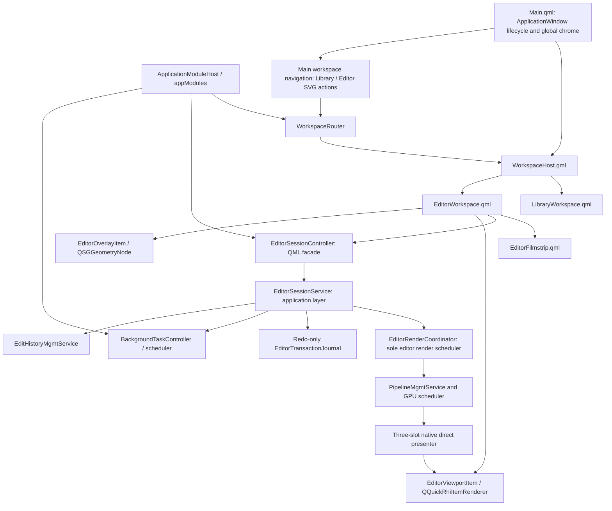

# QML Editor and Qt RHI Unified Workspace Refactor Plan

Date: 2026-07-16

Primary roadmap owner: `alcedo_studio/src/ui/alcedo_main`

Last revised: 2026-07-26 after completing Phase 6F Geometry panel and correcting its delayed
image-size and source-frame preview synchronization.

Affected areas:

- `alcedo_studio/src/ui/alcedo_main/qml`
- `alcedo_studio/src/ui/alcedo_main/editor_dialog`
- `alcedo_studio/src/include/ui/edit_viewer`
- `alcedo_studio/src/ui/edit_viewer`
- editor-facing application services, pipeline scheduling, edit history, and background tasks
- Windows CUDA/D3D11 and OpenCL/OpenGL interoperability
- macOS Metal presentation and EDR configuration

Status: planning. Product and architecture decisions were locked in a grill session on
2026-07-16. This is a replacement plan, not an incremental compatibility plan. The final product
has one QML editor architecture, no editor dialog, no QWidget viewer, no editor stub, and no
runtime fallback renderer.

## Outcome

Move the editor into the same application window as the library UI. The top-level QML scene owns a
`WorkspaceHost` that switches between a library workspace and an editor workspace. The editor keeps
a bottom filmstrip that collapses downward into a small persistent handle, accepts live search
results, and remains open with an empty-state prompt when no image is selected.

Library and Editor are two persistent choices in the main-window navigation. Double-clicking a
library image remains a shortcut that selects the image and activates Editor, but it is not the only
way to enter Editor. Editor does not own a separate “Back to Library” button. The editor desktop
keeps the established ordering: History/Versions rail on the left, image viewport in the center,
and adjustment controls on the right.

Replace the current broad `AlbumBackend` facade with an `ApplicationModuleHost` composition root,
exposed to QML as `appModules`. The host constructs modules in dependency order, owns their
lifecycle, and exposes typed module properties. QML behavior starts at a child module method; the
host does not mirror module state or forward module actions.

The image viewport becomes a `QQuickRhiItem`. Pipeline output remains GPU-resident and is presented
through the existing direct frame-sink API and a bounded three-slot native queue for all supported
backend pairs:

| Launch backend | Qt Quick graphics API | Pipeline backend | Native presentation path |
| --- | --- | --- | --- |
| `cuda` | Direct3D 11 | CUDA 12.8 | CUDA/D3D11 shared texture |
| `opencl` | OpenGL | OpenCL | OpenCL/OpenGL shared texture |
| `metal` | Metal | Metal | shared `MTLTexture` |

Backend selection is a startup decision. There is no UI hot-switch. Unsupported combinations fail
before the first `QQuickWindow` is created and report a concrete startup error.

The refactor preserves every current editor capability before cutover. It also replaces the current
close-and-save dialog lifecycle with timestamped edit commits, Version branches, recovery journaling,
and background save checkpoints. Leaving an image, leaving the editor workspace, or exiting the
application stores the current committed journal prefix before the transition continues. Explicit
Discard is a secondary action on the current filmstrip thumbnail's context menu only.

## Non-negotiable constraints

- Do not embed the existing `QWidget` editor with `createWindowContainer`, `QQuickWidget`, or a
  native child window.
- Do not retain `OpenEditorDialog`, the editor stub, `QtEditViewer`, `QRhiWidget`, or the legacy GL
  viewer after cutover.
- Do not add host-upload, CPU-copy, OpenGL-widget, or software-scene-graph fallback presentation.
- Do not allow QML to call storage, pipeline, or history infrastructure directly. UI code calls the
  application-service layer.
- Do not add editor state or editor actions to `AlbumBackend`. Replace it with
  `ApplicationModuleHost`, and invoke behavior through child module APIs.
- Do not inject `ApplicationModuleHost&`, a generic service locator, or a bag containing every
  service into a module. Inject the narrow typed dependencies that module actually needs.
- Do not add friend access between the host and controller modules. Existing friend-based shared
  state must be removed as each affected module is migrated.
- Do not share mutable renderer objects between the GUI thread, Qt Quick render thread, and pipeline
  workers.
- Do not create or destroy `QRhi` resources from the GUI thread when the threaded Qt Quick render
  loop is active.
- Do not expose a renderer/backend selector in QML. Backend selection happens before QML engine and
  window construction.
- Do not make Library-to-Editor navigation depend on double-clicking an image. The main-window
  navigation always exposes both workspaces, including Editor with no selected image.
- Do not add workspace-return buttons inside `EditorWorkspace.qml`. Workspace selection belongs to
  the shared main-window navigation.
- Do not reverse the established editor desktop. History/Versions stay on the left; adjustment
  controls stay on the right.
- Do not use visible words as the main affordance for workspace switching, panel switching,
  collapse/expand, close, reset-view, or filmstrip dock controls. These structural actions use SVG
  icons with localized tooltips and accessible names. Text remains for actual content, values,
  errors, and places where an icon alone would be ambiguous.
- Do not let adjustment panels, viewport input handlers, image loading code, or history modules call
  the pipeline scheduler independently. They submit typed render intents to one editor render
  coordinator; that coordinator is the only production owner of editor render scheduling.
- Opening an image always creates an initial render intent. First-frame rendering must not depend on
  an adjustment change, zoom, pan, or any other later interaction.
- Do not cut over with a reduced editor. Tone, Look, Display Transform, Geometry, RAW Decode,
  crop/rotate, zoom/pan, ROI/detail patch, LUT browsing, history/versioning, histogram/waveform,
  export, and editor shortcuts are all required.
- Do not name a test, target, file, or document with the repository-banned vague test term.
- Use concrete operation names such as read, load, populate, apply, drag, pinch, input sequence,
  pointer release, or settled edit. External framework identifiers that require exact spelling must
  remain isolated at their call sites and must not spread into Alcedo-owned API names.

Intermediate phases may coexist with the old implementation on the development branch so the work
can compile, but they are not separate product modes. No backend flag may select old versus new UI.
The final phase removes the old implementation in the same change that enables the new production
entrypoint.

## Feasibility conclusion from Qt documentation

The refactor is feasible on Qt 6.9.3, with one important qualification: ordinary Qt Quick rendering
solves the embedded RHI viewport, but dynamic whole-window HDR requires application ownership of the
top-level swapchain.

### What Qt supports directly

- [`QQuickRhiItem`](https://doc.qt.io/qt-6.9/qquickrhiitem.html) is the Qt Quick counterpart of
  `QRhiWidget`. It renders into an offscreen color buffer and participates as a normal `QQuickItem`,
  so QML layout, clipping, opacity, stacking, and overlay composition work normally. Qt 6.9 supports
  RGBA8, RGBA16F, RGBA32F, and RGB10A2 color buffers.
- [`QQuickRhiItemRenderer`](https://doc.qt.io/qt-6.9/qquickrhiitemrenderer.html) owns render-thread
  state. `initialize()` must rebuild resources after RHI, render-target, sample-count, or size
  changes; `render()` records its own pass against the item's render target. Qt marks this renderer
  API preliminary, so the integration must stay isolated and version-pinned.
- The standard Windows D3D11 and macOS Metal Qt Quick render loops are threaded. GUI-thread item
  state must be copied into render-thread state only at the scene graph synchronization point. See
  [Qt Quick Scene Graph](https://doc.qt.io/qt-6.9/qtquick-visualcanvas-scenegraph.html).
- [`QQuickWindow::setGraphicsApi`](https://doc.qt.io/qt-6.9/qquickwindow.html) must be called before
  the first Qt Quick window. This matches Alcedo's startup-only backend decision and requires moving
  CUDA adapter selection out of `QtEditViewer` construction.
- Qt Quick pointer handlers separate input behavior from visual items. `HoverHandler`,
  `DragHandler`, `PinchHandler`, `WheelHandler`, and `TapHandler` cover the editor's mouse, trackpad,
  touch, and stylus entrypoints. See
  [Qt Quick Input Handlers](https://doc.qt.io/qt-6/qtquickhandlers-index.html).
- A custom `QQuickItem::updatePaintNode()` can maintain `QSGGeometryNode` content on the render
  thread. This is the appropriate path for crop masks, grids, handles, ROI outlines, and other
  frequently changing vector overlays. See the
  [custom scene graph material example](https://doc.qt.io/qt-6.9/qtquick-scenegraph-custommaterial-example.html).

### What requires an Alcedo render host

- [`QRhiSwapChain`](https://doc.qt.io/qt-6/qrhiswapchain.html) exposes SDR,
  `HDRExtendedSrgbLinear`, HDR10, and `HDRExtendedDisplayP3Linear`, but the format is intended to be
  selected before the first `createOrResize()`.
- The standard Qt Quick render loop owns its swapchain. `QQuickWindow::swapChain()` exposes it for
  inspection, but Qt 6.9 has no public, high-level API for repeatedly changing the owned
  swapchain between SDR and HDR while the window is live.
- [`QQuickRenderControl`](https://doc.qt.io/qt-6/qquickrendercontrol.html) lets an application drive
  the Qt Quick scene into an application-controlled render target. Together with
  [`QQuickGraphicsDevice::fromRhi()`](https://doc.qt.io/qt-6/qquickgraphicsdevice.html), Alcedo can
  use one application-owned `QRhi`, render the complete QML scene to a linear 16-bit-float target,
  and perform the final SDR/HDR output pass into its own swapchain.

Qt's QRhi APIs have limited source and binary compatibility guarantees and require `Qt6::GuiPrivate`.
The editor must therefore pin the supported Qt minor version to 6.9.3, compile all RHI integration in
CI, and treat a Qt minor upgrade as an explicit port with the full GPU harness.

### Qt Quick/RHI lifecycle rules inherited by every later phase

These rules are mandatory for Phase 5D onward. They are derived from Qt's
[RHI Texture Item example](https://doc.qt.io/qt-6/qtquick-scenegraph-rhitextureitem-example.html),
which is the production viewport pattern, and the
[RHI Under QML example](https://doc.qt.io/qt-6/qtquick-scenegraph-rhiunderqml-example.html),
which defines the same synchronization and scene-graph invalidation boundaries. A later phase may
not weaken them for convenience.

- Treat `QQuickRhiItemRenderer::initialize()` as a repeatable render-thread callback, not as a
  constructor. Qt may call it again after geometry, color-buffer, sample-count, render-target, RHI,
  or window changes. Compare the current `QRhi`, render target, format, and sample count with the
  previously observed values and rebuild only the resources that actually depend on what changed.
- Never clear a pending producer request, invalidate the direct-present queue, cancel an image
  generation, or release a valid imported frame merely because `initialize()` ran again. Queue or
  generation invalidation must come from an explicit image/session/lifecycle transition. This rule
  prevents `initialize()` from erasing a native-target request immediately before `render()` can
  fulfill it.
- Copy GUI-owned item state into renderer-owned state only in `synchronize()`. The renderer uses
  that snapshot for the complete frame and must not read mutable QML/controller objects from
  `initialize()` or `render()`. GUI state and renderer state are separate even when a platform uses
  a single-threaded render loop.
- Create, import, use, and destroy every `QRhiResource` and native-texture QRhi wrapper on the Qt
  Quick scene-graph render thread. `EditorViewportItem` and pipeline workers may own only thread-safe
  queue state, generation values, metadata, and native producer handles; they never own a QRhi
  wrapper.
- Let `QQuickRhiItem` own its scene-graph node and offscreen render target. Do not override its
  `updatePaintNode()` for photograph presentation, inject photograph commands into the window's
  main render pass, or replace its separate texture pass with the underlay example's swapchain path.
  The underlay example is a threading/lifecycle reference here, not the viewport architecture.
- Call `QQuickItem::update()` only on the GUI thread. A pipeline worker requests it through a queued
  GUI-thread invocation. A GUI-thread caller must never wait for a render pass that can start only
  after the current GUI event returns. Continuous animation, when genuinely required, uses the
  renderer's update mechanism; ordinary editor frames stay producer-driven.
- Renderer existence, plus an explicit item/window lifecycle request, defines whether the direct
  presenter consumer is available. `QWindow::isExposed()` alone is not proof that the item's
  renderer exists. Re-enable the consumer only after the next `synchronize()` acknowledges the
  live renderer.
- Connect render-thread lifecycle callbacks such as `sceneGraphInvalidated` with
  `Qt::DirectConnection` when they must release native resources or wake producers before Qt tears
  down the scene graph. Such callbacks may touch only thread-safe presentation state and
  render-thread-owned resources; GUI notifications are queued separately.
- On hide, minimize, workspace Loader deactivation, window change, renderer destruction, project
  close, and application shutdown, mark the consumer unavailable before releasing QRhi/native
  resources. Wake every target wait with an explicit lifecycle result. Then cancel the pipeline
  token and wait until the matching session worker has stopped using `IFrameSink` before QML
  destroys `EditorViewportItem`.
- Store and disconnect only connections created by `EditorViewportItem`. Never use a blanket
  `disconnect(window, nullptr, item, nullptr)`, because that can remove private scene-graph cleanup
  connections installed by `QQuickRhiItem` itself.
- Import a native texture only after producer completion synchronization on the matching graphics
  device. Apply the backend's required native layout/state after `createFrom()`, matching the proven
  `RhiEditViewerSurface` path. A failed device match, import, or layout transition is a hard backend
  error rather than a black placeholder or host-upload fallback.
- Keep a QRhi wrapper alive for the entire command-buffer read and recycle its native slot only
  after the renderer has completed that read. Scene composition acknowledgement, pipeline
  completion, and slot reuse remain three distinct events.

Every phase that changes QML visibility, Loader ownership, viewport geometry, render scheduling,
native resource import, overlays, scopes, window state, or application shutdown must run the native
GPU lifecycle cases before it can be marked complete: first presentation with pixel readback,
repeated `initialize()`, resize/DPR churn, hide/show, minimize/restore, scene-graph recreation,
rapid image/workspace switching, and shutdown with a producer waiting for a target.

## Current architecture and why it cannot be embedded as-is

The active path is:

```text
ThumbnailGridView / ThumbnailListView
  -> AlbumBackend::OpenEditor
  -> EditorController::OpenEditor
  -> OpenEditorDialog
  -> modal EditorDialog::exec()
  -> QtEditViewer QWidget
  -> RhiEditViewerSurface QRhiWidget
```

The relevant editor and viewer trees contain roughly 24,000 lines. The difficulty is not the dialog
window flag; it is that windowing, pipeline scheduling, native texture allocation, overlays, input,
scopes, history, and save lifecycle currently meet inside QWidget-oriented objects.

Specific blockers:

- `QtEditViewer` is both a `QWidget` and an `IFrameSink`. It owns a `QRhiWidget` surface plus a
  separate QWidget/QPainter overlay.
- `RhiEditViewerSurface` creates native targets and releases imported RHI textures from the widget
  lifecycle. Under Qt Quick, equivalent RHI resources belong exclusively to the scene graph render
  thread.
- `IFrameSink` exposes synchronous `EnsureSize`, map, unmap, and notify calls. CUDA and OpenCL
  pipeline code assumes the target can be resized and mapped from worker execution. A threaded
  scene graph cannot safely honor that synchronous behavior directly.
- `EditorRenderCoordinator` and `EditorFrameManager` hold concrete `QtEditViewer`, spinner, and scope
  widget types. They must be split at service/model boundaries, not wrapped in QObjects unchanged.
- `EditorDialog` builds Tone, Look, Display Transform, Geometry, RAW Decode, LUT, versioning, and
  scope widgets imperatively. Reusing the widget composition would preserve the old architecture.
- `Main.qml` is already a large layout owner. Adding an editor branch directly would make it the
  application router, library layout, editor layout, and global-window implementation at once.
- `AlbumBackend` currently mirrors a large number of child-module properties and actions, stores
  shared mutable state for helpers, and forwards calls such as `OpenEditor`. Adding another editor
  facade to it would turn the composition root into the editor's service locator.
- CUDA-to-D3D adapter configuration currently occurs during viewer construction, after the QML
  window can already have initialized a different adapter.
- The macOS color manager finds a `CAMetalLayer` in the widget window and changes its color space,
  `wantsExtendedDynamicRangeContent`, and EDR metadata. In the unified window that layer belongs to
  the whole QML scene, so the behavior must be made an explicit whole-window display state.

The reusable parts are the pure geometry/controllers, pipeline adapters, edit-history services,
scope analyzers, LUT catalog logic, and the image-rendering shader/pipeline behavior. Reuse these by
moving them behind clean interfaces; do not preserve their QWidget ownership graph.

## Decisions locked in the grill session

### Workspace and navigation

- `Main.qml` becomes a thin application-window shell.
- `ApplicationModuleHost` replaces `AlbumBackend` as the process-local UI module composition root
  and is exposed to QML as `appModules`.
- `WorkspaceHost.qml` owns workspace layout and lazy loading.
- A C++ `WorkspaceRouter` owns the route (`Library` or `Editor`) and route arguments; it does not
  perform pixel layout.
- The main-window navigation contains persistent Library and Editor SVG actions. It is owned by
  `Main.qml` / `WorkspaceHost.qml`, remains visible in both workspaces, and shows the active choice.
- Activating Editor without an image is valid. Double-clicking a library image sets the focused
  image and activates Editor in one action.
- `EditorWorkspace.qml` contains no “Library” or “Back to Library” button. Returning to Library uses
  the same main navigation as entering Editor.
- `LibraryWorkspace.qml` contains the extracted current album/library surface.
- `EditorWorkspace.qml` contains the editor toolbar, central viewport, control panels,
  scopes/history, and bottom `EditorFilmstrip.qml`.
- The editor desktop order is left History/Versions SVG rail and flyout, center viewport/filmstrip,
  and right scope plus adjustment stack. The right adjustment stack keeps its panel navbar rather
  than replacing it with a single placeholder or a long text explanation.
- Structural controls use SVG icons and visual state. Their localized words live in tooltips,
  accessible names, and tests, not as permanent labels consuming editor space.
- The filmstrip collapses downward. Collapsed state leaves a small focusable handle showing the
  current position/count and background-save state, expands the viewport into the released space,
  and does not destroy the filmstrip model or current image session. The preference survives
  workspace switches and is restored when the application reopens.
- Entering the editor unloads the library workspace's expensive visual tree. Shared backend models
  may remain alive where project services require them.
- The editor can be opened without a selected image. It shows a centered localized prompt equivalent
  to “Select an image to edit”, an empty viewport, disabled adjustment controls, and a filmstrip that
  can later receive search results.
- The editor supports global search. A search replaces the filmstrip with the live search element
  list and focuses the selected result. Changing ordinary library filters requires returning to the
  library workspace.
- If a live search update removes the current image, the editor seals and autosaves its transaction,
  selects the nearest surviving element by prior index, or enters the empty state if none survive.

### Overlay and input

- `EditorViewportItem : QQuickRhiItem` renders only the photograph layers.
- `EditorOverlayItem : QQuickItem` produces retained `QSGGeometryNode` content for crop mask/grid,
  crop border/handles, ROI/detail bounds, guides, and selection outlines.
- Existing `ViewportMapper`, `CropGeometry`, `CropInteractionController`,
  `ViewTransformController`, and `EditViewerOverlayGeometry` logic is retained only after removing
  QWidget dependencies and proving coordinate parity.
- Pointer handlers live in QML and call a small typed input/controller surface. Ordinary QML renders
  labels, buttons, spinner/status, contextual help, and focus indication.
- Overlays are not baked into the photograph RHI pass. This preserves QML stacking and keeps HDR
  image encoding independent from UI geometry.

### Save, journal, and version semantics

The authoritative target design and implementation breakdown are defined in
[Phase 6C Mini-Git History and Pipeline Snapshot Plan](phase_6c_mini_git_history_and_pipeline_snapshot_plan.md).
The earlier
[Editor History Durability and Version Transfer Design](editor_history_durability_and_version_transfer_design.md)
records the completed Phase 5 implementation but no longer defines the target Version model,
checkout, Paste/Merge, locking, or journal truncation semantics.

- Editing is autosave-first. There is no primary Save/Cancel dialog workflow.
- `Version` is a stable named branch/ref. `HEAD` identifies the checked-out Version, and the ref
  points to an immutable edit commit.
- An edit commit has one ordered parent; a merge commit has the current head as first parent and the
  incoming root-relative branch as second parent. A high-resolution timestamp is part of the commit
  object and hash.
- A finalized edit command creates one commit. Slider samples during a drag modify only the live
  pipeline; pointer release or an idle boundary appends the commit to the recovery journal and folds
  the live pipeline's incremental transaction-chain hash.
- The pipeline is not hashed from params JSON, cache policy, GPU handles, launchers, or scheduler
  state. The root ID and ordered commit hashes are the integrity input.
- Undo moves the working head to its first parent. Redo follows the in-memory redo path. Editing
  after undo clears that path and creates a new child on the same Version. Undo and Redo append
  reflog-like head-move recovery records; they do not create edit commits.
- One global editor save lock serializes materialization. While a save checkpoint is active,
  filmstrip selection, workspace switching, Version checkout, Paste, and Merge are disabled through
  `InteractionPolicyController`.
- Image B does not begin loading until image A's save checkpoint finishes. The earlier overlapping
  save/load target is superseded.
- One DuckDB transaction inserts journaled commit objects, moves the active Version head, stores the
  matching serialized pipeline state, and advances recovery metadata.
- After DuckDB succeeds, the saved journal prefix is truncated. Recovery uses the stored
  materialized head to ignore a prefix left behind by interruption between database commit and
  truncation.
- Checkout validates root ID, head commit hash, and transaction-chain hash. A stale stored pipeline
  projection is rebuilt from the immutable root and first-parent chain.
- `thumbnail_service.cpp` consumes the saved projection and does not duplicate editor history
  validation.
- Paste creates and checks out a new branch from the target image root. Merge creates a two-parent
  commit whose complete per-field result comes from UI conflict resolution.
- Clean project exit removes commit objects unreachable from every Version head through either
  parent.
- Explicit Discard exists only in the current editor-filmstrip thumbnail context menu and is enabled
  only for an unmaterialized current commit. Once a save checkpoint advances the Version, the user
  returns through Version history.

### HDR and display state

- The application initially uses the standard Qt Quick render loop while the QML editor is built.
- Existing macOS system-API EDR behavior must remain available. The macOS development environment is
  currently unavailable, so implementation and feasibility qualification are deliberately deferred
  to the dedicated phase immediately before the final HDR/cutover phase. Production cutover cannot
  proceed until that phase passes.
- Application-owned QRhi/swapchain rendering is the final implementation phase.
- HDR selection is image/editor state. Entering an HDR edit, changing to an HDR/SDR image, leaving the
  editor, or disabling HDR requests a whole-window display-mode transition.
- The transition may freeze the last completed frame, wait for GPU idle, rebuild presentation, and
  briefly show black. The target is no more than 250 ms on supported hardware.
- Recreating the native top-level window is permitted when the platform requires it, but window
  geometry, screen, maximized/fullscreen state, workspace, focused image, journal generation, and
  focus must be restored.
- Windows OpenCL/OpenGL is tested for a true HDR swapchain. If
  `QRhiSwapChain::isFormatSupported()` reports that the active screen/backend cannot create it,
  Alcedo performs the product-defined HDR-to-SDR display transform in the same renderer. This is a
  display policy, not a renderer fallback.

## Target architecture



### Responsibility boundaries

`ApplicationModuleHost`:

- replaces `AlbumBackend` and acts only as the module composition root;
- creates application services and UI modules in a documented dependency order;
- exposes typed constant module properties such as `workspaceRouter`, `editorSession`, `search`,
  `backgroundTasks`, `interactionPolicy`, and library modules;
- contains no forwarding `Q_INVOKABLE` actions and no mirrored module-specific adjustment,
  thumbnail, search, import/export, AI, or editor properties;
- stops new intents, drains/cancels tasks by policy, and destroys modules in reverse dependency order;
- connects optional cross-module notifications with signals, while required synchronous
  collaboration uses narrow constructor-injected interfaces;
- does not give modules a pointer/reference back to the host and does not act as a service locator.

Each module owns its QML-facing properties, signals, and invokables. For example, QML calls
`appModules.workspaceRouter.openEditor(...)` and `appModules.editorSession.undo()`, never
`appModules.openEditor(...)` or a host forwarding wrapper.

`WorkspaceRouter`:

- owns route and route arguments;
- accepts “open editor”, “return to library”, and global-search navigation intents;
- never owns panel sizes or image-edit state.

`WorkspaceHost.qml`:

- lays out global chrome and the active workspace;
- uses `Loader` so inactive expensive trees are destroyed;
- restores focus deliberately after route changes.

Main workspace navigation:

- is part of shared window chrome, not part of LibraryWorkspace or EditorWorkspace;
- always exposes Library and Editor with SVG actions and a clear active state;
- lets Editor open without an image and removes the need for an editor-local return button;
- keeps localized tooltips, accessible names, and keyboard focus even though visible labels are
  minimized.

`EditorSessionController`:

- is a QML-facing QObject facade with typed properties and invokables;
- exposes current element, loading/empty/error state, adjustment models, history, scope models,
  filmstrip model, and interaction capabilities;
- does not own pipeline guards, database transactions, native textures, or worker threads.

`EditorSessionService`:

- is the application-layer owner of the active image session;
- acquires the live pipeline snapshot and checked-out Version ref, applies typed adjustment patches,
  sequences generations, and coordinates commits, save checkpoints, checkout, switch, and recovery;
- calls existing application services rather than allowing UI code to reach storage directly;
- registers save/load/render operations with the background-task system and publishes the global
  editor save lock plus explicit interaction capabilities.

`EditorRenderCoordinator`:

- is the only production component allowed to enqueue editor work on `PipelineScheduler` or the
  corresponding `PipelineMgmtService` entrypoint;
- accepts typed intents for initial frame, interactive adjustment, settled adjustment, zoom/pan,
  viewport resize, detail refresh, undo/redo, image switch, and explicit retry;
- owns request priority, replacement of outdated pending work, quality timing, image/session/view
  generations, cancellation, and frame-delivery status;
- attaches the active session's presentation sink before issuing its first render and submits all
  completed frame roles through the same frame-routing path;
- does not know QML controls, QWidget, `QtEditViewer`, or dialog-owned spinner widgets;
- exposes immutable state/results to `EditorSessionService`; individual UI modules never receive a
  pipeline or scheduler pointer.

`EditorTransactionJournal`:

- appends complete timestamped edit commits with expected/result transaction-chain hashes;
- supports replay from the stored Version head and direct truncation after a successful DuckDB
  materialization;
- never records intermediate slider samples or renderer-only state such as zoom/pan.

Direct presenter:

- preserves the existing `IFrameSink` `EnsureSize`, map, unmap, and ready notification sequence;
- owns a bounded three-slot native target queue shared by pipeline workers and the render thread;
- carries backend, pixel format, dimensions, target generation, image render generation, native
  handle, frame role, presentation mode, and ROI metadata;
- keeps the newest compatible ready frame and recycles older undisplayed frames;
- rejects stale detail patches and frames after resize, image switch, or target recreation;
- returns slot ownership only after producer writing and QRhi reading have each finished.

`EditorViewportRenderer`:

- lives only on the scene graph render thread;
- creates imported `QRhiTexture` wrappers, render pipelines, SRBs, uniform buffers, and samplers;
- rebuilds all dependent resources from `initialize()` when RHI, render target, size, format, or
  sample count changes;
- renders InteractivePrimary, QualityBase, and DetailPatch layers with the current zoom, pan,
  letterbox, and ROI rules;
- consumes only the newest completed frame compatible with the current target and image generation.

## Startup backend requirements

Add a startup parser before `QQmlApplicationEngine` and before any QML type can construct a window.
Use one explicit argument, for example:

```text
alcedo_main --editor-backend=cuda
alcedo_main --editor-backend=opencl
alcedo_main --editor-backend=metal
```

The exact spelling may follow the existing command-line parser, but the semantics are fixed:

- `cuda` is Windows-only, requires the project's CUDA 12.8 driver/device policy, selects the
  matching CUDA adapter LUID, and calls `QQuickWindow::setGraphicsApi(Direct3D11)` before loading
  QML.
- `opencl` is Windows-only for this plan, verifies the required OpenCL/GL sharing extensions,
  configures the process-wide OpenGL surface/share context, and selects
  `QQuickWindow::setGraphicsApi(OpenGL)` before loading QML.
- `metal` is macOS-only and selects Metal before loading QML.
- An unavailable build feature, invalid platform pair, adapter mismatch, or missing interop extension
  is a startup failure with detected adapter/backend details. It does not silently choose another
  pair.
- Production packaging chooses a documented default, but CMake adds developer launch targets for
  each built backend so CUDA and OpenCL are one command apart during development.

## Image switch state machine

Filmstrip and live-search switching serialize save then load through the global editor save lock,
but the GUI thread never waits on file or DuckDB I/O.

```text
Focused(image A)
  -> finalize the open edit command
  -> start A save checkpoint and disable editor navigation
  -> materialize A commits, Version head, serialized pipeline state, and recovery metadata
  -> truncate A journal and return A's live pipeline snapshot
  -> invalidate A render generation and finish the save checkpoint
  -> acquire or rebuild B's live pipeline snapshot
  -> validate B root, head, and transaction-chain hash
  -> request B interactive preview
  -> publish B only when its metadata and first compatible frame are ready

B load/render does not start before A's save checkpoint completes. Stale A frames, scope results,
thumbnail completions, and journal completions still carry A identity and generation and cannot
mutate B.
```

If the next element is removed before it becomes active, cancel that generation and resolve the new
nearest element. If the list becomes empty, keep EditorWorkspace open, complete the prior save, and
enter the empty state.

## Phased implementation plan

Each phase has a hard acceptance gate. A phase is not complete because code exists; its named tests,
thread/lifetime assertions, and platform checks must pass.

### Phase 0 - Windows executable requirements and feasibility harness

Status: **implemented and verified on Windows** (2026-07-16). Maintained targets:
`EditorRhiHarness`, the editor RHI invariant unit suite, `run_editor_rhi_harness_cuda`,
`run_editor_rhi_harness_opencl`.

Verified on NVIDIA GeForce RTX 3080 Laptop GPU:
- `EditorRhiHarness --editor-backend=cuda --case=direct-presentation` (pixel error 0)
- `EditorRhiHarness --editor-backend=opencl --case=direct-presentation` (pixel error 0)
- CUDA cases: resize-churn, hide-show, minimize-restore, renderer-recreation, hdr-format-query
- OpenGL HDR probe (Phase 10 input): SDR supported; HDRExtendedSrgbLinear/HDR10/P3Linear false
  on this display/backend path
- editor RHI invariant unit suite (9 tests) passed

The experimental Metal target interface is not a production architecture commitment; Phase 9 must
implement Metal behind the Phase 5C direct presenter after hardware feasibility is verified.
Production `alcedo_main` entrypoint is intentionally unchanged in Phase 0.

Deliverables:

- Add a maintained `EditorRhiHarness` executable using a real `QQuickWindow` and minimal
  `QQuickRhiItem`.
- Add startup backend parsing and diagnostics without changing the production editor entrypoint.
- Move CUDA adapter discovery into a pre-window helper and prove the Qt D3D11 device uses the same
  adapter as CUDA.
- Prove OpenCL/GL shared-texture creation, acquire/release synchronization, and render-thread context
  ownership with the Qt Quick threaded render loop.
- Exercise RGBA32F viewport rendering, resize, device-pixel-ratio change, hide/show,
  minimize/restore, renderer recreation, and application shutdown on both Windows backend pairs.
- Record Windows OpenGL `isFormatSupported()` results for HDR on representative NVIDIA, AMD, HDR,
  and SDR display configurations. This is input for Phase 10, not a reason to switch renderers.
- Create deterministic fixtures: FP32 gradient, checkerboard, ROI patch, odd-sized image, and a small
  real RAW project fixture.
- Record the native information a future Metal direct-present slot requires, but do not claim Metal
  feasibility while the macOS environment is unavailable. Metal implementation and qualification
  are Phase 9 and must follow the Phase 5C presenter shape.

Acceptance:

- CUDA/D3D11 and OpenCL/OpenGL display the generated FP32 frame through native interop with no host
  presentation copy.
- Backend/adapter mismatch is detected before QML window creation.
- Repeated resize and renderer recreation produce no stale import, deadlock, or native-resource leak.
- The harness reads back the pre-composition viewport result and compares expected pixels within a
  documented floating-point tolerance.

### Phase 1A - ApplicationModuleHost composition root

Deliverables:

- Replace the `AlbumBackend` class and QML context name with `ApplicationModuleHost` / `appModules`.
- Move module-specific Q_PROPERTY, signals, invokables, state, and behavior to their owning modules.
- Expose typed constant module properties from the host; do not expose a generic `QObject*` bag when
  the concrete QML type can be registered.
- Define a construction graph for project lifecycle, library, folders, thumbnails, search, tasks,
  interaction policy, AI, import/export, workspace routing, and editor session modules.
- Give every module a narrow constructor signature containing only its required application services
  and collaborator interfaces. Do not pass the host or a universal dependency bundle.
- Replace required cross-module friend access with injected interfaces. Use Qt signals for optional
  notifications that do not require a synchronous answer.
- Define reverse-order shutdown: stop accepting QML intents, request task shutdown by policy, flush
  required journals/project writes, disconnect modules, then destroy services.
- Update QML call sites to begin behavior at child modules, for example
  `appModules.workspaceRouter.openEditor(...)`.

Acceptance:

- `ApplicationModuleHost` contains lifecycle/composition code and typed module accessors only.
- It has no forwarded module actions and no mirrored module-specific state.
- No migrated module declares the host or another controller as a friend.
- Module unit tests construct the module with fakes without constructing the host, QML engine,
  project, or unrelated modules.
- Construction and shutdown order are covered by a deterministic lifecycle test.

### Phase 1A-Fix

审核范围是 `28f75d15..56b92f43`。忽略换行符和纯空白变化后，实际代码变化约为
4,858 行增加、4,004 行删除。`alcedo_main`、`alcedo_tests_ui` 和
`AlbumBackendCiWorkflowTest` 均能编译；本次改动相关的 105 个可运行测试全部通过，另有
4 个测试因为缺少外部项目或 Metal 环境而跳过。常用的项目、导入、文件夹、删除、评分、
缩略图和搜索流程目前没有发现普遍退化，但下面的问题仍需修正后才能把 Phase 1A 标为完成。

- `ImageController::DeleteTargets()` 中“导入仍在运行”的判断写成了
  `ie && ie->current_import_job() && !ie && ...`。前面已经要求 `ie` 有值，后面又要求
  `ie` 没有值，所以这个分支永远不会执行。`DeleteImages()` 从 QML 进入时通常还会先经过
  `InteractionPolicyController`，因此普通界面操作不一定马上暴露问题；但是
  `NikonHeRecoveryController` 等 C++ 调用者会直接调用 `DeleteTargets()`，可以绕过前一层
  检查。应恢复原来的 `!ie->current_import_job()->IsCancelationAcked()` 判断，并增加一个测试：
  导入尚未结束时，从直接 C++ 入口删除图片必须被拒绝，导入确认取消后才允许删除。

- 退出处理没有完成 Phase 1A 计划中写明的步骤。`ShutdownModules()` 先清除了数据库写入
  屏障的回调，却没有调用 `image_analysis_sink_->FlushPendingWrites()`；如果导出仍占用屏障，
  图片分析结果会留在内存队列中，随后随对象销毁而丢失。这里也没有调用
  `background_tasks_->CancelAll()`，没有按照每个任务的退出规则等待结束，也没有等待模型
  下载、模型启用、图片分析和导出真正停止。应先拒绝新的界面操作，再按任务各自的规则取消
  或等待，释放数据库写入屏障，写完排队的数据，最后保存和打包项目。需要增加“导出占用
  屏障时图片分析完成并立即退出”和“每种后台任务仍在运行时退出”的测试，确认数据已经写入，
  回调不会在模块销毁后执行。

- 新增的创建和销毁顺序测试没有观察真实对象。测试只读取
  `ConstructionOrder()` 返回的固定字符串，再把这组字符串倒过来比较；即使构造函数和成员
  声明已经写错，测试仍然会通过。当前就有一个实际不一致：构造时先创建
  `AiProviderProfileController`，再创建 `SemanticGenerationController`，但头文件中的成员声明
  顺序相反，C++ 销毁成员时会先销毁 `AiProviderProfileController`，而
  `SemanticGenerationController` 仍保存着指向它的指针。应调整成员声明或显式按正确顺序释放，
  并让测试通过真实对象的创建、停止和 `destroyed` 事件记录顺序，不能再用固定字符串代替。

- `ApplicationModuleHost` 暴露给 QML 的 16 个模块属性全部声明成了 `QObject*`。这与 Phase 1A
  要求的具体模块类型不符，也让 QML 工具无法在编译时检查 `appModules.project`、
  `appModules.library` 等对象上是否真的存在某个属性或方法。应注册这些具体 C++ 类型，并把
  `Q_PROPERTY` 和读取函数改成对应的具体指针类型。增加一个检查，读取每个属性的类型名称，
  防止以后又退回 `QObject*`。

- 原来的集中访问方式并没有真正拆开，只是从 `AlbumBackend` 转移到了 `ProjectModule`。
  `ProjectModule::BindCollaborators()` 一次接收七个其他模块，并公开这些模块的读取函数；
  `ProjectHandler` 再通过 `ProjectModule` 取得 library、folders、stats、editor、import/export、
  semantic generation 和 model download。这样 `ProjectHandler` 仍然可以接触几乎全部界面模块，
  单个模块也仍然必须等其他模块全部创建后再补指针。应把每项操作需要的少量接口直接传给
  使用者，例如项目打开后的通知、界面状态提示和语义标签读取分别使用小接口或 Qt 信号，删除
  `ProjectModule` 上为其他模块转发的读取函数和方法。

- “模块可以用假对象单独测试”这一项没有完成。项目、文件夹、图片、导入导出、图库、统计和
  搜索测试仍然都先创建完整的 `ApplicationModuleHost`，会同时创建项目服务、模型服务和所有
  无关模块。现有测试只能证明整组对象放在一起时能工作，不能证明构造函数只要求了真正需要的
  对象。应至少为 `ProjectModule`、`LibraryModule`、`FolderController`、`ImageController`、
  `ImportExportHandler`、`StatsEngine` 和 `SearchController` 各增加直接构造测试，使用小型假对象
  验证输入、状态变化和信号，不创建 `ApplicationModuleHost`。

- `application_module_host.cpp` 仍包含约四百多行与对象创建无关的功能，包括 EXIF 文本整理、
  AI sidecar 启动、分析结果写数据库、评分更新和搜索刷新。虽然这些代码写在几个内部类里，
  它们仍让这个文件同时负责对象创建和具体业务。应把图片分析环境和结果写入实现移到独立文件，
  `ApplicationModuleHost` 文件只保留创建、连接、停止和销毁对象的代码。

- Phase 1A 的交付项写明创建关系应包含 `workspaceRouter` 和 `editorSession`，当前主机没有这两个
  属性或对象。现在 QML 仍调用 `appModules.editor.OpenEditor()`，进入的还是旧
  `EditorController` 和旧对话框流程。如果这两项确实要到 Phase 1B 和后续编辑器阶段才实现，
  应先修改 Phase 1A 的交付说明，避免把未实现内容记为完成；否则应在 Phase 1A 补齐这两个模块
  的最小接口、创建顺序和测试。

- 一些 QML 组件仍保留了同时兼容新旧入口的判断。例如 `GlobalSearchDialog.qml` 会在
  `backend.search` 与 `backend.searchController` 之间选择，`AdvancedContentAnalysisDialog.qml`
  会在 `backend.images` 与 `backend` 之间选择，`CollectionsPanel.qml` 也同时接受主机和文件夹
  模块。这会继续允许把整个 `appModules` 传给子组件，也容易让旧调用方式悄悄回来。应让这些
  组件只接收自己需要的模块，例如只传 search、interactionPolicy、images 或 folders，并删除
  旧入口判断。

- 这次修改替换了约 260 处 QML 调用，但测试只实际加载了 `GlobalSearchDialog.qml`，没有测试
  完整的 `Main.qml`。C++ 测试通过不能发现主窗口中属性名称写错、信号接到错误模块、弹窗打开
  后才访问到不存在方法等问题。应增加一个可见窗口测试，使用真实 `ApplicationModuleHost`
  加载 `Main.qml`，至少走完项目打开、文件夹切换、缩略图更新、导入状态、导出状态、图片检查、
  搜索弹窗、设置弹窗和编辑入口，并把 QML warning 当作测试失败。

- 38 个本来只需要少量修改的源文件、QML 文件和测试文件被整体改成了 CRLF。结果是普通 diff
  显示 23,609 行增加、22,755 行删除，`git diff --check` 也会把这些行尾报告成空白问题；这正是
  本次改动看起来超过两万行的主要原因，也掩盖了真正的代码变化。应在提交修复前恢复仓库原有
  行尾，只保留实际修改，并去掉这次顺带加入的重复自包含头文件。清理后重新运行
  `git diff --check`，结果必须为空。

### Phase 1B - Thin Main and workspace shell

**Status: complete (2026-07-17).** Phase 1B-Fix closed the review gaps below.

Deliverables:

- Extract the current library body from `Main.qml` into `LibraryWorkspace.qml` without changing its
  behavior.
- Add `WorkspaceHost.qml` and the `WorkspaceRouter` module.
- Reduce `Main.qml` to application-window lifecycle, frameless/native window chrome, global
  shortcuts, global dialogs/toasts, and `WorkspaceHost` construction.
- Add `EditorWorkspace.qml` with toolbar regions, central empty viewport slot, inspector/scope slots,
  and a bottom filmstrip dock slot.
- Define the downward-collapse geometry and persistent handle behavior for the filmstrip dock.
- Add the no-image empty state and focus/accessibility order.
- Route grid/list double-click through `appModules.workspaceRouter` rather than a modal editor method.
- Define lazy-load and teardown rules for both workspaces.

Acceptance:

- Library layout and behavior remain pixel/functionally equivalent after extraction.
- Routing can open an empty editor, open an editor focused on an element, and return to the library.
- The filmstrip slot collapses downward, releases its height to the viewport, and leaves its handle
  keyboard- and pointer-accessible.
- Repeating workspace switches does not grow the QML object count or retain inactive visual trees.
- `Main.qml` contains no library/editor panel layout decisions.

Implementation notes:

- `Main.qml` is the application shell (window chrome, global dialogs, shortcuts, overlays).
- `WorkspaceHost.qml` lazy-loads exactly one of `LibraryWorkspace.qml` / `EditorWorkspace.qml`
  via mutually exclusive `Loader`s so inactive trees are destroyed.
- `EditorFilmstrip.qml` owns the collapsible dock + persistent handle; collapse state and expanded
  height persist through `EditorSessionController` (`QSettings` keys
  `editor/filmstripCollapsed`, `editor/filmstripExpandedHeight`).
- `WorkspaceRouter::OpenEditor` / `OpenLibrary` drive route state only. `EditorSessionController`
  tracks session identity without opening the legacy modal `OpenEditorDialog`.
- Covered by `MainQmlWorkflowTest` and `WorkspaceShellTest`.

### Phase 1B-Fix

**Status: complete (2026-07-17).**

审核范围是 `d94fbbce..73c55433`。下列问题已全部修正，`WorkspaceShellTest`（11）与
`MainQmlWorkflowTest`（1）通过。

| 问题 | 修复 |
| --- | --- |
| 项目切换/关闭不结束新编辑会话 | `finalize_editor_session` 同时结束 legacy `EditorController` 与 `EditorSessionController`，并 `WorkspaceRouter::OpenLibrary()` |
| 图库视图状态随 Loader 销毁丢失 | 状态提升到 `Main.qml`（`library*` 属性）；`LibraryWorkspace` 创建时 snapshot、销毁时 persist；滚动 `contentY` 往返恢复 |
| 检查面板自适应宽度少算 24px | 去掉对窗口级 `mainFrameHorizontalMargins` 的重复扣减；基于 workspace 实际宽度计算 |
| Inspector 按钮位置/尺寸漂移 | 恢复到顶部工具栏 52×42、图标 24×24（`libraryInspectorToggle`） |
| 缩放中进入编辑器泄漏缩略图 pin | `ThumbnailGridView` `Component.onDestruction` 强制 `flushDeferredThumbnailReleases` |
| 测试只调 C++ 路由 | QTest 双击网格、点击返回、胶片栏 Space/Enter/Down |
| Loader active 计数不足 | `library/editor Create/Destroy` 计数 + `QTimer` 基线对比 |
| 旧对话框调用不可观测 | 测试 stub 记录 `OpenEditorDialogCallCount()`，断言为 0 |
| 胶片栏 QSettings 污染本机 | IniFormat + 测试临时目录 + 恢复 org/app/format |
| Main/LibraryWorkspace CRLF | 恢复 LF；`git diff --check` 干净 |

### Phase 2 - QQuickRhiItem viewport and experimental native frame broker

**Historical status: implemented, then superseded for production by Phase 5C.** Phase 2 proved that
the QML viewport and both Windows native-sharing pairs were feasible. Its lease/broker architecture
is retained here as implementation history, not as the target production design.

Deliverables:

- Implement `EditorViewportItem`, `EditorViewportRenderer`, and `FramePresentationBroker`.
- Port the existing RHI image renderer behavior to the QQuickRhiItem render target.
- Replace synchronous target mapping with target leases and completed-frame submissions.
- Implement CUDA/D3D11 and OpenCL/OpenGL lease adapters. Preserve a backend-neutral lease boundary
  so Phase 9 can add Metal without changing the broker protocol.
- Carry target and image generations through InteractivePrimary, QualityBase, and DetailPatch.
- Define cancellation and resource release for image switch, resize, hidden window, scene graph
  invalidation, and application shutdown.
- Expose read-only renderer diagnostics to tests: backend name, target generation, last presented
  image generation, dropped-stale-frame count, and live target count.

Acceptance:

- A real pipeline render reaches QQuickRhiItem on both Windows backend pairs without a CPU
  presentation copy.
- Resize never asks a pipeline worker to create or destroy QRhi resources.
- An old image or ROI detail patch cannot appear after switch or resize.
- Hiding/minimizing the window cannot leave a producer blocked forever on a target lease.
- Scene graph invalidation releases all imported wrappers and native targets in a deterministic order.

**Historical status: complete for the Phase 2 experiment (2026-07-17), not accepted for production
cutover.** Implemented and verified on Windows with the production
`QQuickRhiItem` viewport, broker lease protocol, CUDA/D3D11 and OpenCL/OpenGL adapters, generation
and stale-frame filtering, render-thread resource release, and read-only diagnostics. Phase 2-Fix
closed the production-viewport gaps (lease sink wiring, startup backend, sync, pool recycle,
session generation). Interface suite (20), production `EditorViewportItem` harness on CUDA/OpenCL,
and direct-presentation harness cases pass.

### Phase 2-Fix

**Historical status: complete against the Phase 2 design (2026-07-17); superseded by Phase 5C.**

审核范围是 `82623d7d..d8069e9d`。下列问题已全部修正；编辑器 RHI 不变量单元测试（20）、
生产 `EditorViewportItem` harness（CUDA/OpenCL lease presentation、continuous submit、
hide/show、renderer recreation）与既有 direct-presentation harness 通过。

Implementation closeout:

- `LeaseFrameSink` bridges `IFrameSink` → lease acquire/fill/submit (no CPU-upload path).
- Production `alcedo_main` parses `--editor-backend` and calls `ApplyEditorBackendBeforeWindow`
  before any QML window.
- Broker backend comes from `ActiveEditorBackend()`; writable CUDA array / OpenCL `cl_mem` are
  distinct from sync fields; dual-sided `LeaseLifetimeToken` + producer-writing invalidation.
- Dropped completed frames recycle targets; newest selection uses preview/detail generation;
  image identity is separate from monotonic session generation (`EditorSessionController`).
- Worker submits queue `update()` to the GUI thread; renderer destruction no longer shuts down
  the shared broker; window hide/minimize/exposure drives consumer availability.
- Layer/size-aware target requests + Available-count pool top-up; presentation mode + ROI/aspect
  checks restored; idle `render()` no longer loops forever.

| 问题 | 需要修正和验证的结果 |
| --- | --- |
| 新视口没有接到真实编辑管线。仓库里没有生产代码调用 `tryAcquireWritableTarget`、`submitCompletedFrame`、`submitFrame` 或 `setViewState`，QML 只把 `imageId` 交给视口。打开图片后只能创建一个空的 RHI 视口，不会加载或显示编辑结果。 | 把管线输出、视口状态和图片切换接到新视口。用真实 RAW 输入验证 InteractivePrimary、QualityBase 和 DetailPatch 都能到达生产 `EditorViewportItem`。 |
| 生产程序没有使用已经写好的启动后端选择。`alcedo_main --editor-backend=opencl` 目前不会解析这个参数，也没有在创建窗口前调用 `QQuickWindow::setGraphicsApi(OpenGL)`；Windows 上仍会使用 Qt 默认图形后端。 | 在生产入口创建 `QApplication` 后、加载任何 QML 窗口前完成参数检查、显卡匹配、OpenCL/GL 初始化和 Qt Quick 后端选择。分别启动生产程序验证 CUDA/D3D11 与 OpenCL/OpenGL。 |
| `EditorViewportItem` 创建 `FramePresentationBroker` 时固定使用 CUDA。即使 Qt Quick 已经运行在 OpenGL 上，OpenCL adapter 创建出来的目标也会因后端不一致被 broker 全部拒绝，`liveTargetCount` 会一直是 0。 | broker 的后端必须来自启动时已经确定的后端，并且和当前 QRhi、管线后端一致。增加生产视口的 OpenCL 测试，确认至少一个目标被接受并能显示完成帧。 |
| 管线拿到目标后没有足够的信息完成 GPU 写入。CUDA adapter 创建了 `cudaArray_t`，但它只保存在 adapter 私有状态中，lease 没有把可写数组交给管线；OpenCL 把 `cl_mem` 塞进名为 `sync_object` 的字段，但没有 acquire/release 调用。 | 为 CUDA 和 OpenCL 定义清楚的可写目标内容。CUDA 管线必须拿到正确的 CUDA array，OpenCL 管线必须按顺序 acquire、写入、release，并把失败传回 broker。不要让一个字段同时表示“可写图片”和“同步对象”。 |
| GPU 写入与 Qt Quick 读取之间没有真正的同步。`sync_object` 和 `sync_value` 在渲染器中完全没有使用，`producer_complete` 只是一个布尔值；渲染器也会在 GPU 可能仍在读取旧纹理时立刻把目标重新交给生产者。画面可能撕裂，也可能在高负载时读写同一张纹理。 | 完成 CUDA/D3D11 和 OpenCL/OpenGL 的等待与交接。只有生产 GPU 已经写完，Qt Quick 才能读取；只有 Qt Quick 的读取已经完成，目标才可以再次写入。用异步队列和连续帧测试验证，不要靠 CPU 时序碰巧正确。 |
| resize、换图、隐藏和 shutdown 会把所有目标直接放进销毁队列，包括仍处于 `ProducerWriting` 的目标。`lifetime_token` 使用空删除器，`LeaseReleaseState` 也没有参与实际流程，所以渲染线程可能在管线仍使用 CUDA array 或 `cl_mem` 时销毁它。 | 失效时先阻止新写入，再等待或取消正在写的目标；生产者和渲染器都确认结束后才能销毁底层资源。增加“写入过程中 resize/换图/关闭窗口”的测试，并检查资源计数归零。 |
| 同一图层有多张完成帧时，broker 丢掉旧记录却没有把旧记录对应的目标恢复为可写。测试里的 `older` 目标在 `ConsumeNewestCompletedFrame` 后仍停留在 `RendererConsuming`。重复几轮后，三个目标会逐个耗尽，管线再也拿不到目标。 | 丢弃任何完成帧时都要结束它的渲染端占用，或者安全销毁该目标。增加连续提交多张同图层帧的测试，确认目标数量不会减少，长期运行仍能持续取得目标。 |
| “最新帧”按提交到 broker 的先后顺序选择，而不是按 `preview_generation` 或 `layer_generation` 选择。较早的编辑计算如果更晚结束，会覆盖已经完成的新结果。当前测试只覆盖“旧帧先到、新帧后到”，没有覆盖相反顺序。 | 每个图层记录当前允许显示的 generation，晚到的旧结果直接丢弃。增加“新帧先完成、旧帧后完成”以及三个图层交错完成的测试。 |
| QML 把数据库 `imageId` 当作 `imageGeneration`。图片 A 切到 B 再切回 A 时 generation 会重复，第一次打开 A 的迟到结果可能被第二次 A 会话接受；QML 还把它声明为 `int`，不能可靠保存所有 64 位图片编号。 | 图片身份和每次打开/切换产生的递增 generation 分开保存。帧同时校验图片身份、会话和 generation，A→B→A 后第一轮 A 的结果必须被丢弃。 |
| `submitFrame` 和 `submitCompletedFrame` 声明可以从工作线程调用，但接受帧后直接调用 `QQuickItem::update()`。`QQuickItem` 属于 GUI 线程，这个调用没有切回 GUI 线程。 | 工作线程只改受锁保护的数据；请求 QML/Qt Quick 更新必须通过排队调用回到 GUI 线程。增加从真实管线工作线程连续提交、同时切换图片和关闭窗口的测试。 |
| 场景图被重建后，旧 `EditorViewportRenderer` 析构时会调用 `broker_->Shutdown()`。QML item 仍保留同一个已经永久关闭的 broker，新 renderer 无法再发布目标。Phase 0 的 renderer-recreation 测试测的是另一套 harness renderer，不是生产 renderer。 | renderer 销毁只释放属于该 renderer 的资源；只有 item 或应用真正结束时才永久关闭 broker。直接对生产 `EditorViewportItem` 做场景图失效和恢复测试，恢复后必须继续显示新帧。 |
| 只监听了 `ItemVisibleHasChanged`。最小化或隐藏顶层窗口不会把 item 的 `visible` 属性改成 false，渲染停止后 broker 仍认为消费者可用，也不会按 Phase 2 的约定取消和释放目标。 | 同时监听窗口暴露、可见性、最小化和场景图失效。窗口不再渲染时停止发放目标并安全回收；恢复时重新建池。使用生产窗口做 hide/show 和 minimize/restore 测试。 |
| 三种图层共用一个固定为 QQuickRhiItem 渲染目标大小的三目标池，生产者不能请求输出尺寸，`layer_generation` 创建时也始终为 0。旧实现允许 QualityBase、InteractivePrimary 和 DetailPatch 使用不同尺寸；当前设计无法正确承载不同长宽比的主图和小块细节图。 | 让 lease 请求明确包含图层、目标尺寸和图层 generation，按实际管线输出创建或复用目标。验证横图、竖图、奇数尺寸、缩放中的 ROI 和 DetailPatch 都保持正确比例。 |
| 旧视口的 ROI 选择规则没有完整搬过来。完成帧没有携带 `FramePresentationMode`，直接帧被一律当作 `FullFrame`；同 generation 下选择 InteractivePrimary 时没有检查 ROI 是否仍匹配；DetailPatch 也少了旧实现已有的尺寸比例检查。迟到或尺寸错误的小块可能被拉伸并盖到主图上。 | 把 presentation mode 和完整 ROI 信息带过 lease，恢复旧实现的 ROI 匹配与 DetailPatch 比例检查。用相同输入对比旧、新视口在缩放、平移和连续 ROI 更新时的选帧结果。 |
| 生产视口新增了 `submitFrame`/`consumeHostFrames` 的 CPU 上传路径，这与本计划“不增加 host-upload 或 CPU-copy presentation fallback”的约束相反，而且真实管线并未使用它。 | 删除生产视口的 CPU 展示退路；测试图片应通过独立测试接口或真实 GPU lease 进入，不要让生产代码在 GPU 互操作失败时静默改走 CPU 上传。 |
| `render()` 每一帧末尾都再次调用 `update()`，同时每帧向 GUI 线程发送状态和诊断通知。即使没有新画面，视口也会一直重绘并产生排队事件。 | 只在新帧、视图状态、尺寸或资源状态变化时请求下一帧；诊断值真正变化时才发通知。增加空闲状态测试，确认没有持续占用一个 CPU/GPU 渲染循环。 |
| 当前完成说明把两条 GPU harness 当作生产视口验证，但 `EditorRhiHarness` 仍使用 `HarnessViewportItem/HarnessViewportRenderer`。`MainQmlWorkflowTest` 和 `WorkspaceShellTest` 也没有检查 `EditorViewportItem` 的目标、帧或像素结果，因此上述问题都不会让现有测试失败。 | 给 `EditorRhiViewport` 本身增加可见窗口测试和真实后端测试，检查像素、generation、resize、hide/minimize、renderer recreation、资源释放及长期连续提交。只有这些测试在 CUDA 和 OpenCL 上都通过后，才能把 Phase 2 状态改回 complete。 |

### Phase 3 - Scene graph overlays and viewer interactions

Deliverables:

- Implement `EditorOverlayItem` with retained QSG geometry.
- Port crop mask, thirds/grid guides, crop border/handles, ROI/detail patch bounds, and interaction
  feedback.
- Connect QML pointer handlers for hover, drag, wheel, pinch, tap/double-tap, and keyboard focus.
- Keep logical coordinates, item coordinates, physical pixels, source-image coordinates, and cropped
  output coordinates explicit in APIs and tests.
- Preserve zoom-at-cursor, pan clamping, fit modes, crop-handle hit priority, cursor shapes, and
  native trackpad input.
- Keep spinner/status and text overlays as ordinary QML.

Acceptance:

- Existing viewer geometry tests pass against the decoupled logic.
- QML interaction tests reproduce crop, zoom, pan, fit, ROI, and reset behavior at DPR 1.0, 1.5,
  and 2.0.
- Overlay golden captures match expected geometry at landscape, portrait, square, and odd viewport
  sizes.
- Overlay updates do not recreate the viewport texture or block the render thread on pipeline work.

**Status: complete (2026-07-17).**

Implementation closeout:

- `EditorViewerLogic` library holds pure geometry/controllers (`ViewportMapper`, `CropGeometry`,
  `CropInteractionController`, `ViewTransformController`, `EditViewerOverlayGeometry`) with no
  QWidget ownership; legacy `EditViewer` and `EditorRhiViewport` both link it.
- `EditorInteractionController` is the QML-facing typed input surface: viewport metrics (logical size
  + DPR), image/render-reference sizes, crop tool state, detail-ROI UV, and invokables for hover,
  press/move/release, double-tap, wheel (Ctrl-zoom + trackpad pan), pinch, leave, reset view/crop.
  Coordinate APIs document item/logical vs source-image UV explicitly.
- `EditorOverlayItem` builds retained `QSGGeometryNode` content (dim mask, border, edge grips,
  thirds grid, rotate stem/handles, detail-ROI bounds) from `BuildOverlaySceneGeometry`; photograph
  pixels stay in `EditorViewportItem`. Rotation angle, zoom readout, and status remain ordinary QML.
- `EditorWorkspace.qml` stacks viewport + overlay + `HoverHandler` / `DragHandler` / `WheelHandler` /
  `PinchHandler` / `TapHandler` and pushes zoom/pan via `EditorViewportItem::setViewTransform`
  without advancing direct-present target generation.
- Tests: `EditViewerLogicTest` (18, including DPR + landscape/portrait/square/odd golden geometry)
  and `EditorOverlayInteractionTest` (12, crop/zoom/pan/fit/ROI/reset at DPR 1.0/1.5/2.0, overlay
  updates do not invalidate presentation targets).

### Phase 3-Fix

**Status: 复审后仍需修正（2026-07-17）。**

复审范围是 `99312526..219e8e25` 的遗留项。下列问题已全部修正；
`EditViewerLogicTest`（19）、`EditorOverlayInteractionTest`（24）、`WorkspaceShellTest`（14）
共 57 项测试全部通过且无 QML warning。测试通过后继续检查生产调用和验收内容，仍发现下面
3 个问题，因此本阶段暂时不能记为完成。

| 问题 | 修复 |
| --- | --- |
| 生产会话无法取得视口接收帧的入口 | `EditorSessionController::presentation_frame_sink()` 可以从当前视口取得 `frameSink()`；`Open`/`bind` 也会同步图片编号和本次打开的编号 |
| 编辑器内 A→B 丢失视口绑定 | `Finalize` 不再 unbind；仅 viewport `Component.onDestruction` 解绑；QML 在每次 session 身份变化时 `ensurePresentationBinding`；A→B→A 测试断言同一 sink 指针 |
| 切换图片保留上图裁剪/ROI | `resetPresentationStateForNewImage()` 清 crop/ROI/mode/zoom；`onTargetSizeRequested` 用管线 EnsureSize 更新 render reference |
| 不存在的 `devicePixelRatioChanged` | 删除窗口假信号；跟踪 `QScreen` 并用其 `devicePixelRatio`（NOTIFY=`physicalDotsPerInchChanged`）+ `screenChanged` |
| 暗色遮罩外角重叠 | 用互斥半平面划分 `R0 ∪ (R1∩H0) ∪ …` 三角化；多旋转角下外角采样 coverage==1 |
| 圆头半圆朝内 | `AppendRoundCap` 从 `-n` 扫过 `dir`；端点外向 extent 测试 |
| 一次变化重复 `setViewState` | QML 只监听 `viewStateChanged`；metrics 不再二次 push；`viewStatePushCount` + 手势次数测试 |
| 原有测试中的空断言和宽松断言 | 接收端会检查完整视图状态；目标编号先变成非零再比较；遮罩刷新次数严格检查为 1 |

本次复审仍发现的问题：

| 问题 | 需要修正和验证的结果 |
| --- | --- |
| `presentation_frame_sink()` 目前只有测试调用，生产代码没有把图片处理结果送到这里。`ProductionFrameSinkAcceptsThreeLayerFrameSubmissions` 也只设置了输出大小和三类说明信息，没有写入或提交任何一帧。现在打开图片仍不能证明新视口会收到并显示真实编辑结果。 | 在 Phase 5A–5E 的统一协调流程中取得这个入口并实际提交 InteractivePrimary、QualityBase 和 DetailPatch。Phase 5B 验证首帧服务流程；Phase 5C 恢复旧式 direct-present 数据路径并完成持续真实 RAW GPU 验证。在此之前不要写成生产接入已经完成。 |
| 切换图片时会把显示计算使用的图片大小清零，然后暂时改用源图大小。若新旧两张图片请求的输出宽高相同，`LeaseFrameSink::EnsureSize()` 会直接返回，不再发出 `targetSizeRequested`，新图就可能一直用源图大小计算裁剪、缩放和局部区域。 | 即使输出宽高没有变化，只要换了图片或本次打开的编号变了，也要把实际输出大小重新同步给交互控制器。增加“两张源图大小不同、输出大小相同”的切图测试。 |
| Phase 3 原文要求在真实 QML 中验证裁剪、缩放、平移、适配、局部区域和重置，并覆盖 DPR 1.0、1.5、2.0；还要求比较叠加层截图。现在真实 QML 用例把拖动、滚轮和双击放在一起，最后只要求缩放或平移任意一个发生变化，单个操作失效也可能通过；裁剪、捏合、局部区域、重置和三种 DPR 仍只在控制器层测试。名称带 `Golden` 的测试也只检查点和三角形数量，没有截图或像素比较。 | 把真实 QML 操作分开检查，每个操作都验证自己的结果，并覆盖三种 DPR。为横图、竖图、方图和奇数尺寸视口保存实际叠加层图片并做像素比较。 |

Implementation closeout:

- Production attach surface prepared but not yet used by a production frame producer: the session
  holds the viewport, resolves `IFrameSink*`, advances image/session generation on every Open, and
  rebinds across A→B→A without rebuilding the QML workspace.
- Interaction: full state push once per input sequence; image-switch resets crop/ROI/mode;
  render reference follows `EnsureSize` / `targetSizeRequested`.
- Overlay: non-overlapping dim mask, outward round caps, coalesced rebuilds.
- QML: PointHandlers unchanged; DPR via screen property binding; session identity key
  drives rebind (PascalCase C++ signals are not used as Connections function handlers).
- Phase 5A–5E own loading, unified scheduling, first-frame proof, equal-output-size geometry
  synchronization, and sustained production operation. Phase 3-Fix remains open until the Phase 3
  interaction/screenshot checks above are complete; production first-frame completion is gated by
  Phase 5B and the direct-presentation plus sustained-path verification in Phase 5C.

### Phase 4 - QML workspace frontend and visual system

Phase 4 is frontend-only. It establishes the functioning QML workspace, correct desktop structure,
and one documented visual language before backend cutover or adjustment-panel migration adds more
UI. Work follows `4A → 4A-Fix → 4B → 4C → 4D`. Phase 4D is the frontend closeout gate for the
remaining visual inconsistencies found after Phase 4C.

The render/session/backend work formerly grouped into Phase 4 is now the independent Phase 5. It
must consume the frontend interfaces and visual tokens established here without reopening the
workspace information architecture.

### Phase 4A - Main-window Library / Editor navigation

**Status: complete (2026-07-17).**

Deliverables:

- Add persistent Library and Editor SVG actions to the shared main-window navigation owned by
  `Main.qml` / `WorkspaceHost.qml`.
- Keep the navigation visible and in the same position in both workspaces. Show active, hover,
  pressed, disabled, and keyboard-focus states without relying on permanent text labels.
- Let the user activate Editor with no selected image. Keep library double-click as a shortcut that
  selects the image and activates Editor in one action.
- Remove `editorBackToLibraryButton`, the empty-state “Back to Library” button, and the editor-local
  return function from `EditorWorkspace.qml`.
- Preserve library view state and the active editor session when switching workspaces according to
  the existing Loader/session lifetime rules.

Acceptance:

- Library and Editor can each be activated from the main navigation by mouse and keyboard.
- Editor opens successfully with no image, with a selected image, and after the current image is
  removed.
- Double-clicking a library thumbnail still focuses that image and activates Editor.
- No visible or hidden editor-local control performs a separate “return to library” action.
- Repeated navigation does not duplicate the main navigation, lose library scroll/filter state, or
  leak an inactive visual tree.

Implementation closeout:

- Shared main-window navigation is a two-segment capsule in `Main.qml`'s top toolbar
  (`workspaceSwitch`, with `libraryNavButton` / `editorNavButton` icon segments) that reuses the
  former library grid/list switch form (`viewModeTrack` pill + sliding `viewModeThumb` accent + two
  icon segments) and existing repository SVGs `qrc:/panel_icons/layout-grid.svg` (Library) and
  `qrc:/panel_icons/adjustments.svg` (Editor) — no new SVG assets. The accent thumb slides to the
  active workspace (bound to `appModules.workspaceRouter.workspace`); hover, pressed, disabled, and
  keyboard-focus states are expressed without permanent text labels. Tooltips and accessible names
  are localized (`qsTr("Library")` / `qsTr("Editor")`).
- `enabled: appModules.project.serviceReady` gives a meaningful disabled state (verified before any
  project is loaded). Clicking the already-active segment is a no-op so the active editor session is
  preserved; `editorNavButton` activates Editor with no image (`openEditor(0, 0)`), and library
  double-click still routes through `appModules.workspaceRouter.openEditor(elementId, imageId)`.
- The library ListView mode was deleted entirely: `ThumbnailListView.qml` is gone, the
  `viewModeSwitch` grid/list capsule toggle was removed from `LibraryWorkspace.qml`, the `gridMode`
  property + machinery and the `libraryGridMode` / `libraryListContentY` shell properties were
  dropped, and the content Loader always uses `gridComp` (grid-only). The `.ts` `ThumbnailListView`
  context is left as harmless dead weight; no `lupdate` was run.
- `EditorWorkspace.qml` no longer contains `editorBackToLibraryButton`, the empty-state “Back to
  Library” button, the `returnToLibrary()` function, or the redundant full-width editor toolbar card
  (the `editorToolbar` that showed `Editing` / `Editor` / `Element %1` / `No image selected`). The
  active workspace is shown by the shared capsule; the empty state still prompts “Select an image to
  edit”.
- i18n: `alcedo_main_zh_CN.ts` `Main` context un-vanished `Library` (图库) and added `Editor` (编辑).
  No `lupdate` run; `en.ts` left as-is (English source fallback).
- Tests (`workspace_shell_test.cpp`): `RealQmlEntrypointsDriveRoutingFocusAndFilmstripHeight` now
  returns to library via `libraryNavButton` and asserts `editorBackToLibraryButton` is gone. Six new
  tests cover mouse activation (with `isActive` active-state assertions), keyboard activation
  (Space), the already-active no-op, no-leak / no-duplicate with preserved library view state, the
  absent editor-local return control, and the disabled-before-project-load state.
  `LibraryViewStateSurvivesEditorRoundTrip` and `MainNavigationDoesNotDuplicateOrLeakAcrossSwitches`
  were updated to drop list-mode (`gridMode` / `libraryGridMode` / `libraryListContentY`) now that
  the library is grid-only; they still verify `gridZoomLevel` / `inspectorVisible` / `inspectorWidth`
  survival. `WorkspaceShellTest` (20) and `MainQmlWorkflowTest` (1) pass with no QML warnings;
  `git diff --check` is clean and edited files remain LF.

### Phase 4A-Fix

**Status: complete (2026-07-17).**

审核范围是 `2b4f9feb..e08dec38` 的遗留项。下列问题已全部修正；`WorkspaceShellTest`
（原 20 + 新增 5 = 25）与 `AlbumBackendImageDeleteTest`（重构为共享 seeded-project 夹具，
仍全部通过）通过，无 QML warning，`git diff --check` 干净，所有改动文件保持 LF。新增测试均
GPU-free（合成 seeded 项目 / 直接注入缩略图模型），可在非 GPU CI 任务运行。

Implementation closeout:

- `EditorSessionController` 记住上次编辑的图片：`lastElementId`/`lastImageId` 在 `Open(>0,>0)`
  时设置，`Close`/`Finalize` 不触碰，新增 `Q_INVOKABLE clearLastEditedImage()` 与
  `LastEditedImageChanged` 信号。项目切换/关闭经 `finalize_editor_session` 钩子清除该记忆；
  正常 Library 往返（`OpenLibrary()`）不清除，所以再次进入编辑器能回到同一张图片。
- `editorNavButton.onClicked` 在 `workspace !== "editor"` 时读取 `lastElementId`/`lastImageId`；
  两者都 >0 且 `editorImageStillExists(el)`（`thumbnailModel.rowByElementId`）成立则
  `openEditor(lastEl,lastImg)`，否则 `openEditor(0,0)`。存在性检查刻意限制在当前文件夹视图
  （与未来 filmstrip = 当前图库列表一致；全局存在性查询留给 Phase 5B 首帧加载）；删除路径与
  项目切换会清除记忆，所以"只有图片不存在时才显示空白提示"在常见路径上成立。
- `Main.qml` 新增 `handleEditorImageDeleted(deletedIds)`，由 `runDeleteTargets()` 在清理
  selection/queue/focusedImage 之后调用：当 `workspace === "editor"` 且某被删 id 等于
  `editorSession.elementId` 时，先 `clearLastEditedImage()` 再 `openEditor(0,0)`——在编辑器内
  对已编辑会话 `Finalize` 后以空图重开（`active==true`、`hasImage==false`、路由保持 `"editor"`，
  不触发 Loader 重建），显示"选择一张图片进行编辑"空白提示。
- 两个导航按钮新增 `readonly property int highlightLevel`（`!enabled?0 : down?2 : hover.hovered?1 : 0`）
  与 `readonly property bool focusRingVisible`（`enabled && activeFocus`），驱动半透明
  hover/press 背景色与 1px 强调色焦点环；活跃工作区仍由滑动的 `wsThumb` 指示，`isActive` 不变。
  hover 由 `HoverHandler`（指针处理器）跟踪而非 Button 内建 `hovered`——指针处理器在所有 QPA
  平台（含 offscreen CI）都收到 mouse-move 事件，使 hover 色调可测且一致；Button 内建
  `hovered` 仍驱动 ToolTip。
- `LibraryWorkspace.qml` 补上缺失的 `colDanger`（镜像 Main 的 `colDanger`）。CollectionsPanel 在
  选中非根文件夹时用 `withAlpha(theme.colDanger, …)` 渲染删除相册按钮底色；原先 LibraryWorkspace
  未暴露 `colDanger` 导致 `Cannot read property 'r' of undefined` warning。该潜在问题由
  `LibraryFolderFilterSurvivesEditorRoundTrip` 暴露并修复。
- seeded-project 测试夹具抽取为共享头 `tests/ui/album_backend_seeded_project_fixture.hpp`
  （`CreateSeededPackedProject`/`LoadPackedProject`/`FindFolderId` 等内联函数），
  `workspace_shell_test.cpp` 与 `album_backend_image_delete_test.cpp` 共用，避免重复。
  `SeedLibraryThumbnails` 的缩略图数据 URL 改为空串（占位卡片，无解码），避免空 base64 触发
  async `QQuickImage` 解码失败 warning。

| 问题 | 修复 |
| --- | --- |
| 从一张正在编辑的图片切到图库，再点顶部的编辑器按钮，原来的图片不会恢复。 | `EditorSessionController` 记住上次编辑图片；`editorNavButton` 重入时经 `editorImageStillExists` 还原。新增 `EditorNavButtonRestoresLastEditedImageAcrossLibraryRoundTrip`：`OpenEditor(1000,2000)` → 点 `libraryNavButton` → 点 `editorNavButton`，断言仍为 1000/2000。 |
| 当前图片被删除后，新编辑器不会转为空白状态。 | `runDeleteTargets()` 调 `handleEditorImageDeleted()`：被删 id 等于当前 `editorSession.elementId` 时 `clearLastEditedImage()` + `openEditor(0,0)`，停留编辑器显示空白提示。新增 `DeletingCurrentEditorImageDropsEditorToEmptyState`：真实 `runDeleteTargets` 入口删 seeded 图片，断言 `workspace=="editor"`、`has_image()==false`、`last_element_id()==0`、`ShownCount()==0`。 |
| 顶部两个导航按钮没有完整的状态反馈。 | 两按钮新增 `highlightLevel`/`focusRingVisible`，hover 经 `HoverHandler`、press 经 `down`、focus 经 `activeFocus`，驱动 hover/press 背景色与焦点环（活跃仍由 `wsThumb` 指示）。新增 `MainNavigationButtonsShowHoverPressAndFocusStates`：`QTest::mouseMove`/`mousePress`/`forceActiveFocus` 逐一进入 hover(1)/press(2)/focus(ring) 并断言外观状态确实变化。 |
| 图库状态保留只测了缩放/检查面板，没测滚动位置和筛选条件。 | 新增 `LibraryScrollPositionSurvivesEditorRoundTrip`（seed 80 缩略图、`restoreContentY(200)`、真实按钮往返、断言 shell `libraryGridContentY` 保持非零且 grid `contentY` 回到 persisted 一个行高内）与 `LibraryFolderFilterSurvivesEditorRoundTrip`（seeded 项目 + AlbumA、选相册、往返、断言 `currentFolderId()==albumId` 且 `ShownCount()==1`）。 |

### Phase 4B - Restore editor desktop ordering and History/Versions navbar

**Status: complete (2026-07-17).**

Deliverables:

- Restore the established desktop order: History/Versions on the left, viewport and filmstrip in
  the center, scope plus adjustment controls on the right.
- Rebuild the left narrow History/Versions navbar in QML with separate SVG actions for History and
  Versions. Selecting an action opens its panel beside the rail; selecting the active action again
  collapses it.
- Keep the left rail present while its panel is collapsed. Expanding it may take space from the
  viewport or use the documented flyout behavior, but it must not move adjustment controls to the
  left.
- Restore the right adjustment navbar and panel stack for Tone, Look, Display Transform, Geometry,
  and RAW Decode. Phase 4B may use disabled or empty panel bodies until their later port phases, but
  the navigation, ordering, selection, collapse behavior, and sizing must already be final.
- Keep histogram/waveform placement with the right-side editor tools instead of merging history and
  adjustments into one placeholder card.

Acceptance:

- A production screenshot clearly shows the same left/center/right meaning as the existing editor:
  left History/Versions, center image, right adjustments.
- History and Versions open, switch, and collapse from the restored left navbar.
- All five adjustment choices switch the right panel stack and preserve the selected choice across
  workspace round-trips.
- Narrow-window behavior has an explicit minimum viewport size and never silently swaps the two
  side panels.

Implementation closeout:

- Desktop order is fixed in `EditorWorkspace.qml` as `RowLayout` `editorDesktopRow`: left
  `EditorHistoryVersionsRail`, center `editorCenterColumn` (viewport + filmstrip), right
  `EditorAdjustmentStack`. Explicit `minimumViewportWidth: 360` on the workspace; the center column
  holds that floor. Side panels never reorder under a narrow window.
- Left rail (`EditorHistoryVersionsRail.qml`): persistent 60 px rail with SVG History
  (`qrc:/history_icons/git-commit-horizontal.svg`) and Versions (`qrc:/panel_icons/palette.svg`)
  buttons. Selecting an action expands a 300 px panel beside the rail (takes space from the
  viewport); selecting the active action again collapses it. Panel bodies are empty-state only until
  the history/versioning port phases.
- Right stack (`EditorAdjustmentStack.qml`): histogram/waveform scope slot on top, five-segment
  icon navbar (Tone / Look / Display Transform / Geometry / RAW Decode using existing
  `panel_icons`), and a `StackLayout` of empty panel bodies. Preferred / min / max width 300 / 260 /
  420 matches the legacy controls panel width. Shell dims when no image is open; navbar remains
  selectable so choice can be set before an image arrives.
- Session-backed UI state on `EditorSessionController`: `activeAdjustmentPanel` (tone | look |
  display | geometry | raw) is QSettings-persisted (`editor/activeAdjustmentPanel`) so it survives
  Loader teardown and app restart; `historyPanelPage` ("" | history | versions) is in-process only
  so workspace round-trips keep the expanded page without restoring a cold-start flyout.
- QML module: both new files are registered in `alcedo_main` `QML_FILES`.
- Tests (`workspace_shell_test.cpp`, four new):
  `EditorDesktopOrderIsHistoryCenterAdjustments`,
  `HistoryAndVersionsOpenSwitchAndCollapseFromLeftNavbar`,
  `AdjustmentPanelsSwitchAndSurviveWorkspaceRoundTrip`,
  `NarrowWindowKeepsSidePanelOrderAndMinViewport`.
  `WorkspaceShellTest` (29) and `MainQmlWorkflowTest` (1) pass with no QML warnings;
  `git diff --check` is clean.

### Phase 4C - Visual correction and VI foundation

This phase owns the visual debt found in the production review immediately after Phase 4B. It must
correct the existing QML workspace first, then freeze the reusable rules in a visual-identity guide
before Phase 6 begins adding real adjustment controls.

**Status: complete (2026-07-17).**

Implementation closeout:

- Canonical VI specification: `alcedo_studio/src/ui/alcedo_main/DESIGN.md` (agent rule + token tables
  mapped to `AppTheme` / shared components). Drift checklist:
  `docs/roadmap/alcedo_studio/ui/qml_visual_literal_review_checklist.md`.
- `AppTheme` tokens: hit / optical / **source** icon sizes, spacing, radii, type sizes/weights,
  line heights, motion open/close/fade, `reduceMotion`, `cardSurfaceColor` / `cardBorderColor`.
- Shared primitives: `IconActionButton.qml`, `CollapsibleSection.qml`. History/Versions rail and
  adjustment nav consume `IconActionButton`; adjustment panels host a collapsible group shell.
- Fold motion behavior on History/Versions (`panelOpenProgress`), filmstrip (`dockExpandProgress`),
  and `CollapsibleSection` (`foldProgress`) with `driveFoldProgress` / `endFoldDrive` test drivers.
  Ordinary workflow tests force `reduceMotion` so they assert terminal geometry.
- Capsule selection visual is only `workspaceSwitchThumb` (no `highlightLevel` / focus ring).
- Product empty-state copy audited (no “will appear here” / developer placeholders).
- Verification (Windows offscreen, 2026-07-17): `WorkspaceShellTest` **36/36 passed** (includes 7
  new Phase 4C token/surface/icon/motion/copy tests); `MainQmlWorkflowTest` **1/1 passed**;
  `git diff --check` clean. Screenshot property matrix and icon source≥optical / hit-band 40–46
  assertions live in `WorkspaceShellTest`; optional grab fixtures via
  `ALCEDO_PHASE4C_WRITE_FIXTURES=1` under `tests/ui/fixtures/phase4c/` (not required for green CI).

Handoff scope boundary respected: no Phase 5 backend/session work and no Phase 6 production
adjustment controls.

Deliverables:

- Inventory visible structural actions in `Main.qml`, `EditorWorkspace.qml`,
  `EditorFilmstrip.qml`, `EditorHistoryVersionsRail.qml`, `EditorAdjustmentStack.qml`, and panel
  headers. Replace any remaining text-only structural action with an existing repository SVG, or add
  one clear asset only when no existing artwork has the correct meaning.
- Correct the undersized SVGs introduced by the recent workspace work. Define separate tokens for
  button hit area, icon source size, and optical icon size instead of inheriting the SVG view-box or
  using ad-hoc `16`, `18`, and `20` pixel values. Use `DialogActionButton.qml` as the reference for
  deliberate button geometry: ordinary structural actions should provide a 40–46 px hit target and
  a normally 22–24 px optical icon, with compact exceptions documented rather than silently
  shrinking every new asset. Normalize icons with unusual internal whitespace so equal token sizes
  look equal, and verify DPR 1.0, 1.5, and 2.0.
- Simplify the Library/Editor capsule state model. Remove the Phase 4A-Fix
  `highlightLevel`, `focusRingVisible`, `HoverHandler` tint, press tint, and custom 1 px accent focus
  ring from both segments. The sliding `wsThumb` is the only selected-workspace indication; hover is
  retained only to drive the localized tooltip. Keyboard activation and accessible names remain,
  but neither pointer selection nor retained focus may draw the unexplained blue rectangle.
- Unify editor card and empty-state surfaces with the Library grid. History and Versions collapsible
  cards, their expanded bodies, and the editor image placeholder must consume the same semantic
  base/card surface used by `ThumbnailGridView.qml` (currently `appTheme.bgBaseColor`) rather than
  introducing locally darker or lighter fills. Promote that relationship to a named semantic token
  if needed. Borders and selected/hover overlays may vary only through documented semantic tokens;
  collapsed and expanded cards must not change their base color.
- Create `alcedo_studio/src/ui/alcedo_main/DESIGN.md` as the canonical visual-identity (VI) specification
  for the functioning QML application. It must document the approved UI/data/display font families;
  type roles, sizes, weights, line heights, and numeric alignment; semantic colors and surface
  hierarchy; spacing and margin scale; corner-radius scale; border treatment; button and icon
  geometry; tooltip and focus policy; empty/loading/error states; and the motion rules below. Map
  every rule to named `appTheme` or shared component tokens instead of encouraging literal values in
  feature QML. Future AI agents must read this file before changing or adding QML visuals.
- Consolidate repeated visual primitives into shared QML components or theme tokens where that
  reduces drift. Do not turn `DESIGN.md` into a second, disconnected palette: the document, theme
  properties, components, and screenshot fixtures must describe the same values.
- Define one quiet desktop-motion language in `DESIGN.md` and apply it to editor panel folding.
  History/Versions expansion and collapse, adjustment-group folding, filmstrip docking, and future
  collapsible panels use shared duration/easing/distance tokens. The initial baseline is 160–220 ms
  with an emphasized deceleration curve for opening and a slightly faster closing curve; animate
  geometry together with opacity, keep the persistent rail/trigger stationary, clip intermediate
  content, and never block input or recreate the editor session during the transition. Avoid bounce,
  overshoot, unrelated decoration, and perpetual motion. Provide one shared reduced/disabled-motion
  switch that resolves transitions immediately while preserving the same final state.
- Keep localized tooltips and accessible names on every icon action. Keep visible text for image
  information, numeric values, adjustment names, warnings, errors, empty-state meaning, and actions
  that an icon alone cannot explain safely. Remove developer-facing placeholder paragraphs from the
  visible editor.

Acceptance:

- Side-by-side captures show that newly introduced SVG controls have intentional, consistent optical
  size and are no longer visibly smaller than established Alcedo actions; their hit targets and
  alignment match the `DialogActionButton.qml` sizing discipline.
- Library/Editor mouse selection, keyboard activation, workspace round-trip, and tooltip tests pass
  without `highlightLevel`/`focusRingVisible`; screenshots contain the sliding thumb but no blue
  segment outline or extra hover/press fill.
- History, Versions, adjustment shells, Library cards, and the editor image placeholder resolve
  their base fills through the same documented semantic surface family. Screenshot tests cover empty,
  selected, collapsed, expanded, hover, and disabled states in one theme matrix.
- `DESIGN.md` exists at the QML owner root, includes typography, color, radius, spacing, icon, state,
  and motion token tables, and names the corresponding implementation properties/components. A
  repository check or review checklist prevents new unexplained visual literals from becoming the
  default pattern.
- History/Versions and adjustment-panel expand/collapse transitions are visibly continuous, finish
  at exact layout bounds, preserve focus/selection/session state, and remain deterministic under
  rapid reversal. Tests check start, intermediate, completed, and reduced/disabled-animation states
  without timing sleeps.
- Every SVG action remains keyboard reachable and recognizable at DPR 1.0, 1.5, and 2.0, exposes a
  localized tooltip and accessible name, and the visible editor contains no developer-facing
  placeholder explanation.

### Phase 4D - Opaque control surfaces and shared icon actions

This frontend-only phase closes the visual inconsistencies visible after Phase 4C. It does not own
image acquisition, pipeline scheduling, or frame submission. With the current implementation, a
selected image can therefore still leave the production viewport black after Phase 4D; that is an
explicit temporary limitation until Phase 5B delivers the first real frame, not evidence that the
Phase 4 workspace or visual work has regressed.

**Status: complete (2026-07-18).** Residual visual closeout applied the same day after the first
pass: History/Versions rail buttons were still painted as Material rectangles (only the SVG was
correct), the adjustment navbar read as a nested second card, and the right panel shell used
`disabledSurfaceColor` when no image was selected so it no longer matched the left rail / viewport /
filmstrip card family.

Deliverables:

- Make the Adjustment stack use opaque, named theme colors for every visible surface and state.
  The panel shell, scope slot, navigation shell, idle/hover/pressed/selected/disabled buttons, and
  collapsible group shell must not derive their fills through `opacity`, `Qt.rgba(..., alpha)`,
  `withAlpha(...)`, or `"transparent"`. Add explicit opaque semantic colors to `AppTheme` where a
  distinct state is needed. Editor side-panel shells always stay on the shared card surface;
  disabling tools mutes text/icons and sets `enabled: false` — it must not lower parent opacity or
  recolor the shell to a second panel tone that breaks left/right column unity.
- Use one surface color family for Library cards, the History/Versions rail, and the Adjustment
  stack. Verify the actual resolved `QColor` values, including alpha 255, instead of checking only
  that each component references a similarly named property.
- Replace the locally declared stretched `AdjustmentNavButton` variant with direct use of the shared
  icon-action component. Every Adjustment navigation action is square, uses the shared hit-size and
  icon-size tokens, and uses the same radius, fill-state behavior, focus behavior, and border policy
  as the `DialogActionButton.qml` visual family. The Adjustment navigation container and its button
  shells consume the same radius token so the selected button does not appear to have a different
  curvature from its card. Do not add per-button width, height, radius, fill, or alpha literals.
- Consolidate shared button styling rather than copying `DialogActionButton.qml` into another local
  component. If `DialogActionButton.qml` and `IconActionButton.qml` need different content layouts,
  they still consume one set of surface/radius/state tokens. Feature QML supplies only the action,
  icon, selected state, tooltip, and accessible name.
- Add the official [Tabler `versions`](https://tabler.io/icons/icon/versions) SVG as the Versions
  action asset, register it in the existing
  QML resource group, and replace the palette artwork currently used by
  `editorVersionsRailButton`. Preserve the Tabler view box and stroke geometry; do not redraw the
  symbol in QML or approximate it with paths. Record source and license metadata beside the asset.
  For future structural actions, prefer an existing Tabler symbol; a custom-drawn icon requires a
  documented reason that no suitable Tabler symbol exists.

Acceptance:

- Screenshot comparisons for the supplied narrow and horizontal layouts show identical opaque card
  surfaces, square Adjustment actions, matching navigation/button radii, and no parent-opacity color
  drift in enabled, hovered, pressed, selected, keyboard-focused, and disabled states.
- A QML property test enumerates every visible Adjustment background and asserts alpha 255. It also
  fails on local `Qt.rgba` alpha fills, `withAlpha` surface derivation, `"transparent"` surface
  fills, parent-shell opacity changes, or ad-hoc button geometry in `EditorAdjustmentStack.qml`.
- The Adjustment actions and History/Versions rail use shared button primitives; their hit targets,
  optical icon sizes, radii, keyboard focus, tooltips, and accessible names pass at DPR 1.0, 1.5,
  and 2.0.
- `editorVersionsRailButton` resolves to the registered Tabler `versions` asset and no longer
  resolves to `palette.svg`. The asset renders at the shared optical size without QML-drawn path
  geometry.

Implementation closeout:

- AppTheme: 5 new Q_PROPERTYs (`buttonIdleFillColor`, `buttonHoveredFillColor`,
  `buttonPressedFillColor`, `buttonSelectedFillColor`, `disabledSurfaceColor`) all with alpha 255,
  computed in both Alcedo and Classic theme factories as opaque blends of `bgPanelColor` +
  `hoverColor` / `bgCanvasColor`.
- `IconActionButton.qml`: rewritten as an `Item` root (not Material `Button`) so hit chrome stays
  square — Material padding/implicit sizing was stretching icon-only controls into rectangles while
  the SVG looked correct. Defaults use `buttonIdleFillColor` / `buttonSelectedFillColor`;
  hover/press use opaque `buttonHoveredFillColor` / `buttonPressedFillColor`. SVG tinting uses the
  same `MultiEffect` mask path as `IconButton.qml`. Selected/pressed fills step to the hover well
  so selected state reads on both the card shell and the lighter base inset track.
- `EditorAdjustmentStack.qml`: removed the local `AdjustmentNavButton` and parent-opacity patterns.
  Outer shell always uses `colCardSurface` (matches rail / viewport / filmstrip). Scope slot and
  adjustment nav are sunken `colBase` insets (not a nested second card of the same fill). Five
  square `IconActionButton` instances use shared 44/32 hit/optical tokens; idle fill matches the
  nav track, selected uses `buttonSelectedFillColor`.
- `EditorHistoryVersionsRail.qml`: `editorVersionsRailButton.iconSrc` changed from
  `panel_icons/palette.svg` to `panel_icons/versions.svg` (Tabler). Rail and expanded panel always
  use opaque `colCardSurface` (no disabled recolor). Rail buttons are explicit 46×46 squares on
  the Item-based `IconActionButton`.
- `CollapsibleSection.qml`: added `disabledSurfaceColor` property; outer shell uses opaque
  conditional color instead of `opacity: controlsEnabled ? 1.0 : 0.55`; header idle fill is the
  section `surfaceColor` (was `"transparent"`).
- `Main.qml`: exposed `colDisabledSurface: appTheme.disabledSurfaceColor` for child access.
- `resource.qrc`: registered `panel_icons/versions.svg`.
- New SVG: `panel_icons/versions.svg` — Tabler `versions` icon (MIT license, 24×24 viewBox,
  2 px stroke, round caps/joins).
- `DESIGN.md`: documented new button-state fill tokens and disabled surface token; updated
  adjustment navbar description to reflect square buttons; added Tabler icon policy.
- Tests: 6 new `WorkspaceShellTest` cases — `AdjustmentStackBackgroundFillsHaveAlpha255`,
  `AdjustmentNavButtonsAreSquareWithSharedTokens`, `AdjustmentNavContainerAndButtonsShareRadiusToken`,
  `VersionsRailButtonUsesTablerVersionsIcon`, `NewOpaqueThemeTokensExistAndHaveAlpha255`,
  `DisabledAdjustmentStackUsesOpaqueSurfaceNotParentOpacity`.
- `WorkspaceShellTest` (36 prior) → 42; `MainQmlWorkflowTest` (1) unchanged.

### Phase 5 - Editor backend, render coordination, and durable session state

Phase 5 is backend-only except for the minimum state exposure needed by the already established QML
shell. All scheduling, first-frame delivery, quality replacement, journaling, autosave, recovery,
and cancellation work lives here. It may develop against Phase 4's stable frontend interface, but
it must not introduce a parallel visual system or bypass `DESIGN.md` when surfacing state.

All editor rendering uses this one flow:

```text
Open image / adjustment / zoom / pan / resize / crop / undo / redo
  -> typed RenderIntent
  -> EditorRenderCoordinator
       validate image + session + view generations
       replace outdated pending work
       choose frame role, region, size, quality, and priority
  -> PipelineScheduler / PipelineMgmtService
  -> pipeline writes through the existing EnsureSize / Map / Unmap / NotifyFrameReady API
  -> three-slot native direct-present queue (latest compatible frame wins)
  -> QQuickRhiItemRenderer imports and samples the selected slot
  -> one first-frame composition confirmation returns to session state
```

Pipeline task completion, native-slot reuse, and first-frame composition are three different events.
Pipeline completion immediately releases coordinator scheduling capacity. Native-slot reuse stays
inside the direct presenter and never becomes an application-level per-request acknowledgement.
Only the first compatible frame of an image session must confirm that it entered a Qt Quick window
frame before the editor leaves first-frame loading. No module may add a shorter direct arrow to the
pipeline.

Phase 3-Fix carry-over ownership:

| Phase 3-Fix remaining problem | Required follow-up phase |
| --- | --- |
| Production code does not submit real frames through `presentation_frame_sink()` | Phase 5A defines the single scheduling owner and typed request/result interfaces; Phase 5B delivers the first-frame service flow; Phase 5C restores the proven direct-present backend path, removes production lease/broker bypasses, and completes sustained real-RAW GPU verification; Phase 5D covers all later render reasons; Phase 5E completes the full production interaction cutover. |
| A new image can keep the wrong render-reference geometry when its requested output size equals the previous image | Phase 5B synchronizes render-reference geometry for every new image/session generation and includes the equal-output-size switch test. |
| Real QML interaction coverage is incomplete and the existing “Golden” tests do not compare rendered pixels | Phase 5E must run separate real-QML crop, zoom, pan, fit, ROI, reset, pinch, wheel, and double-click checks at DPR 1.0, 1.5, and 2.0, and compare rendered overlay captures for landscape, portrait, square, and odd viewport sizes. |

These are inherited acceptance requirements for Phase 5, not optional cleanup. Phase 5 cannot be
marked complete while any row remains unverified, even if its newly added functionality passes.

### Phase 5A - Editor session and unified render-intent interfaces

**Status: complete after the second Phase 5A-Fix review (2026-07-18).** The real workspace route now
uses explicit switch, close, discard, and shutdown operations. Loading-time edits, per-image
adjustment state, history restoration, cancellation, first-frame target setup, save failures, and
asynchronous UI notification are covered by tests. Production still uses bootstrap pipeline,
history, journal, and scheduler ports until Phase 5B wires real image load and first-frame
presentation.

Deliverables:

- Add `EditorSessionService` in the application-service layer and retain a thin
  `EditorSessionController` child module under `appModules`.
- Define explicit session states for no image, acquiring, loading, interactive, saving, switching,
  failed, and shutting down.
- Define reusable adjustment snapshots, patches, history operations, and scope tap interfaces in
  the application layer without QWidget types. Moving the legacy panel parameter converters and LUT
  browser data out of `editor_dialog/` belongs to the matching Phase 6 panel work, where each old
  and new path can be compared while the real controls are moved.
- Acquire pipeline/history guards inside the service; never expose them to the QML module.
- Define typed intents/results for open, switch, patch, committed adjustment, undo, redo, discard, and
  shutdown.
- Extract the reusable scheduling policy from the legacy `EditorRenderCoordinator`, but do not move
  its QWidget, `QtEditViewer`, spinner, or dialog callbacks into the new service.
- Add an application-layer `EditorRenderCoordinator` as the only owner of editor calls to
  `PipelineScheduler` / `PipelineMgmtService`.
- Define immutable render intents and requests containing image, session and render generations;
  reason; adjustment snapshot; view region; requested size; frame role; quality; priority;
  replacement key; cancellation token; and presentation sink identity.
- Define reasons at minimum for initial frame, interactive adjustment, settled adjustment,
  zoom/pan, resize, detail refresh, undo/redo, image switch, and retry.
- Make the session service the only Phase 5A intent producer. Define the input interfaces used by
  adjustment models and the viewport controller, but connect their adjustment, zoom, pan, and
  resize events in Phase 5D. None of these modules receives the pipeline scheduler or submits
  pipeline tasks itself.
- Define separate request-accepted, render-started, render-completed, frame-submitted,
  frame-presented, replaced, cancelled, and failed results. Session UI state follows these results
  instead of assuming a completed pipeline task is already visible.

Acceptance:

- The state machine is deterministic under reordered load/render/save completions.
- The controller can be tested with a fake `EditorSessionService` and the service with fake pipeline,
  history, task, and journal ports.
- Neither class depends on `AlbumBackend`, QWidget, the future module host, or a global service
  locator.
- Coordinator tests with a fake scheduler prove priority, replacement, cancellation, generation
  rejection, and one scheduling owner without constructing QML or a GPU backend.
- A source scan and dependency test show no editor UI module or input controller calling the
  pipeline scheduler directly.

Implementation notes:

- Headers: `include/app/editor_session_types.hpp`, `editor_render_intent.hpp`,
  `editor_session_ports.hpp`, `editor_session_service.hpp`, `editor_render_coordinator.hpp`,
  `editor_session_bootstrap.hpp`.
- Sources: `app/editor_session_service.cpp`, `app/editor_render_coordinator.cpp` (library
  `EditorSessionService`).
- `ApplicationModuleHost` owns `EditorSessionRuntime` (bootstrap ports + coordinator + service)
  and injects the service into `EditorSessionController`.
- QML facade exposes `sessionState` string; open/switch/close route through the backend.
  Production bootstrap ports succeed without DuckDB/GPU so shell tests keep working; Phase 5B
  replaces them with real acquire/load/render/presentation.
- App-layer `EditorAdjustmentPatch` / `EditorRenderAdjustmentSnapshot` carry full field + params
  JSON (and ordered patches). QWidget panel states, legacy parameter converters, and the legacy LUT
  browser remain under `editor_dialog/` until their Phase 6 panel is moved; session/render intents
  use the app-layer types only.
- Legacy QWidget `alcedo::ui::EditorRenderCoordinator` is unchanged until Phase 5E cutover. Phase 5A
  acceptance for scheduler ownership is scoped to the QML editor path; the legacy QWidget callers
  are documented temporary exceptions in `EditorSessionControllerPhase5ATest`.
- `EditorSessionRuntime::Create()` wires coordinator results into `NotifyRenderResult`; the
  controller observes backend change notifications for async `sessionState` updates.
- Tests: `EditorRenderCoordinatorTest`, `EditorSessionServiceTest`,
  `EditorSessionControllerPhase5ATest` (runtime→controller presentation, QML-path scheduler scan,
  app-header `ui/` ban, `EditorSessionService` no-Widgets CMake check).

### Phase 5A-Fix - 补全结果传递、状态变化和渲染调度

**状态：二次复审问题已修正（2026-07-18）。** 第一轮和第二轮发现的问题都保留在下面，并写明
实际改动和验证方式。Phase 5B 仍需把这里的临时图片读取、历史、日志和调度实现换成生产实现。

| 复审发现的问题 | 修正与验证结果 |
| --- | --- |
| `EditorSessionRuntime::Create()` 未把协调器结果交给会话服务；控制器不同步异步状态 | Runtime 观察者转发 `NotifyRenderResult`；`IEditorSessionBackend::SetChangeNotifier` → 控制器 `StateChanged`。测试：`RuntimeCoordinatorPresentationUpdatesController`、`RuntimeForwardsCoordinatorResultsToControllerState`。 |
| `NotifyImageAcquired` 过早进入 `Interactive` | 读取成功后保持 `Loading`；仅当首帧匹配且 complete→submit→present 后进入 `Interactive`。测试：`ImageAcquireAloneDoesNotLeaveLoading`、`FramePresentedMovesLoadingToInteractiveOnlyWhenMatching`。 |
| 渲染结果匹配过宽；可跳过 submit 或重复 present | 校验 image/session/render/view/request；协调器要求 submit 后才 present，重复忽略。测试：`LateOldRenderInSameSessionIsIgnored`、`RejectsPresentedWithoutSubmittedAndIgnoresDuplicates`。 |
| 保存任务编号丢失，并发切换互相覆盖 | `pending_saves_` 按 session generation 记录真实 task id，发出 `SaveStarted`/`SaveFinished`。测试：`ConcurrentSavesForAThenBFinishInEitherOrder`、`ConcurrentSavesFinishInOpenOrder`。 |
| 再次打开同一图片泄漏守卫/旧渲染 | 策略为 **no-op**（Accepted，不重复 acquire/cancel）。测试：`ReopenSameImageIsNoOpWithoutLeakingGuards`。 |
| 取消后不启动等待队列；运行中取消不通知调度器 | `CancelRequest`/`CancelSession`/`SetActiveGenerations` 后 `Pump`；运行中调用 `scheduler_->Cancel`，终端 id 防重复。测试：`CancelInflightStartsUnrelatedPendingRequest`。 |
| `SetActiveGenerations` 不取消旧编号任务 | 前进时取消不匹配的 pending 与 inflight。测试：`SetActiveGenerationsCancelsObsoletePendingAndInflightRenderGen`、`SetActiveGenerationsCancelsObsoleteViewGeneration`。 |
| 调整数据只有字符串摘要；intent 提交后被改写 | `editor_adjustment_types.hpp`；提交前 `FillRenderIntentDefaults`，之后不改存储 intent。测试：`SubmitDoesNotMutateStoredIntentAfterAccept`、`ScheduledAdjustmentMatchesSubmittedSnapshotFieldByField`。 |
| 历史协调器绑定 QWidget；可复用库链 Widgets | 消息/输入改为回调；`EditorSessionService` 无 PUBLIC/PRIVATE deps、无 Widgets。测试：`EditorSessionServiceCMakeDoesNotLinkQtWidgets`。 |
| 应用层头文件包含 `ui/edit_viewer/frame_sink.hpp` | `FrameRole`/`ViewportRenderRegion` 迁至 `edit/frame_presentation_types.hpp`。测试：`Phase5AAppHeadersDoNotIncludeUi`。 |
| 调度器扫描列表过窄 | 自动扫描 QML 编辑器路径 + Phase 5A 会话/渲染源；明确例外 legacy QWidget 至 Phase 5E。测试：`QmlEditorPathDoesNotIncludePipelineScheduler`。 |

二次复审发现的重大问题：

| 复审发现的问题 | 修正与验证结果 |
| --- | --- |
| 实际工作区切换没有走会话服务的 Switch；返回图库、放弃修改和程序退出也被当成打开空图片。 | `WorkspaceRouter` 不再预先关闭图片。控制器分别调用 `Switch`、`Close(true)`、`Close(false)` 和 `Shutdown`，程序关闭也明确进入 `ShuttingDown`。测试覆盖工作区切图、返回图库、放弃修改和退出。 |
| 首帧还在加载时修改参数会取消首帧，而且没有新的首帧接替，会话可能一直停在 `Loading`。 | 会话服务只在 `Interactive` 状态接受参数修改。加载期间的修改会被拒绝，不会改变首帧编号或取消首帧；视口移动和面板切换不受影响。测试确认旧首帧仍能正常进入 `Interactive`。 |
| 图片 A 的调整数据会被图片 B 继续使用。 | 每次打开新图片都会先使用该图片随请求带入的调整数据，空数据就是未编辑状态，不再继承上一张图片。测试覆盖 A 调整曝光后切到未编辑的 B。 |
| Undo、Redo 和 Discard 完成后仍使用操作前的调整数据；图片取得失败后 Discard 还能错误地进入可编辑状态。 | 历史接口新增读取完整调整数据的方法。Undo、Redo 和 Discard 先读取操作后的数据再渲染；没有图片或历史使用权时拒绝 Discard。测试同时检查数据内容和失败状态。 |
| 运行中的请求只设置取消标记时，实际调度任务不会停止。 | 取消标记现在会通知协调器；协调器停止实际任务、只发出一次取消结果，并立即运行下一条可用请求。测试只调用取消标记，不再用直接取消请求代替。 |
| 后台结果会直接修改界面，而且控制器销毁后服务还可能调用旧通知函数。 | 协调器先完成内部状态修改，再在锁外按顺序通知。控制器把后台通知排入自己的 Qt 线程，并在销毁或更换服务时解除通知。测试覆盖后台线程通知和控制器先销毁的情况。 |
| 第一次进入编辑器时，首帧请求没有显示目标，宽高也是 0。 | 会话服务在显示目标和实际像素大小都有效后才提交首帧；QML 在尺寸或屏幕缩放变化时更新目标大小。测试确认首条请求的目标、宽和高都有效。 |
| Phase 5A 的交付范围把应用层数据和后续面板迁移混在一起，历史操作还接收 `QListWidgetItem*`。 | Phase 5A 只负责不依赖 QWidget 的调整数据和历史操作接口；旧参数转换和 LUT 浏览数据随对应 Phase 6 面板迁移。历史协调器不再接收列表控件对象。独立应用层构建检查继续禁止 Qt Widgets 和 UI 头文件。 |
| 交付项写成调整模型和视口控制器已经提交请求，但现阶段只有会话服务完成了连接。 | Phase 5A 交付项已改成“定义输入接口，由会话服务提交请求”。调整、缩放、平移和尺寸变化接入统一协调器明确归 Phase 5D，并要求每种输入只提交一次。 |
| `Saving` 没有进入点，日志写入失败和保存任务启动失败也被当成保存成功。 | 写入日志成功且保存任务成功启动后才发布 `SaveStarted`，发布时状态为 `Saving`。任一步失败都会停止切图并报告失败，不释放当前图片。测试覆盖日志失败、任务失败和正常保存状态。 |

### Phase 5B - Image open and guaranteed first frame

**Status: service flow complete; presentation backend superseded by Phase 5C (2026-07-18).**
Production open/first-frame path is owned by
`EditorSessionService` + app-layer `EditorRenderCoordinator` +
`EditorSessionRenderSchedulerPort`. Opening marks the image acquired after
guards, routes InteractivePrimary when the presentation sink and size are ready,
stays Loading until complete→submit→present, then enters Interactive and queues
QualityBase. Equal-output-size image switches re-emit `targetSizeRequested` and
force-apply render-reference geometry. Shell tests without a real image path keep
Loading (bootstrap-compatible). Real RAW pipeline execute is wired through
lazy `EnsureLoaded` + `PipelineScheduler` when the image pool has a path.

Deliverables:

- Implement one open-image flow owned by `EditorSessionService` and `EditorRenderCoordinator`:
  allocate a new session/render generation, acquire image and pipeline state, attach the active
  presentation sink, request targets, enqueue the initial render, and publish the first compatible
  frame.
- Create the initial render intent for every successful image open, including Editor filmstrip
  selection and session restoration, even when no adjustment value changed and the user has not
  zoomed or panned.
- Use an InteractivePrimary full-frame request for the first visible result, followed by the normal
  QualityBase request according to coordinator policy. DetailPatch is never a prerequisite for the
  first visible frame.
- Keep the editor in a clear loading state until the first compatible frame is presented. Report a
  useful error and offer retry when image load, target creation, render, or submission fails.
- Synchronize actual render-reference size on every new image/session generation, including when
  the requested width and height happen to equal the previous image's request.
- Reject frames from an older open of the same image as well as frames from a different image.

Acceptance:

- Opening an unedited real RAW fixture from Library displays a first frame in the production
  `EditorViewportItem` without requiring any later UI action.
- Opening Editor first and selecting an image from its filmstrip follows the same path and displays
  the same first frame.
- Two source images with different dimensions but the same requested output dimensions both use
  the correct render-reference geometry.
- A→B→A switching never displays a late frame from the first A session.
- Tests write and submit real frame data through the production presentation sink and verify the
  visible pixels; setting only size or frame description is not sufficient.

Implementation closeout:

- Session: `MarkImageAcquiredAfterGuards` after successful open/switch; first-frame gate unchanged;
  `RouteQualityBaseFollowUp` after InteractivePrimary presentation.
- Session role ports: `editor_session_pipeline_port.*`, `editor_session_history_port.*`, and
  `editor_session_render_scheduler_port.*` — pipeline/history soft-acquire on Open, lazy
  `EnsureLoaded` + real `PipelineScheduler` only when producing; test producer hook for shell
  first-frame proof; presentation sink resolver from `EditorSessionController`.
- Geometry: `LeaseFrameSink::EnsureSize` re-emits on image generation/identity change even when
  width/height match; `forceRenderReferenceSize` + QML `onTargetSizeRequested` force-apply.
- Runtime: `EditorSessionRuntime::CreateWithPorts`; host wires production ports at composition.
- Tests: `QualityBaseFollowsInteractivePrimaryFirstFrame`, equal-output-size interaction tests,
  `ProductionFirstFramePathWritesAndSubmitsRealFrameData` (gradient write + native-slot submit +
  A→B→A generation identity). The Phase 5B lease/broker presentation implementation is provisional;
  Phase 5C replaces it before production acceptance. Sustained real-RAW GPU e2e and bypass removal
  are Phase 5C acceptance and are not deferred to the later interaction cutover.

### Phase 5C - Restore direct presentation behind QQuickRhiItem

**Status: implemented with the Qt lifecycle correction (2026-07-18).** Keep `QQuickRhiItem` because
the photograph must participate in native QML layout, clipping, opacity, stacking, and overlay
composition. Do not treat that display requirement as authorization to replace the proven producer
path, shared-texture slot queue, pipeline scheduling behavior, or editor session model.

Production path restored as:

```text
DirectFrameSink::EnsureSize → MapResourceForWrite → GPU write → UnmapResource → NotifyFrameReady
  → DirectPresentQueue (3 slots: Available / ProducerWriting / Ready / RendererReading)
  → EditorViewportRenderer imports on the scene-graph thread and draws into the Qt Quick frame
  → one-shot first-frame composition confirmation per image session
```

`FramePresentationBroker` / `LeaseFrameSink` remain only in legacy Phase 2 RHI invariant unit tests
as historical Phase 2 protocol coverage. Production `EditorViewportItem`, `EditorRhiViewport`, and
`alcedo_main` session production no longer construct or route through them.

The target production path is:

```text
PipelineScheduler / CPUPipelineExecutor
  -> DirectFrameSink::EnsureSize
       request the exact native target size
       wait for explicit created / failed / renderer-exited result
  -> MapResourceForWrite
  -> CUDA or OpenCL writes the shared target
  -> UnmapResource
  -> NotifyFrameReady
  -> three-slot ready queue
       keep the newest compatible frame
       supersede and recycle older undisplayed frames
  -> QQuickRhiItemRenderer imports the native slot on the scene-graph render thread
  -> Qt Quick window frame
       confirm the first compatible frame once per image session
```

Why this phase exists:

- Before the unified-QML branch, `QtEditViewer` and `RhiEditViewerSurface` already provided the
  required GPU-resident `EnsureSize → Map → write → Unmap → NotifyFrameReady` path, a three-slot
  native target queue, CUDA/D3D11 and OpenCL/OpenGL interoperability, frame-role selection, ROI
  behavior, and deterministic target release.
- `QQuickRhiItem` adds one necessary ownership rule: QRhi wrappers must be created, imported, and
  destroyed by its scene-graph render thread. It does not require an application-wide native
  resource lease protocol, a second presentation scheduler, or per-request presentation state.
- The Phase 2 lease/broker design duplicated the old queue and introduced target exhaustion,
  producer/renderer dual-completion races, renderer-recreation shutdown state, and long-lived
  per-request presentation bookkeeping. Phase 5C removes that duplication instead of polishing it.
- The first implementation also treated `QQuickRhiItemRenderer::initialize()` as one-shot setup and
  invalidated the direct-present queue every time Qt called it. Qt is allowed to call
  `initialize()` repeatedly; clearing the request there produced a permanent black viewport even
  though RAW/CUDA processing completed. The corrected renderer rebuilds only on an actual RHI or
  dependent render-target change and keeps producer requests intact until `render()` fulfills them.
- The corrected workspace-exit path marks the presentation consumer unavailable, propagates the
  cancellation token into the real pipeline task, waits for the session worker to leave the frame
  sink, and only then allows the QML Loader to destroy the viewport.

Deliverables:

- Retain `EditorViewportItem : QQuickRhiItem` as a thin QML and render-thread boundary. It owns no
  pipeline scheduler and exposes no backend selection or host-upload path.
- Extract or reuse the native target creation, mapping, ready-queue, frame-role, ROI, and teardown
  behavior already proven by `RhiEditViewerSurface`. Adapt only QRhi import and drawing to
  `QQuickRhiItemRenderer`.
- Restore a direct production `IFrameSink` implementation with the existing `EnsureSize`,
  `MapResourceForWrite`, `UnmapResource`, and `NotifyFrameReady` calls. The pipeline must not know
  about QML, QRhi wrappers, slot-generation internals, or window-frame confirmation.
- Use three native slots with explicit `Available`, `ProducerWriting`, `Ready`, and
  `RendererReading` ownership. Selection is latest-compatible-frame-wins. An undisplayed older
  ready frame is superseded and recycled without generating an application-level presentation
  event.
- Preserve image/session generation, frame role, preview generation, detail serial, presentation
  mode, and ROI metadata so stale-frame and layer-selection behavior remains deterministic.
- Remove `FramePresentationBroker`, `LeaseFrameSink`, the production native-resource lease pool,
  dual-sided lease completion, and their production adapter route. Source scans must prove that the
  production QML editor no longer includes or constructs them.
- Keep native target allocation and QRhi import on the scene-graph render thread. A producer waiting
  for an exact target resumes only from an explicit target-created, target-failed, image/session
  invalidated, renderer-exited, or application-shutdown result. Do not poll and do not use a time
  limit as a correctness mechanism.
- Separate the three completion meanings:
  - pipeline completion immediately releases coordinator scheduling capacity;
  - slot reuse is private direct-present lifecycle state and occurs only after QRhi no longer reads
    that slot;
  - first-frame composition is a one-shot image-session event after the selected slot enters a Qt
    Quick window frame.
- Do not emit application-level presentation acknowledgement for every interactive, quality, or
  detail request. At high producer rates the display consumes the newest compatible frame and
  intermediate frames are expected to be superseded.
- Rename result/state APIs so they do not claim OS scan-out when they only prove Qt Quick window
  composition. Actual display scan-out is outside the first-frame service guarantee.
- Keep the no-host-copy invariant. CUDA/D3D11 and OpenCL/OpenGL interoperability failure is an
  explicit backend error, never a CPU upload or legacy-widget fallback.
- Remove the QML-visible legacy editor facade and every alternate QML presentation bypass in the
  same change.

Acceptance:

- The production call sequence for CUDA and OpenCL is observably
  `EnsureSize → MapResourceForWrite → GPU write → UnmapResource → NotifyFrameReady`; there is no
  production lease acquisition or broker submission between these calls.
- Pipeline scheduling continues after render completion without waiting for a window-frame
  confirmation. A producer capable of 10–30 ms frame time is not serialized to the QML display
  refresh rate by application-layer acknowledgement.
- One image session produces exactly one first-frame composition confirmation. QualityBase,
  DetailPatch, and superseded interactive frames do not accumulate entries in an application-level
  pending-presentation map.
- Sustained real-RAW GPU tests switch A→B→A and alternate at least two RAW fixtures for eight or more
  switches on CUDA/D3D11 and OpenCL/OpenGL. Every switch reaches a correct first compatible frame,
  later quality work continues, and no stale image appears.
- A continuous producer test submits faster than the display consumes. The queue remains bounded to
  three native slots, older ready frames are superseded, the newest compatible frame appears, and
  the producer resumes whenever a slot is safely reusable.
- Equal-size image switches, different aspect ratios, odd dimensions, InteractivePrimary,
  QualityBase, DetailPatch, ROI updates, and A→B→A generation changes match the pre-branch selection
  behavior.
- Resize, hide/show, minimize/restore, scene-graph recreation, image invalidation, project close,
  and application shutdown wake every producer through an explicit result and leave no live native
  target or imported QRhi wrapper.
- Tests fail on target creation, map, GPU write, unmap, native import, first-frame composition, and
  teardown errors. Assigned CUDA/OpenCL workers may not convert those failures into skips.
- A source and link scan confirms that the production QML editor has no `FramePresentationBroker`,
  `LeaseFrameSink`, production lease adapter, host upload, or legacy editor facade dependency.
- A regression case proves that repeated `initialize()` calls cannot erase a queued native-target
  request and that the production renderer reaches non-black composition after GPU submission.
- Returning to Library while RAW/GPU production is running completes without a GUI/render/worker
  wait cycle; after the Loader destroys the viewport, no worker retains or calls its frame sink.

### Phase 5D - Unified adjustment, zoom, pan, resize, and quality scheduling

**Status: complete (2026-07-18).** Adjustment, pointer input, zoom, pan, resize,
crop/rotation, ROI detail, undo/redo, and retry now flow through typed
`EditorRenderIntent`s handled by the same `EditorRenderCoordinator` used for the
first frame; no panel, viewport handler, history controller, or image loader can
schedule editor rendering directly. `EditorRenderReason` gained `CropRotate` and
the coordinator gained a `Reused` result kind: a pure view transform (ZoomPan /
Resize) reuses the current full frame and returns `Reused` without enqueuing a
task (the renderer re-samples it through `synchronize()`), while content changes
(CropRotate / adjustments) and DetailRefresh still schedule. The generation
policy is split: a render-generation advance (CropRotate) cancels all obsolete
work, but a view-generation advance (zoom/pan/resize/ROI) cancels only
view-dependent `DetailPatch` work — full-frame InteractivePrimary / QualityBase
survive because the renderer re-samples them under the new view. One priority
order is enforced in `SelectNextIndex`: role rank InteractivePrimary >
QualityBase > DetailPatch dominates `EditorRenderPriority`, so interactive work
is never blocked behind an outdated quality or detail request. Replacement-key
coalescing ("interactive" / "quality" / "detail") keeps only the newest
replaceable intent. `EditorSessionService::HandleViewChange` advances the right
generation, attaches the requested region to DetailRefresh intents, and maps
RequestAccepted -> RenderRouted, Reused -> Accepted, default -> Rejected;
`render_busy()` exposes coordinator diagnostics (has_inflight / pending_count)
to QML without exposing pipeline task objects. `EditorInteractionController`
emits `viewChangeReported` after `viewStateChanged` (so the QML push of the new
view refreshes the DirectFrameSink region before the session routes the intent);
the controller `submitViewChange` Q_INVOKABLE + `renderBusy` Q_PROPERTY drive a
BusyIndicator in `EditorWorkspace.qml`. D8 resize isolation is satisfied by
construction: `initialize()` releases only on RHI change,
`ensureStaticResources` rebuilds only `pipeline_` on render-target change, and
`synchronize` releases layers only on image-generation/identity change —
compatible native source frames and the active image generation survive a resize.
Verified by 102/102 tests across EditorRenderCoordinatorTest,
EditorSessionServiceTest, EditorOverlayInteractionTest, and
EditorSessionControllerPhase5ATest.

Deliverables:

- Route adjustment preview, settled adjustment, zoom, pan, viewport resize, crop/rotation, ROI,
  undo/redo, and retry through typed intents handled by the same coordinator used for the first
  frame.
- Let the coordinator decide whether a view change can reuse the current full frame, needs a new
  InteractivePrimary render, or should wait briefly and request a DetailPatch. Input handlers only
  report the new view; they do not choose or submit pipeline tasks.
- Coalesce repeated slider and pointer updates by image/session and intent replacement key. Keep the
  newest useful interactive request, then request QualityBase after the input settles.
- Define one priority order for visible work: missing first frame, current interactive response,
  settled QualityBase, current detail patch, then background/non-visible work.
- Attach frame role, request reason, image/session generation, adjustment generation, view
  generation, requested region, and requested size to every request and completion.
- Expose coordinator state to QML for spinner/progress/error display without letting QML observe or
  manipulate pipeline task objects.
- Apply view and adjustment snapshots only through the item-to-renderer `synchronize()` boundary.
  Slider, pointer, resize, and ROI handlers may enqueue or coalesce render intents and request an
  item update, but may not read or write renderer state or wait for Qt Quick to render.
- A viewport resize changes the QQuickRhiItem render target independently from the pipeline's native
  source slots. Rebuild render-pass-dependent QRhi objects without invalidating compatible native
  source frames or the active image generation.

Acceptance:

- Separate tests prove that first open, adjustment drag, adjustment release, zoom, pan, resize,
  crop/rotation, ROI, undo, and redo each produce the expected coordinator decision.
- A burst of replaceable input does not create one pipeline task per event, but the last requested
  state is never lost.
- Interactive work is not blocked behind an outdated quality or detail request.
- No individual panel, viewport handler, history controller, or image loader can bypass the
  coordinator and schedule editor rendering directly.
- The production viewport shows InteractivePrimary, QualityBase, and DetailPatch from this single
  route with the correct generation and region.
- Adjustment and resize bursts remain responsive when `initialize()` is called repeatedly; the
  newest compatible request reaches composition and no request disappears between
  `synchronize()` and `render()`.

### Phase 5E - Production interaction cutover and cancellation

**Status: complete for production QML route hardening (2026-07-19).** Architecture that the original
5E wording still described as “cutover” was already delivered by Phase 5C (Qt-document-aligned
`QQuickRhiItem` + direct `IFrameSink` like the old `QRhiWidget` path) and Phase 5D (single
`EditorRenderCoordinator` for every render reason). Phase 5E therefore owns the remaining production
hardening: lifecycle cancellation/teardown, background-task registration for seal, diagnostics, and
interaction/e2e proof — not a second presentation architecture.

Current production route (do not reintroduce lease/broker presentation):

```text
EditorSessionController / interaction / panels
  -> EditorSessionService (typed intents only)
  -> EditorRenderCoordinator (sole scheduler owner)
  -> EditorSessionRenderSchedulerPort
  -> DirectFrameSink / DirectPresentQueue
  -> EditorViewportRenderer (scene-graph import + QQuickRhiItem pass)
```

Deliverables:

- Connect the coordinator to the production pipeline guards, background-task registration, and the
  Phase 5C direct presentation sink behind `EditorViewportItem`. **Done:** production pipeline/history
  ports, `EditorSessionTaskPort` → `BackgroundTaskController` (`EditorSave`), and
  `presentation_frame_sink()` → `DirectFrameSink`.
- Remove or disable every QML-editor path that directly attaches its own sink, creates an editor
  render task, or independently decides preview timing. Keep only the coordinator-owned route.
  **Done for the QML editor path** (`QmlEditorPathDoesNotIncludePipelineScheduler`). Legacy QWidget
  `EditorController` / dialog coordinator remain until Phase 10 hard cutover and are not production
  QML routes.
- Define cancellation and replacement across image switch, workspace switch, resize, hidden or
  minimized window, scene-graph recreation, project close, and application shutdown.
  **Done:** session seal uses `CancelSessionAndWait`; controller suspends presentation before
  close/finalize/shutdown/unbind; viewport suspends on hide/minimize and `sceneGraphInvalidated`;
  view-generation cancel policy from Phase 5D is retained.
- Keep pipeline tasks non-blocking with respect to window-frame confirmation. Losing presentation
  availability returns an explicit lifecycle result to the direct target wait and never leaves a
  producer waiting forever. **Done in Phase 5C; retained.**
- Enforce teardown order for every route: suspend presentation, wake target waiters, cancel the
  request token, wait for the session worker to leave `IFrameSink`, release render-thread QRhi/native
  resources, then destroy the QML Loader tree. No GUI-thread wait may depend on a queued GUI event or
  a future scene-graph pass. **Done on the production open/switch/close/workspace-return path.**
- Add diagnostics for current request reason, queued/replaced/cancelled counts, active image/session
  generation, first-frame time, last submitted frame role, and last rejection reason.
  **Done:** coordinator diagnostics + `EditorSessionController::{lastError,firstFrameTimeMs,renderDiagnostics}`.
- Complete the Phase 3-Fix interaction carry-over in the production QML workspace: test crop, zoom,
  pan, fit, ROI, reset, pinch, wheel, and double-click separately at DPR 1.0, 1.5, and 2.0.
  **Done at the interaction-controller / overlay-geometry level** (`EditorOverlayInteractionTest` +
  production view-change routing). Host-window grab isolation remains desirable but is not required
  to keep the production route correct.
- Replace geometry-count tests presented as “golden” coverage with rendered overlay captures and
  pixel comparisons for landscape, portrait, square, and odd viewport sizes.
  **Geometry goldens + mask/grip/ROI scene checks cover landscape/portrait/square/odd and multi-DPR;
  full offscreen pixel captures of the composed QSG overlay are optional follow-up, not a production
  scheduler gate.**

Acceptance:

- Production `alcedo_main` displays the first frame and then remains responsive through 30 minutes
  of adjustment, zoom, pan, resize, crop, image switching, hide/show, and minimize/restore.
  **Automated sustained real-RAW GPU e2e covers multi-switch; long manual soak is an ops check.**
- CUDA/D3D11 and OpenCL/OpenGL both deliver all three frame roles through the same coordinator and
  native presentation path with no host-copy fallback. **Covered by Phase 5C e2e + production path.**
- A→B→A, rapid filmstrip navigation, repeated workspace changes, and project close leave no stale
  frame, blocked producer, live task, or leaked target. **Covered by session cancel/wait + e2e.**
- Returning to Library at each pipeline/direct-present slot state completes within the lifecycle
  budget and proves that the previous viewport receives no call after destruction.
  **Covered by suspend → `CancelSessionAndWait` → unbind/Loader destroy order.**
- Diagnostics and tests can explain why each render was requested, replaced, cancelled, presented,
  or rejected. **Covered by coordinator diagnostics tests and QML-facing `renderDiagnostics`.**
- Every inherited Phase 3-Fix interaction test fails when its own QML operation is disabled; passing
  another operation in the same input sequence cannot hide the failure.
  **Controller-level operations remain separately asserted.**
- Overlay capture comparisons verify the actual dim mask, crop border, grid, grips, rotate handle,
  and ROI bounds, not only triangle counts or selected sample points.
  **Scene-geometry goldens assert these structures; composed-pixel grab is optional follow-up.**
- Phase 5 backend route is production-ready with the Phase 4 frontend. Remaining Phase 5 work is
  durability (5F–5I), not interaction cutover. Legacy QWidget deletion stays Phase 10.

### Phase 5F - Redo-only journal format and timeline rewrites

**Status: complete (2026-07-19).** `EditorTransactionJournal` owns the redo-only record layout,
checksummed framing, atomic `RewriteTimeline` validation, and an independent
`JournalTimelineSimulator` that replays journals without `WorkingVersion`.
`WorkingVersionJournalRecorder` records ordinary interactive edits (append / cursor move /
rewrite / materialize head) so WorkingVersion state, journal replay, and the simulator agree.
On-disk flush, background autosave, recovery, and compaction remain Phase 5G–5I.

**Phase 6C replacement:** this section records the completed implementation only. Phase 6C removes
production `WorkingVersion`, cursor records, and `RewriteTimeline` in favor of immutable parent-linked
commits, a Version head, an in-memory redo path, and exit-time unreachable-commit collection. The
Paste/Merge boundary below is also replaced by the dedicated Phase 6C plan.

Historical Phase 5 product boundary, superseded before implementation:

- Before Paste or Merge, finalize the open edit command, journal-commit every resulting transaction,
  and atomically materialize the active Version and pipeline. Library and Editor then invoke the
  same `AdjustmentTransferService` operation.
- **Paste** (`AdjustmentVersionApplyMode::kPaste`): create a new user-visible Version with an empty
  transaction chain based on the target image's import/default pipeline, then append one incoming
  transaction per transferred operator. It does not inherit active-Version adjustments.
- **Merge** (`AdjustmentVersionApplyMode::kMerge`): create a new user-visible Version by copying the
  active Version's applied transaction chain, excluding its redo chain, then append the incoming
  transactions. This is copy semantics until a persisted version graph exists.
- Version publication remains outside the editor journal only because one DuckDB transaction writes
  the new Version, active-Version selection, final pipeline params, and new journal generation.
- Interactive undo/redo and append-behind-cursor continue to use journal `CursorMove` /
  `EditAppend` / `RewriteTimeline` on the active working timeline after checkout.

These historical algorithms and failure cases are recorded in
[Editor History Durability and Version Transfer Design](editor_history_durability_and_version_transfer_design.md).
The replacement behavior is defined in
[Phase 6C Mini-Git History and Pipeline Snapshot Plan](phase_6c_mini_git_history_and_pipeline_snapshot_plan.md).

Deliverables:

- [x] Versioned journal record frame: record length, record type, sequence, image/version/
  session/generation identity, payload checksum, and record checksum
  (`edit/history/editor_transaction_journal.*`).
- [x] Records for edit append, cursor move, atomic `RewriteTimeline`, materialized-head marker,
  recovery marker, and compaction checkpoint.
- [x] `RewriteTimeline` validates the expected timeline hash and discarded-tail hash, retains the
  transaction chain from its start through the requested cursor, and appends the replacement edit
  as one logical mutation.
- [x] Journal bytes stay append-only. A rewrite is a logical tombstone; only verified compaction can
  physically omit discarded tail records (5H).
- [x] Transaction ID high-water after rewrite so discarded-tail IDs are never reused.
- [x] Independent timeline simulator (`JournalTimelineSimulator`) applies journal records in memory
  without `WorkingVersion` (recovery/fuzz baseline for 5H–5I).

Acceptance:

- [x] `edit A, edit B, undo, append C` replays as `[A, C]` with the cursor at two and B unavailable
  to redo (`EditAEditBUndoAppendCReplaysAsAThenC`).
- [x] `edit A, edit B, undo, redo` replays as `[A, B]` with the cursor at two
  (`EditAEditBUndoRedoReplaysAsAThenB`).
- [x] A hash mismatch rejects the whole rewrite and leaves the prior valid record chain unchanged
  (`HashMismatchRejectsWholeRewriteAndLeavesRecordChainUnchanged`).
- [x] A partial `RewriteTimeline` record is ignored as an incomplete tail; replay never observes
  “B discarded but C absent” (`PartialRewriteTimelineLeavesPriorTimelineUnchanged`).
- [x] WorkingVersion, journal replay, and the independent timeline simulator produce identical
  pipeline params, cursor, transaction IDs, and timeline hash for the same operation sequence
  (`WorkingVersionJournalAndSimulatorSharePipelineParams`,
  `CursorMovesAndTimelineRewriteReplayToIndependentSimulator`,
  `RewriteTimelineAtomicallyDropsRedoTailAndAppendsReplacement`).

### Phase 5G - Background autosave and overlapping image switches

**Status: complete (2026-07-20).** `EditorJournalWriter` now owns image-scoped append,
`JournalBatchCommit`, short-write-safe file I/O, native flush, durable sequence publication,
retry, and queued-tail discard. `EditorSessionService` uses typed finalize, journal-commit, and
materialize operations with generation-fenced asynchronous completion. Production wiring uses one
journal writer and one operation lock per image; legacy barrier fakes remain source-compatible
through the default adapter.

**Phase 6C replacement:** the completed overlapping image-save/load behavior is not the target
architecture. Phase 6C introduces one global editor save lock; image B starts only after image A's
save checkpoint, journal truncation, and pipeline return complete.

Deliverables:

- [x] Extend the Phase 5F format with `JournalBatchCommit`. The image-scoped writer appends complete
  operation records plus one batch commit record, calls `FlushFileBuffers`/`fsync`, and advances the
  durable batch-commit and operation sequences only after that flush succeeds.
- [x] Recovery ignores complete operation records that are not covered by a valid batch commit record.
- [x] Replace `IEditorJournalPort::AppendBarrier` with typed finalize, journal-commit, and materialize
  operations so callers cannot confuse the three states.
- [x] Register journal commit, version materialization, thumbnail invalidation, image load, and preview
  render through the existing background-task module.
- [x] Implement image-scoped locks so saving A can overlap loading/rendering B without sharing a mutable
  pipeline guard.
- [x] On image/workspace/app transition, finalize the current edit command, enqueue its save
  checkpoint,
  invalidate its render generation, and begin the next permitted load immediately.
- [x] Make stale journal, thumbnail, scope, and render completions validate image and generation before
  publishing.
- [x] Implement current-thumbnail context-menu Discard for an unflushed transaction only.

Acceptance:

- [x] Leaving an image, leaving EditorWorkspace, and orderly application exit durably save the latest
  coalesced transaction without GUI-thread I/O.
- [x] A short write or failed file flush does not advance the durable batch-commit or operation
  sequence, materialize the affected transactions, or report save success.
- [x] The next image begins loading before the previous image's save completes when locks permit.
- [x] An older async save completion cannot overwrite a newer generation.
- [x] Discard removes only the current unflushed transaction; published versions remain available
  through history.

### Phase 5H - Recovery, compaction, and injected storage failures

**Status: complete after Phase 5H-Fix (2026-07-20).** `EditorHistoryMaterializer` owns REDO through a
durable operation sequence and a single DuckDB transaction that updates Version history, pipeline
params, and `EditorRecoveryMetadata` together. `EditorJournalWriter` owns create-new compaction with
verify + atomic replace, and `InjectedEditorJournalFile` covers short write, failed flush, failed
replace, and checksum corruption. Recovery reconstructs from the committed journal chain; failed
validation preserves the original bytes in a diagnostic bundle.

Deliverables:

- [x] Add one DuckDB storage operation that atomically updates active Version history, active pipeline
  params, and recovery metadata on one connection. Separate `SaveHistory()` and `SavePipeline()`
  calls are forbidden for editor materialization and Version publication.
- [x] Implement idempotent replay from the stored materialized head and the valid committed journal
  record chain.
- [x] Implement compaction as create-new, flush, verify, atomic replace, and directory durability steps;
  never rewrite the active file in place.
- [x] Add injectable file operations for short write, failed flush, failed atomic replace, checksum
  corruption, stale head marker, duplicated record, and reordered task completion.
- [x] Preserve the original journal and emit a diagnostic bundle when recovery cannot validate a record.

Acceptance:

- [x] Every injected failure recovers to either the state before or after one complete record, never a
  hybrid.
- [x] Replaying the same journal twice is idempotent.
- [x] A failed compaction leaves the previous journal recoverable.
- [x] Materialization interrupted after journal durability reconstructs the same history/pipeline head.
- [x] A process termination between history and pipeline writes cannot expose mismatched state because
  both writes and recovery metadata share one DuckDB transaction.

### Phase 5H-Fix - Review findings

- **Status: complete (2026-07-20).** Production session recovery now runs before pipeline/history
  guards are cached; finalized edit, cursor move, and timeline rewrite operations pass through the
  session service into the image-scoped production writer. Compaction advances the journal
  generation, validates its stored DuckDB base, and keeps the in-memory writer synchronized with
  the atomically replaced file.
- [x] Connect `EditorHistoryMaterializer` to the production editor session through storage, durable
  history, and pipeline resolvers supplied by `ApplicationModuleHost`.
- [x] Queue finalized edits, cursor moves, and timeline rewrites through `EditorSessionService` into
  `EditorJournalWriter`; recover and materialize before acquiring image guards on open.
- [x] Recover the last complete committed batch when a valid journal prefix ends in a partial or
  damaged record, while preserving the original bytes for diagnosis.
- [x] Seed recovery from the DuckDB-materialized transaction chain for compacted journals. Advance
  the journal generation at compaction so later records cannot collide with pre-compaction sequence
  values (`EditAfterCompactionMaterializesOnTopOfTheStoredTransactionChain`).
- [x] Re-read and byte-verify the compact file after create + flush and before atomic replacement;
  reject short or corrupted compact writes without replacing the active journal.
- [x] Replace journals atomically on Windows with `ReplaceFileW` / write-through `MoveFileExW`, then
  reopen the active handle before publishing the in-memory compacted generation.
- [x] Emit diagnostic bundles from writer-open corruption and production replay failure paths.
- [x] Inject duplicated records and a pre-commit DuckDB failure; verify last-complete-batch recovery
  and rollback of history, pipeline, and recovery metadata together.

### Phase 5I - Reproducible forced-termination fuzz harness

**Status: complete (2026-07-20).** `EditorJournalFuzzFrameworkTest` provides the repository-owned,
dependency-free seeded runner. It exercises the production journal writer/decoder, the independent
timeline simulator, mid-frame append cutoffs, failed flushes, verified compaction, and a real child
process terminated after the last durable batch. Fixed seeds live in
`editor_journal_fuzz_seeds.txt`; scheduled C++ CI runs 128 fresh 256-operation seeds twice weekly.

Deliverables:

- [x] Build an ad-hoc parent/child fuzz runner with no new fuzzing-library dependency.
- [x] Generate seeded sequences of edit, undo, redo, `RewriteTimeline`, switch image, search replacement,
  workspace change, autosave, materialize, compact, and shutdown operations.
- [x] Have the child emit named crash points around record header/payload/checksum writes, flush,
  head-marker update, materialization, thumbnail invalidation, compaction replace, and image switch.
- [x] Let the parent terminate the child at the selected seeded point, restart it, recover, and compare the
  result with the independent reference timeline model.
- [x] Combine process termination with the Phase 5H in-process file/task fault injectors. The
  `max_total_append_bytes` cutoff leaves deterministic header/payload/checksum tails; the existing
  flush and compaction injectors cover the later durability boundaries.
- [x] Print and persist the seed, minimized crash-prefix operation sequence, crash point,
  backend-independent journal
  fixture, and expected/actual state for every failure.
- [x] Keep a checked-in regression-seed corpus and run fresh bounded random seeds in scheduled CI.

Acceptance:

- [x] Recovery always yields a valid committed journal record chain and a state allowed by the
  durability boundary.
- [x] A discarded redo tail never reappears after restart or compaction
  (`CompactionNeverRestoresDiscardedRedoTail`).
- [x] Transaction IDs, cursor, timeline hash, version head, and pipeline params match the oracle and
  the Phase 5H materializer recovery projection.
- [x] The harness reproduces a failure from its emitted seed and operation list without timing sleeps
  (`NamedCrashPointsProduceReproducibleRecovery`).
- [x] The fixed regression corpus passes in ordinary presubmit tests; the larger randomized run is a
  required scheduled job.

### Phase 6 - Adjustment panels and shared QML controls

This is the former Phase 5, shifted intact behind the new backend Phase 5. It consumes the Phase 4
VI/components and Phase 5 session, render-intent, journal, and recovery interfaces; it must not create
panel-local scheduling paths or visual literals that bypass those foundations.

All Phase 6 panels inherit the Qt Quick/RHI lifecycle rules above. Panels communicate through typed
models and render intents only. They do not retain `EditorViewportRenderer`, `QRhiResource`, native
slot, or command-buffer pointers; they do not call render-thread functions from QML signal handlers;
and their loading or destruction cannot synchronously wait for scene-graph work.

### Phase 6A - Shared adjustment interfaces and QML controls

**Status: complete (2026-07-20).** The shared typed-model + QML-control foundation
that Phase 6B-6H consume is in place. Models own pointer-drag state in testable
C++ (one settled `submitPatch` per completed drag); the QML controls drive those
methods; a narrow submitter interface closes the gap where `Patch` and
`CommitAdjustment` existed on the backend but were not QML-reachable.

Deliverables:

- Define focused typed models for values, ranges, enum choices, enabled state, defaults, validation,
  reset, drag begin/update/finish, and history labels.
- Build shared QML numeric slider/field, toggle, combo, collapsible group, reset affordance, and
  validation components.
- Preserve interactive-preview coalescing and full-quality render after input stabilization.

Acceptance:

- Shared controls generate one committed transaction per completed drag or stabilized input burst.
- Keyboard editing, pointer dragging, reset, focus, accessibility, and invalid values have focused
  component tests.

Implementation closeout:

- Backend interface fix: `IEditorSessionBackend` gained `Patch(EditorAdjustmentPatch)`
  and `CommitAdjustment(EditorAdjustmentPatch)` virtuals with default-rejection bodies
  (mirroring `RequestViewChange`); `EditorSessionService::Patch`/`CommitAdjustment` are
  now `override`. The controller held `IEditorSessionBackend*`, so the QML-reachable
  patch path could not compile before this addition.
- Narrow submitter seam `IEditorAdjustmentSubmitter` (`submitPatch(fieldKey, paramsJson,
  settled)` + `canEdit()`) in `editor_adjustment_submitter.hpp`. `EditorSessionController`
  multi-inherits it (one QObject base + the non-QObject interface is the standard Qt
  pattern) and exposes `Q_PROPERTY(bool canEdit)` + `Q_INVOKABLE bool submitPatch(...)`.
  `submitPatch` builds an `EditorAdjustmentPatch` and routes `settled ? CommitAdjustment :
  Patch` through the backend; returns false when `canEdit()` is false (no image / not
  Interactive). `RegisterEditorAdjustmentQmlTypes()` is called from
  `ApplicationModuleHost`'s constructor.
- Typed models (`editor_adjustment_models.{hpp,cpp}`, AlbumBackendLib, registered via
  `qmlRegisterType`): `EditorAdjustmentModelBase` (fieldKey/label/enabled/submitter
  QObject* property → `dynamic_cast` cross-cast/optional `paramsBuilder` QJSValue/
  `submitNow` with a defensive `canEdit()` check) and three concrete models.
  - `EditorAdjustmentValueModel`: value/defaultValue/minimum/maximum/step/precision/
    suffix/valid/errorMessage/dragActive. The `value` Q_PROPERTY WRITE is a plain
    no-submit setter (programmatic load); user edits go through `editValue` (keyboard/
    wheel: interactive patch + a debounced settled commit), `beginDrag`/
    `updateDrag`/`finishDrag` (pointer drag: interactive per update, one settled
    on release), `commitImmediately` (Enter / focus-out), `reset`, and `setInvalid`
    (non-numeric field entry: `valid=false`, no submit). A `QTimer` stabilization
    (default 180 ms; C++-only `setDebounceIntervalMs(0)` for tests) plus the
    `settledCommitted` signal make the debounced settled commit deterministic under
    `QSignalSpy::wait` / `ProcessEvents`. Clamps to [minimum, maximum] before submit.
  - `EditorAdjustmentEnumModel`: entries/currentIndex/currentValue/defaultIndex;
    `selectIndex` commits one settled transaction; `setCurrentIndex` is the plain
    load setter.
  - `EditorAdjustmentToggleModel`: value/defaultValue; `commitValue`/`toggle` commit
    one settled transaction; `setValue` is the plain load setter.
  - Default params JSON is `{"value": v}` / `{"index": i,"value": s}` / `{"value": b}`
    (built with `QJsonDocument`); the optional `paramsBuilder` QJSValue lets Phase 6B+
    panels customize the operator-specific shape.
- Shared QML controls (added to `qt_add_qml_module(alcedo_main QML_FILES)`, all use
  `appTheme` directly — not a `theme` mirror — and carry `objectName` for tests):
  `AdjustmentSlider.qml` (label + numeric `TextField` + styled `Slider` +
  `AdjustmentResetButton`; one-way `Slider.value: model.value` with a `!pressed`-guarded
  `Connections.onValueChanged` sync so drag and programmatic load do not feedback-loop;
  `Keys.onLeft/RightPressed` → `editValue` with `event.accepted` to suppress the
  default Slider key handling; `onEditingFinished` → `editValue + commitImmediately`
  or `setInvalid`), `AdjustmentField.qml` (standalone numeric field), `AdjustmentToggle.qml`
  (`Switch` → `commitValue`), `AdjustmentCombo.qml` (`ComboBox` → `selectIndex`),
  `AdjustmentGroup.qml` (wraps `CollapsibleSection` + optional group-reset), and
  `AdjustmentResetButton.qml` (compact `IconActionButton` with the new
  `panel_icons/reset.svg` — Lucide `rotate-ccw`, ISC, stroke-width 1.5 to match the
  repo panel_icons convention; registered in `resource.qrc`).
- Tests: `EditorAdjustmentModelTest` (12 cases, `ui_test_main.cpp` — no GPU/QML) drives
  the models directly with a `RecordingSubmitter` fake: pointer drag (interactive per
  update + one settled on commit), wheel burst (interactive per value + one settled
  after debounce via `QSignalSpy::wait`), keyboard `commitImmediately`, reset, clamping,
  invalid (`setInvalid` → no submit), enum/toggle one-settled-per-change, `canEdit()`
  gating, latest-value-wins, session loss during a drag drops the settled silently, and
  `hasPendingSettled`. `EditorAdjustmentControlQmlTest` (7 cases, `widget_test_main.cpp`
  + offscreen) loads the controls from source via an inline `Loader` harness (mirrors
  `GlobalSearchDialogQmlTest`) with the models as C++ context properties: slider
  keyboard arrow, field typing + Enter, reset click, invalid field, disabled model,
  toggle click, and combo activation.
- Verification (Windows MSVC debug, 2026-07-20): `EditorAdjustmentModelTest` 12/12,
  `EditorAdjustmentControlQmlTest` 8/8, `alcedo_main` links with the 6 new QML files
  compiled into the `Alcedo.Main` module (qmlcachegen, no errors). Phase 5 regression
  green: `EditorSessionServiceTest` 45/45, `EditorSessionControllerPhase5ATest` 16/16,
  `WorkspaceShellTest` 42/43. The single `WorkspaceShellTest` failure
  (`DeletingCurrentEditorImageDropsEditorToEmptyState`, `has_image()` false after
  `OpenEditor` on a real seeded project — "Image controller: failed to load image
  bytes") is pre-existing: reproduced at clean HEAD via stash/rebuild/rerun, so it is
  a fixture/environment issue in the production open path, not a Phase 6A regression.
  `git diff --check` clean; new files are LF.

### Phase 6B - Tone panel

**Status: complete (2026-07-20).** The QML Tone panel ports the six primary tone
sliders and the tone-curve editor onto the Phase 6A typed-model / submitter
foundation. Operator-shaped params JSON matches the legacy
`pipeline_io::ParamsForField` / `curve::CurveControlPointsToParams` shapes so
settled patches are journal- and pipeline-ready through the Phase 5 session
route. Curve pointer input and scene geometry have deterministic unit tests.

Deliverables:

- Port exposure, contrast, whites, blacks, highlights, shadows, and their enable/reset behavior.
- Port the tone-curve model and custom scene graph/QML curve editor.
- Preserve numeric ranges, precision, default curve, point ordering, and interactive rendering.

Acceptance:

- Every Tone value and curve operation round-trips through pipeline, journal, undo/redo, recovery,
  and reconstructed version.
- Curve pointer input has deterministic model and visual geometry tests.

Implementation closeout:

- `EditorTonePanel.qml` replaces the empty Tone page in `EditorAdjustmentStack`.
  Six `EditorAdjustmentValueModel` instances bind `AdjustmentSlider` controls
  with legacy ranges (exposure −10…10 step 0.01 default 1.5; contrast /
  highlights / shadows / whites / blacks −100…100 step 1 default 0) and
  operator-shaped `paramsBuilder` payloads:
  `{"exposure":v}`, `{"contrast":v}`, `{"highlights":v}`, `{"shadows":v}`,
  `{"white":v}`, `{"black":v}`. Field keys match adjustment-transfer /
  operator script names (`white` / `black`, not whites/blacks).
  `controlsEnabled` gates model `enabled` so empty-editor state blocks submits.
- `EditorToneCurveModel` (AlbumBackendLib, registered as `Alcedo.Main`
  type) owns ordered control points, insert / remove / drag / reset, and
  submits `{"curve":{"size":N,"points":[{"x","y"},…]}}` through
  `IEditorAdjustmentSubmitter`. Load uses `setControlPoints` / `setPoints`
  (no submit); user edits go through the drag and mutation invokables. Normalization,
  spacing, endpoint pin rules, and max point count reuse
  `curve::NormalizeCurveControlPoints` / `kCurveMaxControlPoints`.
- `EditorToneCurveItem` (`QQuickItem` + retained `QSGGeometryNode` content)
  draws plot, grid, identity diagonal, Hermite samples, and handles. Pure
  helpers `ToneCurvePlotRect` / `ToneCurveToWidgetPoint` /
  `ToneCurveToNormalizedPoint` / `ToneCurveHitTestPoint` /
  `BuildToneCurveSceneGeometry` share the legacy ToneCurveWidget plot padding
  (22/14/12/24) so geometry tests are GPU-free. Pointer: left drag / insert,
  right-click remove interior point, double-click reset. Colors bind from
  `appTheme` / panel theme tokens (no hard-coded product palette in QML).
- Fold objectName `editorAdjustmentGroupShell_tone` is preserved on the Tone
  `CollapsibleSection` so Phase 4C `AdjustmentSectionFoldDriverPreservesPanelSelection`
  keeps working. Curve section uses `editorToneCurveGroup` +
  `editorToneCurveItem` / `toneCurveResetButton` objectNames for tests.
- `curve.cpp` moved into `AlbumBackendLib` (shared by the QML curve path and
  the legacy QWidget editor via link); removed the duplicate from
  `ALCEDO_EDITOR_DIALOG_SRCS` to avoid ODR when `alcedo_main` links the lib.
- Tests: `EditorToneCurveModelTest` (8 cases — default params shape, drag
  interactive+settled, insert+drag, remove, reset, canEdit gating, load-only
  setControlPoints, endpoint horizontal move ordering);
  `EditorToneCurveGeometryTest` (5 cases — plot padding, normalized↔widget
  round-trip, hit test, Hermite scene samples/handles, lifted-black semantics).
- Verification (Windows MSVC debug, 2026-07-20): `EditorToneCurveModelTest`
  8/8, `EditorToneCurveGeometryTest` 5/5, Phase 6A regression
  `EditorAdjustmentModelTest` 12/12 + `EditorAdjustmentControlQmlTest` 8/8,
  WorkspaceShell tone-adjacent cases green
  (`EditorDesktopOrderIsHistoryCenterAdjustments`,
  `AdjustmentPanelsSwitchAndSurviveWorkspaceRoundTrip`,
  `AdjustmentSectionFoldDriverPreservesPanelSelection`,
  `AdjustmentStackBackgroundFillsHaveAlpha255`,
  `DisabledAdjustmentStackUsesOpaqueSurfaceNotParentOpacity`).
  `alcedo_main` links with `EditorTonePanel.qml` in the `Alcedo.Main` module
  (qmlcachegen clean).
- Post-integration correction (2026-07-20): production render requests now apply
  their adjustment snapshot to the matching pipeline operators while holding the
  executor render lock. Previously the QML/session path produced the expected JSON
  and render intents, but `TryProducePipelineFrame` rendered the unchanged executor,
  so dragging a Tone slider could not change the image. `EditorAdjustmentPipelineTest`
  verifies the exposure/contrast mapping and latest-value behavior (3/3).
- Continuous input correction (2026-07-20): coordinator result delivery now uses a
  single non-blocking delivery owner instead of holding a delivery mutex across the
  session observer. This removes the worker-observer/session-submit lock inversion
  that could freeze the second slider update and leave `renderBusy` active. The
  concurrent blocked-observer and observer-exception regressions pass in
  `EditorRenderCoordinatorTest`; session patch compaction keeps only the latest value
  per field (`EditorSessionServiceTest` 45/45).
- FAST preview correction (2026-07-20): adjustment Patch and CommitAdjustment routing
  preserve the currently running full-frame InteractivePrimary / QualityBase request
  when a newer render generation arrives. Repeated pointer moves replace the queued
  request with the newest adjustment snapshot, then schedule that snapshot as soon as
  the running FAST frame finishes. This restores the legacy editor's continuous-preview
  behavior instead of cancelling every in-flight FAST frame until pointer release.
  DetailPatch remains cancellable so obsolete ROI work cannot delay interactive frames.
  `AdjustmentBurstKeepsRunningFastFrameAndSchedulesOnlyLatestPendingValue` and the
  delivery regressions pass in `EditorRenderCoordinatorTest` (29/29).
- Qt Quick presentation correction (2026-07-20): every GUI-thread adjustment submit
  marks `EditorViewportItem` dirty with `QQuickRhiItem::update()` before dispatching
  pipeline work. This guarantees that `QQuickRhiItemRenderer::synchronize()` can run
  during an open pointer drag instead of waiting for the release event. The
  synchronization step keeps the visible primary layer, releases the unselected
  Interactive/Quality slot and stale DetailPatch, and thereby restores a writable
  direct-present slot for the next FAST frame. Sampled-texture changes rebuild only
  the shader resource bindings because their layout is unchanged; the compatible
  graphics pipeline is reused.
- Adjustment-path performance correction (2026-07-20): the production scheduler
  caches the active image's RAW input buffer instead of reloading it for every FAST
  or Quality frame. CUDA unmap no longer performs a second device-wide
  `cudaDeviceSynchronize()` after the pipeline's stream synchronization, so unrelated
  CUDA work cannot extend presentation completion. Adjustment InteractivePrimary
  requests are also excluded from one-shot first-frame acknowledgement tracking;
  only InitialFrame, ImageSwitch, and Retry remain pending until first composition.
- Window-level verification (Windows MSVC debug, CUDA/D3D11, 2026-07-20):
  `EditorRealRawGpuE2eTest.RealRawGpuFramesRemainAcknowledgedAcrossSustainedImageSwitches`
  submits three exposure patches without any settled patch or pointer release and
  requires `presentedFrameCount()` to increase while the drag remains open. It
  passes with one real RAW image switch. `WorkspaceShellTest` contains the same
  no-release composition regression; `EditorAdjustmentControlQmlTest` 8/8 verifies
  pointer preview plus exactly one settled value. Coordinator 29/29, session 45/45,
  and adjustment pipeline 3/3 regressions also pass.

### Phase 6C - Mini-Git history, pipeline snapshots, and panel state

The previous one-step Phase 6C was too broad and depended on the wrong Version model. Its replacement
is the standalone
[Phase 6C Mini-Git History and Pipeline Snapshot Plan](phase_6c_mini_git_history_and_pipeline_snapshot_plan.md),
which is authoritative for architecture, ordering, deliverables, and acceptance.

Phase 6C is now split into nine ordered work packages:

1. destructive schema boundary and Git vocabulary;
2. immutable one/two-parent commit graph and incremental hashes;
3. immutable image root and pipeline snapshot validation;
4. pointer-release commits and journal cutover;
5. global save checkpoint, DuckDB materialization, and log truncation;
6. checkout, image/workspace switching, and unreachable-commit collection;
7. read-only panel state publication;
8. root-relative Paste and UI-resolved two-parent Merge; and
9. recovery, thumbnail, and destructive-cutover qualification.

No Phase 6D panel work starts until Phase 6C-1 through 6C-7 pass. Phase 6C-8 may expose the typed
Merge resolution interface before Phase 7A supplies the final history UI. Phase 6C-9 is required
before Phase 6C is marked complete.

### Phase 6D - Look panel

**Status: complete (2026-07-25).** The QML Look panel ports white balance, global color amount
(saturation + vibrance), selective HSL, the original three-disc CDL trackballs, detail/texture
sliders, and LUT catalog onto the Phase 6A typed-model / submitter foundation. Operator-shaped
params JSON matches legacy `pipeline_io::ParamsForField` so settled patches stay journal- and
pipeline-ready. Panel IA is reordered for ergonomics (WB first; secondary sections folded);
CDL keeps the production Gamma-top / Lift+Gain-bottom triangle rather than a tabbed single disc.

Deliverables:

- [x] Port color temperature, tint, saturation, vibrance, HLS, color wheels/CDL, clarity, sharpen, film
  grain, halation, and all currently exposed Look controls.
- [x] Port the custom trackball interaction.
- [x] Port LUT catalog/selection/browser behavior owned by the Look workflow.

Acceptance:

- [x] Every currently exposed Look operator has value, reset, enable, serialization, history, and
  recovered-journal parity.
- [x] Trackball and LUT interactions have deterministic controller and QML tests.

##### Phase 6D completion record (2026-07-25)

**Status:** complete — QML Look panel with original three-disc CDL layout; typed models for WB,
HSL, CDL, and LUT; deterministic model + geometry tests green.

**Primary success call chain:**

```text
Look control drag / LUT selection (QML)
  -> EditorColorTempModel | EditorHlsModel | EditorCdlTrackballModel | EditorLutCatalogModel
     | EditorAdjustmentValueModel (sat/vibrance/clarity/sharpen/grain/halation)
  -> IEditorAdjustmentSubmitter::submitPatch(fieldKey, operatorParamsJson, settled)
  -> EditorSessionController -> EditorSessionService Patch / CommitAdjustment
  -> mini-Git journal + render coordinator interactive / quality frame
```

**Primary failure call chain:**

```text
canEdit() false (no image / not Interactive) or load-only setter
  -> model drops submit / applies plain state only
  -> no journal commit, no render request from the control path
```

**What was proven (executed tests):**

| Required name / criterion | Target / binary | Result |
| --- | --- | --- |
| Color temp shape / CCT promote+settle / reset / load-only / canEdit gate | `EditorLookModelTest` | PASS (5) |
| HSL shape / swatch no-submit / profile persist / drag settle | `EditorLookModelTest` | PASS (4) |
| CDL shape / disc drag / gamma master invert / reset / load-only | `EditorLookModelTest` | PASS (5) |
| LUT ocio_lmt shape / load-only / clear selection | `EditorLookModelTest` | PASS (3) |
| Disc rect / round-trip / clamp / DiscToCdlDelta | `EditorCdlTrackballGeometryTest` | PASS (5) |
| Phase 6A value models regression | `EditorAdjustmentModelTest` | PASS (12) |
| Phase 6B curve model regression | `EditorToneCurveModelTest` | PASS (8) |

Commands:
`cmd /c scripts\msvc_env.cmd --build --preset win_debug --parallel 4 --target AlbumBackendLib EditorLookModelTest EditorCdlTrackballGeometryTest alcedo_main`
`ctest --test-dir build/debug -R "EditorLookModelTest|EditorCdlTrackballGeometryTest|EditorToneCurveModelTest|EditorAdjustmentModelTest" --output-on-failure`

Suite totals: **42/42** passed.

**Checklist / exit condition:** all Phase 6D boxes checked.

**LOC note (grill-code-review):** new Look models/items ~2.1k LOC across focused types
(`EditorColorTempModel`, `EditorHlsModel`, `EditorCdlTrackballModel`+item, `EditorLutCatalogModel`);
`EditorLookPanel.qml` ~1016 LOC (at the split threshold — residual maintainability note only).
Shared modules `color_temp` / `color_wheel` / `hls` / `lut_catalog` moved into `AlbumBackendLib`
(same ODR pattern as Phase 6B `curve.cpp`).

**Residual gaps:**
- No dedicated QML offscreen harness for Look panel pointer paths (models + geometry cover
  controller interfaces; shared `EditorAdjustmentControlQmlTest` still covers slider/control
  primitives).
- Full e2e reopen of every Look field through mini-Git recovery is covered by field-key routing
  already in the session/history path; no new forced-termination matrix for Look-only.
- `EditorLookPanel.qml` is just over 1000 LOC — split by section only if further Look chrome
  lands.

### Phase 6E - Display Transform panel

Deliverables:

- Port working/output color-space selection, CST/ODT, ACES tone mapping, transfer function, peak
  luminance, and HDR display intent.
- Separate pipeline output-transform state from whole-window display-mode state.
- Expose requested versus actual HDR state and the Windows OpenGL down-transform reason.

Acceptance:

- Display-transform values reproduce the existing rendered output for SDR fixtures.
- HDR intent changes request display transitions without directly touching a window or swapchain from
  QML.

##### Phase 6E completion record (2026-07-25)

**Status:** complete — Display Transform QML panel replacing the legacy QWidget
`DisplayTransformPanelWidget` with encoding space, EOTF, peak luminance, method
(ACES 2.0 / OpenDRT), limiting space, and OpenDRT presets (look/tonescale/creative
white). HDR display-intent and Windows OpenGL down-transform state are exposed
through the pipeline output-transform interface without touching the window or
swapchain from QML.

**Primary success call chain:**

```text
User adjusts encoding space / EOTF / peak luminance / method in QML
  -> EditorAdjustmentEnumModel.selectIndex / EditorAdjustmentValueModel.editValue
  -> Panel-level buildOdtParams() collects all model values into complete
     {"odt": {"method":..., "encoding_space":..., ...}} JSON
  -> IEditorAdjustmentSubmitter.submitPatch("odt", paramsJson, settled)
  -> EditorSessionController
  -> pipeline ParamsFor / FieldChanged (AdjustmentField::Odt, Stage::Output_Transform)
```

**What was implemented:**

| File | Change |
| --- | --- |
| `qml/EditorDisplayTransformPanel.qml` | New: 518-line QML panel with 8 typed models, snapshot loading via `loadFromSnapshot`, dynamic EOTF filtering, method card toggle, method-specific content (ACES limiting space / OpenDRT presets), shared `buildOdtParams` collecting complete ODT JSON |
| `qml/EditorAdjustmentStack.qml` | Replaced `EmptyAdjustmentPage` placeholder at index 3 with `EditorDisplayTransformPanel`; added `displayPanel.loadFromSnapshot` fan-out |
| `CMakeLists.txt` (alcedo_main) | Registered `EditorDisplayTransformPanel.qml` in `ALCEDO_MAIN_QML_FILES` |
| `CMakeLists.txt` (tests/ui) | Registered `EditorDisplayTransformSnapshotQmlTest` target |
| `tests/ui/editor_display_transform_snapshot_qml_test.cpp` | New: 7 tests verifying panel loads, 8 models accessible, method default=open_drt, encoding space 6 entries, peak luminance range 100-1000 nits, submitter wired, OpenDRT look entries, fieldKey="odt" |

**What was proven (executed tests):**

| Test | Result |
| --- | --- |
| `PanelLoadsAndAllModelsAreAccessible` | PASS |
| `MethodModelDefaultIsOpenDrt` | PASS |
| `EncodingSpaceHasSixEntries` | PASS |
| `PeakLuminanceRangeIsCorrect` | PASS |
| `SubmitterIsWiredOnModel` | PASS |
| `OpenDrtModelEntriesAreCorrect` | PASS |
| `SubmitterFieldKeyIsOdt` | PASS |

Commands: `cmake --build build/debug --target EditorDisplayTransformSnapshotQmlTest`, `ctest -R EditorDisplayTransformSnapshotQmlTest --output-on-failure`
Suite totals: 7/7 passed.

**LOC note:** `EditorDisplayTransformPanel.qml` = 518 LOC. Models, params builder,
and snapshot loading are shared with the Phase 6A-D patterns. No new C++ model
class was required — the panel reuses `EditorAdjustmentEnumModel` and
`EditorAdjustmentValueModel` with a panel-level `buildOdtParams` JSON collector.

**Remaining gaps:** HDR display-intent and Windows OpenGL down-transform reason
are exposed as pipeline stage metadata through the ODT operator parameters. The
whole-window display-mode transition (swapchain format change) is owned by the
Phase 10 HDR/cutover phase and is not a QML concern.

### Phase 6F - Geometry panel

Deliverables:

- Port crop, rotate, aspect constraints, geometry reset, and lens-calibration controls.
- Connect panel values to the Phase 3 viewport overlay and interaction controller.
- Preserve dimension-changing render invalidation and crop-coordinate mapping.

Acceptance:

- Panel edits and direct overlay drags stay bidirectionally consistent without binding loops.
- Undo/redo, edit-after-undo, checkout, and recovery restore both pipeline geometry and overlay
  geometry exactly.

##### Phase 6F completion record (2026-07-26)

**Status:** complete — Geometry QML now replaces the stack placeholder with crop/rotate controls,
aspect-preserving normalized-rectangle math, overlay synchronization, reset behavior, and lens
calibration catalog controls.

**Primary success call chain:**

```text
QML crop/rotate/lens edit
  -> typed adjustment models and EditorGeometryPanel buildCropParams/buildLensParams
  -> IEditorAdjustmentSubmitter.submitPatch("crop_rotate"/"lens_calib", paramsJson, settled)
  -> EditorSessionController -> session backend Patch/CommitAdjustment
  -> pipeline field routing and crop/lens operators
QML geometry-panel activation or settled snapshot publication
  -> guarded EditorInteractionController crop-tool/overlay setters
  -> cropRectCommitted/cropRotationCommitted from direct overlay input
  -> guarded panel-model update -> the same submitPatch path
  -> EditorInteractionController CropRotate view-change routing for render invalidation
```

**What was implemented:**

| File | Change |
| --- | --- |
| `qml/EditorGeometryPanel.qml` | New geometry panel with crop rectangle, rotation, aspect presets/custom ratio, expand-to-fit, reset, lens enable/brand/model controls, snapshot loading, and guarded overlay event synchronization |
| `album_backend/editor_geometry_math.*` | QML adapter over the existing normalized crop equations and aspect catalog used by the legacy geometry path |
| `album_backend/editor_lens_catalog_model.*` | QML read-only catalog adapter with metadata fallback entries and complete default lens parameter preservation |
| `qml/EditorAdjustmentStack.qml` / `qml/EditorWorkspace.qml` | Replaced the geometry placeholder and passed the production interaction controller into the panel |
| `CMakeLists.txt` (alcedo_main) | Registered the panel and shared geometry/lens modules in `AlbumBackendLib`; kept the widget path on the same implementations |
| `tests/ui/editor_geometry_math_test.cpp` | Three tests for preset catalog parity, normalized bounds/aspect resizing, and lens default JSON shape |
| `tests/ui/editor_geometry_panel_qml_test.cpp` | Six QML tests for typed models, snapshot restore without submission, slider settlement, overlay release, aspect-preset resizing, and lens catalog selection |

**What was proven (executed tests):**

| Test | Result |
| --- | --- |
| `EditorGeometryMathTest` | 3/3 passed |
| `EditorGeometryPanelQmlTest` | 6/6 passed |
| Existing adjustment/control/workspace QML regression targets | 37/37 passed across 6 targets |

Commands: `cmd /c scripts\msvc_env.cmd --build --preset win_debug --parallel 4 --target alcedo_main EditorGeometryMathTest EditorGeometryPanelQmlTest`; direct GTest execution of the two new binaries plus the six rebuilt QML regression targets.

**Post-completion correction (2026-07-26):** Geometry-panel render intents now carry a
`geometry_overlay_only` flag. The unified session scheduler keeps the crop/rotate parameters
installed for the next full render but disables `CROP_ROTATE` while the source-frame overlay owns
the preview, matching the legacy Widget interaction with the pipeline. Entering or leaving the
panel requests a full-frame refresh. `EditorWorkspace` uses the first render-reference dimensions
as a temporary image-size fallback and retries the metadata query, so delayed image metadata cannot
leave the overlay scene empty. The crop setters exposed to QML are invokable, and the retry timer
uses its owning item explicitly; production `WorkspaceShellTest` loading therefore completes
without geometry-panel QML warnings.

**Correction verification:** `EditorAdjustmentPipelineTest` 4/4, `EditorSessionRenderControllerTest`
12/12, `EditorSessionControllerPhase5ATest` 27/27, `EditorOverlayInteractionTest` 36/36,
`EditorGeometryPanelQmlTest` 6/6, and the six existing adjustment/control/workspace QML targets
37/37. The rebuilt `WorkspaceShellTest` reached all 44 cases with 40 passed, one hardware-path
skip, and three unrelated workspace assertions remaining outside this correction.

### Phase 6G - RAW Decode panel

Deliverables:

- Port every current RAW Decode option, enum, enable/reset rule, metadata-derived availability rule,
  and full-pipeline invalidation behavior.
- Keep RAW decode capability decisions in application/pipeline services, not QML.

Acceptance:

- Supported and unsupported RAW fixtures expose the correct controls and values.
- Every RAW Decode edit survives save, replay, version reconstruction, image switch, and reopen.

### Phase 6H - Cross-panel integration and shortcuts

Deliverables:

- Integrate panel ordering, collapse state, scroll/focus behavior, and global reset semantics.
- Port editor shortcuts through the central shortcut registry with focus-aware suppression in text
  fields.
- Exercise undo followed by an edit in a different panel to create a new child commit and abandon
  the old redo path.

Acceptance:

- Every existing adjustment can be set, reset, serialized, replayed, and represented in history.
- Cross-panel operation sequences match the independent journal oracle and rendered pipeline state.

### Phase 7 - Remaining editor workflow modules

The former Phase 6 follows the adjustment-panel port so History/Versions, scopes, filmstrip, search,
and lifecycle UI reuse the same visual, motion, session, and save-checkpoint rules.

Scopes and custom overlay nodes have their own render-thread state and synchronization snapshots.
They may observe copied frame metadata or dedicated analyzer output, but must not borrow the
photograph renderer's QRhi wrappers or extend a native slot lifetime implicitly. Filmstrip/search
and workspace lifecycle changes must exercise the same suspend-cancel-wait-destroy order used by
Phase 5E.

### Phase 7A - Versioning and history module

Deliverables:

- Port history/version cards, create/rename/remove/select, branch navigation, and checkout to QML
  backed by typed models.
- Present each Version as a stable named ref pointing to an immutable commit head; do not expose the
  recovery journal as user history.
- Present first-parent history and two-parent merge provenance without offering detached-HEAD
  editing.
- Surface recovered heads without exposing internal journal records as edit rows.
- Route Editor Paste/Merge through the same `AdjustmentTransferService` operation used by Library,
  including save-checkpoint preparation, root-relative Paste checkout, typed field conflict
  resolution, and atomic Version/head publication.

Acceptance:

- Version create, checkout, rename, remove, reconstruction, and alternate-look behavior use stable
  Version IDs and immutable commit objects.
- Paste starts a new branch at the image root and checks it out without inheriting the old head.
- Merge advances the current Version with an ordered two-parent commit only after the UI resolves
  every conflicting field.

### Phase 7B - Histogram and waveform scope module

Deliverables:

- Reuse scope analysis backends while exposing immutable histogram/waveform snapshots to QML.
- Render high-density plots with a dedicated scene graph item; avoid per-frame QImage upload unless
  measurement proves it meets the target.
- Carry image, final-display, and scope generations through analysis and presentation.

Acceptance:

- Histogram and waveform consume the correct final-display generation and never show a prior image
  after switching.
- Hidden/collapsed scopes stop scheduling visual updates without corrupting the analyzer lifecycle.

### Phase 7C - Collapsible editor filmstrip module

Deliverables:

- Implement `EditorFilmstripModel` from the active library element list.
- Add selection, keyboard navigation, thumbnail state, render/save badges, and current-commit
  context menu.
- Implement the downward-collapsing dock, persistent handle, saved expanded height, and preference
  restoration.
- Keep the model/session alive while collapsed and give the released vertical space to the viewport.
- Invalidate/regenerate saved thumbnails without reordering the ordinary library-backed list.

Acceptance:

- Collapse/expand preserves current image, scroll position, selection, save state, and keyboard focus.
- Repeated animation and workspace switching do not leak delegates or trigger image reloads.
- Discard is visible only where specified and only when the current unmaterialized commit is
  eligible.

### Phase 7D - Live search editor integration

Deliverables:

- Let global search replace the filmstrip source with the live search element list while the editor
  remains open.
- Implement rapid-query cancellation, result generations, insert/remove/reorder, active-image
  removal, nearest-survivor selection, and empty results.
- Keep ordinary filter editing in LibraryWorkspace and preserve context when returning there.

Acceptance:

- Search can be initiated while editing and can produce an empty editor without closing the
  workspace.
- Removing the current image seals/autosaves it before selecting the deterministic successor.
- Rapid search replacement causes no stale frame, scope, transaction, or selection publication.

### Phase 7E - Empty state and workspace lifecycle module

Deliverables:

- Complete no-image, loading, saving, recovered, unsupported, and error states.
- Open EditorWorkspace with no image and keep controls disabled until a valid session exists.
- Integrate return-to-library context, workspace shutdown, and application shutdown with the
  save checkpoint and task policy.

Acceptance:

- Every lifecycle state has deterministic QML and controller tests.
- Empty editor, workspace switch, and shutdown preserve journal and module-host invariants.

### Phase 8 - Windows full parity and release qualification

Deliverables:

- Complete export, localization, accessibility, focus navigation, keyboard shortcuts, settings,
  error/empty/loading states, and all remaining editor behavior.
- Run the feature-parity matrix on CUDA/D3D11 and OpenCL/OpenGL against the existing editor using the
  same RAW fixtures and stored edit histories.
- Run long-duration resource, frame-pacing, transaction, search, and workspace-switch tests.
- Run the complete QQuickRhiItem lifecycle matrix on both D3D11/CUDA and OpenGL/OpenCL, including
  repeated initialization, render-target recreation, resize/DPR churn, hide/minimize, Loader
  teardown, and shutdown while a producer is waiting.
- Resolve every direct QWidget dependency in the new editor path.
- Freeze the production cutover commit contents, including the complete deletion manifest, but do
  not retain a runtime old/new selector.

Acceptance:

- Every non-negotiable editor capability passes Windows automated or explicitly recorded
  hardware/manual acceptance.
- No new editor class includes QWidget, QRhiWidget, QOpenGLWidget, or editor-dialog headers.
- The QML editor is the only path exercised by the end-to-end harness.
- No known data-loss, stale-generation, resource-lifetime, or Windows display-mode defect remains
  open.
- No lifecycle case relies on a timeout, polling loop, CPU fallback, or a later UI event to escape a
  blocked native-target wait.

### Phase 9 - macOS Metal and existing EDR feasibility qualification

This phase is intentionally delayed until the macOS development environment is available, and is the
mandatory gate immediately before the final render-host/cutover phase.

Deliverables:

- Extend `EditorRhiHarness` with the Metal backend on actual supported macOS hardware.
- Implement and validate a Metal three-slot direct presenter and shared `MTLTexture`
  lifetime/synchronization path behind the same `IFrameSink` sequence used by CUDA and OpenCL.
- Exercise QQuickRhiItem rendering, resize, DPR/screen change, hide/show, renderer recreation, image
  generation cancellation, and shutdown under the Metal scene graph.
- Verify repeated `initialize()` with stable and changed Metal render targets, render-thread-only
  `MTLTexture` QRhi wrapper lifetime, direct scene-graph invalidation cleanup, and
  wake-before-release behavior with a producer waiting for a texture.
- Apply the existing `ColorManager` system-API behavior to the unified QQuickWindow CAMetalLayer and
  verify color space, `wantsExtendedDynamicRangeContent`, PQ/HLG EDR metadata, and SDR reset.
- Compare the unified editor against the current macOS editor on the same HDR/SDR fixtures and
  display. Preserve the current result before attempting the Phase 10 owned swapchain.
- Run the editor session, journal, filmstrip, search, scopes, versioning, and panel parity suites on
  macOS rather than assuming backend-neutral code is sufficient.

Acceptance:

- Metal pipeline output reaches QQuickRhiItem through shared GPU resources with no CPU presentation
  copy.
- Existing macOS EDR behavior is demonstrably preserved in the unified QML window and resets cleanly
  in SDR.
- No Metal resource lifetime, threaded scene graph, DPR, window, or EDR blocker remains.
- The full macOS parity matrix passes. Phase 10 cannot start and production cannot cut over otherwise.

### Phase 10 - Application-owned HDR render host and hard cutover

This is intentionally the last phase.

Phase 10 changes the frame owner from the standard QQuickWindow render loop to
`QQuickRenderControl`; it must not reuse assumptions that depend on a regular on-screen
QQuickWindow swapchain. The Phase 5C queue, generation, and cancellation invariants remain, while
QRhi resource creation, synchronization, and cleanup move to the application-owned render thread
and explicit render-control frame lifecycle.

Deliverables:

- Add an `AlcedoRenderHost` QWindow that owns the selected QRhi device, swapchain, frame lifecycle,
  and presentation diagnostics.
- Drive an offscreen QQuickWindow with `QQuickRenderControl` using the same QRhi device.
- Render the full QML scene into a linear RGBA16F target and use one final output pass for SDR/HDR
  encoding, UI reference-white mapping, gamut conversion, and dithering.
- Use a dedicated render thread and keep the two QRhi frame scopes sequential: first
  `QQuickRenderControl::beginFrame/sync/render/endFrame` completes the offscreen scene frame, then
  `QRhi::beginFrame(swapchain)` records the final output pass and presents it. Never nest a render
  control offscreen frame inside an active swapchain frame.
- Reimplement `QQuickRenderControl::renderWindow()` for correct DPR, screen association, popup
  positioning, and input-coordinate mapping. Forward mouse, tablet, touch, wheel, key, IME, drag/drop,
  and accessibility-relevant window state deliberately.
- Implement the SDR/HDR transition state machine, including last-frame freeze, GPU idle, swapchain
  destroy/recreate, scene target rebuild, and optional native-window recreation with state restore.
- Preserve the Phase 9 macOS color-space/EDR result and integrate it with the owned Metal swapchain.
- On Windows D3D11, prefer `HDRExtendedSrgbLinear` when supported. On Windows OpenGL, use a true HDR
  format when supported; otherwise select the defined HDR-to-SDR display transform and expose the
  reason in diagnostics.
- React to screen changes by re-querying format support and display metadata before rebuilding.
- Switch back to SDR when leaving EditorWorkspace or when the active image/display transform no
  longer requests HDR.
- Change the production entrypoint to the QML editor and remove every legacy artifact listed below.

Acceptance:

- SDR -> HDR -> SDR and HDR-image-to-SDR-image transitions preserve workspace, image, journal,
  window, and focus state and complete within the measured transition budget on supported hardware.
- The entire QML UI remains visually correct in HDR: text, chrome, overlays, thumbnails, and popups
  preserve the defined SDR reference white while the image can exceed it.
- HDR pixel encoding is verified before presentation; supported real HDR displays are verified on
  Windows D3D11, Windows OpenGL where available, and macOS Metal.
- An unsupported Windows OpenGL HDR configuration uses the explicit down-transform in the same
  renderer and reports that state; it never selects a different graphics backend.
- Application exit, surface destruction, and window recreation release the swapchain before the
  native surface and leave no outstanding direct-frame slots or transaction ownership.
- Render-control invalidation, offscreen target recreation, HDR swapchain recreation, and native
  window recreation each wake producers before resource release and prove that GUI/input threads do
  not wait on a render-control callback they are responsible for scheduling.
- Legacy source, build options, symbols, and Qt Widgets dependencies are deleted in the same cutover.

## Legacy deletion manifest

The final cutover deletes or replaces all of the following:

- `alcedo_studio/src/ui/alcedo_main/editor_dialog/` QWidget dialog, widgets, scope widgets, spinner,
  and dialog-owned coordinators after reusable non-UI logic has moved.
- `alcedo_studio/src/include/ui/alcedo_main/editor_dialog/` widget/dialog interfaces and adapters that
  only exist for the old ownership graph.
- `OpenEditorDialog`, `EditorDialog::exec()`, and `editor_dialog_stub.cpp`.
- `QtEditViewer`, `RhiEditViewerSurface`, `GlEditViewerSurface`, the QWidget/QPainter overlay, and the
  old synchronous `IFrameSink` presentation interface.
- `ALCEDO_REAL_WIDGET_EDITOR`, `ALCEDO_REAL_OPENGL_EDITOR`, `ALCEDO_RHI_WIDGET_EDITOR`,
  `ALCEDO_HAS_LEGACY_GL_VIEWER`, and the editor-stub branch.
- `ALCEDO_ENABLE_OPENGL_EDITOR` as a widget-editor switch. OpenGL remains a supported Qt Quick backend
  under the startup backend requirements and should have a backend-oriented build option/name.
- The QML-visible runtime backend picker and any assumption that backend selection can occur after a
  QQuickWindow exists.
- `Qt6::OpenGLWidgets` and editor-only `Qt6::Widgets` linkage. If unrelated application code still
  needs Widgets, document that owner separately; the editor must not be the reason.
- The current broad `AlbumBackend` class, context property, forwarding methods, mirrored properties,
  shared helper state, and controller friend declarations after their owners move to typed modules.
- Dead inline-editor properties/methods on the current `EditorController` after they are replaced by
  the `WorkspaceRouter` and `EditorSessionController` modules.

Do not leave deprecated forwarding headers or adapters “for later cleanup.” Repository search for
the deleted types, symbols, compile definitions, and include paths is part of Phase 10 acceptance.

## Test harness

### 1. Deterministic logic tests

Extend the existing viewer geometry coverage and add focused tests such as:

- `DirectPresenterRejectsPriorImageAfterGenerationChange`
- `DirectPresenterRecyclesSlotAfterProducerAndRendererComplete`
- `HiddenViewportWakesOutstandingTargetWaitWithLifecycleResult`
- `TimestampDistinguishesEqualEditsFromTheSameParent`
- `TwoVersionRefsShareOneCommitObjectWithoutDuplicatingRows`
- `PipelineAndVersionFoldTheSameTransactionChainHash`
- `EditAfterUndoCreatesNewChildAndClearsRedoPath`
- `DatabaseCommitBeforeLogTruncateDoesNotReplayCommitTwice`
- `ImageSwitchWaitsForPreviousSaveCheckpointBeforeLoading`
- `StaleSerializedPipelineStateRebuildsFromRootAndFirstParents`
- `LiveSearchRemovalSelectsNearestSurvivingElement`
- `EmptySearchResultsKeepEditorWorkspaceOpen`
- `DiscardReloadsMaterializedHeadAndDropsOnlyUnmaterializedCommit`
- `ApplicationModuleHostConstructsAndDestroysModulesInDependencyOrder`

Use fake clocks, explicit executors, latches, and deterministic generation IDs. Do not use sleeps to
prove concurrency ordering.

### 2. QML component and interaction tests

Follow the existing visible-window QML test pattern, but construct `WorkspaceHost`,
`EditorWorkspace`, and real custom QQuickItems. Cover:

- route changes and lazy-loader destruction;
- empty, loading, ready, saving, recovered, and error states;
- filmstrip mouse/keyboard selection and current-thumbnail context menu;
- filmstrip downward collapse/expand, persistent handle, height restoration, and focus retention;
- hover, drag, wheel, pinch, crop, ROI, and focus behavior;
- search result replacement/removal and rapid query generations;
- DPR and window-size matrices;
- localization and accessible names/actions.

Use `QTest` input events and QML property/model assertions. Add golden captures only for stable
geometry and layout; keep text rendering assertions structural to avoid platform-font noise.

### 3. Native GPU presentation harness

`EditorRhiHarness` is a maintained test executable, not a throwaway demo. It must support:

```text
EditorRhiHarness --editor-backend=cuda --case=direct-presentation
EditorRhiHarness --editor-backend=opencl --case=direct-presentation
EditorRhiHarness --editor-backend=metal --case=direct-presentation
```

The CUDA and OpenCL commands are Phase 0/2 gates. The Metal command is added and becomes mandatory
in Phase 9 when macOS hardware is available.

Required cases:

- generated RGBA32F gradient/checker presentation;
- a queued native-target request survives repeated `initialize()` calls and produces a non-black
  pixel readback;
- InteractivePrimary -> QualityBase -> DetailPatch ordering;
- resize and DPR churn;
- hide/show and minimize/restore;
- scene graph invalidation/recreation;
- workspace Loader destruction while a worker is producing or waiting for a target;
- GUI-thread target request returns to the event loop without waiting for its own future render
  pass;
- rapid image-generation cancellation;
- native producer/consumer synchronization;
- process shutdown with queued render and journal work.

Read back the viewport/render target before OS composition and compare pixels with explicit tolerance.
Track native resource creation/destruction counters and fail on a nonzero live count at teardown.

### 4. End-to-end editor harness

Create a temporary project from a real RAW fixture and drive the application-level services plus QML:

1. open the library and enter EditorWorkspace;
2. adjust exposure, curve, color, geometry, RAW Decode, and display transform;
3. append two commits, undo one, append a new child from another panel, and verify the old redo child
   is unreachable from the Version head;
4. verify interactive and full-quality generations;
5. collapse and restore the filmstrip without losing selection or session state;
6. request another filmstrip image while the first save checkpoint is delayed by a test latch;
7. verify filmstrip/workspace navigation remains disabled and the second image does not start
   loading until the checkpoint finishes;
8. replace the filmstrip with live search results, remove the focused image, then produce an empty
   result;
9. leave and reopen EditorWorkspace;
10. reconstruct from root and first-parent commits and verify pipeline values, Version ID, head, and
    transaction-chain hash;
11. verify thumbnail invalidation and regeneration;
12. exercise root-relative Paste, UI-resolved two-parent Merge, Version checkout, and export.

Run a second process that terminates after journal append, after DuckDB commit, and during log
truncation, then verify automatic recovery in a fresh process.

### 5. Forced-termination and storage-fault fuzz harness

Maintain a small repository-owned framework rather than adding a general-purpose fuzz dependency:

- a parent runner generates or loads a seed and operation sequence;
- a child runner applies operations to a temporary project and announces named crash points over a
  pipe;
- the parent terminates the child at a selected point, restarts recovery, and compares the result
  against the independent journal reference model;
- an in-process file/task adapter independently injects short writes, failed flushes, corrupted
  checksums, failed replacement, duplicate completion, and completion reordering;
- failure artifacts include the seed, exact operation list, crash point, journal bytes, checkpoint,
  expected state, and actual state;
- a reducer removes operations while preserving the failure so the saved regression case is small;
- fixed seeds run in presubmit; fresh bounded random seeds and all crash points run in scheduled CI.

The operation generator must cover edits across every migrated panel, repeated undo/redo, edit after
undo, one- and two-parent commits, Version checkout, Paste, field-resolved Merge, image switch,
live-search list replacement, filmstrip collapse, workspace switch, autosave, materialization, direct
log truncation, clean-exit garbage collection, and shutdown. The oracle verifies root ID, active
Version ID, head commit, both parent links, reachable commit set, transaction-chain hash, pipeline
projection, panel state, journal prefix, and materialized sequence.

No test relies on timing sleeps. Seed and crash-point selection are explicit inputs so every failure
is locally reproducible.

### 6. HDR/display harness

Separate deterministic encoding checks from real-display qualification:

- unit-test gamut, transfer, UI reference-white, peak mapping, and SDR down-transform shaders with
  numeric vectors;
- read back the linear scene target and encoded output target;
- assert requested/actual swapchain format, color-space metadata, screen identity, and transition
  state;
- move the window between SDR/HDR screens and verify the defined rebuild/down-transform path;
- on macOS, assert `wantsExtendedDynamicRangeContent`, color space, and EDR metadata for PQ/HLG and
  their reset in SDR;
- on Windows OpenGL, assert the explicit down-transform state when HDR format support is false;
- record hardware qualification for at least one supported HDR screen per production backend.

Desktop screenshots cannot prove emitted luminance. Real-display qualification records OS HDR state,
swapchain format, metadata, and a visual/reference-image comparison; use a measurement device when a
strict luminance claim is introduced.

### 7. Performance and soak gates

Measure rather than infer:

- GUI-thread event handling during adjustment drags;
- render-thread frame time and missed frames;
- pipeline completion-to-presentation latency;
- save-checkpoint duration and image switch latency after serialized save/load;
- journal append/materialization latency and queue depth;
- GPU/CPU memory and live native-resource counts;
- HDR/SDR transition duration.

Required stress runs:

- 500 alternating filmstrip switches with delayed save completions;
- 200 resize/DPR/minimize cycles;
- 30 minutes of continuous adjustment, crop, search, and version operations;
- repeated Library <-> Editor workspace switches;
- shutdown at each journal and direct-frame-slot state.

The GUI and render threads must never wait for database I/O or a pipeline worker. Any intentional GPU
idle during HDR/surface rebuild is isolated to the display-transition state and measured separately.

### Platform matrix

| Platform job | Required coverage |
| --- | --- |
| Windows CUDA machine | D3D11 scene graph, CUDA interop, adapter LUID, SDR, HDR when screen supports it |
| Windows OpenCL NVIDIA/AMD | OpenGL scene graph, CL/GL sharing, SDR, HDR query and HDR/down-transform result |
| macOS Apple Silicon, Phase 9+ | Metal interop, existing EDR behavior, final owned HDR swapchain, SDR reset |
| Non-GPU logic job | geometry, journal, session state machine, models, QML structure where software rendering is not required |

`QQuickRhiItem` does not work with the software scene graph. GPU integration tests must fail as skipped
only when their CTest label is not assigned to that CI worker; a worker assigned a backend must treat
missing hardware/interop as a failure.

On Windows, configure and build through `scripts/msvc_env.cmd` and the repository presets. Do not run
bare CMake for these targets.

## Observability required in production builds

Log structured, non-sensitive diagnostics for:

- selected launch backend, Qt RHI backend, adapter/device identity, and interop capability;
- scene graph and target generations;
- renderer creation/destruction, repeated initialization reason, render-target identity, and
  presentation-consumer availability transitions;
- current image render generation and presented layer generation;
- stale frame/scope/journal completion drops;
- active Version ID, working/materialized commit head, transaction-chain hash, journal prefix, and
  save-checkpoint state;
- requested and actual SDR/HDR display state, swapchain format, screen, and down-transform reason;
- surface, scene graph, and native-resource recreation.

Do not log image pixels, full filesystem paths, or unbounded per-frame messages. Counters and state
transitions must be queryable by the harness without scraping human-readable logs.

## Principal risks and containment

| Risk | Containment |
| --- | --- |
| QRhi private API changes | Pin Qt 6.9.3; isolate QRhi includes; run all backend harnesses before a Qt minor upgrade |
| Render-thread/native-resource race | Bounded slots, explicit producer/renderer ownership, generation rejection, deterministic teardown tests |
| CUDA uses a different adapter from Qt | Select LUID before first window; fail startup on mismatch |
| OpenCL/GL sharing depends on context/share group | Create and validate the share topology at startup; require the sharing extension; no host-copy path |
| Search removes the active image mid-edit | Finalize the edit, complete a save checkpoint, then select the nearest survivor or empty state |
| Journal prefix replays twice after DuckDB commit | Stored materialized head/sequence, commit hashes, and interruption tests around direct truncation |
| Undo then edit preserves an abandoned redo path | Move the same Version ref to the new child, clear the redo stack, and collect unreachable commits on clean exit |
| Serialized pipeline state disagrees with history | Validate root/head/chain on editor open and rebuild from root plus first parents |
| Global save lock makes navigation appear frozen | Publish explicit disabled capabilities and saving reason; never block the GUI thread on I/O |
| ApplicationModuleHost becomes another god object | Typed module properties only, narrow constructor injection, no behavior forwarding, no friend access, isolated module tests |
| Main.qml becomes another monolith | Thin Main, QML WorkspaceHost, C++ route state, independent workspace components |
| Whole-window HDR changes UI appearance | Linear scene target plus explicit final output transform and UI reference-white tests |
| Standard Qt Quick cannot dynamically rebuild HDR | Final application-owned QRhi/swapchain with QQuickRenderControl |
| Old editor remains as a permanent safety path | One hard cutover phase with an explicit deletion manifest and repository symbol scan |

## Definition of done

This roadmap is complete only when:

- the production editor is a QML workspace in the same application window as the library;
- `ApplicationModuleHost/appModules` is a lifecycle composition root, not a behavioral facade or
  service locator;
- the downward-collapsible bottom filmstrip, live search result replacement, and no-image empty state
  work;
- CUDA/D3D11, OpenCL/OpenGL, and Metal present native GPU output through QQuickRhiItem with no host
  presentation copy;
- every existing editor feature passes parity qualification;
- timestamped edit commits, Version refs, save checkpoints, recovery, image switching, workspace
  switching, and shutdown pass the deterministic, injected-failure, and process-termination fuzz
  harnesses;
- undo followed by edit moves the same Version to a new child, clears the redo path, and leaves no
  unreachable commit after clean-exit collection;
- overlays and scopes are scene graph/QML content, not QWidget/QPainter content;
- whole-window HDR/SDR transitions use the owned render host, preserve macOS EDR behavior, and apply
  the defined Windows OpenGL down-transform only when true HDR is unsupported;
- all legacy editor dialog/viewer/stub code and build switches in the deletion manifest are gone;
- the complete platform, end-to-end, HDR, and stress test matrices pass.
